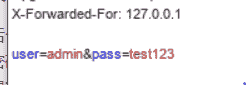
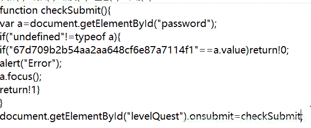

<!--yml
category: 未分类
date: 2022-04-26 14:35:54
-->

# BugkuCTF-WEB部分题解（一）_flying_bird2019的博客-CSDN博客_bugkuctfweb题解

> 来源：[https://blog.csdn.net/flying_bird2019/article/details/104595139](https://blog.csdn.net/flying_bird2019/article/details/104595139)

# 域名解析

**访问** flag.baidu.com **提示：找不到网站** 无法进行DNS解析
**直接访问**123.206.87.240 **返回400 Bad Request**
查询400错误 [详情](https://m.php.cn/faq/426361.html)

## 两种方法解析域名

### 1.修改hosts文件：

直接在hosts文件中添加flag.baidu.com 120.24.86.145

### 2.修改头信息：

用burpsuit抓包修改host头信息为flag.baidu.com

**得到flag**

# 变量1

审计代码发现需要**get**一个变量

**$$ args**为一个[可变变量](https://www.php.cn/php-weizijiaocheng-361041.html)(args的值将作为一个变量名)
var_dump()函数用于输出变量的相关信息，由此可以想到flag可能在全局变量数组中，**args=GLOBALS** 得到flag

# Web5

**题目提示** [JSPFUCK](https://www.cnblogs.com/chianquan/p/5671474.html)(jother编码)
将一长串代码复制到浏览器控制台运行，得到Flag后字母转化为大写

# 网站被黑

御剑扫描网站后台发现**shell.php**
访问需要登录密码
burp字典爆破得密码：**hack**
登录得到flag

# 管理员系统

随便提交一个账号密码提示：**IP禁止访问，请联系本地管理员登陆，IP已被记录**

抓包伪造XFF头改为本地IP：127.0.0.1
查看网页源代码将注释中的字符串base64解密得**test123**
猜测为管理员密码 账号为admin
抓包提交返回得**Flag**

# web4

根据提示查看源代码，将**P1+‘%35%34%61%61%32’+P2** enscape解密
分析代码

将代码中的字符串提交得到**Flag**

# flag在index里

该题用到**php://filter**
搬运大佬的[博客](https://blog.csdn.net/wy_97/article/details/77432002)
构造语句**php://filter/read/convert.base64-encode/resource=index.php**
得到base64代码，解码得源代码
从注释中得到**Flag**