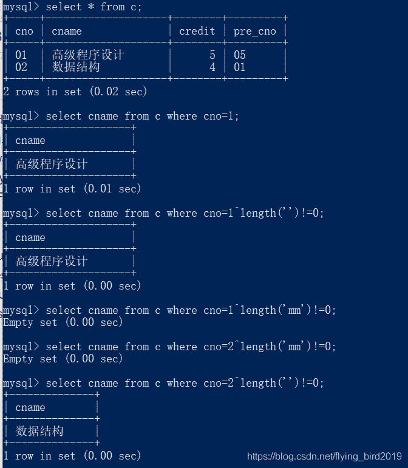

<!--yml
category: 未分类
date: 2022-04-26 14:36:49
-->

# BugkuCTF-WEB部分题解（四）_flying_bird2019的博客-CSDN博客

> 来源：[https://blog.csdn.net/flying_bird2019/article/details/109983418](https://blog.csdn.net/flying_bird2019/article/details/109983418)

# 字符？正则？

关于正则表达式推荐一篇博客
[正则表达式](https://www.cnblogs.com/52php/p/5658208.html)

```
 <?php 
highlight_file('2.php');
$key='KEY{********************************}';
$IM= preg_match("/key.*key.{4,7}key:\/.\/(.*key)[a-z][[:punct:]]/i", trim($_GET["id"]), $match);
if( $IM ){ 
  die('key is: '.$key);
}
?> 
```

get参数id的值要符合正则表达式的要求
表达式"/…/i"表示不区分大小写
'.'表示一个任意字符
".*"表示多个任意字符
".{4,7}"表示匹配4到7次任意字符
[a-z]表示字符集（一个字符)
[[:punct:]]表示字符集(一个)
因此最好的id=key6666key66666key:/6/666keya:(不唯一)
得到flag

# login1(skctf)

环境坏了，但是可以学习一下sql约束攻击
[sql约束攻击原理](https://www.jianshu.com/p/c037dd76db5b)
总的来说就是管理者在定义sql表的时候没有给用户那一列设置UNIQE并且没有检测输入的长度，由于用户名的长度有限以及sql处理字符串的一些特性造成了任意用户登录
具体如下：
sql在处理字符串的时候会把字符串末尾的空格删除，因此select…where username='xxxxx+(多个空格)'与username='xxxxx’是一样的。
因此我们可以构造一个用户名’xxxxx+(多个空格)+1(不唯一)‘这样在注册时sql查询表中有无该用户名时能继续下一步，如果构造的用户名超过限制，则会取前x个字符插入，此时插入的用户名实际为’xxxxx+(多个空格)’
登陆时查询’xxxxx+(多个空格)'与’xxxxx’是一样的，因此登录时以username=‘xxxxx’,password='注册时的密码’即可任意用户名登录

# 多次

本题为考察异或注入+报错注入
id=1’^(length(‘union’))!=0–+
原理：
当union被过滤的时候length(’’)!=0为假，真与假异或为真，页面显示正确

用BP爆破关键字，发现and,or,union,select被过滤
采用双写绕过 ununionion,seselectlect…
在表flag1的address地址得到下一关地址
id=1’时发现sql报错语句
尝试用extractvalue();
[报错注入原理](https://blog.csdn.net/weixin_46145442/article/details/110254238)
id=1’ and extractvalue(1,concat(0x7e,(select group_concat(flag2,address) from flag2),0x7e))–+
得到flag
flag{bugku-sql_6s-2i-4t-bug}

# PHP_encrypt_1(ISCCCTF)

给了加密函数，逆向一下这个加密过程
我用了最简单的爆破的方法(注意不同的字母加密后%128的结果可能是相等的，因此每爆破出一个值就break，否则可能会出现多余字符)

```
<?php

$str1=base64_decode('fR4aHWwuFCYYVydFRxMqHhhCKBseH1dbFygrRxIWJ1UYFhotFjA=');

$len1=strlen($str1);

$payload="abcdefghigklmnopqrstuvwxyzABCDEFGHIJKLMNOPQRSTUVWXYZ0123456789{}*:";
$len2=strlen($payload);
$key = md5('ISCC');
$x = 0;

$klen = strlen($key);
for ($i=0; $i < $len1; $i++) { 
        if ($x == $klen)
        {
            $x = 0;
        }
        $char .= $key[$x];
        $x+=1;
}
$p=0;

for($i=0;$i<$len1;$i++){
    for($k=0;$k<$len2;$k++){
        if(((ord($payload[$k]) + ord($char[$i])) % 128)-ord($str1[$i])===0){
        print($payload[$k]);
        $p+=1;
        break;
        }

    }
}

?> 
```

这个flag的形式有点坑
Flag:{asdqwdfasfdawfefqwdqwdadwqadawd}