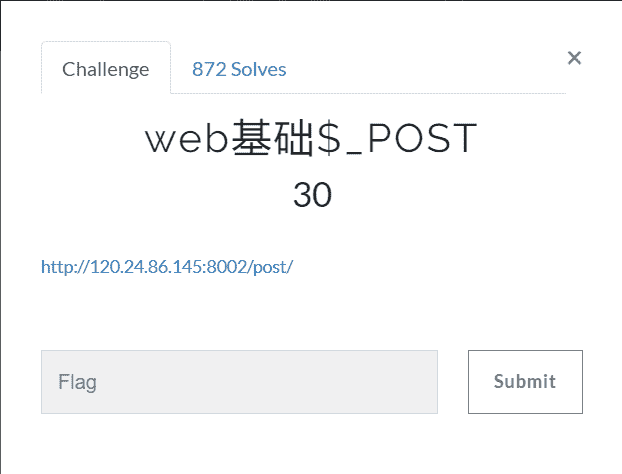
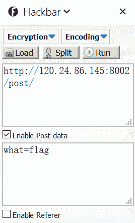

<!--yml
category: 未分类
date: 2022-04-26 14:46:46
-->

# BugkuCTF web基础$_POST_weixin_34194359的博客-CSDN博客

> 来源：[https://blog.csdn.net/weixin_34194359/article/details/89625132](https://blog.csdn.net/weixin_34194359/article/details/89625132)

**前言**

写了这么久的web题，算是把它基础部分都刷完了一遍，以下的几天将持续更新BugkuCTF WEB部分的题解，为了不影响阅读，所以每道题的题解都以单独一篇文章的形式发表，感谢大家一直以来的支持和理解，共勉~~~



打开链接，就知道是道代码审计的题目，不过这题比较简单，我们一起看一下这段代码

```
$what=$_POST['what']; echo $what; if($what=='flag') echo 'flag{****}';
```

意思是通过post传入一个参数what，如果what的值等于flag，即打印出flag

这个我们有好几种办法：

**第一种方法：**

用FireFox的HackBar插件，传入参数what=flag



run一下，爆出了flag


**第二种方法：**

写个脚本run一下试试：

```
import requests

s = requests.Session()
r = s.get("http://120.24.86.145:8002/post/")
values = {'what':'flag'}
r = s.post("http://120.24.86.145:8002/post/",values) print(r.text)
```

直接爆出了flag


您可以考虑给博主来个小小的打赏以资鼓励，您的肯定将是我最大的动力。thx.

微信打赏


支付宝打赏


作　　者： **[Angel_Kitty](http://www.cnblogs.com/ECJTUACM-873284962/)**
出　　处：[http://www.cnblogs.com/ECJTUACM-873284962/](http://www.cnblogs.com/ECJTUACM-873284962/)
关于作者：潜心机器学习以及信息安全的综合研究。如有问题或建议，请多多赐教！
版权声明：本文版权归作者和博客园共有，欢迎转载，但未经作者同意必须保留此段声明，且在文章页面明显位置给出原文链接。
特此声明：所有评论和私信都会在第一时间回复。也欢迎园子的大大们指正错误，共同进步。或者[直接私信](http://msg.cnblogs.com/msg/send/Angel_Kitty)我
声援博主：如果您觉得文章对您有帮助，可以点击右下角**【】**推荐一下该博文。您的鼓励是作者坚持原创和持续写作的最大动力！