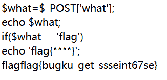
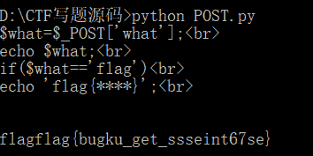

<!--yml
category: 未分类
date: 2022-04-26 14:46:39
-->

# BugkuCTF web基础$_POST_weixin_34306446的博客-CSDN博客

> 来源：[https://blog.csdn.net/weixin_34306446/article/details/85987406](https://blog.csdn.net/weixin_34306446/article/details/85987406)

**前言**

写了这么久的web题，算是把它基础部分都刷完了一遍，以下的几天将持续更新BugkuCTF WEB部分的题解，为了不影响阅读，所以每道题的题解都以单独一篇文章的形式发表，感谢大家一直以来的支持和理解，共勉~~~


打开链接，就知道是道代码审计的题目，不过这题比较简单，我们一起看一下这段代码

```
$what=$_POST['what']; echo $what; if($what=='flag') echo 'flag{****}';
```

意思是通过post传入一个参数what，如果what的值等于flag，即打印出flag

这个我们有好几种办法：

**第一种方法：**

用FireFox的HackBar插件，传入参数what=flag


run一下，爆出了flag



**第二种方法：**

写个脚本run一下试试：

```
import requests

s = requests.Session()
r = s.get("http://120.24.86.145:8002/post/")
values = {'what':'flag'}
r = s.post("http://120.24.86.145:8002/post/",values) print(r.text)
```

直接爆出了flag

