<!--yml
category: 未分类
date: 2022-04-26 14:19:59
-->

# BugkuCTF web题解析_qq_37078651的博客-CSDN博客_bugkuctfweb题解

> 来源：[https://blog.csdn.net/qq_37078651/article/details/88423588](https://blog.csdn.net/qq_37078651/article/details/88423588)

1、简单

 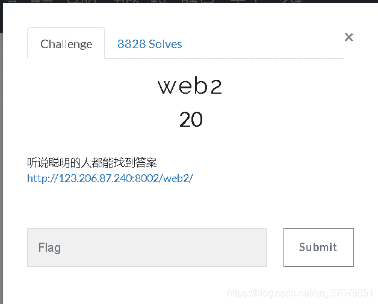

查看源码F12：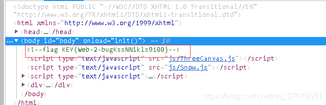

2、计算器


输入发现只能输入一个字符，遂查看源码修改maxlength值或者删掉。

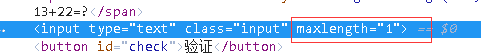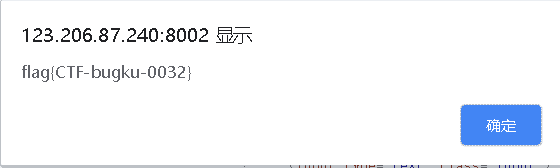

3、web基础$_GET

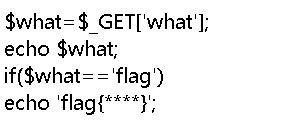

GET请求参数what==flag即可.

4、web基础$_POST

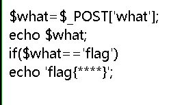

使用工具（我用的是hackbar）发送post请求

参数what=flag。

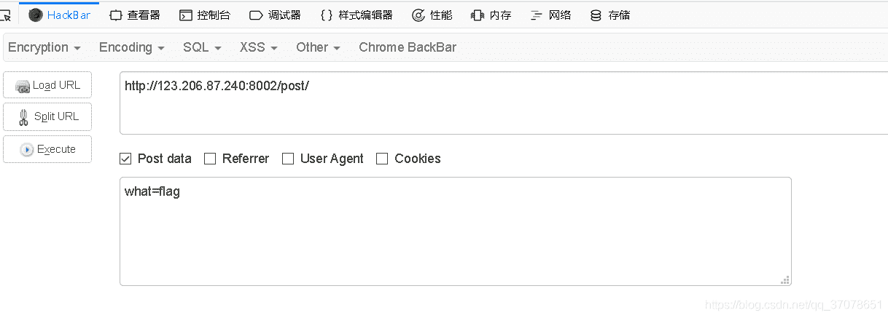

5、矛盾

```
$num=$_GET['num'];
if(!is_numeric($num))
{
echo $num;
if($num==1)
echo 'flag{**********}';
}
```

**is_numeric()** 函数用于检测变量是否为数字或数字字符串。

题意是get传参num不能为数字或数字字符串但值却等于1。

当num用科学计数法表示1：1*e*0

或者传入1x，x为任意字母串即可。

6、web3

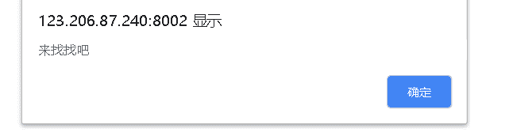

一直在弹窗，查看源码。

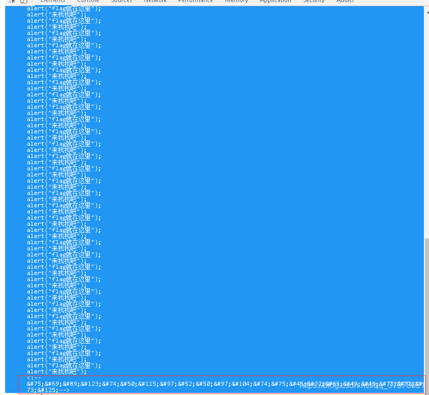

发现一串编码，这是Unicode编码，扔到在线编码[http://tool.chinaz.com/tools/unicode.aspx](http://tool.chinaz.com/tools/unicode.aspx)即可得到：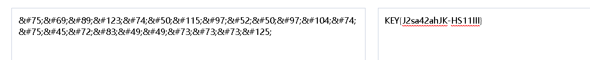

7、域名解析

[https://www.cnblogs.com/ECJTUACM-873284962/p/8995801.html](https://www.cnblogs.com/ECJTUACM-873284962/p/8995801.html)转自别人的。

8、你必须让他停下

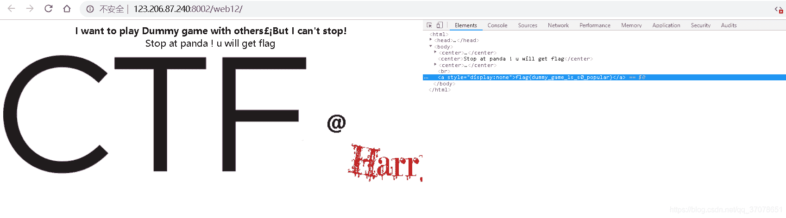

通过控制JS，关闭即可得到flag。