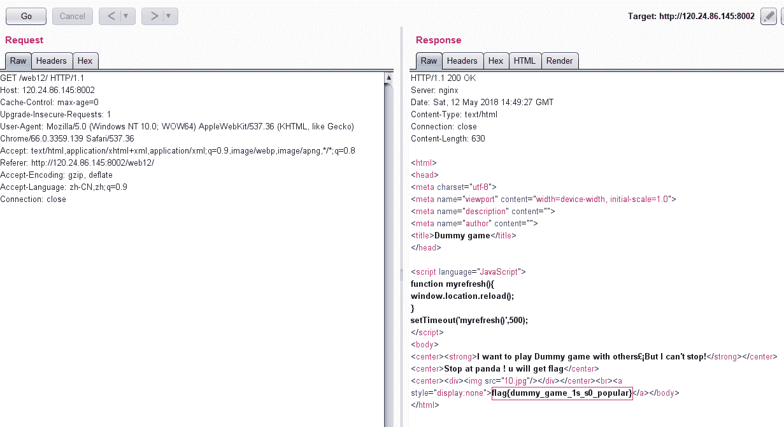

<!--yml
category: 未分类
date: 2022-04-26 14:46:47
-->

# BugkuCTF 你必须让他停下_weixin_34301132的博客-CSDN博客

> 来源：[https://blog.csdn.net/weixin_34301132/article/details/86130506](https://blog.csdn.net/weixin_34301132/article/details/86130506)

**前言**

写了这么久的web题，算是把它基础部分都刷完了一遍，以下的几天将持续更新BugkuCTF WEB部分的题解，为了不影响阅读，所以每道题的题解都以单独一篇文章的形式发表，感谢大家一直以来的支持和理解，共勉~~~

打开链接，我们可以看到页面一直在抖动，一定概率会出现图片，这时我们想到用bp去抓下包试试看。

打开bp发送到repeater，然后不停的gogogogogogogo，后台总共有15个jpg,后台会随机返回一个图片，如果jpg为10的时候就能得到flag(不完全是，有一定的概率，多试几次就好了)

拿到了flag

