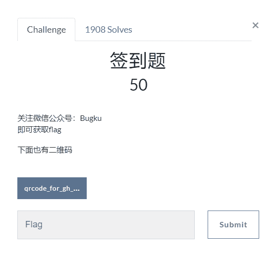
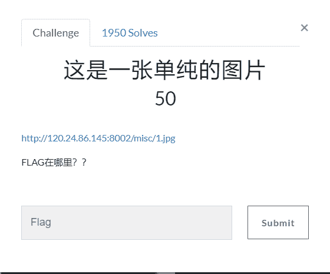
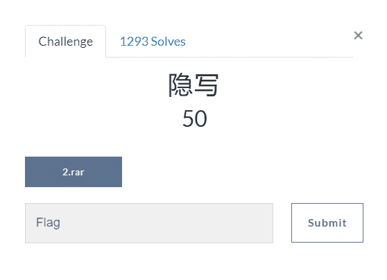
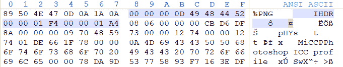
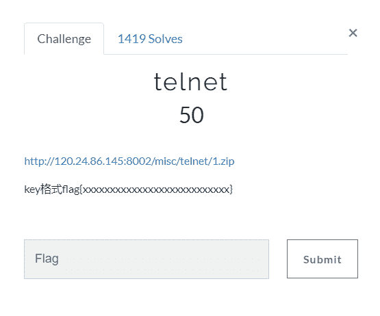
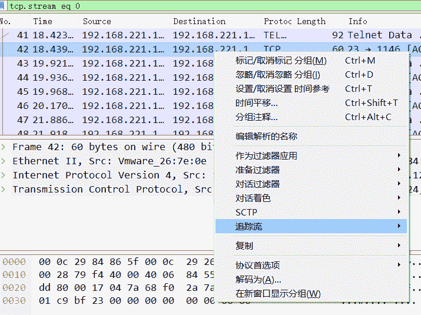

<!--yml
category: 未分类
date: 2022-04-26 14:20:52
-->

# BugkuCTF 杂项 解题记录 1-4_aap49042的博客-CSDN博客

> 来源：[https://blog.csdn.net/aap49042/article/details/102388436/](https://blog.csdn.net/aap49042/article/details/102388436/)

#### 写了一部分的web题，算是把它最基础的一部分做了一遍，以后的几天将持续更新BugkuCTF WEB部分的题解，为了不影响阅读，所以每五道题的题解以一篇文章的形式发表，感谢大家一直以来的支持和理解，共勉~~~

## 签到题



按要求管制二维码中的公众号即可得到flag

## 这是一张单纯的图片



打开链接下载链接中的图片

以文本格式打开图片，再乱码最下面发现一串Unicode字符

我们使用工具进行解码即可得到flag

## 隐写



下载压缩包解压没有阻碍，直接解压出来一个图片

题目是隐写，我们使用winhex打开文件        下载地址   winhex19.2 专业版

我们看下最开头的一部分二进制数据



给大家稍微介绍一下

```
89 50 4E 47 是文件的格式 00 00 00 0D 说明IHDR头块长为13 49 48 44 52 IHDR标识 00 00 01 F4 图像的宽 00 00 01 A4 图像的高

最后四位

CB　D6  DF  8 A为CRC校验
```

这里需要注意的是，文件宽度不能任意修改，需要根据 IHDR 块的 CRC 值爆破得到宽度(这点暂时也不是太懂)，否则图片显示错误不能得到 flag

PS：想深入链接的可以查看   PNG文件结构分析    正文

我们将高度问及那中的01改为03即可

保存打开图片即可得到flag

## telnet



打开链接下载了一个压缩包

里边是一个流量的信息文件，使用wireshark打开即可  （可在应用中心直接搜索下载）

 

选择一项右键，追踪流，tcp流，即可查看到flag