<!--yml
category: 未分类
date: 2022-04-26 14:18:05
-->

# BugkuCTF 部分题解(持续更新)_z.volcano的博客-CSDN博客_bugkuctf

> 来源：[https://blog.csdn.net/weixin_45696568/article/details/122243131](https://blog.csdn.net/weixin_45696568/article/details/122243131)

之前做的题在[BugkuCTF 部分题解(一)](https://blog.csdn.net/weixin_45696568/article/details/111413521)

# 佛系更新

4月18日更新了yst的小游戏
4月15日更新了where is flag 5
4月14日更新了图片里的英文
4月12日更新了RSSSSSA、TLS

# MISC

## yst的小游戏

bmp文件，考虑`lsb`或`wbstego`，后者解出一串hex，转字符得到

```
 import os,threading

class user():
    MAX_HP=400
    HP=400
    MP=200
    Danger=30
    Defence=20
class HP():
    name_1='小瓶生命药水'
    HP_1=50
    name_2='大瓶生命药水'
    HP_2=100
    name_3='满血药水'
    HP_3=user.HP
class MP():
    name_1='小瓶魔法药水'
    MP_1=50
    name_2='大瓶魔法药水'
    MP_2=100
    name_3='满魔药水'
    MP_3=user.MP
class USE():
    name_1='普通攻击'
    MP_1=0
    Danger_1=user.Danger
    name_2='磨刀石'
    MP_2=10
    Danger_2=user.Danger*2
    name_3='鸡汤'
    MP_3=20
    Danger_3=user.Danger*3
    name_4='攻击强化'
    MP_4=50
print('开始游戏'.center(100,'*'))
print('yst的属性值\t生命值%s\t魔法值%s\t攻击力%s\t防御值%s\t'%(user.HP,user.MP,user.Danger,user.Defence))
level=129
class Boss():
    HP=300
    Danger=30
    Defence=20
    HP=HP+20*level
    MP=400
    Danger=Danger+3*level
    Defence=Defence+level*4
user.Danger=user.Danger-Boss.Defence
Boss.Danger=Boss.Danger-user.Defence
if user.Danger <=0:
    user.Danger=1
if Boss.Danger <=0:
    Boss.Danger=1
print('树木的属性值\t生命值%s\t魔法值%s\t攻击力%s\t防御值%s\t'%(Boss.HP,Boss.MP,Boss.Danger,Boss.Defence))
print('战斗开始'.center(100,'*'))
ran=0
while 1:
    ran=ran+1
    print('可用技能\t%s 攻击力%s\t%s 攻击力%s\t%s 攻击力%s\t%s 攻击力%s\t'%(USE.name_1,user.Danger,USE.name_2,user.Danger*2,USE.name_3,user.Danger*3,USE.name_4,user.Danger*2))
    print('可用药水\t%s 回复生命值%s\t%s 回复生命值%s\t%s 回复生命值%s\t\n\t\t%s 回复魔法值%s\t%s 回复魔法值%s\t%s 回复魔法值%s\t'%(HP.name_1,HP.HP_1,HP.name_2,HP.HP_2,HP.name_3,HP.HP_3,MP.name_1,MP.MP_1,MP.name_2,MP.MP_2,MP.name_3,MP.MP_3))
    use=input('使用:')
    if USE.name_1 in use:
        user.MP=user.MP-USE.MP_1
        if user.MP<USE.MP_1:
            print('魔力不足,自动使用普通攻击')
            Boss.HP=Boss.HP-user.Danger
            print('yst使用了%s 对怪物造成了%s伤害'%(USE.name_1,user.Danger))
        else:
            user.MP=user.MP-USE.MP_1
            print('yst使用了%s 对怪物造成了%s伤害'%(USE.name_1,user.Danger))
            Boss.HP=Boss.HP-user.Danger
    elif USE.name_2 in use:
        if user.MP<USE.MP_2:
            print('魔力不足,自动使用普通攻击')
            Boss.HP=Boss.HP-user.Danger
            print('yst使用了%s 对怪物造成了%s伤害'%(USE.name_1,user.Danger))
        else:
            user.MP=user.MP-USE.MP_2
            print('yst使用了%s 对怪物造成了%s伤害'%(USE.name_2,user.Danger*2))
            Boss.HP=Boss.HP-user.Danger*2
    elif USE.name_3 in use:
        if user.MP<USE.MP_3:
            print('魔力不足,自动使用普通攻击')
            Boss.HP=Boss.HP-user.Danger
            print('yst使用了%s 对怪物造成了%s伤害'%(USE.name_1,user.Danger))
        else:
            user.MP=user.MP-USE.MP_3
            print('yst使用了%s 对怪物造成了%s伤害'%(USE.name_3,user.Danger*3))
            Boss.HP=Boss.HP-user.Danger*3
    elif USE.name_4 in use:
        if user.MP<USE.MP_4:
            print('魔力不足,自动使用普通攻击')
            Boss.HP=Boss.HP-user.Danger
            print('yst使用了%s 对树木造成了%s伤害'%(USE.name_1,user.Danger))
        else:
            user.MP=user.MP-USE.MP_4
            user.Danger=user.Danger*2
            print('yst使用了%s 对树木造成了%s伤害'%(USE.name_4,user.Danger))
            Boss.HP=Boss.HP-user.Danger
    elif HP.name_1 in use:
        user.HP=user.HP+HP.HP_1
        print('yst使用了%s 恢复了%s生命值'%(HP.name_1,HP.HP_1))
    elif HP.name_2 in use:
        user.HP=user.HP+HP.HP_2
        print('yst使用了%s 恢复了%s生命值'%(HP.name_2,HP.HP_2))
    elif HP.name_3 in use:
        user.HP=user.HP+HP.HP_3
        print('yst使用了%s 恢复了%s生命值'%(HP.name_3,HP.HP_3))
    elif MP.name_1 in use:
        user.MP=user.MP+MP.MP_1
        print('yst使用了%s 恢复了%s魔力值'%(MP.name_1,MP.MP_1))
    elif MP.name_2 in use:
        user.MP=user.MP+MP.MP_2
        print('yst使用了%s 恢复了%s魔力值'%(MP.name_2,MP.MP_2))
    elif MP.name_3 in use:
        user.MP=user.MP+MP.MP_3
        print('yst使用了%s 恢复了%s魔力值'%(MP.name_3,MP.MP_3))
    else:
        print('没有该道具 自动使用普通攻击')
        print('yst使用了%s 对树木造成了%s伤害'%(USE.name_1,user.Danger))
        Boss.HP=Boss.HP-user.Danger
    user.HP=user.HP-Boss.Danger
    print('树木对你造成了%s伤害'%(Boss.Danger))
    print('yst\t剩余生命值%s\t攻击力%s\t\t防御力%s\t魔法值%s'%(user.HP,user.Danger,user.Defence,user.MP))
    print('树木\t剩余生命值%s\t攻击力%s\t防御力%s\t\n'%(Boss.HP,Boss.Danger,Boss.Defence))
    print('第%s回合,结束!!!'%ran)
    if Boss.HP<=0 and user.HP<=0:
        print('平局!!!')
        break
    if Boss.HP <=0:
        print('树木被砍翻了，你赢了!!!\t')
        break
    if user.HP <=0:
        print('你寄了!!!\t')
        break 
```

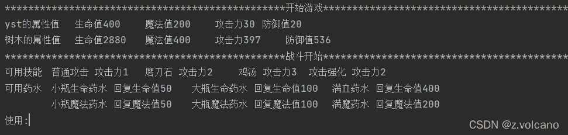

测试一下发现每次攻击强化`耗蓝50`，使`普通攻击和技能伤害*2`，同时会造成伤害
最后鸡汤的伤害会是最高的，用作最后几下补伤害

初始血量400，每次被攻击掉血397，第一回合之后剩3滴血；使用满血药水再被攻击血量变成6，如此往复`使血量超过397`，然后如果当前蓝量不够，则先补蓝，否则释放攻击强化。每次补蓝或者释放技能之后，都执行多次回血操作。

简单模拟这个过程，就可以得到答案。

## 图片里的英文

先拿到密码`I LOV3 CHINA`
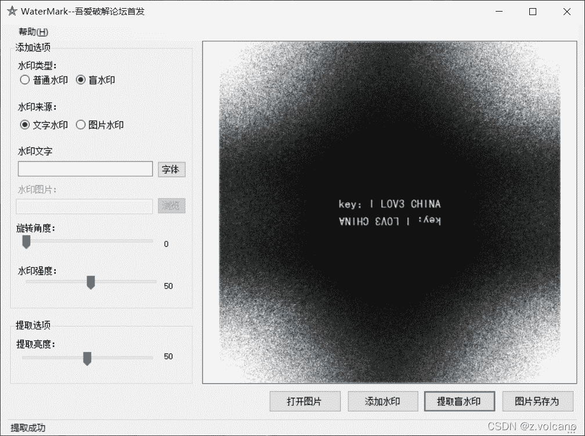
这个密码还不知道用到哪里，作者给了文件，直接跳到第二步，有五张图片，结合题目描述，需要从中破解出压缩包的密码

这是游戏sifu里的东西，能认出其中有`智`和`义`，其实是把传统的`仁义礼智信`改成了`人义尊智诚`，这里的顺序是`人尊智义诚`，不过这五个字所有的排列组合都不是密码。

题目描述是`而且仇人拥有5种不同能力，你能破解他们吗。`，所以压缩包的密码是`木火水金土`，对应五个关卡反派的能力
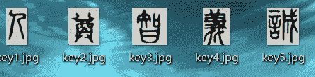

解压之后有两张图片，因为未加密的图片是**bmp**格式，优先试`LSB`和`wbstego`，后者解密出`key：虾仁猪心`

解压出`flag.png`，是`疯狂动物城`里的一幕，结合题目意思可以知道需要找出这张图对应的字幕，是`You know you love me`

对应题目描述，这句台词大概是密码，应该是某种隐写，不过试了一圈都没解出来…

原来不能直接用图片里的台词，得`全换成小写`，还得`去掉空格`，才是正确的密码…

最后一步是有密码的lsb隐写，就很迷惑，空格是可以作为lsb隐写的密码的一部分的，把台词处理过后作为密码，当成一个脑洞点…不理解

```
python2 lsb.py extract flag.png out.txt youknowyouloveme 
```

## TLS

看题目名可以知道本题考察TLS报文的解密，这里用wireshark演示

首先`编辑—> 首选项—>RSA密钥`，把给的密钥文件选中
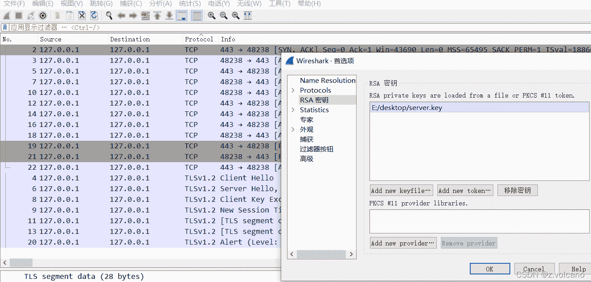
然后得到flag
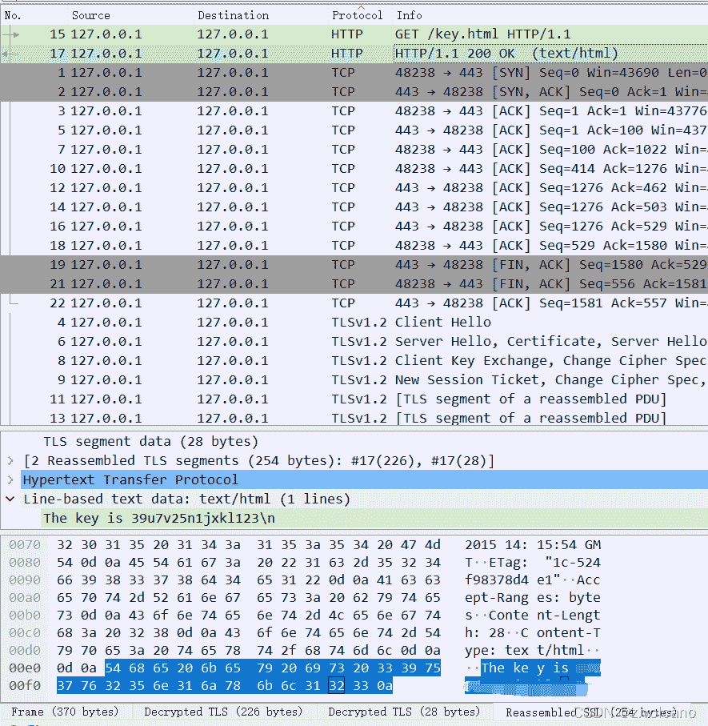

## 图片里的中文

提示`rot47`，压缩包注释信息里的密文拿去解密得到`Add 5D honey to me`，给密文`MD5加密`一下得到压缩包密码`e950c89788db4042193830f49d273512`。我的脑洞仅局限于**把5D转为十进制**，可能对应某个base家族，结果是93

咱也不懂为啥是MD5，而且不理解为什么提示是`Add 5D honey to me`，但不是给这句话MD5加密，而是给密文MD5加密
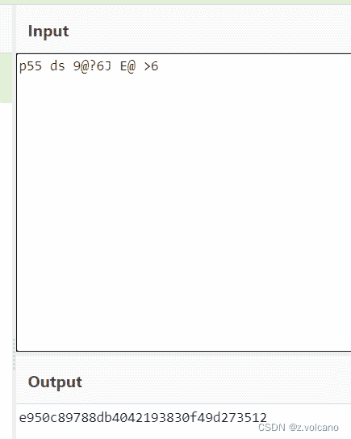
解压得到`password.txt`和`key.png`，前者内容是`AecvWpF9YinwVc7tvKfCGWt28oYiucpd5MEWhghGaaLWKfgTEywz5hmRREEi`，这里继续试…

bugku的在线工具、cyberchef等工具均未解出，最后在[某网站](http://web.chacuo.net/charsetbase58)成功解`base58`

解出`iEeWwc2oGX/DzzdaM1/tdvaWGRodocuXoPMJpAUYMaI=`，应该是AES，下面找密码，这是神剧《让子弹飞》里的名场面，这里的台词应该是`杀人还要诛心？`，结合题目名可以知道这就是密码。

接着就是到各个在线网站疯狂试，最后在[某网站](https://tool.lmeee.com/jiami/aes)成功解出

值得一提的是，选项一样的情况下，去其他几个常用的网站会报错(包括作者给的网站)，总之没有技巧，试就完了
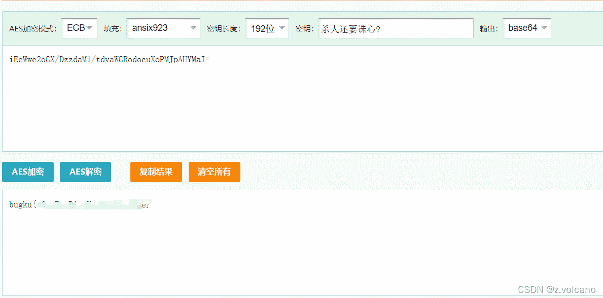

## miko不会jvav啊

第一步仍然是找密码，依旧使用strings命令，把流量包里所有字符串存起来作为字典

这里是`rar5.0`加密，用Accent RAR Password Recovery进行爆破，得到密码`Latifa-Fleuranza` (非预期)

剩下步骤同`学不会jvav我哭辽`

## 学不会jvav我哭辽

拿到一个流量包和加密的压缩包，先用`strings`命令看一下流量包里有哪些字符串，挨个试了一下都不是密码…

不过其中有这样一句：
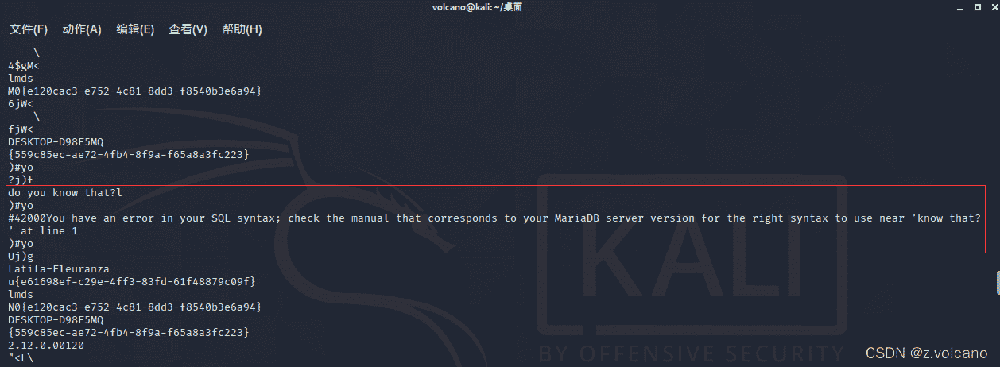
于是找到对应的mysql数据流，一个个看
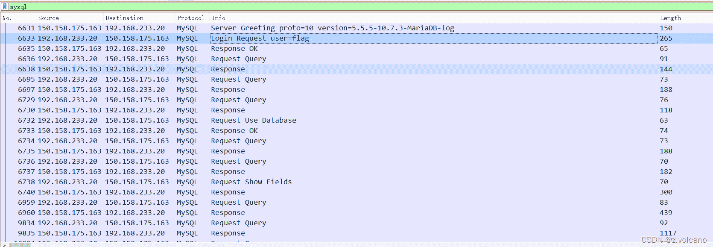
发现多组可疑的数字
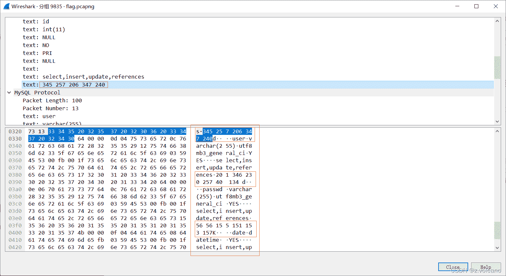
看着像八进制的数，转字符得到密码
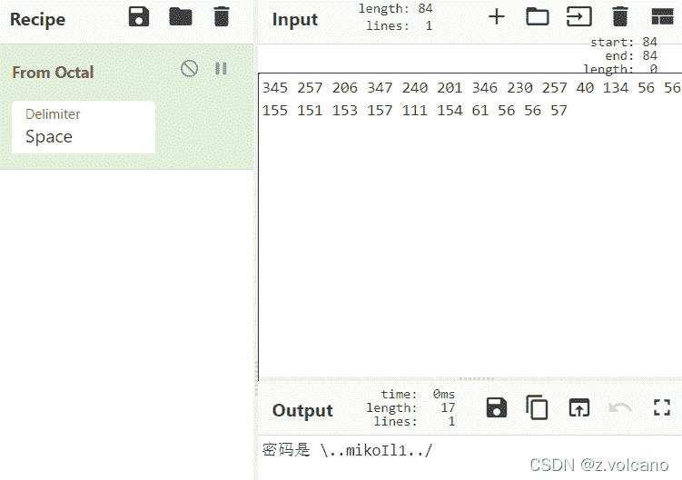
解压出一个exe文件，按照题目提示需要再一步逆向，但是没找到exe转jar的方法，于是尝试使用逆向工具，ida没撸出来，ce可以

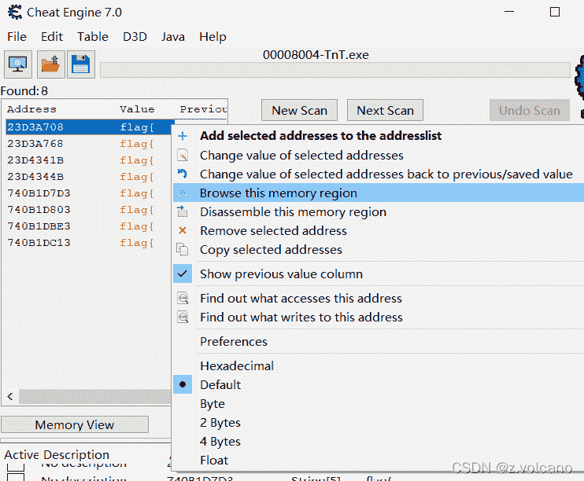

## 黑客的照片

文件尾部有一段flag：`flag{m1s`，和压缩包的数据

formost提取出两个压缩包，其中一个是提示，简单rsa拿到密码`I_1ove_mumuz1!`

```
from Crypto.Util.number import *
import gmpy2

e = 65537
p = 164350308907712452504716893470938822086802561377251841485619431897833167640001783092159677313093192408910634151587217774530424780799210606788423235161145718338446278412594875577030585348241677399115351594884341730030967775904826577379710370821510596437921027155767780096652437826492144775541221209701657278949
q = 107494571486621948612091613779149137205875732174969005765729543731117585892506950289230919634697561179755186311617524660328836580868616958686987611614233013077705519528946490721065002342868403557070176752015767206263130391554820965931893485236727415230333736176351392882266005356897538286240946151616799180309
c = 17210571768112859512606763871602432030258009922654088989566328727381190849684513475124813364778051200650944085160387368205190094114248470795550466411940889923383014246698624524757431163133844451910049804985359021655893564081185136250014784383020061202277758202995568045817822133418748737332056585115499621035958182697568687907469775302076271824469564025505064692884524991123703791933906950170434627603154363327534790335960055199999942362152676240079134224911013272873561710522794163680938311720454325197279589918653386378743004464088071552860606302378595024909242096524840681786769068680666093033640022862042786586612
n= p*q
d = int(gmpy2.invert(e , (p-1) * (q-1)))
m = pow(c ,d ,n)

print(long_to_bytes(m)) 
```

另一个压缩包需要手动提取，解压后得到`flag2.jpg`和`flag3.png`

flag2.jpg修改图片高度

flag3.png是stegpy隐写
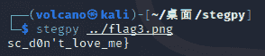

## look

后缀改为zip，解压出look.bmp，stegsolve打开，分别在R0、G0、B0通道发现隐写痕迹，提取得到flag，zsteg应该也能一把梭

## 美丽的烟火

先解zip伪加密

> java -jar ZipCenOp.jar r 美丽的烟火.zip

拿到password.txt,base64-base58-栅栏
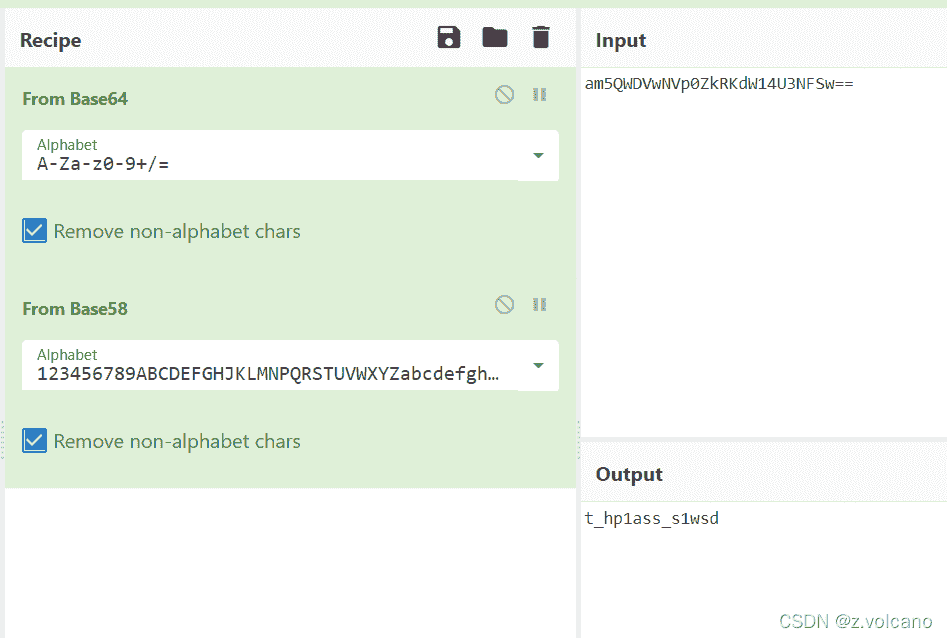
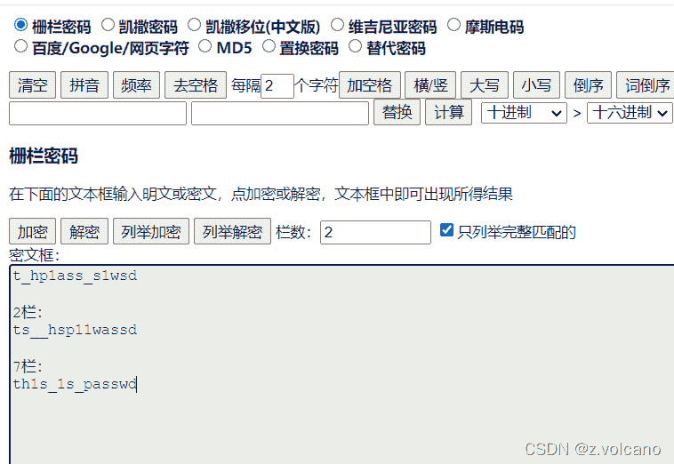

图片的文件尾有`stegpy:shumu`，所以用stegpy解密，密码是shumu，解出一串字符`aZgs8ImPpQOzO3CVA/wIUVq/M7X8C33ptNZSW2Blenc=`

最后找一个在线网站解密就行

个别网站不太行，可以试试下面这两个

> http://tool.chacuo.net/cryptaes/
> https://the-x.cn/zh-cn/cryptography/Aes.aspx

## disordered_zip

binwalk看一下可以发现有俩文件，foremost只能梭出来png
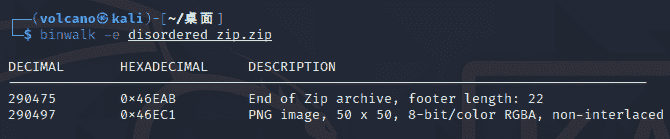
png图片是一个缺了俩定位符的二维码，简单补全扫码得到`psw:yeQFPDS6uTaRasdvwLKoEZq0OiUk`，这个地方很有迷惑性，psw会被认为是password的简写，从而认为后面这个就是密码，其实还得解一手栅栏([在线网站](https://tool.bugku.com/jiemi/))
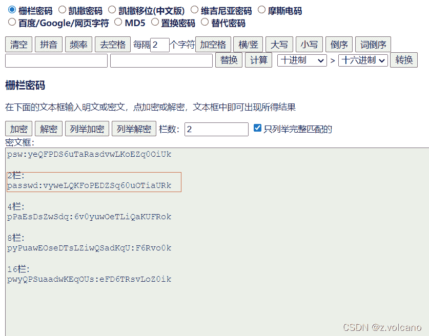
得到了密码`vyweLQKFoPEDZSq60uOTiaURk`，回头把zip拿出来。这里很明显是加密的zip文件的特征(可以找一个zip加密文件对照着看)
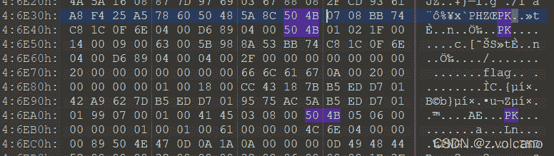
这里是zip加密文件的文件头位置，在最前面补上`504B`即可。
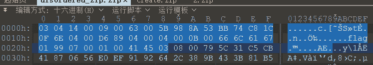
输入密码，解压出的flag其实是个pdf文件，修复文件头后补上后缀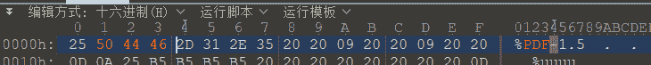
这里是pdf文件，相关隐写很容易想到`webstego4open`，解密得到flag


## easypicture

图片尾有额外数据，提取出加密的压缩包，爆破得到密码`0707`

得到俩图片和`hint:你喝过咖啡吗？你见过彩色的图片吗？`，这里其实提示的是`stegsolve`

先看ciphertext.png，文件尾有个提示`AES,ECB`，用stegsolve简单翻找没有找到，直接用`ztseg`

```
zsteg -a ciphertext.png 
```

结合提示找到一串密文`rcPr04H36Qj+7vt9YFA2KbRyD0yEg+y7mTAQHC82CBM=`

接着找key.jpg中藏着的密钥，挨个试工具，最后发现是`java盲水印`
项目地址：[https://github.com/ww23/BlindWaterMark/releases](https://github.com/ww23/BlindWaterMark/releases)
使用命令：`java -jar BlindWatermark.jar decode -c bingbing.jpg decode.jpg`


最后到[在线网站](http://tool.chacuo.net/cryptaes/)解密即可

## 再也没有纯白的灵魂

题目名即为提示，后一句是`自人类堕落为半兽人`，直接观察密文也能看出来这是[兽音译者](http://hi.pcmoe.net/roar.html)

> ~呜嗷BBBUBGUUBUUKBBKGBGUBBKBKBKUUBUGBBBUGUKGUBUUKBUUGBGUBBUBKBKUBBKBBBBUGUKUUBUUKBKKGBGUBBBBKBKUUBKUBBBUUBBBUBUUKUGGGBGUBBBKKBKUUBGBBBBUUBBBUBUUKUGGGBGUBBBKKBKUUBKGBBBUGUGBUBUUGBUBGBGUBUKUKBKUUBUBBBBUGBBUUBUUKUUB啊

这种加密由`嗷呜啊~`四个字符组成，这里替换成了`BUGK`，找出规律替换回去

```
B-嗷   U-呜   G-啊   K-~ 
```

不过解出来的是乱码，和正常加密的密文对比一下
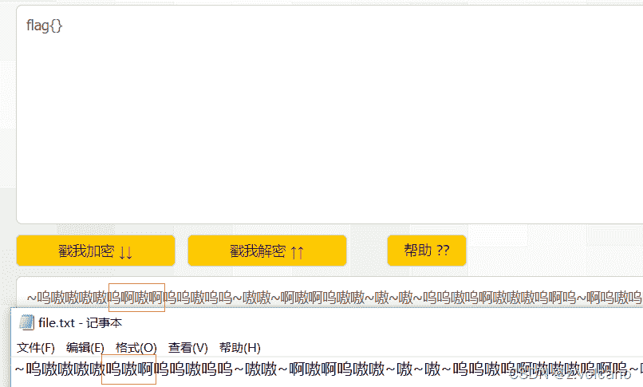
可以发现这个位置少了一个啊，加上之后就能解出来了

## easy_python

每次运行`game.py`，先会读取`.level`文件中的内容，即玩家现在的等级，每次战斗后玩家会升一级，攻击力和防御力提升，而怪物的血量和防御力是不会变的，大概算一下就行。

不想算的话就修改`.level`文件中的内容，然后运行`game.py`，最后的答案应该是`56390`，base64编码后套上flag{}即可

## 简单套娃DX

下载得到8080个无后缀文件，随便用010editor打开几个，发现都是png文件，不过都存在一些问题，先写脚本给这些文件加上png后缀
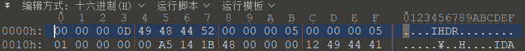

```
import os

path = r'E:\desktop\XD'  
for i in os.listdir('./XD'):    
    oldname = os.path.join(path,i)
    newname = os.path.join(path,i+'.png')
    os.rename(oldname,newname) 
```

加上后缀后只有一部分文件可以正常打开，剩下的就需要修改，前面发现部分文件`缺失了8字节文件头`，写脚本对这种文件进行修复，成功修复了`1046`个文件，说明还有很多图片是其他种类的错误，需要一一找出

```
import os

out = 'output' 
if not os.path.exists(out):
    os.makedirs(out)
for i in os.listdir('./XD'):    
    file = open('./XD/'+i, 'rb').read()
    if file[1:4] != b'PNG':
        file = int(0x89504E470D0A1A0A).to_bytes(8, 'big') + file

        f = open('./output/' + i + '.png','wb')
        f.write(file)
        f.close() 
```

比如说有一些文件是IDAT块跑到IHDR块前面去了
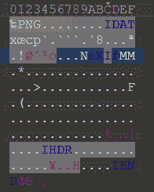
这个过程最好是拿一个正常的png文件过来进行比对，同时使用010editor的模板功能，可以节省很多时间，最后发现有如下几类错误

> 1.文件头缺失8字节(89504E470D0A1A0A) 如aAnLOyuK文件
> 2.IDAT块跑到IHDR块前面。如aAWyDGMo文件
> 3.IHDR块的长度位和标记位替换为00。如aAFRoNjh文件
> 4.图片的宽高被修改了(正确的应该是5*5) 如abFdgotH文件
> 5.Color type被修改成不是0的数。 如ABmgLXTn文件
> 6.IDAT块的长度被改为0\. 如aAWrIqiP文件
> 7.IDAT块标记位被删除。如abQZgrjo文件

八神师傅还是很贴心的，每个文件最多一种错误，而且翻了前十个文件就能找出所有种类的错误，写出最终脚本。

```
import os

out = 'output' 
if not os.path.exists(out):
    os.makedirs(out)
for i in os.listdir('./XD'):    
    file = open('./XD/'+i, 'rb').read()
    if file[1:4] != b'PNG': 
        file = int(0x89504E470D0A1A0A).to_bytes(8, 'big') + file
    elif file[8:16] == b'\x00\x00\x00\x00\x00\x00\x00\x00': 
        file = file[:8] + int(0x0000000D49484452).to_bytes(8, 'big') + file[16:]
    elif file[33:37] == b'\x00\x00\x00\x00' and file[37:41] == b'IDAT': 
        len_idat = file.index(b'eXIf') - 49
        file = file[:33] + int(len_idat).to_bytes(4, 'big') + file[37:]
    elif file[12:16] != b'IHDR': 
        file = file[:8] + file[-37:-12] + file[8:-37] + file[-12:]
    elif file[16:24] != b'\x00\x00\x00\x05\x00\x00\x00\x05': 
        file = file[:16] + int(0x0000000500000005).to_bytes(8, 'big') + file[24:]
    elif file[1:4] == b'PNG' and file[12:16] == b'IHDR' and file[37:41] != b'IDAT': 
        file = file[:37] + b'IDAT' + file[37:]
    elif file[1:4] == b'PNG' and file[12:16] == b'IHDR' and file[25] != b'\x00':  
        file = file[:25] + b'\x00' + file[26:]
    f = open('./output/' + i, 'wb')
    f.write(file)
    f.close() 
```

随后得到了8080个5*5的小方块，挨个查看它们的exif信息，可以发现这两个值均不相同，写脚本挨个输出，发现x对应的最大值是449，y对应的是19，应该是坐标
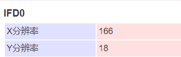
写脚本画图

```
import os
from PIL import Image

img = Image.new('RGB',(450*5,20*5),(255,255,255)) 
for i in os.listdir('./output'):    
    file = open('./output/'+i, 'rb').read().hex()
    x = int(file[-64:-56], 16) 
    y = int(file[-48:-40], 16) 
    x*=5
    y*=5
    im = Image.open('./output/'+i)
    img.paste(im,(x,y,x+5,y+5))

img.save('out.png') 
```


## 做题要细心-1

这个位置有一串二进制，拿出来
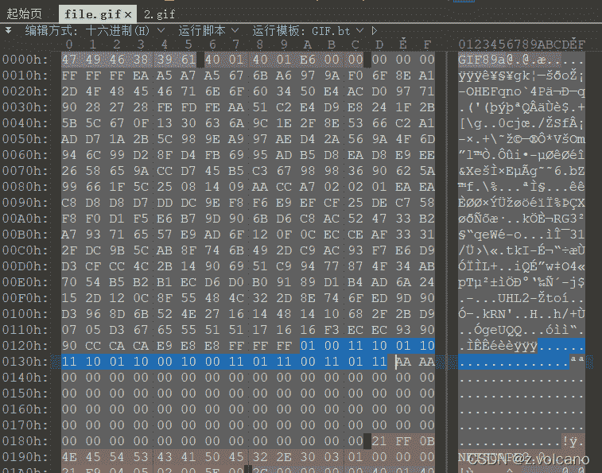
注意到file.gif文件尾有额外数据，看特征是`文件头不全的gif文件`
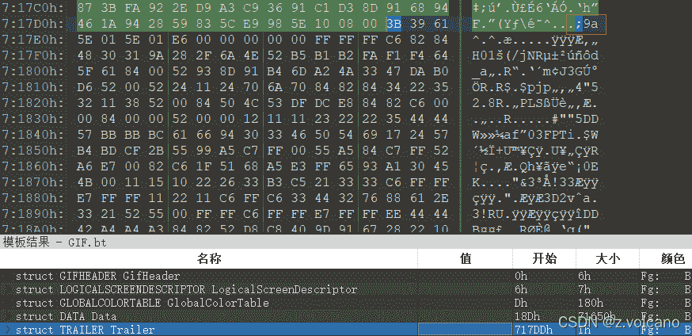
补全文件头，010editor打开，在类似的位置看到另一串二进制
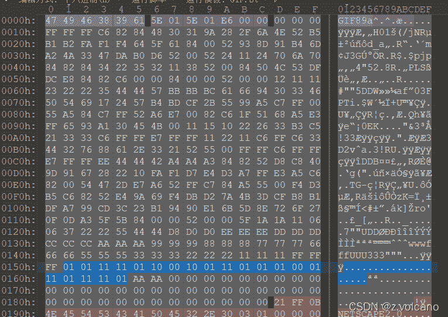
连在一起，转字符得到`Nnb77_buG}`，查看第二个gif的exif信息，发现一个字符串，base64解码得到`{Ax_S`
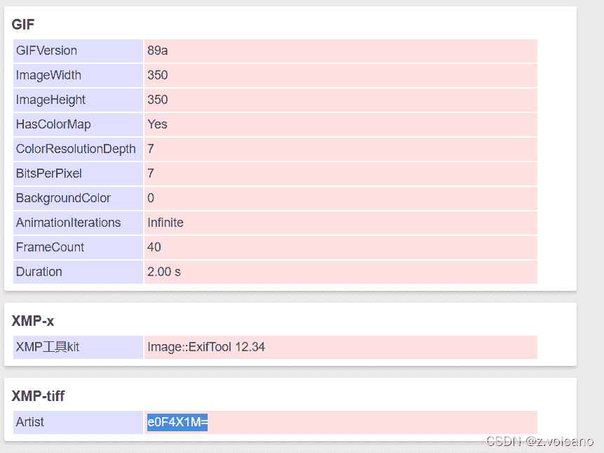
第二个图片的第20帧有一串字符，md5解密得到`bugku`，至此flag找全了
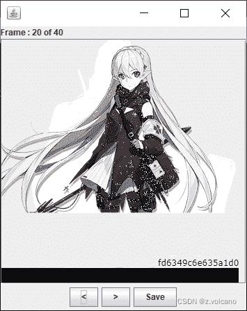

## 简单取证1

下载得到windows系统下一个目录，获取用户名和密码需要用`SAM`和`system`两个文件。

把SAM和SYSTEM文件放到Win32文件夹下，运行mimikatz，执行命令
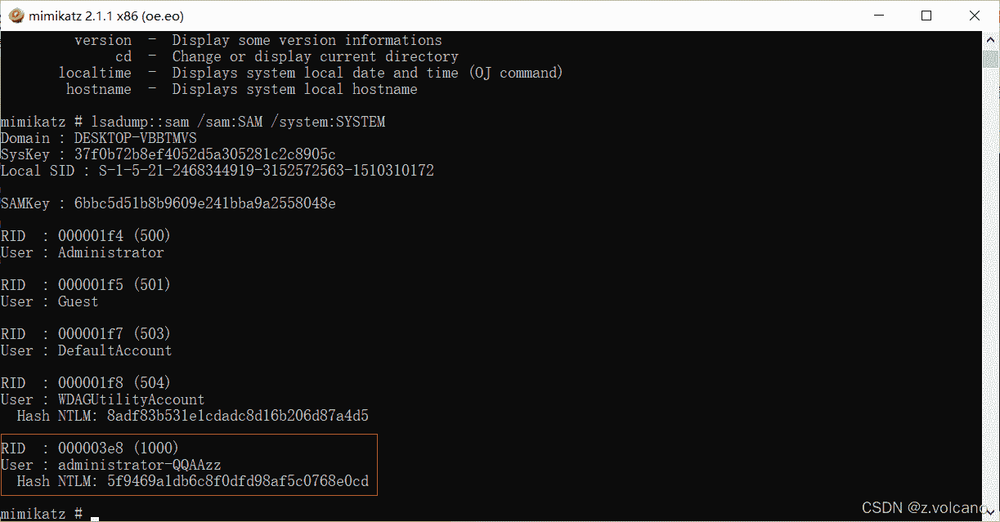
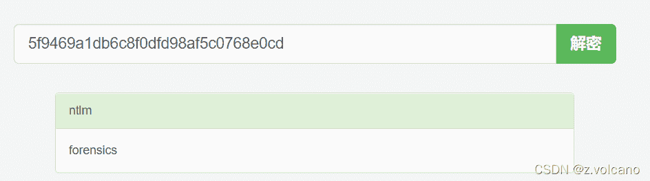
所以`flag{administrator-QQAAzz_forensics}`

## 南城旧梦

mmz.bmp文件尾有一段`DE@@=<6J:DB625K4`，rot47解码后得到`stoolkeyisqeadzc`

意思是使用工具`stool`，密码是`qeadzc`，这个工具使用的话要直接把图片拖进去，解密的话是这个选项，输入密码就可以解出`Key.txt`，得到**把酒言欢.rar**的密码`mmzbudaiwowuwuwu~~~##`
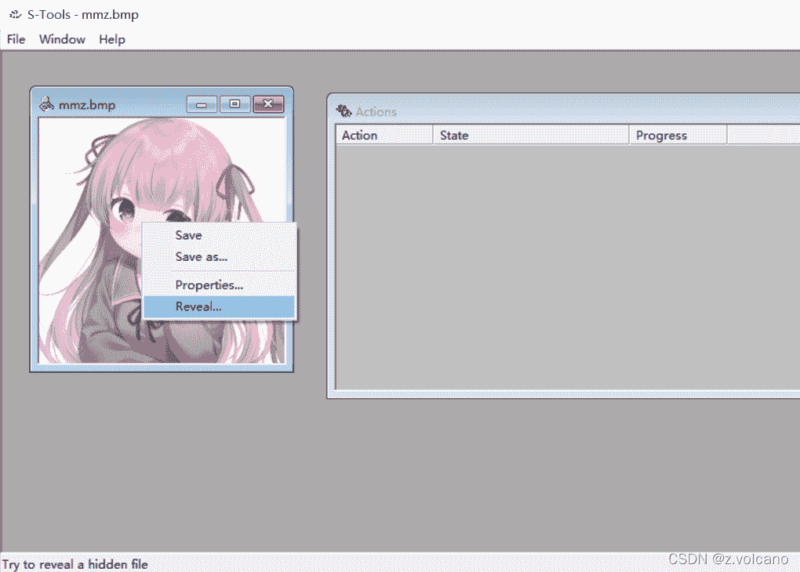
倾听.txt是`SNOW隐写`，解密可以得到密码表

```
(1)1 2 3 4 5 6                    (2)1 2 3 4 5 6                  (3)1 2 3 4 5 6
   ! @ 

(4)1 2 3 4 5 6                    (5)1 2 3 4 5 6                  (6)1 2 3 4 5 6
   / * - + . ?                       F G S F H H                     " " / \ | :    

(7)1 2 3 4 5 6                    (8)1 2 3 4 5 6                  (9)1 2 3 4 5 6
   r o k u g s                       f J L Y G W                     J O P N G W

(10)1 2 3 4 5 6
    F S A S D T 
```

游戏规则在`九菊.docx`中有描述
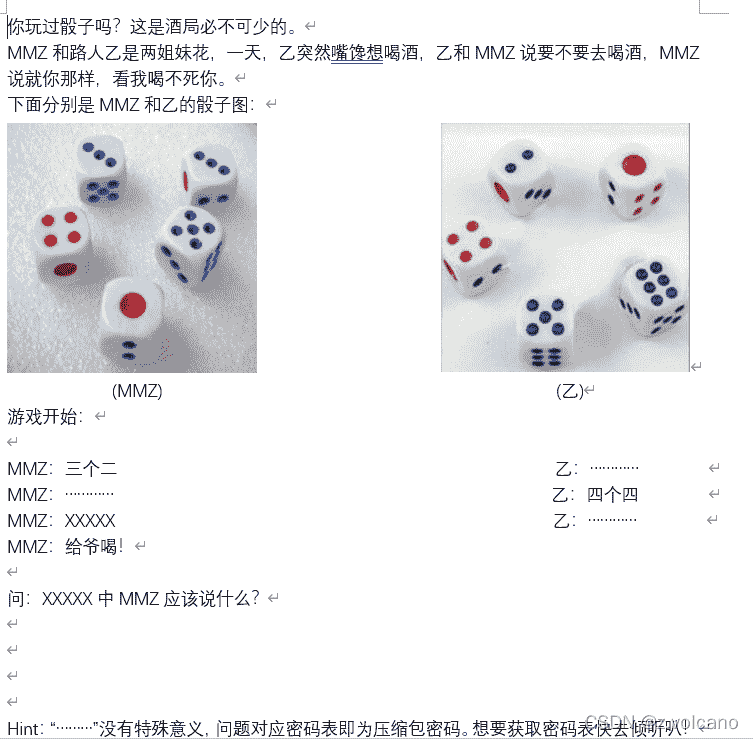
看不懂规则，所以用密码表中所有的字符组成字符串，用`Accent RAR Password Recovery`爆破

```
!@ 
```

最后跑出密码是`%ee.`，解压出`key`和`gpg`两个无后缀文件。

key中的内容是

> ;3%5;3%5;3%5;2 ;5 ; ;%4;3%5;4 ;5
> ;2 ;open _ ,$0;2 ; ;5 ; ;3;2 ;1%2;4 ; ;5 ;3 ;5
> ;2 ;7 ;5 ; ;;while (<_>) { ;5 ; ;5 ;1%6;2
> ;3%5;2%7; ;7 ;2;s;%; ;g;3 ;1%7;2; ;5
> ;8 ; ;;s’([; ])(\d)’ $1x$2 ; ‘ge;; ; s’\S’;'g; ;4;
> s; ;#;g; ; ;5 ; ;5 ; ;5 ; ;5 ; s;;; ;g; ;3 ;
> ;3%5;3%5;3%5;3%5;; print ;}%5;5%3;2

这个是混淆后的perl代码，直接运行得到`secunet`
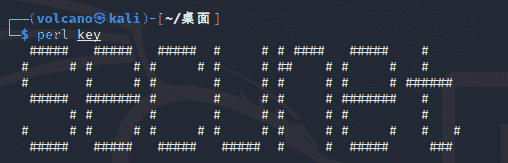
另一个gpg的话可以在kali下直接运行，输入密码`secunet`即可

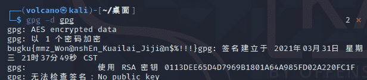

## 成果狗成果狗

图片文件尾有额外数据，是`一段base64+一个jpg文件的数据+另一段base64`，这里按照先后命名为`图片1、图片2、bs1、bs2`.

两段base64解完再hex解密，没有什么特征…结合题目描述，把`bs1`经过base64解码后得到数据放到`图片1文件尾部(插入FFD9之前)`，接着图片高度改高。
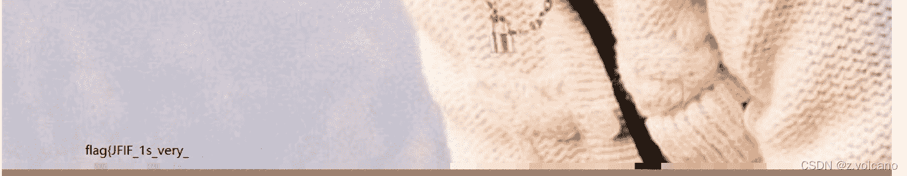
另一段同理。

# Crypto

## RSSSSSA

看特征很明显是低加密指数广播攻击，关于原理的话可以看[翅膀师傅的博客](https://lazzzaro.github.io/2020/05/06/crypto-RSA/)，出题脚本和解题脚本可参考[这篇](https://www.bilibili.com/read/cv13406617)。

## where is flag 5

base64解码后转hex得

```
1b 1f 04 00 0f 12 08 12 1f 1d 00 11 0b 13 14 1f 0b 00 1d 1c 11 1e 1f 01 11 0c 1a 14 14 1f 1b 03 18 08 16 11 1f 1e 12 05 14 1d 19 1f 07 01 0d 10 15 
```

因为每一组的第一位都是0或1

```
1100010111010111001111101011111010111110111100011
每七位转字符得bugku{c 
```

不过找不到另一段flag了，转变思路，回过头base64解码后`直接转二进制`
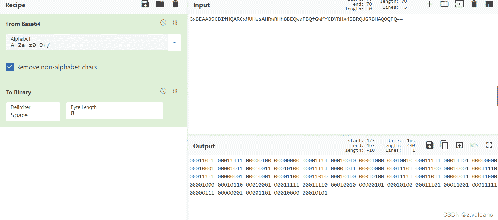
取每一组二进制的`后五位`，因为这里共有`49组`二进制，再结合前面转hex时得到一部分flag的过程，很容易想到：`竖着选取，7个一组`

```
s = '00011011 00011111 00000100 00000000 00001111 00010010 00001000 00010010 00011111 00011101 00000000 00010001 00001011 00010011 00010100 00011111 00001011 00000000 00011101 00011100 00010001 00011110 00011111 00000001 00010001 00001100 00011010 00010100 00010100 00011111 00011011 00000011 00011000 00001000 00010110 00010001 00011111 00011110 00010010 00000101 00010100 00011101 00011001 00011111 00000111 00000001 00001101 00010000 00010101'
lt = [i[3:] for i in list(s.split())]

ind = 0

out = [''] * 35
for i in range(5):
    for j in range(len(lt)):
        if len(out[ind]) == 7:
            ind += 1  
        out[ind] += lt[j][i]      

for i in out:
    print(chr(int(i,2)),end="") 
```