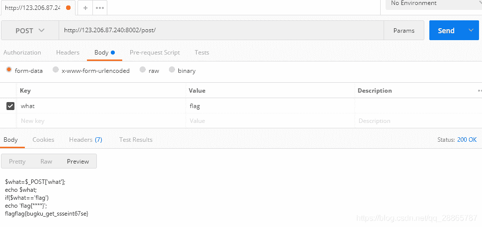
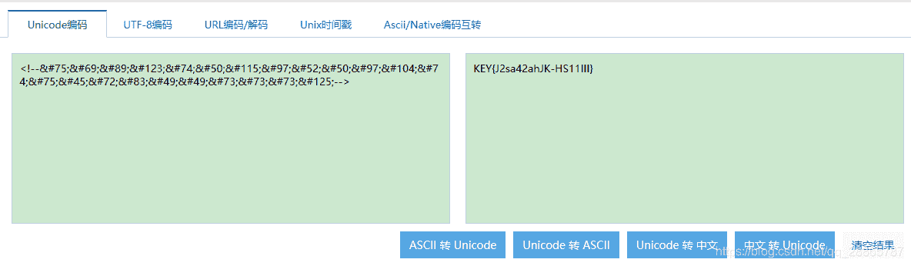
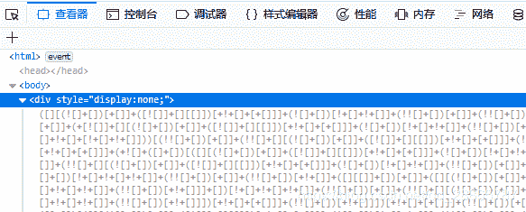
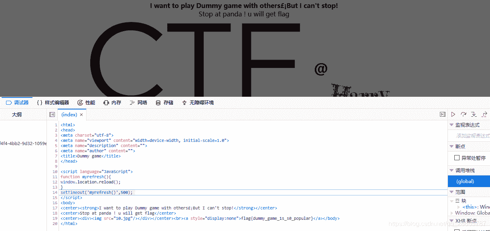
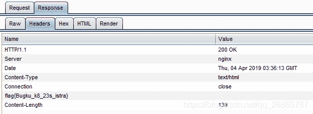

<!--yml
category: 未分类
date: 2022-04-26 14:45:44
-->

# BugkuCTF平台-Web题目笔记_手可摘星辰丶的博客-CSDN博客

> 来源：[https://blog.csdn.net/qq_28865787/article/details/88410698](https://blog.csdn.net/qq_28865787/article/details/88410698)

先从简单的下手，慢慢学习，不断更新~

## Web2

查看页面源码，就找到了，嗯，真的好简单。

## 计算器

还是先查看源码。

```
<input class="input" type="text" maxlength="1"> 
```

然后发现直接在页面上改一下maxlength的限制，输入正确的计算结果，得到flag。

## Web基础$_GET

在URL那一栏直接加上?what=flag，回车，ok~

## Web基础$_POST

一开始，用postman构造一个post请求，死活得不到结果，后来发现，是地址栏少了一个“/”。。。


## 矛盾

看里面写的代码的意思，需要构造一个get请求，参数为1。

```
$num=$_GET['num'];
if(!is_numeric($num))
{
echo $num;
if($num==1)
echo 'flag{**********}';
} 
```

但是请求http://123.206.87.240:8002/get/index1.php?num=1并没有输出结果。
参考了一下其他人解法，发现各种方法都有，不明白原理，查了资料，补充一点php弱类型的知识，参考了[php 弱类型总结](https://www.cnblogs.com/Mrsm1th/p/6745532.html) 。
其中关于这一题的知识点总结一下：

> 1.  php中有两种比较的符号 == 和 === 。=== 在进行比较的时候，会先判断两种字符串的类型是否相等，再比较；== 在进行比较的时候，会先将字符串类型转化成相同，再比较。
>     如果比较一个数字和字符串或者比较涉及到数字内容的字符串，则字符串会被转换成数值，并且比较按照数值来进行。判断admin == 0？成功。
> 2.  当一个字符串作一个数值来取值，其结果和类型如下：如果该字符串没有包含’.’,‘e’,'E’并且其数值在整形的范围之内，该字符串被当作int来取值，其他所有情况下都被作为float来取值，该字符串的开始部分决定了它的值，如果该字符串以合法的数值开始，则使用该数值，否则其值为0。即判断1admin == 1 ？成功，而判断admin1 == 1？不成功。
>     因此这个题，输入num=1后面加任意字符都ok，得到结果。

以及，活到老学到老，以后有关于这种==判断的，都可以考虑一下是不是有这个漏洞。

## Web3

还是直接查看源码，在长长的一段javascript alter弹出框之后。找到了一段不明代码，像个啥字符，ok拿去转义一下，成功得到结果。

```
<!--&#75;&#69;&#89;&#123;&#74;&#50;&#115;&#97;&#52;&#50;&#97;&#104;&#74;&#75;&#45;&#72;&#83;&#49;&#49;&#73;&#73;&#73;&#125;--> 
```



## web5

这个，随便输，没啥用，看看源码，发现有一点隐藏的代码。

这是啥？不懂，又补了一点知识。名字叫[jother编码](https://blog.csdn.net/greyfreedom/article/details/45070667)，XSS攻击中可以用来逃掉一些过滤。

> 1.  javascript中使用少量特定字符对匿名函数进行编码加密，包括：“+”、“！”、“（”、“）”、“[”、“]”、“{”、“}"。
> 2.  利用jother编码可以在不用字母和数字的情况执行任意js代码。
> 3.  直接使用alert(xxx)、console(xxx)、document.write(xxx)即可解码（xxx为编码内容）。

具体看那篇博文吧，这里大概用到只有如何解码。把它复制到浏览器console控制台运行一下，得到了结果。

## 域名解析

题目是：听说把 [flag.baidu.com](http://flag.baidu.com) 解析到123.206.87.240 就能拿到flag。
emmm，改一下C:\Windows\System32\drivers\etc里面的hosts，加上“123.206.87.240 [flag.baidu.com](http://flag.baidu.com)”，[然后访问flag.baidu.com](http://xn--flag-zk1gh85mw20b59q.baidu.com)，得到结果。
好吧我是不是很懂这个，知识点应该就是域名解析的原理？hosts文件是一个用来实现静态的IP地址映射。
PS：之前访问外网，也是给hosts加了无数个项，然后隔段时间又要换，真麻烦。

## 你必须让他停下

打开来一直跳，不管三七二十一，先停了吧，在调试器里面按终止，发现原来要停在panda图片才有flag？
好了，考验手速，看见有了flag立马停住。

## 变量1

```
flag In the variable !
 <?php  
error_reporting(0);
include "flag1.php";
highlight_file(__file__);
if(isset($_GET['args'])){
    $args = $_GET['args'];
    if(!preg_match("/^\w+$/",$args)){
        die("args error!");
    }
    eval("var_dump($$args);");
}
?> 
```

捡起我的php。嗯，首先是正则表达式要过去。

> /^\w+$/
> ^匹配输入字符串的开始位置，除非在方括号表达式中使用，此时它表示不接受该字符集合。要匹配 ^ 字符本身，请使用 ^。
> \将下一个字符标记为或特殊字符、或原义字符、或向后引用、或八进制转义符。例如， ‘n’ 匹配字符 ‘n’。’\n’ 匹配换行符。序列 ‘\’ 匹配 “”，而 ‘(’ 则匹配 “(”。
> \w 匹配字母或数字或下划线或汉字 等价于 ‘[^A-Za-z0-9_]’。
> +匹配前面的子表达式一次或多次。要匹配 + 字符，请使用 +。
> $匹配输入字符串的结尾位置。如果设置了 RegExp 对象的 Multiline 属性，则 $ 也匹配 ‘\n’ 或 ‘\r’。要匹配 $ 字符本身，请使用\$。

综合分析，匹配的应该是，字符串中的字符只能是字母或数字或下划线或汉字。
flag在变量里，$$args，应该是先取$args,再用取得的值取$[$args]，直接用全局变量GLOBALS看吧，因为它包含了全部的全局变量，然后也看不到代码里有其他变量了，访问http://123.206.87.240:8004/index1.php?args=GLOBALS get。

> $GLOBALS [一个包含了全部变量的全局组合数组]

这两天看书突然发现了$$有关的漏洞，参考[PHP代码审计笔记–变量覆盖漏洞](https://www.cnblogs.com/xiaozi/p/7768580.html) 。

## 头等舱

打开来就是，“什么都没有”。
看源码，其他信息都好像没什么，学了一下Burp Suite，设置为代理，抓了包看看，发现回复包问题。
在应答包的头部这里加了一点信息，找到啦。
学习的话，应该是了解一点Burp Suite用法，以及http的头部信息是可以伪造的。

## web4

点进去，嗯，先随便输了一个，没用，然后看看源代码。果然是有一段脚本的，拿去解码一下，内容为：

```
<script>
var p1 = 'function checkSubmit(){var a=document.getElementById("password");if("undefined"!=typeof a){if("67d709b2b';
var p2 = 'aa648cf6e87a7114f1"==a.value)return!0;alert("Error");a.focus();return!1}}document.getElementById("levelQuest").checkSubmit;';
eval(unescape(p1) + unescape('54aa2'   p2));
</script> 
```

看起来还是有点不对，应该先解析这个script代码的意思，再去转码，它的意思其实就是设置p1、p2变量，然后把这两个变量 用Unicode 字符解码，后合起来，执行。ok，那合起来再解码试试，最后eval执行的命令就是：

```
function checkSubmit(){
	var a=document.getElementById("password");
	if("undefined"!=typeof a){
		if("67d709b2b54aa2aa648cf6e87a7114f1"==a.value) return!0;
		alert("Error");
		a.focus();
		return!1
	}
}
document.getElementById("levelQuest").onsubmit=checkSubmit;'; 
```

不太熟悉javascript，大概意思应该是点击提交（虽然id有点对不上？），获得提交的内容，如果有东西判断是不是这个字符串，对的话返回0？那就提交吧。好了，提交以后key来了。