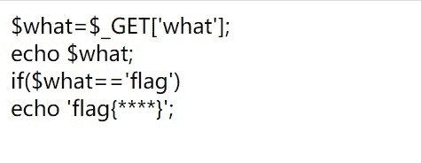
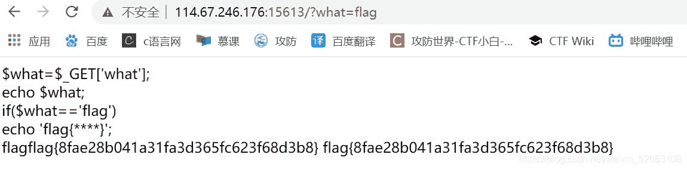

<!--yml
category: 未分类
date: 2022-04-26 14:34:30
-->

# Bugkuctf_web3题解wp_东方黑手的博客-CSDN博客

> 来源：[https://blog.csdn.net/weixin_52653109/article/details/110975693](https://blog.csdn.net/weixin_52653109/article/details/110975693)

题目考察知识点：①**代码审计** ②**”get“请求指令**
话不多说，进入场景。

很明显**what要等于flag**才能得到真正得flag（别一来就想着F12，抓包，截包啥的了的。想太复杂了的😂）
然后在网址那栏加上 **/?what=flag** （get请求，不懂就度娘）

得到flag
flag{8fae28b041a31fa3d365fc623f68d3b8}
写wp不易，看官大人们，点个赞吧( •̀ ω •́ )✧