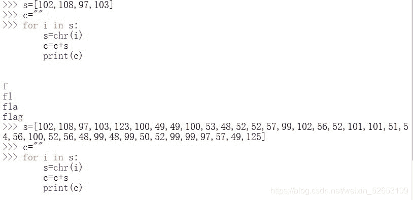
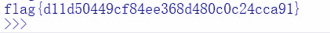

<!--yml
category: 未分类
date: 2022-04-26 14:44:10
-->

# Bugkuctf_web6题解wp_东方黑手的博客-CSDN博客

> 来源：[https://blog.csdn.net/weixin_52653109/article/details/111225613](https://blog.csdn.net/weixin_52653109/article/details/111225613)

抓包看码。发现s包含的数字很“诡异”。
用python写个脚本，试试s前面几个数字。——出来的是“flag”

嗖嘎~那就s全上，搞定。
