<!--yml
category: 未分类
date: 2022-04-26 14:44:50
-->

# Bugku—web题解_Sn0w/的博客-CSDN博客_bugku题解

> 来源：[https://blog.csdn.net/qq_43431158/article/details/91178922](https://blog.csdn.net/qq_43431158/article/details/91178922)

前言：最近做了一些Bugku入门的web题目，感觉web题挺有趣的，并非是得出flag，而是可以通过一个题目学习到很多知识。

## **域名解析**

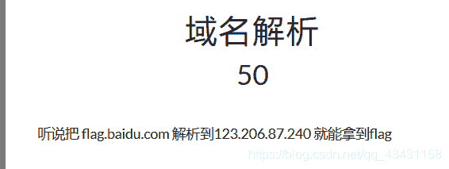
题目说`把 flag.baidu.com 解析到123.206.87.240 就能拿到flag`，如果了解域名解析的原理和系统文件host的作用，那这道题就很简单了。

**通俗的话说**：域名是为了我们方便记忆，但计算机识别的是IP地址，所以要将域名解析为IP地址才能访问到自己想要访问的网站。而host文件中放的是一些网站的DNS(域名系统)缓存,通过本地解析会提高访问速度，如果没有host系统文件，我们发送请求，服务器端DNS接收解析再返回给客户端，这会慢很多，当然也可以用host文件来屏蔽一些垃圾网站，只要将它解析到一个不存在的IP即可屏蔽。

原理大致就是这样。
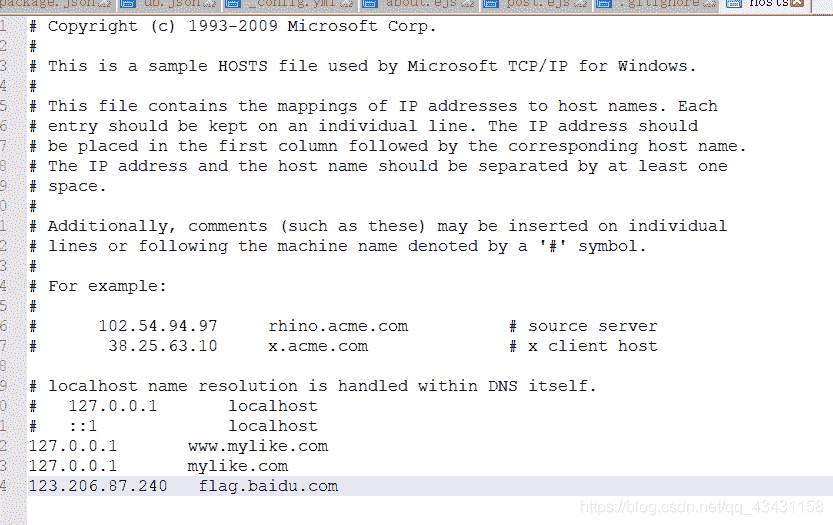
用管理员权限添加上题目所说的域名和IP,再次访问域名,即可得出flag

## **你必须让他停下**

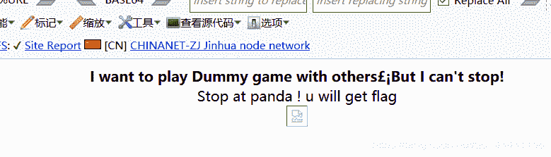
打开之后一直再刷新，查看源代码发现是用JS`setTimeout('myrefresh()',500)`设置刷新，每500毫秒刷新一次页面，有两种方法可以做这到题。
**一、在浏览器中禁用JS，然后手动刷新，查看源代码就可找到flag**
**二、用burp suite抓包**
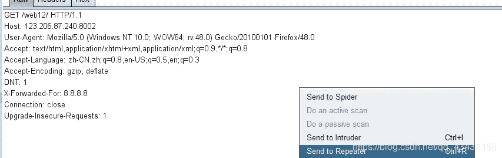
多点击几次go，就可得出flag

## **变量1**

```
flag In the variable ! <?php  
error_reporting(0);
include "flag1.php";
highlight_file(__file__);
if(isset($_GET['args'])){
    $args = $_GET['args'];
    if(!preg_match("/^\w+$/",$args)){
        die("args error!");
    }
    eval("var_dump($$args);");
}
?> 
```

一道关于正则表达式的web题，`/`表示的是正则表达式的开始和结束，`^或\A` 匹配字符串开始位置，`\w`匹配任意数字或字母或下划线(a-z,A-Z,0-9,_)，`+`匹配1次或多次其前面的字符(相当于可以输入多个字符、数字、或下划线)，`$或者\Z`匹配字符串的结束位置。

提示说`flag In the variable` ,直接用全局数组变量`$GLOBALS`可以得出所以变量的值，其中有一个变量是`$$args`那就构造语句，让变量成`$GLOBALS`即可。

```
http://123.206.87.240:8004/index1.php?args=GLOBALS 
```

即可得出flag

## **头等舱**

这个没啥好做的，抓一下包就可得出flag

## **本地包含**

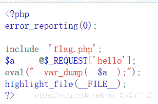
给了一段PHP代码，首先先来搞清一些函数：

```
$_REQUEST
默认情况下包含了 $_GET，$_POST 和 $_COOKIE 的数组。 
show_source() 函数
show_source() 函数对文件进行 PHP 语法高亮显示。
注释：当使用该函数时，整个文件都将被显示，包括密码和其他敏感信息！ 
```

[show_source() 函数](https://www.yuque.com/docs/share/0690a545-49d8-4a2e-960d-9ba76b68dba0)
**方法一、eval函数**

前面学习过了命令注入其中`eval`函数是危险函数，可以将字符串当作PHP进行解析，可以利用这个漏洞构造payload：

```
?hello=);show_source("flag.php");var_dump( 
```

`);`闭合前面的`var_dump(`，`var_dump(`闭合后面的`);`，构造这样的语句便可以执行我们想要的语句了。
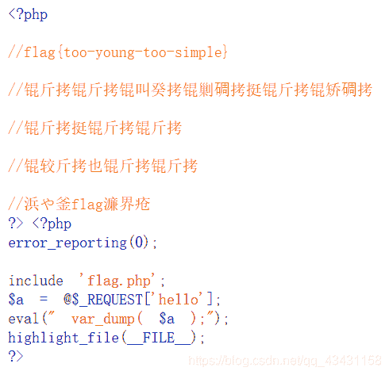
但是flag不对，查了一下，发现很多人都遇到这个问题，这里应该是网站的问题，就不管了，过程最重要！

方法二：

利用`file()`或`get_file_contents`函数

```
file_get_contents() 函数把整个文件读入一个字符串中
file() 函数把整个文件读入一个数组中。 
```

**payload：**

```
?hello=file('flag.php') 
```

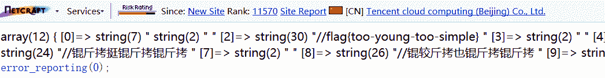
**payload：**

```
?hello=file_get_contents('flag.php') 
```

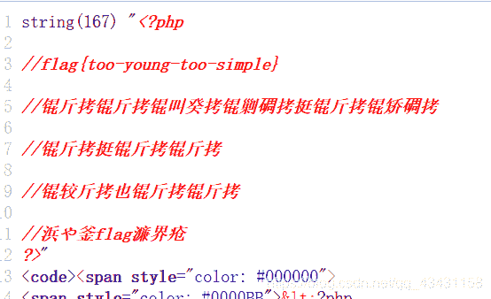
方法三：

这道题的题目便是本地本地包含，就用本地包含的方法来做一下：

```
include()函数和php://filter结合使用
php://filter可以用与读取文件源代码，结果是源代码base64编码后的结果
php://filter/convert.base64-encode/resource=文件路径 
```

**payload:**

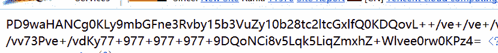
正常的话，base64解码即可，但这个题有点问题。

## **web5**

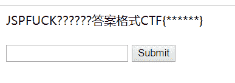
查看源码，发现是`jother编码`
[jother编码详解](https://blog.csdn.net/greyfreedom/article/details/45070667) 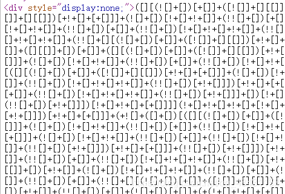
粘贴到控制台回车即可解码，注意flag转化成大写，题目中有提示：
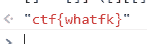

## **网站被黑**


源码什么也没有，其他也没有观察出什么就用御剑扫描一下
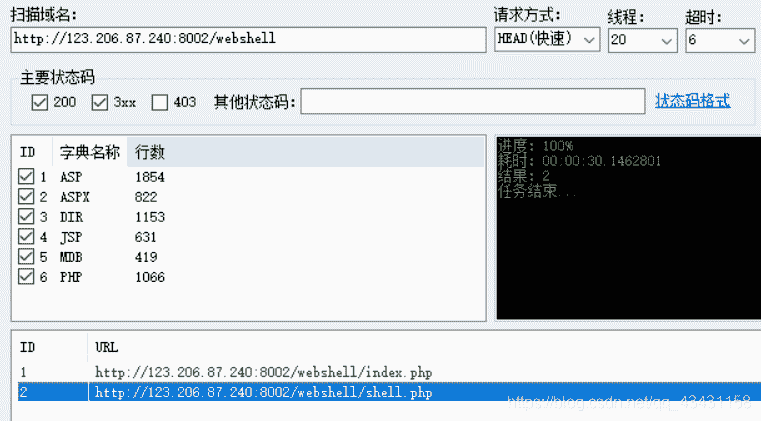
有隐藏目录`shell.php`
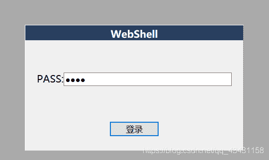
需要输入密码才能进入，也没有任何提示，一般就是弱口令爆破了

加载字典
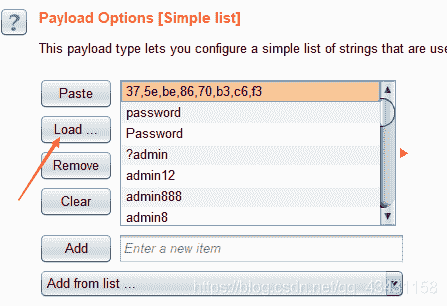
进行爆破，便可得出flag。
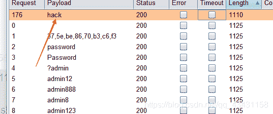

## **输入密码查看flag**

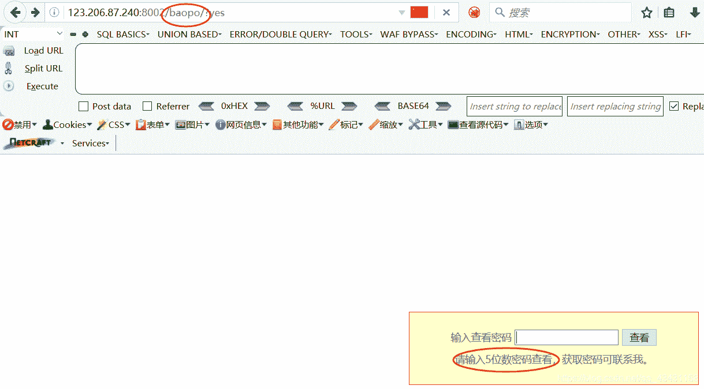
观察到爆破而且密码是五位数字，那就用`burp`来爆破
设置payload：
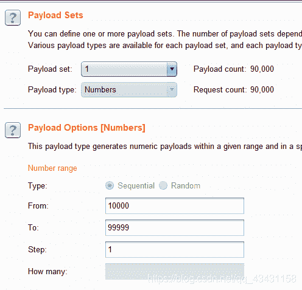
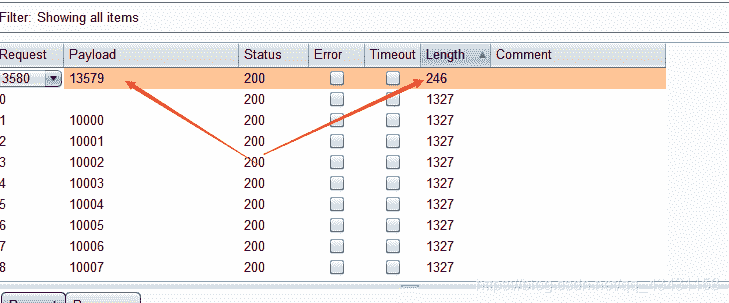
爆破出来了，提交即可得出flag

## **点击一百万次**

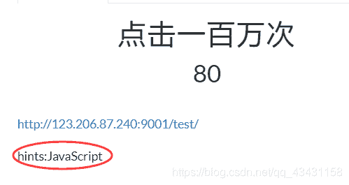
提示是JS，查看一下源代码，发现
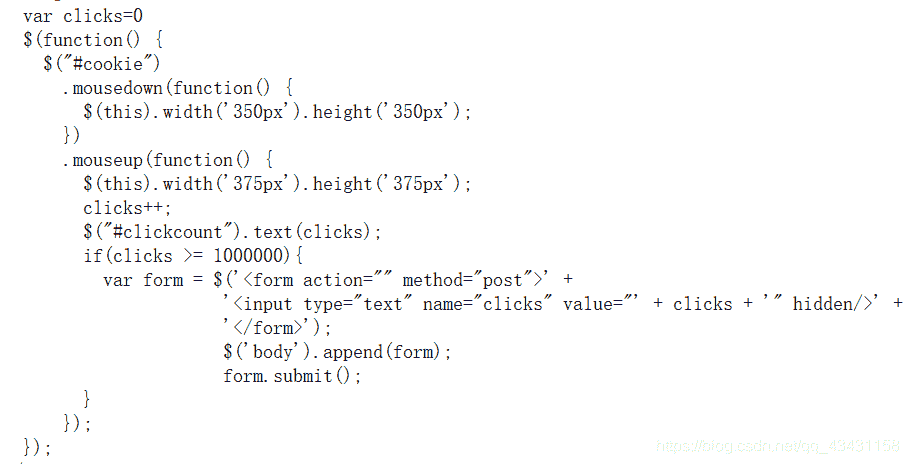
虽然不太懂JS代码，但是还是可以理解这个代码大意，变量`clicks`通过点击来自增。但是这里变量也可以通过POST进行传递,那就直接给变量传一个`10000000`.
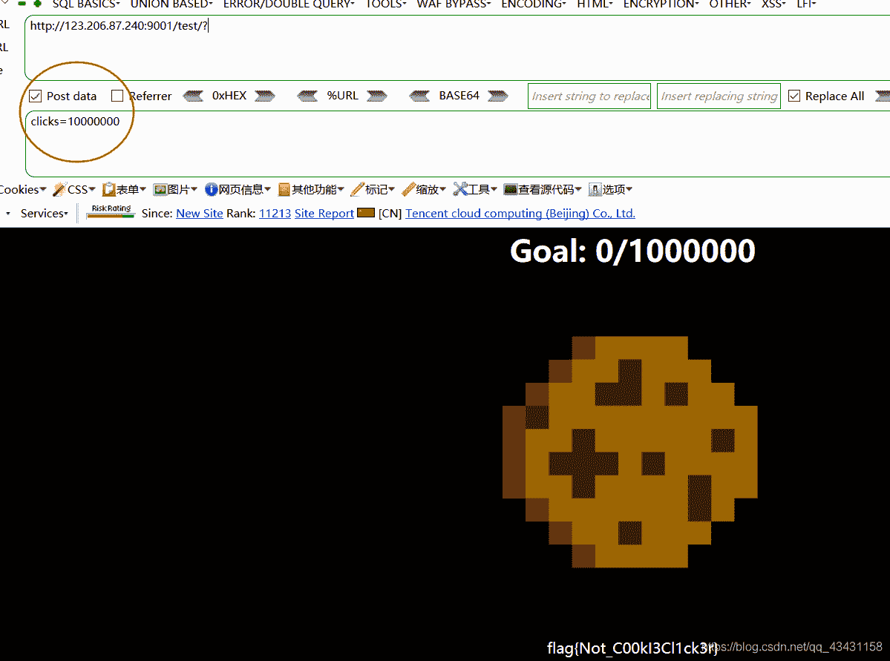

## **备份是个好习惯**

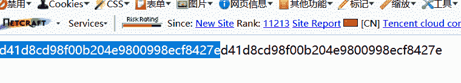
发现是MD5加密后的值，而且两段相同，解密一下
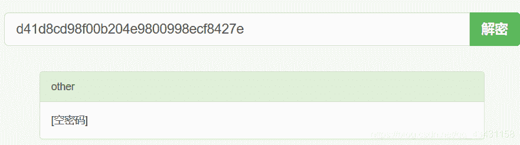空密码，看来解题思路应该错了，重新查看题目发现这道题与备份有关，常见的PHP备份后缀名有`.php.bak`等
输入`http://123.206.87.240:8002/web16/index.php.bak`发现

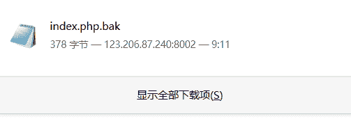
当然了，这次是运气好，是`index.php`，如果遇到其他名字的话就用御剑来把隐藏的目录都给扫出来即可。
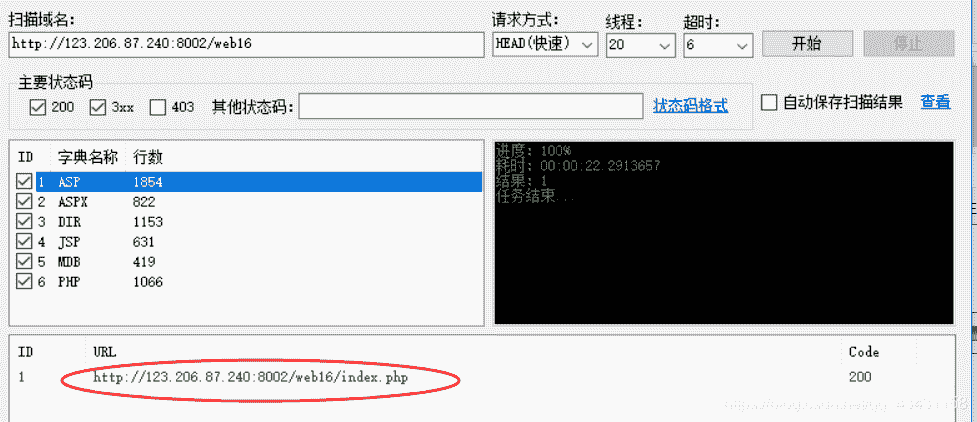
就一个目录，那备份肯定就是`index.php.bak`，接下来就来查看下载的文件
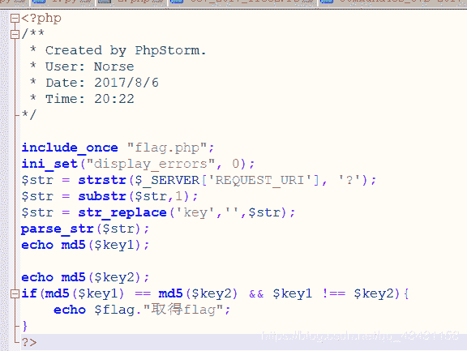

```
$str = strstr($_SERVER['REQUEST_URI'], '?'); 
```

`strstr`函数将URL`?`后的值(包括?)一起赋给变量`str`

```
$str = substr($str,1); 
```

去除`？`

```
$str = str_replace('key','',$str); 
```

如果变量`str`中存在key，则替换掉

最核心的代码就是这一段代码

```
if(md5($key1) == md5($key2) && $key1 !== $key2){
    echo $flag."取得flag";
} 
```

两个变量的MD5值需相同，但是变量不能够相同，才可以得出flag，这点涉及到了MD5的绕过

> md5加密之后以0e开头的，值都为0，那是因为0e在比较的时候会将其视作为科学计数法，所以无论0e后面是什么，0的多少次方还是0。

常见的`0e`开头：

```
QNKCDZO
0e830400451993494058024219903391

s878926199a
0e545993274517709034328855841020

s155964671a
0e342768416822451524974117254469

s214587387a
0e848240448830537924465865611904

s214587387a
0e848240448830537924465865611904

s878926199a
0e545993274517709034328855841020

s1091221200a
0e940624217856561557816327384675 
```

既然知道了如何绕过，那就来构造语句，但是要注意前面将`key`这个关键字给过滤掉了，所以采用`错位`的方法构造payload：

```
?kekeyy1=QNKCDZO&kekeyy2=s214587387a 
```

得出flag
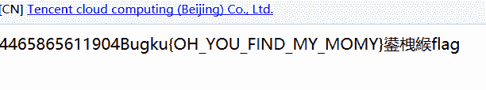
除此之外，看了大师傅们的博客，发现绕过MD5的方法还可以利用数组

> md5()函数无法处理数组，如果传入的为数组，会返回NULL，所以两个数组经过加密后得到的都是NULL,也就是相等的。

所以构造payload：

```
http://123.206.87.240:8002/web16/?kekeyy1[]=aa&kekeyy2[]=bb 
```

得出flag
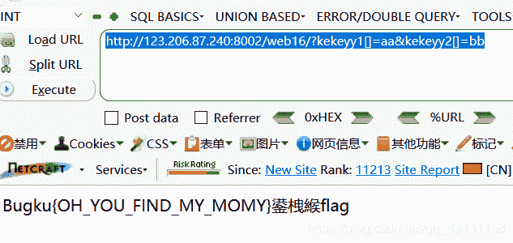

## **成绩单**

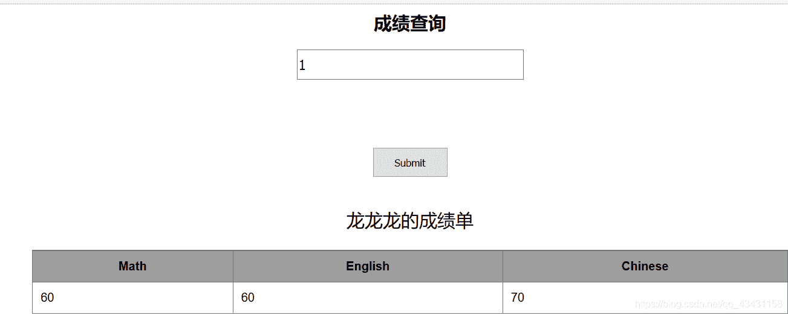
明显的回显注入，判断闭合符号是单引号，省略符号是`#`，这道题也没有过滤关键字什么的，按照通用的语句来做即可，这里就不阐述了。
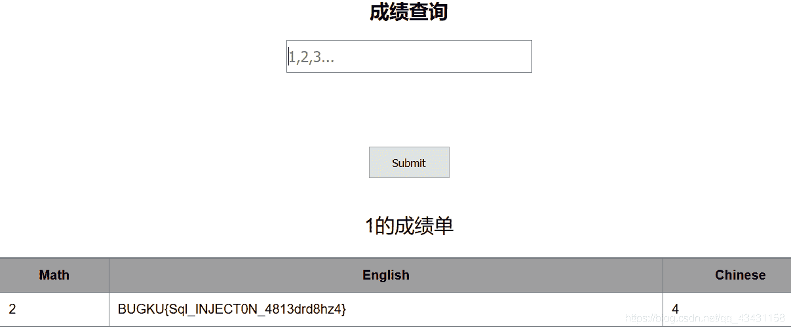

## **速度要快**

查看源码发现
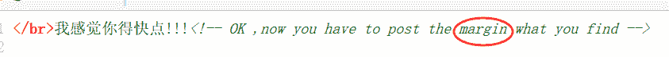
需要一个带margin属性的post请求，除此之外应该还有其他线索，用burp进行抓包，发现请求头中隐藏有flag，base64解码提交确不正确，搞了好久才发现原来每go一次，flag便变化一次
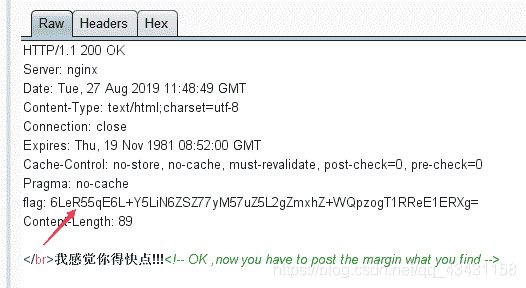
看了大师傅的write up，需要py脚本来解决，自己还写不出来就参考大师傅的脚本

```
import requests
import base64

url = 'http://123.206.87.240:8002/web6/'
req = requests.session()
res = req.get(url)

flag = res.headers['flag']

flag = base64.b64decode(flag)

flag = bytes.decode(flag)

flag = flag[flag.index(':') + 0:]

flag = base64.b64decode(flag)

data = {'margin': flag}

rs = req.post(url, data)

key = rs.content

key = bytes.decode(key)
print(key) 
```

[python str与bytes之间的转换](https://blog.csdn.net/yatere/article/details/6606316)
[大师傅博客](https://blog.csdn.net/New_feature/article/details/82974240)

## **cookies欺骗**

一开始做这道题很懵，后来发现url上`a2V5cy50eHQ=`是base64编码，解码查看
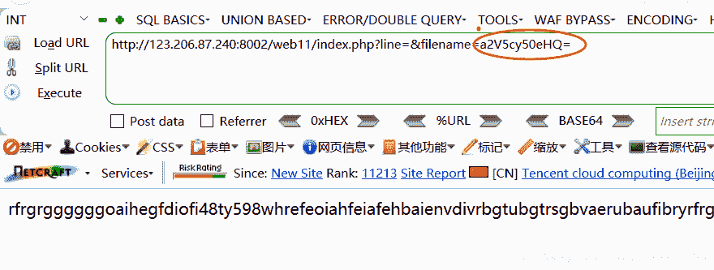
解码得到`keys.txt`，说明当前访问的是`keys.txt`文件，那按照这样的格式把`index.php`也转换成base64编码格式查看源码。
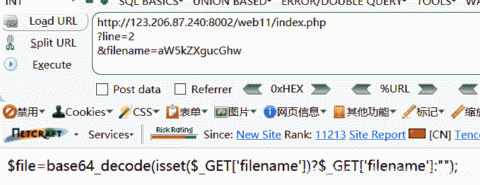
发现改变line的值会出现一段PHP语句，写一个简单的脚本把所有的代码跑出来

```
import requests

a=20

for i in range(a):
    url="http://123.206.87.240:8002/web11/index.php?line="+str(i)+"&filename=aW5kZXgucGhw" 
    s=requests.get(url)
    print (s.text) 
```

结果:

```
<?php
error_reporting(0);
$file=base64_decode(isset($_GET['filename'])?$_GET['filename']:"");
$line=isset($_GET['line'])?intval($_GET['line']):0;
if($file=='') header("location:index.php?line=&filename=a2V5cy50eHQ=");

$file_list = array(
'0' =>'keys.txt',
'1' =>'index.php',
);
if(isset($_COOKIE['margin']) && $_COOKIE['margin']=='margin'){
$file_list[2]='keys.php';
}
if(in_array($file, $file_list)){
$fa = file($file);
echo $fa[$line];
}
?> 
```

审计代码，发现有一段代码特殊

```
if(isset($_COOKIE['margin']) && $_COOKIE['margin']=='margin'){
$file_list[2]='keys.php';
} 
```

再结合题目，cookies欺骗，抓包修改参数即可访问`keys.php`，不过这里`keys.php`需要转化成base64的格式。
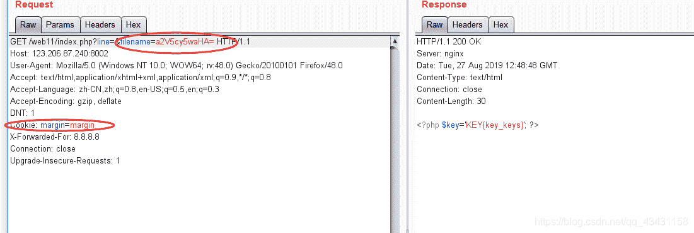

## **前女友(SKCTF)**

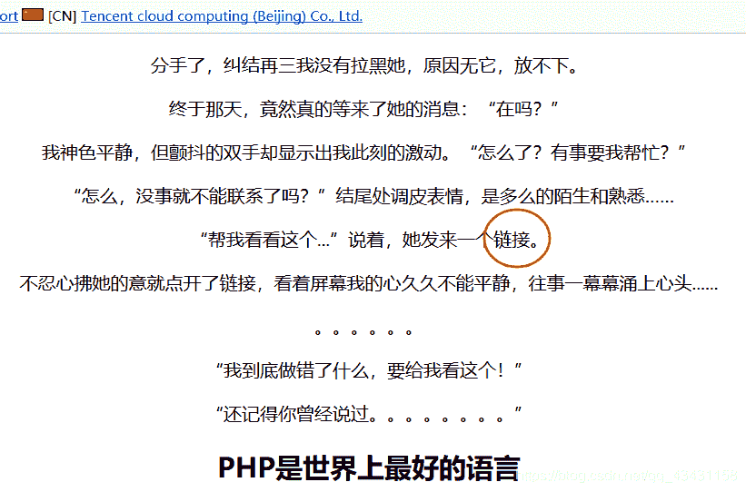
这个链接是可以点开的，一开始没注意到，在抓包过程中才发现
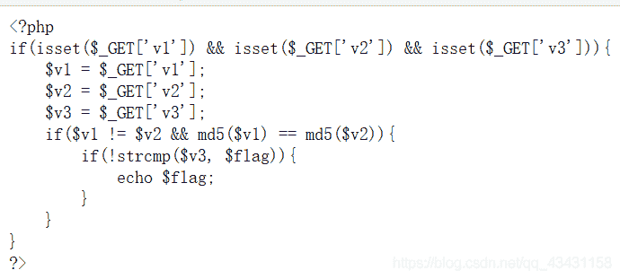
一段PHP代码，考察MD5漏洞的，但是和之前的题中有一点不同，这道题还考察了`strcmp`函数的漏洞

> strcmp(str1,str2)比较两个字符串，如果相等就返回0。
> 在php 5.2版本之前，利用strcmp函数将数组与字符串进行比较会返回-1，但是从5.3开始，会返回0

所以利用这个漏洞构造payload：

```
?v1=s214587387a&v2=s878926199a&v3[]=1 
```

或都用数组来绕过，payload：

```
?v1[]=1&v2[]=2&v3[]=1 
```

得出flag
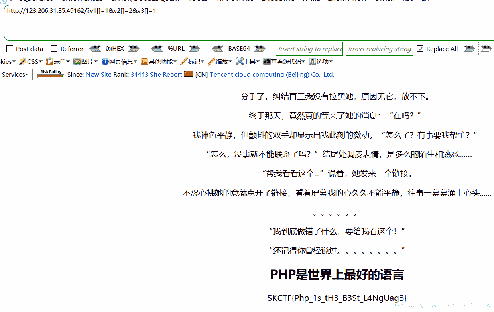

## **你从哪里来**

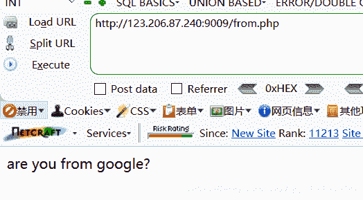
根据提示，可以知道这道题应该是构造`referer`——伪造来源浏览器，抓包进行伪造

```
Referer:https://www.google.com 
```

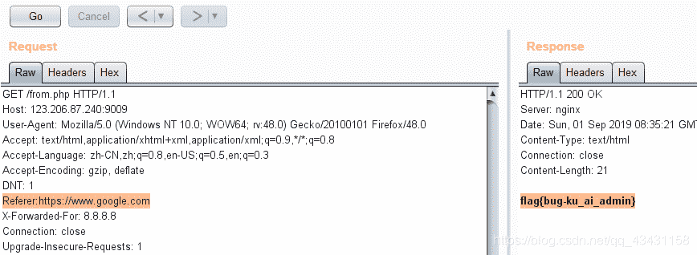

## **程序员本地网站**


根据提示，这道题考察的是`xff`——伪造IP地址来源，抓包修改成本地IP地址即可

```
X-Forwarded-For: 127.0.0.1 
```

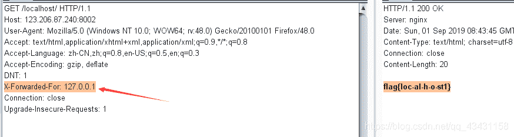

## **md5 collision(NUPT_CTF)**

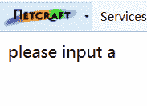
简单的MD5碰撞，由`==`的用法，`0 == 字符串`是成立的，从而可以绕过MD5检查。之前了解过MD5算法的漏洞，会将`0e`开头的当作`0`，所以只要找到常见的一个以`oe`开头加密过的MD5值即可

举个例子：

```
<?php 
$str = "Hello"; 
echo md5($str); 
if (md5($str) == "8b1a9953c4611296a827abf8c47804d7") 

{ 
echo "<br>Hello world!"; 
exit; 
} 
?> 
```

理解了这些，就构造payload：

```
?a=s155964671a 
```


## **never give up**

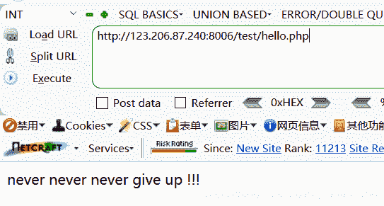
这道题一开始困住很长时间，看了源代码提示后进入这个页面
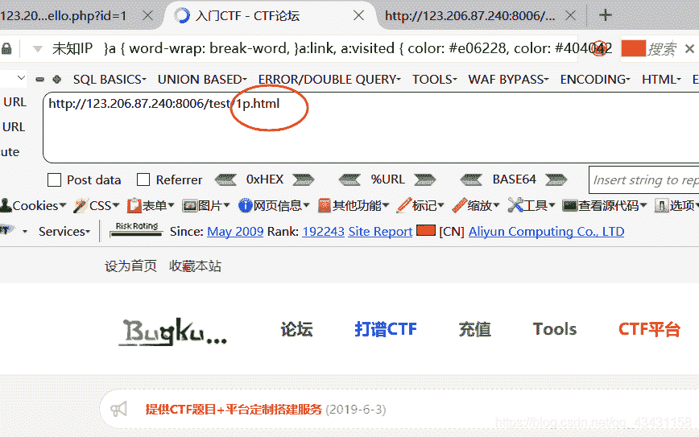
便毫无思路了，后来才发现在源代码中查看`1p.html`才有相应的提示。。。
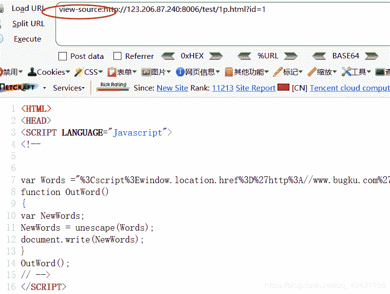
发现一串base64编码，进行解码
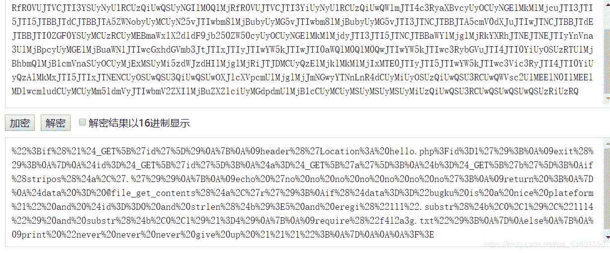
明显是URL编码，继续解码
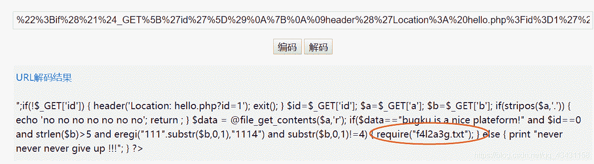
有`require()` 函数引入`f4l2a3g.txt`文件，直接查看即可得出flag
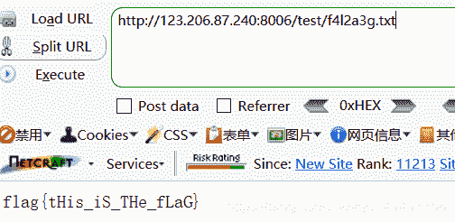

## **web4**

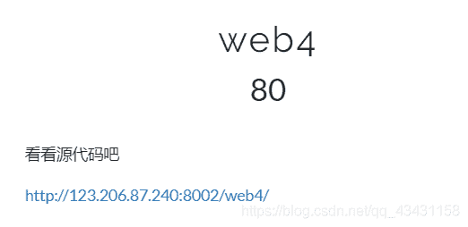
看源代码发现
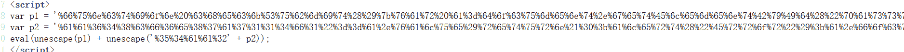
URL编码的，解码
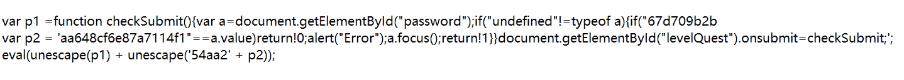
unescape() 函数可对通过 escape() 编码的字符串进行解码。

接下来根据`eval(unescape(p1) + unescape('54aa2' + p2));`顺序进行拼接即可

```
67d709b2b54aa2aa648cf6e87a7114f1 
```

得出flag
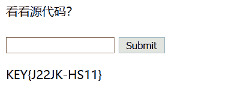

## **管理员系统**

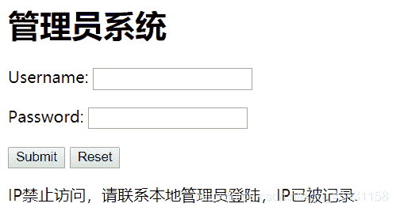
题目是管理员系统，猜测用户名应该是`admin`，查看源代码发现
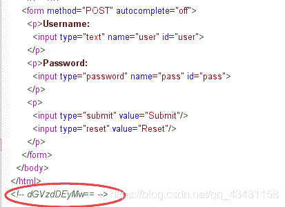
解码后得到`test123`，应该是密码，但是输入之后发现
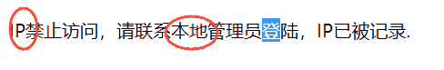
所以抓包XFF伪造IP地址即可得出flag


## **login1(SKCTF)**

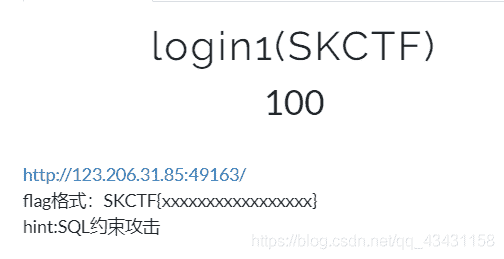
提示是SQL约束攻击，了解一下SQL约束攻击
[基于约束的SQL攻击](https://www.freebuf.com/articles/web/124537.html)
具体的就不详细解释了，大师傅已经在博客中说的很清楚了。
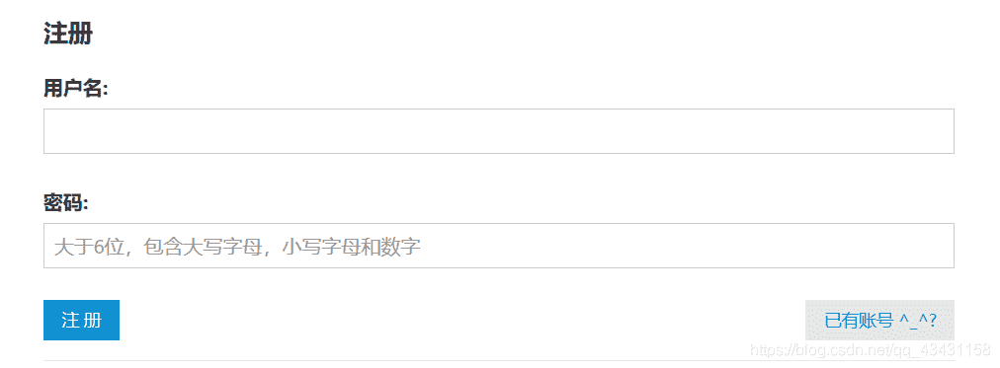
注册一个普通账号，会提示`不是管理员还想登进去`，那就注册一个admin账号，但是已经存在了，这时就用道了SQL约束攻击

构造用户名
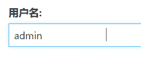
后面多加空格，密码按照要求即可

注册成功后，输入`admin`和注册时的密码即可
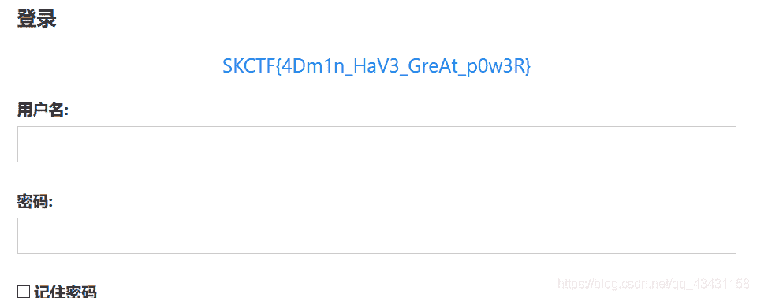
原理的话就是大师傅的这一段话，如果不太了解可以仔细看大师傅的博客
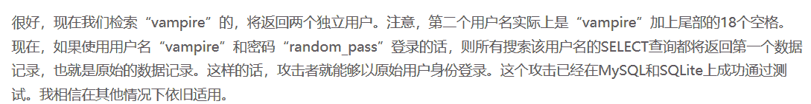

## **求getshell**

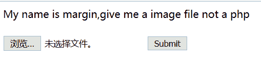
根据提示，只能上传图片，抓包
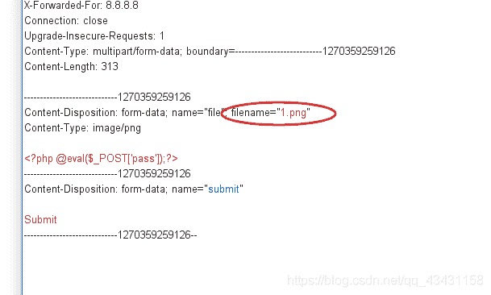
将后缀名改为php发现上传不成功，之后尝试各种方法如：`后缀名加::$DATA绕过`，尝试了`phtml，php3，php4, php5, pht`发现还是不行，最后看了大师傅们的博客
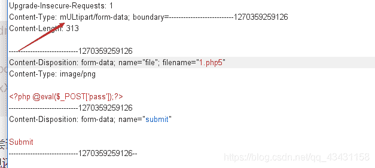
`这个地方需要大小写搭配上`php5`才能绕过，是真的想不到，之前也没遇到过。

发包即可得出flag