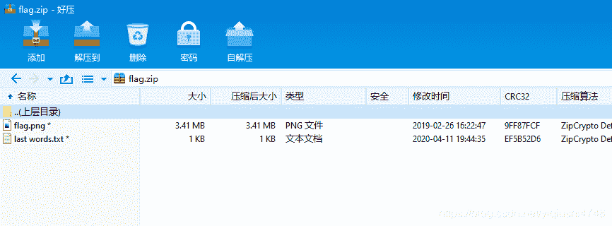
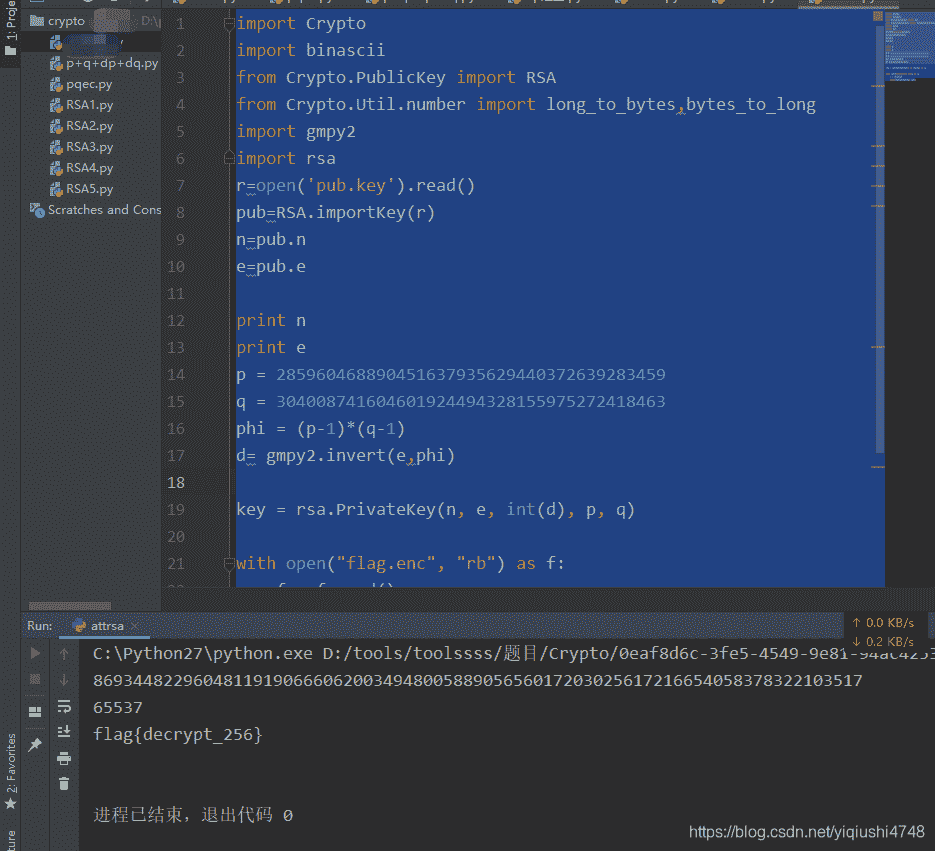

<!--yml
category: 未分类
date: 2022-04-26 14:20:21
-->

# Buuctf RSA 详细题解_偷一个月亮的博客-CSDN博客_buuctf rsa

> 来源：[https://blog.csdn.net/yiqiushi4748/article/details/108329500](https://blog.csdn.net/yiqiushi4748/article/details/108329500)



```
import Crypto
import binascii
from Crypto.PublicKey import RSA
from Crypto.Util.number import long_to_bytes,bytes_to_long
import gmpy2
import rsa
r=open('pub.key').read()
pub=RSA.importKey(r)
n=pub.n
e=pub.e

print n
print e
p = 285960468890451637935629440372639283459
q = 304008741604601924494328155975272418463
phi = (p-1)*(q-1)
d= gmpy2.invert(e,phi)

key = rsa.PrivateKey(n, e, int(d), p, q)

with open("flag.enc", "rb") as f:
    f = f.read()
    print(rsa.decrypt(f, key)) 
```

