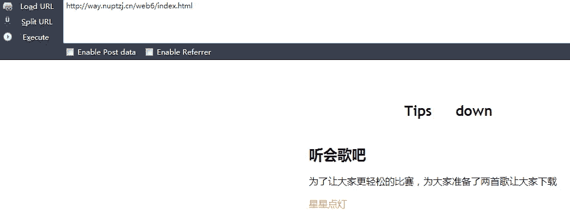
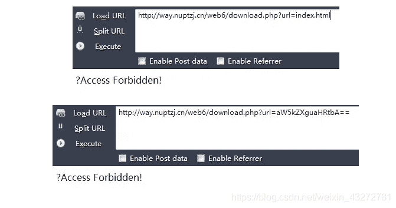
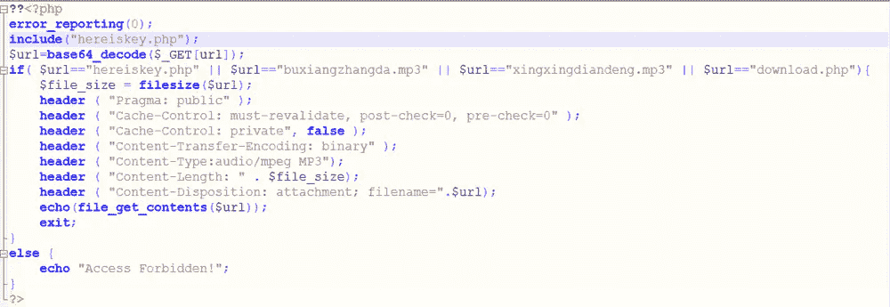
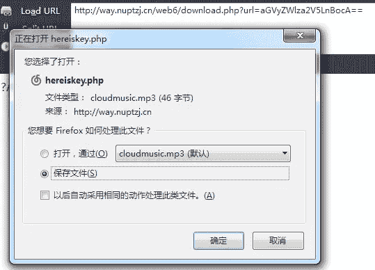

<!--yml
category: 未分类
date: 2022-04-26 14:53:12
-->

# CG CTF WEB Download~!_Starzkg的博客-CSDN博客

> 来源：[https://blog.csdn.net/weixin_43272781/article/details/94443422](https://blog.csdn.net/weixin_43272781/article/details/94443422)

[http://way.nuptzj.cn/web6/](http://way.nuptzj.cn/web6/)

题解：

工具：

提示别下音乐，尝试下载其他东西，首先查看网页源代码

发现两个链接，就是下载音乐的链接，download.php?url=eGluZ3hpbmdkaWFuZGVuZy5tcDM=，url经过了base64加密，解码发现内容为xingxingdiandeng.mp3，在访问下载页面时url参数进行了base64加密，尝试下载其他页面，访问index.php发现页面不存在，访问index.html存在，尝试下载index.html

发现index.html，以及base64后的index.html都无法访问。

尝试下载download.php，以及base64后的download.php

打开下载的download文件，发现首先对url参数进行了base64解码，并且只有四个文件能够正常下载，否则提示Access Forbidden！，下载hereiskey.php，得到flag

