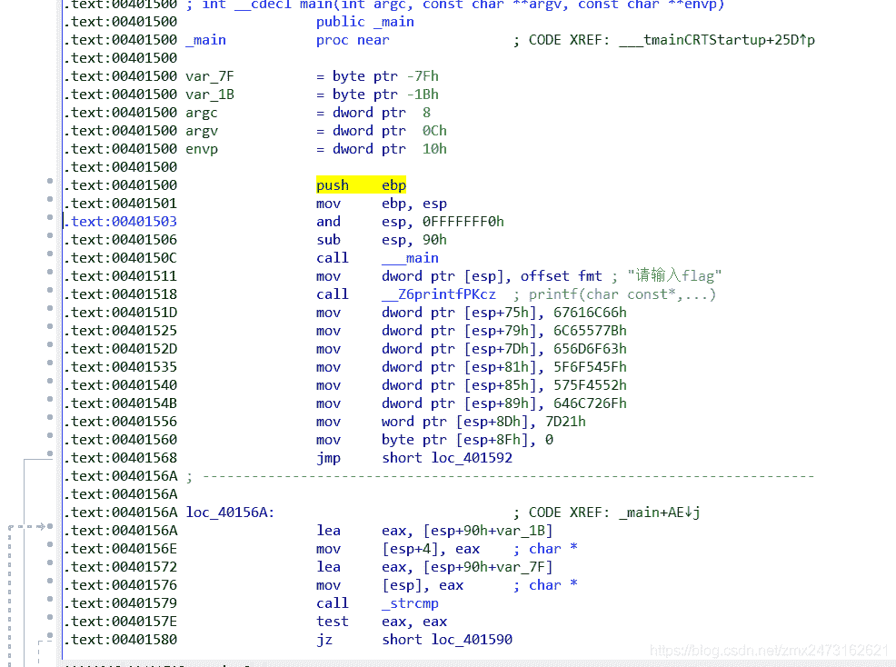
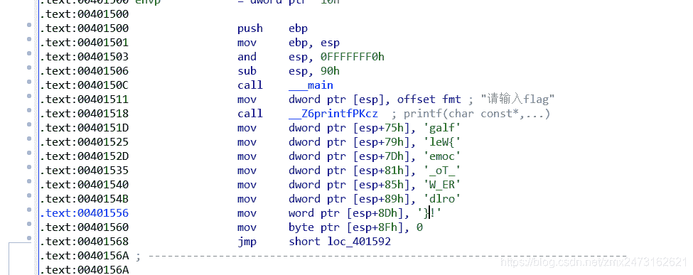
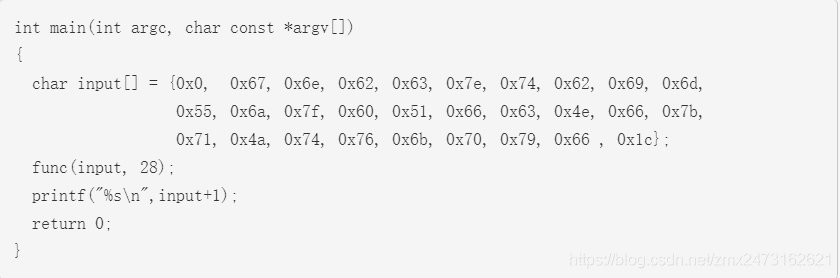
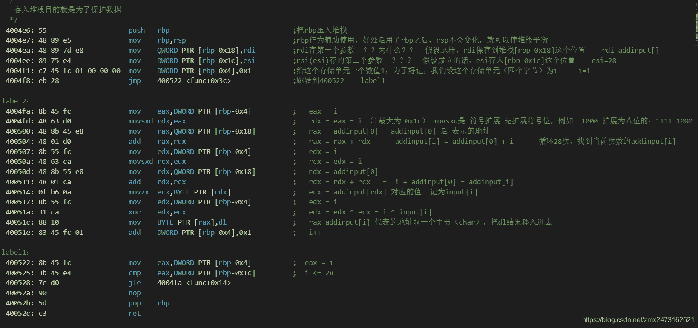
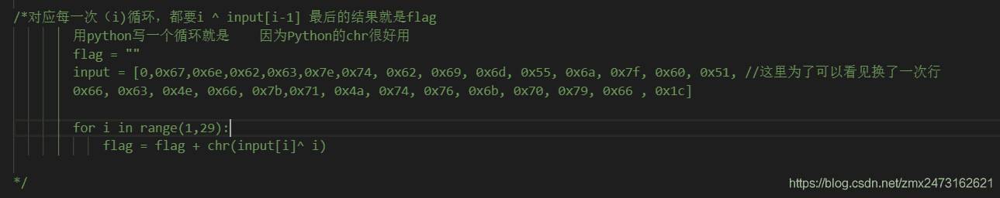
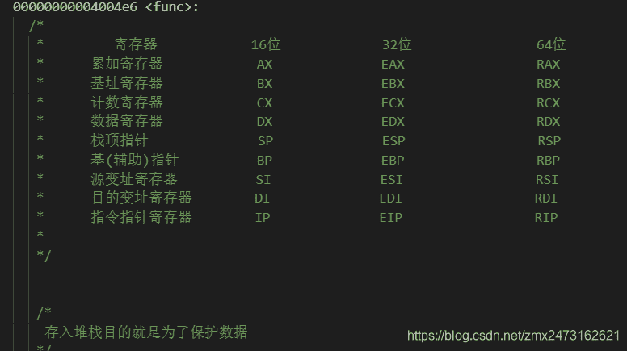

<!--yml
category: 未分类
date: 2022-04-26 14:32:54
-->

# CG-ctf中RE Hello,RE和ReadAsm2超详细题解_jovy-rtt的博客-CSDN博客

> 来源：[https://blog.csdn.net/zmx2473162621/article/details/103163789](https://blog.csdn.net/zmx2473162621/article/details/103163789)

##### Hello，RE！

某小白在实验中搞github的时候（clone真的好慢好慢啊！！！），忘记了时间，就把一门马课给忘了（问了tx没有dm），所以干脆就刷点题玩玩吧，毕竟啥都不知道，刷题可以快速了解一些知识，我就去cg里面看了一下re题，发现一个hello题很适合我，所以我就搞了它！题目在cg上的re中自己去找，为了保护cg的知识产权，就不在这里给源程序，自己去看看！
接下来，我把exe下载之后，运行，是这样滴！

找flag嘛~用ida看一下

找到了这个，后面的那些奇奇怪怪的数字确实难顶，但是题目给的提示是按r可以变成字符串的，后来我再想了一下，其实这一串数字恰好八个，而定义的是dw类型的，也就是四个字节，也恰好是4个字符，所以这应该是四个char，按一下r，所以变成了这样：

emmm，flag出来了，但是，诶~galf反着呢！正常来说，反过来输入确实是一个flag，而且还是一个格式正确的flag（废话），提交了flag之后，我又想了一下，发现用的是esp，esp是什么？是堆栈的指针啊！而对于一个堆栈来说，是从高地址往低地址走的，所以对应的应该是
g->75h,a->74h…以此类推，所以把这些每四位反一下就可以；

##### ReadAsm2

首先题目是这样的，给出了一个主函数，然后不知道的是func这个函数，而给定的是一个asm文件

想必大家做题的时候遇到这道题之后就已经看过那个asm文件了，所以我在这里就只放一个我写的带有注释的文件截图了：
带有详细题解的asm文件链接：https://pan.baidu.com/s/1zRPyFTmR9s9SUEnJb6A8TQ 提取码：1z8h

为了让大家看着方便，就只能是代码片形式了；
看之前先说明一点，在func第一个参数传入的时候，传入的是数组的首地址，所以后面我是用addinput代表的地址的数组集，就是数组里面存的是地址；

```
 /*
    存入堆栈目的就是为了保护数据，这个地方是汇编之后的重中之重，因为汇编中，寄存器的数量是有限的，而通过寄存器的的数据传输又是最快的，所以
    为了是速度上不太慢，编译器会尽可能的使用寄存器，特别是32位寄存器，64位寄存器，在一般情况下，对于寄存器的功能已经淡化了，8个、16个寄存器就
    可以随便（也不是太随便）调用，所以把一些数据先保存在堆栈，防止数值丢失，然后释放寄存器，让寄存器发挥更重要的作用，等用到时候再弹出到寄存器中
    当然，存储器也可以，堆栈的作用主要在调用函数的时候显得尤为重要！
   */
  4004e6: 55                    push   rbp                              ;把rbp压入堆栈   ，起到保护作用
  4004e7: 48 89 e5              mov    rbp,rsp                          ;rbp作为辅助使用，好处是用了rbp之后，rsp不会变化，就可以使堆栈平衡
  4004ea: 48 89 7d e8           mov    QWORD PTR [rbp-0x18],rdi         ;rdi存第一个参数  ？？为什么？？  假设这样，rdi保存到堆栈[rbp-0x18]这个位置    rdi=addinput[] 
;至于为什么，我也想知道，我感觉这地方是和寄存器的功能有关，到底是不是这样，兄弟们给我一点时间，我去查一下（问一下老师和大佬）
  4004ee: 89 75 e4              mov    DWORD PTR [rbp-0x1c],esi         ;rsi(esi)存的第二个参数  ？？？  假设成立的话，esi存入[rbp-0x1c]这个位置    esi=28
  4004f1: c7 45 fc 01 00 00 00  mov    DWORD PTR [rbp-0x4],0x1          ;给这个存储单元一个数值1，为了好记，我们设这个存储单元（四个字节）为i     i=1
  4004f8: eb 28                 jmp    400522 <func+0x3c>               ;跳转到400522    label1

；for循环开始，i=1
;label2：
  4004fa: 8b 45 fc              mov    eax,DWORD PTR [rbp-0x4]          ;   eax = i 
  4004fd: 48 63 d0              movsxd rdx,eax                          ;   rdx = eax = i （i最大为 0x1c） movsxd是 符号扩展 先扩展符号位，例如  1000 扩展为八位的：1111 1000  
  400500: 48 8b 45 e8           mov    rax,QWORD PTR [rbp-0x18]         ;   rax = addinput[0]   addinput[0] 是 表示的地址 
  400504: 48 01 d0              add    rax,rdx                          ;   rax = rax + rdx      addinput[i] = addinput[0] + i      循环28次，找到当前次数的addinput[i]
  400507: 8b 55 fc              mov    edx,DWORD PTR [rbp-0x4]          ;   edx = i      ？？这地方好傻啊，就不能用eax吗？
  40050a: 48 63 ca              movsxd rcx,edx                          ;   rcx = edx = i      这个地方也是傻
  40050d: 48 8b 55 e8           mov    rdx,QWORD PTR [rbp-0x18]         ;   rdx = addinput[0]      这个地方还是傻
  400511: 48 01 ca              add    rdx,rcx                          ;   rdx = rdx + rcx   =  i + addinput[0] = addinput[i]      同上傻
  400514: 0f b6 0a              movzx  ecx,BYTE PTR [rdx]               ;   ecx = addinput[rdx] 对应的值  记为input[i]
  400517: 8b 55 fc              mov    edx,DWORD PTR [rbp-0x4]          ;   edx = i        
  40051a: 31 ca                 xor    edx,ecx                          ;   edx = edx ^ ecx = i ^ input[i]       说来说去，最后只要这个核心代码嘛~前面好多多余的步骤
  40051c: 88 10                 mov    BYTE PTR [rax],dl                ;   rax  addinput[i] 代表的地址取一个字节（char），把dl结果移入进去    变换后结果存入input
  40051e: 83 45 fc 01           add    DWORD PTR [rbp-0x4],0x1          ;   i++    

;label1：
  400522: 8b 45 fc              mov    eax,DWORD PTR [rbp-0x4]          ;  eax = i
  400525: 3b 45 e4              cmp    eax,DWORD PTR [rbp-0x1c]         ;  i <= 28
  400528: 7e d0                 jle    4004fa <func+0x14>
  40052a: 90                    nop
  40052b: 5d                    pop    rbp
  40052c: c3                    ret 
```

所以啊~这道题当你真的认真分析下来之后，你会发现，并不难，只是有一些傻瓜的多余地方，核心功能就这一个，主要还是想让自己静下心来，仔细分析一下汇编语言；然后用Python写一串代码得出 flag{read_asm_is_the_basic}
写好的Python文件：链接：https://pan.baidu.com/s/1SePLofkRpxSGQPW6bZaEDg 提取码：fyq5


什么？你不知道rbx啥意思？？？你怎么能不知道呢？好吧，我也不知道，我是百度之后才知道的，我学的是杨季文老师的新概念汇编，基于x8680的32位汇编，还真不知道这东西就是64位汇编之中的；先看图！

在本道题中，就知道这么多就可以了，就可以去做题了，对于那些movsxd百度一下或者猜一下，就可以知道，sf就是符号标志位，所以应该是带符号的扩展，而且要做ctf二进制的话，汇编还真要有一定的基础，所以不懂的话可以去先学一下汇编基础！

想了解更多的关于32位和64位的区别，我感觉这篇博客不错：https://blog.csdn.net/qq_29343201/article/details/51278798