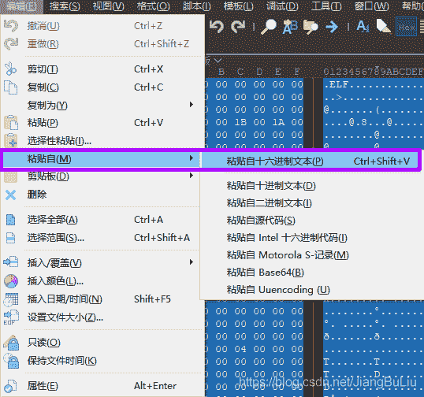
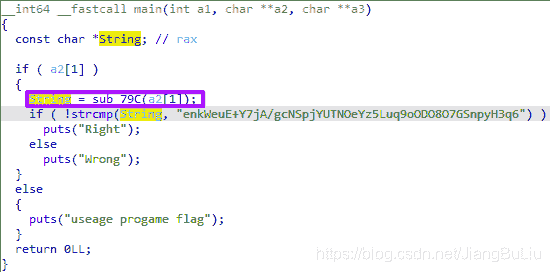
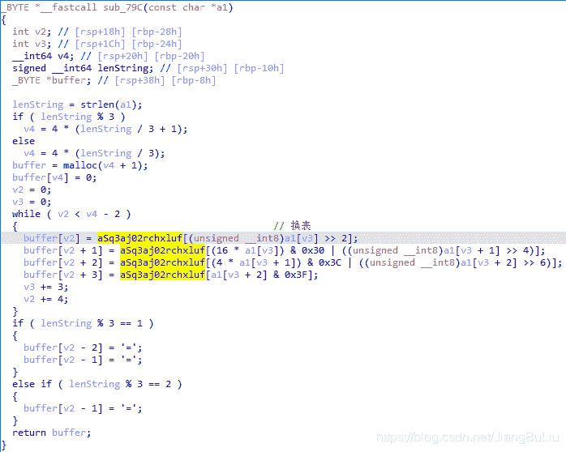
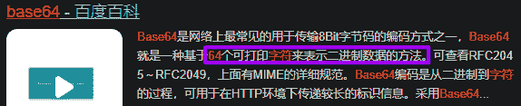
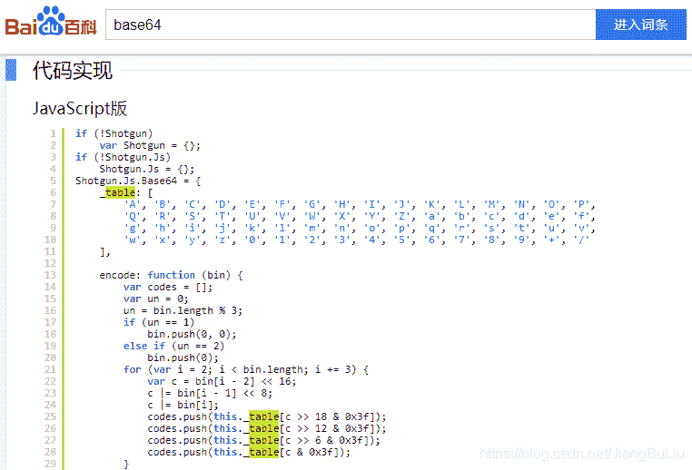
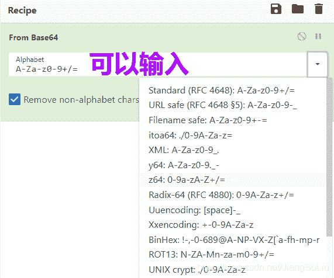
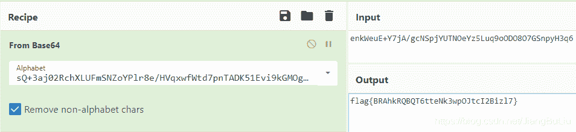

<!--yml
category: 未分类
date: 2022-04-26 14:50:23
-->

# CTF - Base64换表_建瓯最坏的博客-CSDN博客_base64换表

> 来源：[https://blog.csdn.net/JiangBuLiu/article/details/117661772](https://blog.csdn.net/JiangBuLiu/article/details/117661772)

# 原题

## 复制保存为16进制即可得文件


查壳显示是没加壳64位的ELF文件：

```
7F 45 4C 46 02 01 01 00 00 00 00 00 00 00 00 00 03 00 3E 00 01 00 00 00 10 06 00 00 00 00 00 00 40 00 00 00 00 00 00 00 28 11 00 00 00 00 00 00 00 00 00 00 40 00 38 00 09 00 40 00 1B 00 1A 00 06 00 00 00 04 00 00 00 40 00 00 00 00 00 00 00 40 00 00 00 00 00 00 00 40 00 00 00 00 00 00 00 F8 01 00 00 00 00 00 00 F8 01 00 00 00 00 00 00 08 00 00 00 00 00 00 00 03 00 00 00 04 00 00 00 38 02 00 00 00 00 00 00 38 02 00 00 00 00 00 00 38 02 00 00 00 00 00 00 1C 00 00 00 00 00 00 00 1C 00 00 00 00 00 00 00 01 00 00 00 00 00 00 00 01 00 00 00 05 00 00 00 00 00 00 00 00 00 00 00 00 00 00 00 00 00 00 00 00 00 00 00 00 00 00 00 D0 0C 00 00 00 00 00 00 D0 0C 00 00 00 00 00 00 00 00 20 00 00 00 00 00 01 00 00 00 06 00 00 00 A0 0D 00 00 00 00 00 00 A0 0D 20 00 00 00 00 00 A0 0D 20 00 00 00 00 00 70 02 00 00 00 00 00 00 78 02 00 00 00 00 00 00 00 00 20 00 00 00 00 00 02 00 00 00 06 00 00 00 B0 0D 00 00 00 00 00 00 B0 0D 20 00 00 00 00 00 B0 0D 20 00 00 00 00 00 F0 01 00 00 00 00 00 00 F0 01 00 00 00 00 00 00 08 00 00 00 00 00 00 00 04 00 00 00 04 00 00 00 54 02 00 00 00 00 00 00 54 02 00 00 00 00 00 00 54 02 00 00 00 00 00 00 44 00 00 00 00 00 00 00 44 00 00 00 00 00 00 00 04 00 00 00 00 00 00 00 50 E5 74 64 04 00 00 00 64 0B 00 00 00 00 00 00 64 0B 00 00 00 00 00 00 64 0B 00 00 00 00 00 00 44 00 00 00 00 00 00 00 44 00 00 00 00 00 00 00 04 00 00 00 00 00 00 00 51 E5 74 64 06 00 00 00 00 00 00 00 00 00 00 00 00 00 00 00 00 00 00 00 00 00 00 00 00 00 00 00 00 00 00 00 00 00 00 00 00 00 00 00 00 00 00 00 10 00 00 00 00 00 00 00 52 E5 74 64 04 00 00 00 A0 0D 00 00 00 00 00 00 A0 0D 20 00 00 00 00 00 A0 0D 20 00 00 00 00 00 60 02 00 00 00 00 00 00 60 02 00 00 00 00 00 00 01 00 00 00 00 00 00 00 2F 6C 69 62 36 34 2F 6C 64 2D 6C 69 6E 75 78 2D 78 38 36 2D 36 34 2E 73 6F 2E 32 00 04 00 00 00 10 00 00 00 01 00 00 00 47 4E 55 00 00 00 00 00 03 00 00 00 02 00 00 00 00 00 00 00 04 00 00 00 14 00 00 00 03 00 00 00 47 4E 55 00 D5 8C FC 4E 67 91 EE C2 F3 0F 42 F6 F4 7B 3B F8 C0 40 58 2E 01 00 00 00 01 00 00 00 01 00 00 00 00 00 00 00 00 00 00 00 00 00 00 00 00 00 00 00 00 00 00 00 00 00 00 00 00 00 00 00 00 00 00 00 00 00 00 00 00 00 00 00 00 00 00 00 52 00 00 00 20 00 00 00 00 00 00 00 00 00 00 00 00 00 00 00 00 00 00 00 0B 00 00 00 12 00 00 00 00 00 00 00 00 00 00 00 00 00 00 00 00 00 00 00 10 00 00 00 12 00 00 00 00 00 00 00 00 00 00 00 00 00 00 00 00 00 00 00 34 00 00 00 12 00 00 00 00 00 00 00 00 00 00 00 00 00 00 00 00 00 00 00 2D 00 00 00 12 00 00 00 00 00 00 00 00 00 00 00 00 00 00 00 00 00 00 00 6E 00 00 00 20 00 00 00 00 00 00 00 00 00 00 00 00 00 00 00 00 00 00 00 17 00 00 00 12 00 00 00 00 00 00 00 00 00 00 00 00 00 00 00 00 00 00 00 7D 00 00 00 20 00 00 00 00 00 00 00 00 00 00 00 00 00 00 00 00 00 00 00 1E 00 00 00 22 00 00 00 00 00 00 00 00 00 00 00 00 00 00 00 00 00 00 00 00 6C 69 62 63 2E 73 6F 2E 36 00 70 75 74 73 00 73 74 72 6C 65 6E 00 6D 61 6C 6C 6F 63 00 5F 5F 63 78 61 5F 66 69 6E 61 6C 69 7A 65 00 73 74 72 63 6D 70 00 5F 5F 6C 69 62 63 5F 73 74 61 72 74 5F 6D 61 69 6E 00 47 4C 49 42 43 5F 32 2E 32 2E 35 00 5F 49 54 4D 5F 64 65 72 65 67 69 73 74 65 72 54 4D 43 6C 6F 6E 65 54 61 62 6C 65 00 5F 5F 67 6D 6F 6E 5F 73 74 61 72 74 5F 5F 00 5F 49 54 4D 5F 72 65 67 69 73 74 65 72 54 4D 43 6C 6F 6E 65 54 61 62 6C 65 00 00 00 00 00 00 02 00 02 00 02 00 02 00 00 00 02 00 00 00 02 00 00 00 00 00 01 00 01 00 01 00 00 00 10 00 00 00 00 00 00 00 75 1A 69 09 00 00 02 00 46 00 00 00 00 00 00 00 A0 0D 20 00 00 00 00 00 08 00 00 00 00 00 00 00 10 07 00 00 00 00 00 00 A8 0D 20 00 00 00 00 00 08 00 00 00 00 00 00 00 D0 06 00 00 00 00 00 00 08 10 20 00 00 00 00 00 08 00 00 00 00 00 00 00 08 10 20 00 00 00 00 00 D8 0F 20 00 00 00 00 00 06 00 00 00 01 00 00 00 00 00 00 00 00 00 00 00 E0 0F 20 00 00 00 00 00 06 00 00 00 04 00 00 00 00 00 00 00 00 00 00 00 E8 0F 20 00 00 00 00 00 06 00 00 00 06 00 00 00 00 00 00 00 00 00 00 00 F0 0F 20 00 00 00 00 00 06 00 00 00 08 00 00 00 00 00 00 00 00 00 00 00 F8 0F 20 00 00 00 00 00 06 00 00 00 09 00 00 00 00 00 00 00 00 00 00 00 B8 0F 20 00 00 00 00 00 07 00 00 00 02 00 00 00 00 00 00 00 00 00 00 00 C0 0F 20 00 00 00 00 00 07 00 00 00 03 00 00 00 00 00 00 00 00 00 00 00 C8 0F 20 00 00 00 00 00 07 00 00 00 05 00 00 00 00 00 00 00 00 00 00 00 D0 0F 20 00 00 00 00 00 07 00 00 00 07 00 00 00 00 00 00 00 00 00 00 00 48 83 EC 08 48 8B 05 45 0A 20 00 48 85 C0 74 02 FF D0 48 83 C4 08 C3 00 FF 35 F2 09 20 00 FF 25 F4 09 20 00 0F 1F 40 00 FF 25 F2 09 20 00 68 00 00 00 00 E9 E0 FF FF FF FF 25 EA 09 20 00 68 01 00 00 00 E9 D0 FF FF FF FF 25 E2 09 20 00 68 02 00 00 00 E9 C0 FF FF FF FF 25 DA 09 20 00 68 03 00 00 00 E9 B0 FF FF FF FF 25 F2 09 20 00 66 90 00 00 00 00 00 00 00 00 31 ED 49 89 D1 5E 48 89 E2 48 83 E4 F0 50 54 4C 8D 05 8A 04 00 00 48 8D 0D 13 04 00 00 48 8D 3D E6 00 00 00 FF 15 A6 09 20 00 F4 0F 1F 44 00 00 48 8D 3D C9 09 20 00 55 48 8D 05 C1 09 20 00 48 39 F8 48 89 E5 74 19 48 8B 05 7A 09 20 00 48 85 C0 74 0D 5D FF E0 66 2E 0F 1F 84 00 00 00 00 00 5D C3 0F 1F 40 00 66 2E 0F 1F 84 00 00 00 00 00 48 8D 3D 89 09 20 00 48 8D 35 82 09 20 00 55 48 29 FE 48 89 E5 48 C1 FE 03 48 89 F0 48 C1 E8 3F 48 01 C6 48 D1 FE 74 18 48 8B 05 41 09 20 00 48 85 C0 74 0C 5D FF E0 66 0F 1F 84 00 00 00 00 00 5D C3 0F 1F 40 00 66 2E 0F 1F 84 00 00 00 00 00 80 3D 39 09 20 00 00 75 2F 48 83 3D 17 09 20 00 00 55 48 89 E5 74 0C 48 8B 3D 1A 09 20 00 E8 0D FF FF FF E8 48 FF FF FF C6 05 11 09 20 00 01 5D C3 0F 1F 80 00 00 00 00 F3 C3 66 0F 1F 44 00 00 55 48 89 E5 5D E9 66 FF FF FF 55 48 89 E5 48 83 EC 20 89 7D EC 48 89 75 E0 48 8D 05 98 03 00 00 48 89 45 F8 48 8B 45 E0 48 83 C0 08 48 8B 00 48 85 C0 74 45 48 8B 45 E0 48 83 C0 08 48 8B 00 48 89 C7 E8 45 00 00 00 48 89 C2 48 8B 45 F8 48 89 C6 48 89 D7 E8 77 FE FF FF 85 C0 74 0E 48 8D 3D 85 03 00 00 E8 47 FE FF FF EB 1A 48 8D 3D 7D 03 00 00 E8 39 FE FF FF EB 0C 48 8D 3D 75 03 00 00 E8 2B FE FF FF B8 00 00 00 00 C9 C3 55 48 89 E5 48 83 EC 40 48 89 7D C8 48 8D 05 71 03 00 00 48 89 45 E8 48 8B 45 C8 48 89 C7 E8 11 FE FF FF 48 89 45 F0 48 8B 4D F0 48 BA 56 55 55 55 55 55 55 55 48 89 C8 48 F7 EA 48 89 C8 48 C1 F8 3F 48 29 C2 48 89 D0 48 89 C2 48 01 D2 48 01 C2 48 89 C8 48 29 D0 48 85 C0 75 2B 48 8B 4D F0 48 BA 56 55 55 55 55 55 55 55 48 89 C8 48 F7 EA 48 89 C8 48 C1 F8 3F 48 29 C2 48 89 D0 48 C1 E0 02 48 89 45 E0 EB 2D 48 8B 4D F0 48 BA 56 55 55 55 55 55 55 55 48 89 C8 48 F7 EA 48 89 C8 48 C1 F8 3F 48 29 C2 48 89 D0 48 83 C0 01 48 C1 E0 02 48 89 45 E0 48 8B 45 E0 48 83 C0 01 48 89 C7 E8 90 FD FF FF 48 89 45 F8 48 8B 55 E0 48 8B 45 F8 48 01 D0 C6 00 00 C7 45 D8 00 00 00 00 C7 45 DC 00 00 00 00 E9 1F 01 00 00 8B 45 DC 48 63 D0 48 8B 45 C8 48 01 D0 0F B6 00 C0 E8 02 0F B6 D0 48 8B 45 E8 48 01 D0 8B 55 D8 48 63 CA 48 8B 55 F8 48 01 CA 0F B6 00 88 02 8B 45 DC 48 63 D0 48 8B 45 C8 48 01 D0 0F B6 00 0F B6 C0 C1 E0 04 83 E0 30 89 C2 8B 45 DC 48 98 48 8D 48 01 48 8B 45 C8 48 01 C8 0F B6 00 C0 E8 04 0F B6 C0 09 D0 48 63 D0 48 8B 45 E8 48 01 D0 8B 55 D8 48 63 D2 48 8D 4A 01 48 8B 55 F8 48 01 CA 0F B6 00 88 02 8B 45 DC 48 98 48 8D 50 01 48 8B 45 C8 48 01 D0 0F B6 00 0F B6 C0 C1 E0 02 83 E0 3C 89 C2 8B 45 DC 48 98 48 8D 48 02 48 8B 45 C8 48 01 C8 0F B6 00 C0 E8 06 0F B6 C0 09 D0 48 63 D0 48 8B 45 E8 48 01 D0 8B 55 D8 48 63 D2 48 8D 4A 02 48 8B 55 F8 48 01 CA 0F B6 00 88 02 8B 45 DC 48 98 48 8D 50 02 48 8B 45 C8 48 01 D0 0F B6 00 0F B6 C0 83 E0 3F 48 89 C2 48 8B 45 E8 48 01 D0 8B 55 D8 48 63 D2 48 8D 4A 03 48 8B 55 F8 48 01 CA 0F B6 00 88 02 83 45 DC 03 83 45 D8 04 8B 45 D8 48 98 48 8B 55 E0 48 83 EA 02 48 39 D0 0F 8C CB FE FF FF 48 8B 4D F0 48 BA 56 55 55 55 55 55 55 55 48 89 C8 48 F7 EA 48 89 C8 48 C1 F8 3F 48 29 C2 48 89 D0 48 89 C2 48 01 D2 48 01 C2 48 89 C8 48 29 D0 48 83 F8 01 74 08 48 83 F8 02 74 2A EB 3C 8B 45 D8 48 98 48 8D 50 FE 48 8B 45 F8 48 01 D0 C6 00 3D 8B 45 D8 48 98 48 8D 50 FF 48 8B 45 F8 48 01 D0 C6 00 3D EB 14 8B 45 D8 48 98 48 8D 50 FF 48 8B 45 F8 48 01 D0 C6 00 3D 90 48 8B 45 F8 C9 C3 66 0F 1F 44 00 00 41 57 41 56 49 89 D7 41 55 41 54 4C 8D 25 4E 03 20 00 55 48 8D 2D 4E 03 20 00 53 41 89 FD 49 89 F6 4C 29 E5 48 83 EC 08 48 C1 FD 03 E8 27 FB FF FF 48 85 ED 74 20 31 DB 0F 1F 84 00 00 00 00 00 4C 89 FA 4C 89 F6 44 89 EF 41 FF 14 DC 48 83 C3 01 48 39 DD 75 EA 48 83 C4 08 5B 5D 41 5C 41 5D 41 5E 41 5F C3 90 66 2E 0F 1F 84 00 00 00 00 00 F3 C3 00 00 48 83 EC 08 48 83 C4 08 C3 00 00 00 01 00 02 00 00 00 00 00 65 6E 6B 57 65 75 45 2B 59 37 6A 41 2F 67 63 4E 53 70 6A 59 55 54 4E 4F 65 59 7A 35 4C 75 71 39 6F 4F 44 4F 38 4F 37 47 53 6E 70 79 48 33 71 36 00 57 72 6F 6E 67 00 52 69 67 68 74 00 75 73 65 61 67 65 20 70 72 6F 67 61 6D 65 20 66 6C 61 67 00 00 00 00 00 00 00 00 73 51 2B 33 61 6A 30 32 52 63 68 58 4C 55 46 6D 53 4E 5A 6F 59 50 6C 72 38 65 2F 48 56 71 78 77 66 57 74 64 37 70 6E 54 41 44 4B 35 31 45 76 69 39 6B 47 4D 4F 67 62 75 49 7A 79 42 34 36 4A 43 00 00 00 00 01 1B 03 3B 40 00 00 00 07 00 00 00 4C FA FF FF 8C 00 00 00 9C FA FF FF B4 00 00 00 AC FA FF FF 5C 00 00 00 B6 FB FF FF CC 00 00 00 38 FC FF FF EC 00 00 00 DC FE FF FF 0C 01 00 00 4C FF FF FF 54 01 00 00 14 00 00 00 00 00 00 00 01 7A 52 00 01 78 10 01 1B 0C 07 08 90 01 07 10 14 00 00 00 1C 00 00 00 48 FA FF FF 2B 00 00 00 00 00 00 00 00 00 00 00 14 00 00 00 00 00 00 00 01 7A 52 00 01 78 10 01 1B 0C 07 08 90 01 00 00 24 00 00 00 1C 00 00 00 B8 F9 FF FF 50 00 00 00 00 0E 10 46 0E 18 4A 0F 0B 77 08 80 00 3F 1A 3B 2A 33 24 22 00 00 00 00 14 00 00 00 44 00 00 00 E0 F9 FF FF 08 00 00 00 00 00 00 00 00 00 00 00 1C 00 00 00 5C 00 00 00 E2 FA FF FF 82 00 00 00 00 41 0E 10 86 02 43 0D 06 02 7D 0C 07 08 00 00 1C 00 00 00 7C 00 00 00 44 FB FF FF 9E 02 00 00 00 41 0E 10 86 02 43 0D 06 03 99 02 0C 07 08 00 44 00 00 00 9C 00 00 00 C8 FD FF FF 65 00 00 00 00 42 0E 10 8F 02 42 0E 18 8E 03 45 0E 20 8D 04 42 0E 28 8C 05 48 0E 30 86 06 48 0E 38 83 07 4D 0E 40 72 0E 38 41 0E 30 41 0E 28 42 0E 20 42 0E 18 42 0E 10 42 0E 08 00 10 00 00 00 E4 00 00 00 F0 FD FF FF 02 00 00 00 00 00 00 00 00 00 00 00 00 00 00 00 00 00 00 00 00 00 00 00 00 00 00 00 00 00 00 00 00 00 00 00 00 00 00 00 00 00 00 00 00 00 00 00 00 00 00 00 00 00 00 00 00 00 00 00 00 00 00 00 00 00 00 00 00 00 00 00 00 00 00 00 00 00 00 00 00 00 00 00 00 00 00 00 00 00 00 00 00 00 00 00 00 00 00 00 00 00 00 00 00 00 00 00 00 00 00 00 00 00 00 00 00 00 00 00 00 00 00 00 00 00 00 00 00 00 00 00 00 00 00 00 00 00 00 00 00 00 00 00 00 00 00 00 00 00 00 00 00 00 00 00 00 00 00 00 00 00 00 00 00 00 00 00 00 00 00 00 00 00 00 00 00 00 00 00 00 00 00 00 00 00 00 00 00 00 00 00 00 00 00 00 00 00 00 00 00 00 00 00 00 00 00 00 00 00 00 00 00 00 00 00 00 00 00 00 10 07 00 00 00 00 00 00 D0 06 00 00 00 00 00 00 01 00 00 00 00 00 00 00 01 00 00 00 00 00 00 00 0C 00 00 00 00 00 00 00 98 05 00 00 00 00 00 00 0D 00 00 00 00 00 00 00 B4 0A 00 00 00 00 00 00 19 00 00 00 00 00 00 00 A0 0D 20 00 00 00 00 00 1B 00 00 00 00 00 00 00 08 00 00 00 00 00 00 00 1A 00 00 00 00 00 00 00 A8 0D 20 00 00 00 00 00 1C 00 00 00 00 00 00 00 08 00 00 00 00 00 00 00 F5 FE FF 6F 00 00 00 00 98 02 00 00 00 00 00 00 05 00 00 00 00 00 00 00 A8 03 00 00 00 00 00 00 06 00 00 00 00 00 00 00 B8 02 00 00 00 00 00 00 0A 00 00 00 00 00 00 00 97 00 00 00 00 00 00 00 0B 00 00 00 00 00 00 00 18 00 00 00 00 00 00 00 15 00 00 00 00 00 00 00 00 00 00 00 00 00 00 00 03 00 00 00 00 00 00 00 A0 0F 20 00 00 00 00 00 02 00 00 00 00 00 00 00 60 00 00 00 00 00 00 00 14 00 00 00 00 00 00 00 07 00 00 00 00 00 00 00 17 00 00 00 00 00 00 00 38 05 00 00 00 00 00 00 07 00 00 00 00 00 00 00 78 04 00 00 00 00 00 00 08 00 00 00 00 00 00 00 C0 00 00 00 00 00 00 00 09 00 00 00 00 00 00 00 18 00 00 00 00 00 00 00 1E 00 00 00 00 00 00 00 08 00 00 00 00 00 00 00 FB FF FF 6F 00 00 00 00 01 00 00 08 00 00 00 00 FE FF FF 6F 00 00 00 00 58 04 00 00 00 00 00 00 FF FF FF 6F 00 00 00 00 01 00 00 00 00 00 00 00 F0 FF FF 6F 00 00 00 00 40 04 00 00 00 00 00 00 F9 FF FF 6F 00 00 00 00 03 00 00 00 00 00 00 00 00 00 00 00 00 00 00 00 00 00 00 00 00 00 00 00 00 00 00 00 00 00 00 00 00 00 00 00 00 00 00 00 00 00 00 00 00 00 00 00 00 00 00 00 00 00 00 00 00 00 00 00 00 00 00 00 00 00 00 00 00 00 00 00 00 00 00 00 00 00 00 00 00 00 00 00 00 00 00 00 B0 0D 20 00 00 00 00 00 00 00 00 00 00 00 00 00 00 00 00 00 00 00 00 00 C6 05 00 00 00 00 00 00 D6 05 00 00 00 00 00 00 E6 05 00 00 00 00 00 00 F6 05 00 00 00 00 00 00 00 00 00 00 00 00 00 00 00 00 00 00 00 00 00 00 00 00 00 00 00 00 00 00 00 00 00 00 00 00 00 00 00 00 00 00 00 00 00 00 00 00 00 00 00 00 00 00 08 10 20 00 00 00 00 00 47 43 43 3A 20 28 55 62 75 6E 74 75 20 37 2E 34 2E 30 2D 31 75 62 75 6E 74 75 31 7E 31 38 2E 30 34 29 20 37 2E 34 2E 30 00 00 2E 73 68 73 74 72 74 61 62 00 2E 69 6E 74 65 72 70 00 2E 6E 6F 74 65 2E 41 42 49 2D 74 61 67 00 2E 6E 6F 74 65 2E 67 6E 75 2E 62 75 69 6C 64 2D 69 64 00 2E 67 6E 75 2E 68 61 73 68 00 2E 64 79 6E 73 79 6D 00 2E 64 79 6E 73 74 72 00 2E 67 6E 75 2E 76 65 72 73 69 6F 6E 00 2E 67 6E 75 2E 76 65 72 73 69 6F 6E 5F 72 00 2E 72 65 6C 61 2E 64 79 6E 00 2E 72 65 6C 61 2E 70 6C 74 00 2E 69 6E 69 74 00 2E 70 6C 74 2E 67 6F 74 00 2E 74 65 78 74 00 2E 66 69 6E 69 00 2E 72 6F 64 61 74 61 00 2E 65 68 5F 66 72 61 6D 65 5F 68 64 72 00 2E 65 68 5F 66 72 61 6D 65 00 2E 69 6E 69 74 5F 61 72 72 61 79 00 2E 66 69 6E 69 5F 61 72 72 61 79 00 2E 64 79 6E 61 6D 69 63 00 2E 64 61 74 61 00 2E 62 73 73 00 2E 63 6F 6D 6D 65 6E 74 00 00 00 00 00 00 00 00 00 00 00 00 00 00 00 00 00 00 00 00 00 00 00 00 00 00 00 00 00 00 00 00 00 00 00 00 00 00 00 00 00 00 00 00 00 00 00 00 00 00 00 00 00 00 00 00 00 00 00 00 00 00 00 00 00 00 0B 00 00 00 01 00 00 00 02 00 00 00 00 00 00 00 38 02 00 00 00 00 00 00 38 02 00 00 00 00 00 00 1C 00 00 00 00 00 00 00 00 00 00 00 00 00 00 00 01 00 00 00 00 00 00 00 00 00 00 00 00 00 00 00 13 00 00 00 07 00 00 00 02 00 00 00 00 00 00 00 54 02 00 00 00 00 00 00 54 02 00 00 00 00 00 00 20 00 00 00 00 00 00 00 00 00 00 00 00 00 00 00 04 00 00 00 00 00 00 00 00 00 00 00 00 00 00 00 21 00 00 00 07 00 00 00 02 00 00 00 00 00 00 00 74 02 00 00 00 00 00 00 74 02 00 00 00 00 00 00 24 00 00 00 00 00 00 00 00 00 00 00 00 00 00 00 04 00 00 00 00 00 00 00 00 00 00 00 00 00 00 00 34 00 00 00 F6 FF FF 6F 02 00 00 00 00 00 00 00 98 02 00 00 00 00 00 00 98 02 00 00 00 00 00 00 1C 00 00 00 00 00 00 00 05 00 00 00 00 00 00 00 08 00 00 00 00 00 00 00 00 00 00 00 00 00 00 00 3E 00 00 00 0B 00 00 00 02 00 00 00 00 00 00 00 B8 02 00 00 00 00 00 00 B8 02 00 00 00 00 00 00 F0 00 00 00 00 00 00 00 06 00 00 00 01 00 00 00 08 00 00 00 00 00 00 00 18 00 00 00 00 00 00 00 46 00 00 00 03 00 00 00 02 00 00 00 00 00 00 00 A8 03 00 00 00 00 00 00 A8 03 00 00 00 00 00 00 97 00 00 00 00 00 00 00 00 00 00 00 00 00 00 00 01 00 00 00 00 00 00 00 00 00 00 00 00 00 00 00 4E 00 00 00 FF FF FF 6F 02 00 00 00 00 00 00 00 40 04 00 00 00 00 00 00 40 04 00 00 00 00 00 00 14 00 00 00 00 00 00 00 05 00 00 00 00 00 00 00 02 00 00 00 00 00 00 00 02 00 00 00 00 00 00 00 5B 00 00 00 FE FF FF 6F 02 00 00 00 00 00 00 00 58 04 00 00 00 00 00 00 58 04 00 00 00 00 00 00 20 00 00 00 00 00 00 00 06 00 00 00 01 00 00 00 08 00 00 00 00 00 00 00 00 00 00 00 00 00 00 00 6A 00 00 00 04 00 00 00 02 00 00 00 00 00 00 00 78 04 00 00 00 00 00 00 78 04 00 00 00 00 00 00 C0 00 00 00 00 00 00 00 05 00 00 00 00 00 00 00 08 00 00 00 00 00 00 00 18 00 00 00 00 00 00 00 74 00 00 00 04 00 00 00 42 00 00 00 00 00 00 00 38 05 00 00 00 00 00 00 38 05 00 00 00 00 00 00 60 00 00 00 00 00 00 00 05 00 00 00 16 00 00 00 08 00 00 00 00 00 00 00 18 00 00 00 00 00 00 00 7E 00 00 00 01 00 00 00 06 00 00 00 00 00 00 00 98 05 00 00 00 00 00 00 98 05 00 00 00 00 00 00 17 00 00 00 00 00 00 00 00 00 00 00 00 00 00 00 04 00 00 00 00 00 00 00 00 00 00 00 00 00 00 00 79 00 00 00 01 00 00 00 06 00 00 00 00 00 00 00 B0 05 00 00 00 00 00 00 B0 05 00 00 00 00 00 00 50 00 00 00 00 00 00 00 00 00 00 00 00 00 00 00 10 00 00 00 00 00 00 00 10 00 00 00 00 00 00 00 84 00 00 00 01 00 00 00 06 00 00 00 00 00 00 00 00 06 00 00 00 00 00 00 00 06 00 00 00 00 00 00 08 00 00 00 00 00 00 00 00 00 00 00 00 00 00 00 08 00 00 00 00 00 00 00 08 00 00 00 00 00 00 00 8D 00 00 00 01 00 00 00 06 00 00 00 00 00 00 00 10 06 00 00 00 00 00 00 10 06 00 00 00 00 00 00 A2 04 00 00 00 00 00 00 00 00 00 00 00 00 00 00 10 00 00 00 00 00 00 00 00 00 00 00 00 00 00 00 93 00 00 00 01 00 00 00 06 00 00 00 00 00 00 00 B4 0A 00 00 00 00 00 00 B4 0A 00 00 00 00 00 00 09 00 00 00 00 00 00 00 00 00 00 00 00 00 00 00 04 00 00 00 00 00 00 00 00 00 00 00 00 00 00 00 99 00 00 00 01 00 00 00 02 00 00 00 00 00 00 00 C0 0A 00 00 00 00 00 00 C0 0A 00 00 00 00 00 00 A1 00 00 00 00 00 00 00 00 00 00 00 00 00 00 00 08 00 00 00 00 00 00 00 00 00 00 00 00 00 00 00 A1 00 00 00 01 00 00 00 02 00 00 00 00 00 00 00 64 0B 00 00 00 00 00 00 64 0B 00 00 00 00 00 00 44 00 00 00 00 00 00 00 00 00 00 00 00 00 00 00 04 00 00 00 00 00 00 00 00 00 00 00 00 00 00 00 AF 00 00 00 01 00 00 00 02 00 00 00 00 00 00 00 A8 0B 00 00 00 00 00 00 A8 0B 00 00 00 00 00 00 28 01 00 00 00 00 00 00 00 00 00 00 00 00 00 00 08 00 00 00 00 00 00 00 00 00 00 00 00 00 00 00 B9 00 00 00 0E 00 00 00 03 00 00 00 00 00 00 00 A0 0D 20 00 00 00 00 00 A0 0D 00 00 00 00 00 00 08 00 00 00 00 00 00 00 00 00 00 00 00 00 00 00 08 00 00 00 00 00 00 00 08 00 00 00 00 00 00 00 C5 00 00 00 0F 00 00 00 03 00 00 00 00 00 00 00 A8 0D 20 00 00 00 00 00 A8 0D 00 00 00 00 00 00 08 00 00 00 00 00 00 00 00 00 00 00 00 00 00 00 08 00 00 00 00 00 00 00 08 00 00 00 00 00 00 00 D1 00 00 00 06 00 00 00 03 00 00 00 00 00 00 00 B0 0D 20 00 00 00 00 00 B0 0D 00 00 00 00 00 00 F0 01 00 00 00 00 00 00 06 00 00 00 00 00 00 00 08 00 00 00 00 00 00 00 10 00 00 00 00 00 00 00 88 00 00 00 01 00 00 00 03 00 00 00 00 00 00 00 A0 0F 20 00 00 00 00 00 A0 0F 00 00 00 00 00 00 60 00 00 00 00 00 00 00 00 00 00 00 00 00 00 00 08 00 00 00 00 00 00 00 08 00 00 00 00 00 00 00 DA 00 00 00 01 00 00 00 03 00 00 00 00 00 00 00 00 10 20 00 00 00 00 00 00 10 00 00 00 00 00 00 10 00 00 00 00 00 00 00 00 00 00 00 00 00 00 00 08 00 00 00 00 00 00 00 00 00 00 00 00 00 00 00 E0 00 00 00 08 00 00 00 03 00 00 00 00 00 00 00 10 10 20 00 00 00 00 00 10 10 00 00 00 00 00 00 08 00 00 00 00 00 00 00 00 00 00 00 00 00 00 00 01 00 00 00 00 00 00 00 00 00 00 00 00 00 00 00 E5 00 00 00 01 00 00 00 30 00 00 00 00 00 00 00 00 00 00 00 00 00 00 00 10 10 00 00 00 00 00 00 29 00 00 00 00 00 00 00 00 00 00 00 00 00 00 00 01 00 00 00 00 00 00 00 01 00 00 00 00 00 00 00 01 00 00 00 03 00 00 00 00 00 00 00 00 00 00 00 00 00 00 00 00 00 00 00 39 10 00 00 00 00 00 00 EE 00 00 00 00 00 00 00 00 00 00 00 00 00 00 00 01 00 00 00 00 00 00 00 00 00 00 00 00 00 00 00 
```

## IDA显示



## 题目解读

倒叙法：

1.  Right逻辑 = if+`strcmp`推测出：输入的字符串要转为"enkWeuE+Y7jA/gcNSpjYUTNOeYz5Luq9oODO8O7GSnpyH3q6"；
2.  1的字符串输入后经过`sub_79C`处理；
3.  2的函数`sub_79C`在IDA显示如下：
    

# 提示：base64程序逆向


此时需要对[Base64](https://baike.baidu.com/item/base64/8545775?fr=aladdin)算法有一个基础的了解。

## 题目特点

1.  出现64个字节的字符串（其实应该叫做表）作为数组取值，并且（经常，不是一定）出现“/”和“+”符号
2.  =作为补位，体现为对3求余（%3）

## Base64算法特征

### Base64表格

64个字符串


### 位移

`>> 0/6/12/18 & 0x3F`

### 等号补位

上面提到了，这里就不赘述了

## 结论

### Base64变体 - 换表

查看字符串：

也就是把原本Base64使用的表`“ABCDEFGHIJKLMNOPQRSTUVWXYZabcdefghijklmnopqrstuvwxyz0123456789+/”`
换成`sQ+3aj02RchXLUFmSNZoYPlr8e/HVqxwfWtd7pnTADK51Evi9kGMOgbuIzyB46JC`

### Base64变体 - 题外话

> 标准的Base64并不适合直接放在URL里传输，因为URL编码器会把标准Base64中的“/”和“+”字符变为形如“%XX”的形式，而这些“%”号在存入数据库时还需要再进行转换，因为ANSI SQL中已将“%”号用作通配符。
> 为解决此问题，可采用一种用于URL的改进Base64编码，它在末尾填充’='号，并将标准Base64中的“+”和“/”分别改成了“-”和“*”，这样就免去了在URL编解码和数据库存储时所要作的转换，避免了编码信息长度在此过程中的增加，并统一了数据库、表单等处对象标识符的格式。
> 另有一种用于正则表达式的改进Base64变种，它将“+”和“/”改成了“!”和“-”，因为“+”,“*”以及前面在IRCu中用到的“[”和“]”在正则表达式中都可能具有特殊含义。
> 此外还有一些变种，它们将“+/”改为“*-”或“.*”（用作编程语言中的标识符名称）或“.-”（用于XML中的Nmtoken）甚至“*:”（用于XML中的Name）。



## 解法

### 【🐷偷懒推荐💤】在线编码转化

使用[CyberChef](https://gchq.github.io/CyberChef/#recipe=From_Base64%28%27sQ+3aj02RchXLUFmSNZoYPlr8e/HVqxwfWtd7pnTADK51Evi9kGMOgbuIzyB46JC%27,true%29&input=ZW5rV2V1RStZN2pBL2djTlNwallVVE5PZVl6NUx1cTlvT0RPOE83R1NucHlIM3E2)的Base64转码功能。
可以自定义Base64表格，输入需要转码的字符串，即可得flag：


### 【👩‍💻练Python推荐⌨】Python脚本

```
import base64
import string

string = "enkWeuE+Y7jA/gcNSpjYUTNOeYz5Luq9oODO8O7GSnpyH3q6"

tableBase64 = "ABCDEFGHIJKLMNOPQRSTUVWXYZabcdefghijklmnopqrstuvwxyz0123456789+/"
tableNew = "sQ+3aj02RchXLUFmSNZoYPlr8e/HVqxwfWtd7pnTADK51Evi9kGMOgbuIzyB46JC"

'''
maketrans()：用于创建字符映射的转换表，对于接受两个参数的最简单的调用方式，第一个参数是字符串，表示需要转换的字符，第二个参数也是字符串表示转换的目标；
translate()：法根据参数table给出的表(包含 256 个字符)转换字符串的字符, 要过滤掉的字符放到 del 参数中；
decode()：以encoding指定的编码格式解码字符串。
'''

'1.换表'
maketrans = str.maketrans(tableNew, tableBase64)
'2.使用新表转换字符串'
translate = string.translate(maketrans)
'2.Base64解码'
flag = base64.b64decode(translate)

'''
三合一操作：
flag = base64.b64decode(string.translate(str.maketrans(tableNew, tableBase64)))
'''

print (flag) 
```