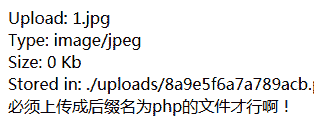
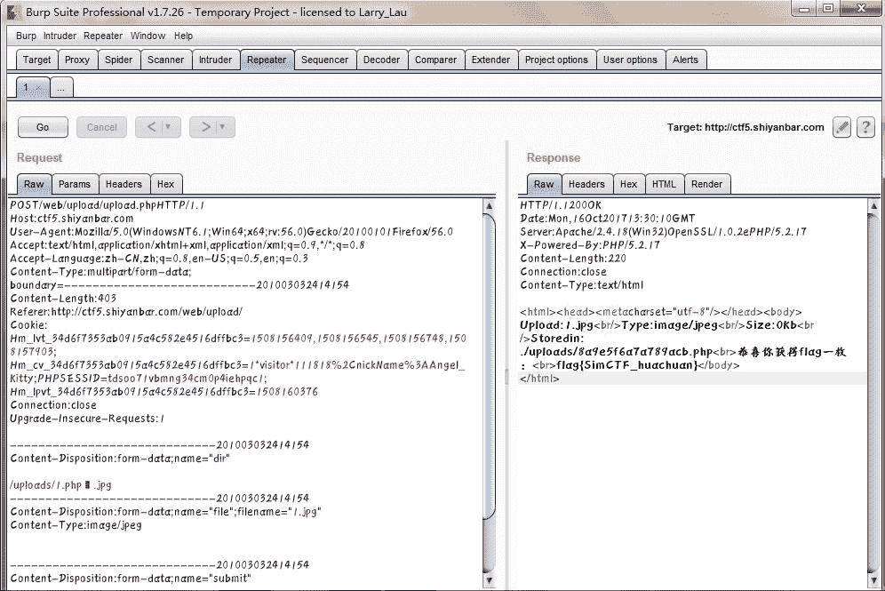
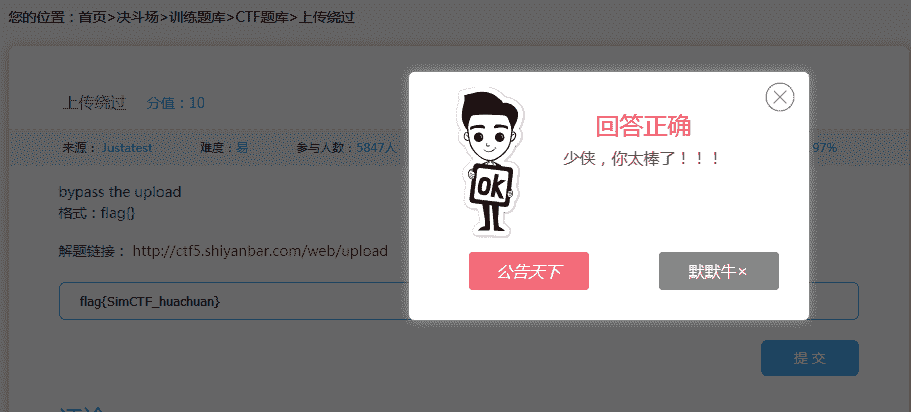

<!--yml
category: 未分类
date: 2022-04-26 14:51:40
-->

# CTF---Web入门第二题 上传绕过_weixin_30344995的博客-CSDN博客

> 来源：[https://blog.csdn.net/weixin_30344995/article/details/94883210](https://blog.csdn.net/weixin_30344995/article/details/94883210)

### 上传绕过分值：10

*   来源： [Justatest](http://www.shiyanbar.com/user/studentcourse/A55B865A754E13)
*   难度：易
*   参与人数：5847人
*   Get Flag：2272人
*   答题人数：2345人
*   解题通过率：97%

bypass the upload

格式：flag{}

解题链接：[http://ctf5.shiyanbar.com/web/upload](http://ctf5.shiyanbar.com/web/upload)

原题链接：[http://www.shiyanbar.com/ctf/1781](http://www.shiyanbar.com/ctf/1781)

【解题报告】

　　这是我入门Web开始写的第二道题，这道题有点意思，它的题目意思是要上传一个文件，具体要上传什么文件题目也没说，我们就随意上传一个txt文本文档，点submit，题目会显示"不被允许的文件类型,仅支持上传jpg,gif,png后缀的文件"的字样，这时我们就新建一个1.jpg文件，然后点击submit上传，然后会有以下提示信息：，这不是在逗我玩嘛，怎么又上传php文件啊，你再新建一个1.php文件上传，会跳出类似的要上传.jpg文件的字样，这时候你就会发现问题了，什么问题呢？这句话前后是矛盾的~~~

题目名字为上传绕过，意思就是要绕过这个提示的界面，这里涉及到一个很有意思的知识，叫做00截断，什么是00截断呢？在这里我简单给大家介绍一下~~~

00截断是文件后缀名就一个%00字节，可以截断某些函数对文件名的判断，在许多语言函数中，处理字符串的函数中0x00被认为是终止符。

例如，网站上传函数处理xxx.php%00.jpg时，首先后缀名是合法的jpg格式，可以上传，在保存文件时，遇到%00字符，丢弃后面的jpg，文件后缀最终保存的后缀名为xxx.php

例如：head.php.jpg，head.php_.jpg，head.php%00.jpg

我们如何做这题呢？首先我们要用到一个截断工具，Burp Suite，同时我们需要一个代理工具，浏览器火狐的一个代理，打开火狐浏览器，火狐浏览器代理需要设置端口，使得端口和我们Burp Suite设置的端口要一致，我们设置端口为8080，这样网站的包就会被我们抓取下来~~~

然后我们开启Intercept，点击文件上传，这时我们会发现页面没有跳转，说明这个包已经被我们拦截下来了，然后我们再把这个包发送到Repeater里面去，对这个包进行一个分析，然后这时我们可以用到00截断，自己手动构造一个上传的文件，1.php .jpg，然后我们去Hex查看，发现只需要把20改为00，再回到Raw，发现空格已经变成一个框框，框框表示一个空字节，这时我们只需要Go一下，发送文件过去，然后我们可以看到如下界面：

恭喜你获得flag一枚，咱们只需要提交这个flag就可以完成此题

这题就是运用到一个上传的思想，