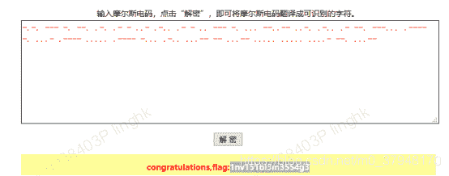
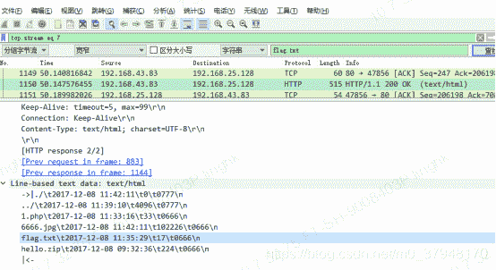
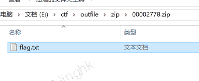
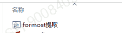

<!--yml
category: 未分类
date: 2022-04-26 14:18:22
-->

# CTF MISC 杂项入门题解析_Slient-猿的博客-CSDN博客

> 来源：[https://blog.csdn.net/m0_37948170/article/details/107416667](https://blog.csdn.net/m0_37948170/article/details/107416667)

******CTF入门学习******

**如下题目来自于 攻防世界（**[https://adworld.xctf.org.cn/task](https://adworld.xctf.org.cn/task)**）。**

*   ****入门题1：this_is_flag****
*   ****Most flags are in the form flag{xxx}, for example:flag{th1s_!s_a_d4m0_4la9}****
*   答案：flag{th1s_!s_a_d4m0_4la9}
*   解析： 考验对flag的认知，flag夺旗。这题说明之后的答题格式都是flag{}
*   ****入门题********2：********掀桌子****
*   菜狗截获了一份报文如下
*   c8e9aca0c6f2e5f3e8c4efe7a1a0d4e8e5a0e6ece1e7a0e9f3baa0e8eafae3f9e4eafae2eae4e3eaebfaebe3f5e7e9f3e4e3e8eaf9eaf3e2e4e6f2，生气地掀翻了桌子(╯°□°）╯︵ ┻━┻
*   答案：flag{hjzcydjzbjdcjkzkcugisdchjyjsbdfr}
*   解析：尝试各种解密解码都不对之后，尝试进制，最大为f，故16进制，故16进制转换为10进制，转换后不对，减去128将其装换为字符串范围内，正确。flag 十进制 为102 108 97 103 ，其对应的16进制为 0X66 0X6C 0X61 0X67，java代码示例：
*   ```
    static void getFlag(){
            String str = "c8e9aca0c6f2e5f3e8c4efe7a1a0d4e8e5a0e6ece1e7a0e9f3baa0e8eafae3f9e4eafae2eae4e3eaebfaebe3f5e7e9f3e4e3e8eaf9eaf3e2e4e6f2";

            String flag = "";
            for (int i = 0; i < str.length(); i = i + 2) {

                String hex = str.substring(i, i + 2);
                long sub = Long.parseLong(hex, 16);
                flag = flag + (char) Integer.parseInt(Long.toString(sub-128));
            }
            System.out.println(flag);
        }
    ```

*   ****入门题3：gif****
*   菜狗截获了一张菜鸡发给菜猫的动态图，却发现另有玄机
*   答案：flag{FuN_giF}
*   解析：
*   打开是一组黑白图片，将其装换为二进制如下：
*   01100110 01101100
*   0110000101100111
*   0111101101000110
*   0111010101001110
*   0101111101100111
*   0110100101000110
*   01111101
*   flag 的二进制为 01100110、01101100、01100001、01100111
*   进行查询，验证其包含flag，将二进制转换为10进制，在转换为字符得到flag.
*   故解题思路正确。注意进制和编码问题，这也是解题可以考虑的一方面。
*   ****入门题4：********如来十三掌****
*   菜狗为了打败菜猫，学了一套如来十三掌。
*   答案：flag{bdscjhbkzmnfrdhbvckijndskvbkjdsab}
*   解析：打开附件看到的是一串佛文，这是采用佛文加密方式做的一种加密，可以在与佛论禅上进行解密，地址：[<u><u>http://www.keyfc.net/bbs/tools/tudoucode.aspx</u></u>](http://www.keyfc.net/bbs/tools/tudoucode.aspx)  解密记得在密文前加上：佛曰：
*   也可以在这里进行加密操作，加密后的密文都是佛曰：开头。
*   解密结果：MzkuM3gvMUAwnzuvn3cgozMlMTuvqzAenJchMUAeqzWenzEmLJW9 进行base64解密失败，可能进行了其他操作，进行rot13解码，再解密即完成，得到结果。
*   ROT-13：简易的置换暗码操作：（回转13位，rotateby13places，有时中间加了个减号称作ROT-13）是一种简易的置换暗码。它是一种在网路论坛用作隐藏八卦、妙句、谜题解答以及某些脏话的工具，目的是逃过版主或管理员的匆匆一瞥。ROT13被描述成“杂志字谜上下颠倒解答的Usenet对等体”ROT13也是过去在古罗马开发的凯撒加密的一种变体
*   ****入门题5：********pdf****
*   菜猫给了菜狗一张图，说图下面什么都没有
*   答案：flag{security_through_obscurity}
*   解析：这个比较简单，编辑方式打开pdf,移动图片即可得到flag.
*   这是一种图片遮挡了文本信息，从而掩盖一些信息，达到隐写的目的。
*   ****入门题6: give you flag****
*   ****菜狗找到了文件中的彩蛋很开心，给菜猫发了个表情包****
*   答案：flag{e7d478cf6b915f50ab1277f78502a2c5}
*   解析：flag打开，拆分后可以看到十几张静态图片，可以看到一张二维码图片，有残缺，补全扫码即可。
*   常见的文件头：
*   JPEG： 文件头标识 (2 bytes):ff, d8  文件结束标识 (2 bytes): ff, d9 (EOI)
*   TGA：未压缩的前5字节    00 00 02 00 00
    RLE压缩的前5字节   00 00 10 00 00
*   PNG - 文件头标识 (8 bytes)   89 50 4E 47 0D 0A 1A 0A
*   GIF - 文件头标识 (6 bytes)   47 49 46 38 39(37) 61
                        G I  F 8  9 (7) a
*   BMP - 文件头标识 (2 bytes)   42 4D   B    M
*   PCX - 文件头标识 (1 bytes)   0A 
*   TIFF - 文件头标识 (2 bytes)   4D 4D 或 49 49
*   ICO - 文件头标识 (8 bytes)   00 00 01 00 01 00 20 20
*   CUR - 文件头标识 (8 bytes)   00 00 02 00 01 00 20 20
*   IFF - 文件头标识 (4 bytes)   46 4F 52 4D
                      F O  R  M
*   ANI - 文件头标识 (4 bytes)   52 49 46 46
                          R I  F F
*   ****入门题7**** ****SimpleRAR****
*   ****菜狗最近学会了拼图，这是他刚拼好的，可是却搞错了一块(ps:双图层)****
*   答案：flag{yanji4n_bu_we1shi}
*   解析：解压只发现一个txt，然后使用winhex 打开rar文件，查看内容发现一张png图片，根据rar文件结构，7A是一个错误的，改成74再次解压，可得到图片，查看图片头，发现是gif图片，改后缀，然后分离图片得到两张图片，再次使用Stegsolve图片分析工具，分析得到两个残缺的二维码，拼接扫描即可

*   ****入门题8 坚持60s****
*   ****菜狗发现最近菜猫不爱理他，反而迷上了菜鸡****
*   答案： flag{DajiDali_JinwanChiji}
*   解析：附件是一个jar包，查看jar包源码，搜索flag 得到flag{RGFqaURhbGlfSmlud2FuQ2hpamk=}"，输入答案错误，使用base64解码得到 DajiDali_JinwanChiji，输入正确。
*   ****入门题9 stegano****
*   菜狗收到了图后很开心，玩起了pdf 提交格式为flag{xxx}，解密字符需小写
*   ****答案：flag{****1nv151bl3m3554g3****}.****
*   ****解析：****下载附件，是一个pdf.打开后没有找到flag,使用火狐浏览器打开，开发者模式查看文件内容，找到隐藏的文字 ：

*   

*   BABA BBB BA BBA ABA AB B AAB ABAA AB B AA BBB BA AAA BBAABB AABA ABAA AB BBA BBBAAA ABBBB BA AAAB ABBBB AAAAA ABBBB BAAA ABAA AAABB BB AAABB AAAAA AAAAA AAAAB BBA AAABB
*   这种看起来像摩斯密码，尝试将A转换为. B 转换为- ，然后使用摩斯解密，得到flag。在线解码地址：[<u><u>http://moersima.00cha.net/</u></u>](http://moersima.00cha.net/)

*   

*   ****入门题10**** ****base64stego****
*   菜狗经过几天的学习，终于发现了如来十三掌最后一步的精髓。
*   答案：flag{Base_sixty_four_point_five}
*   解析：解压打开文本，看到的是很长的一串base64编码的文件，尝试base64分行解码得不到flag，那么这题可能是base64隐写，解析得到flag.关于base64 的隐写和解码原理和代码，请参考：https://mp.csdn.net/console/editor/html/107387926。
*   ****入门题11 ext3****
*   今天是菜狗的生日，他收到了一个linux系统光盘

*   答案：flag{sajbcibzskjjcnbhsbvcjbjszcszbkzj}
*   解析：记事本打开，查询flag,找到一个flag.txt文件，继续向下找到一串字符串，看起来像是base64串，复制出来进行base64解码得到flag{sajbcibzskjjcnbhsbvcjbjszcszbkzj}。输入，正确。

*   ****入门题12**** ****功夫再高也怕菜刀****
*   菜狗决定用菜刀和菜鸡决一死战
*   ****答案：****flag{3OpWdJ-JP6FzK-koCMAK-VkfWBq-75Un2z}
*   ****解析：****pcapng是一个抓包文件，使用Wireshark打开，查找选择字符串，分组字节流进行查找flag.txt，找到后发现是处于一个压缩包中，
*   
*   使用formost分离文件,得到压缩包，解压看到flag.txt文件，
*   formost下载地址：https://github.com/jin-stuff/foremost。使用方法：在formost目录下新建一个：formost.bat，内容如下，
*   @echo off
*   cd E:\ctf\formost  
*   set path=%~dp1
*   start foremost -i %1 -o %path%\outfile
*   echo  foremost 解密成功
*   Pause
*   然后复制这个bat文件，放到C:\Users\XXX\AppData\Roaming\Microsoft\Windows\SendTo 目录下，粘贴选择粘贴快捷方式即可，然后待分离的文件右键选择发送到 用 formost提取 即可。
*   
*   
*   打开flag.txt的时候需要密码，继续查看flag.txt,可以发现一个图片，6666.jpg的图片，右键选择追踪流，查看tcp流，jpg文件开头是FF D8 结束是 FFD9，复制选择新建winhex，然后保存为jpg打开即可看到密码。
*   打开flag.txt输入密码，得到flag.
*   总结：
*   经过入门12题的学习和动手解析实践，该解题用到的工具和思路如下：
*   工具： winhex,formost,360压缩，pdf编辑器，Wireshark,狐火浏览器，记事本，base64加解密，佛曰加解密，idea,
*   解题思路：遇见字母和数字组成的字符串可以考虑base64加解密，进制转换，比如****掀桌子******** .****
*   Gif 图片解题思路：gif一般都是多个图片构成，可以将图片分离出来，这时候有可能看到二维码的图片，残缺的话进行补全即可。如果分离的图片有明显的规律，如入门题3gif ，都是黑白图片，那可以考虑进制相关进行转换进制解题。
*   佛文加密： 遇见佛文的，一般都是佛曰加解密，可以去对应的加解密网站操作，[<u><u>http://www.keyfc.net/bbs/tools/tudoucode.aspx</u></u>](http://www.keyfc.net/bbs/tools/tudoucode.aspx)。
*   Pdf 隐写： PDF隐写的可以使用火狐浏览器打开PDF，f12调试去查看隐藏的信息。
*   Rar压缩文件，一般使用winhex打开，查找flag，或图片其他信息，即解压后得不到flag,可以查到压缩问价是否还隐藏了其他的文件，图片等。Winhex打开找到图片，可以根据rar压缩文件的结构，看下是否有不正确的16进制字符，修改后，重新解压。
*   Linux文件，一般可以使用360压缩打开，查找flag文件。
*   Base64隐写：如果遇见很长的文本文件里都是base64 编码文件，可以考虑是否是base64隐写。。
*   抓包文件： 一般使用Wireshark打开，搜索字符串flag,找到后使用formost提取文件，会得到flag文件，如果有密码，需要继续找flag附件是否有图片或者其他的文件。