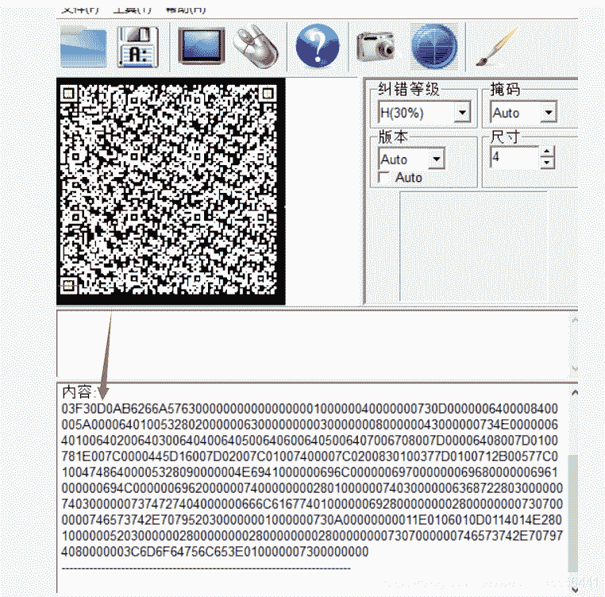

<!--yml
category: 未分类
date: 2022-04-26 14:47:11
-->

# CTF-Misc-常用知识点_半岛铁盒@的博客-CSDN博客

> 来源：[https://blog.csdn.net/weixin_45556441/article/details/110479635](https://blog.csdn.net/weixin_45556441/article/details/110479635)

## 一,自述

这也是我的一个错题笔记吧,把没见过,感觉有用的记录一下,与大家分享;

## 二,正文

1.这道题大概就是解出来一个二维码扫一下出来一些字符,

知识点:****03F30D0A开头是pyc文件,注:要把这串代码复制到Winhex上哦,然后再保存.pyc!直接复制到文本文件上改后缀是不行的 -.-(别问我怎么知道的,说多了都是泪 - -.)