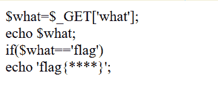
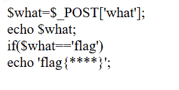
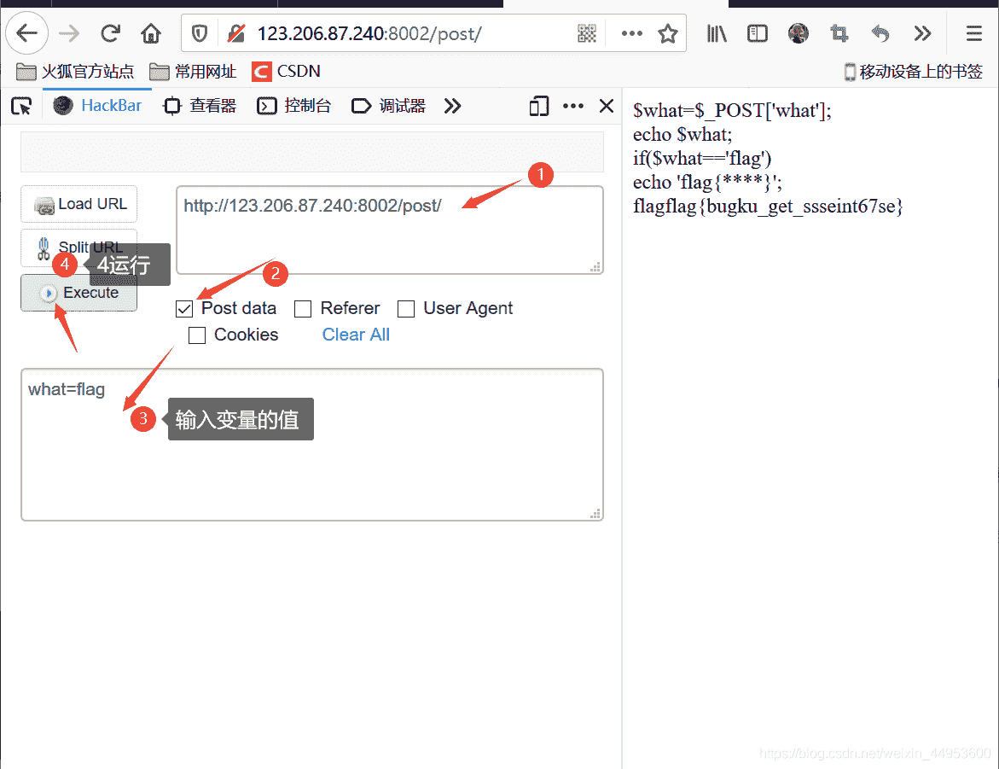
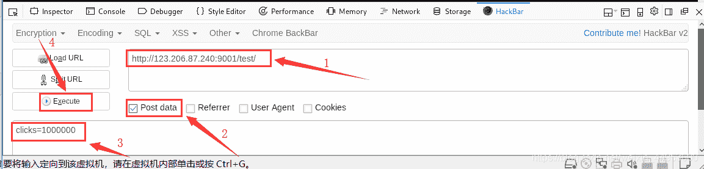

<!--yml
category: 未分类
date: 2022-04-26 14:36:00
-->

# CTF Web入门题目——Bugku Web 题目题解——发送HTTP请求篇（3道基础题目)_日熙！的博客-CSDN博客

> 来源：[https://blog.csdn.net/weixin_44953600/article/details/107331849](https://blog.csdn.net/weixin_44953600/article/details/107331849)

### 题目：

### 思路：

关键是分析PHP代码：
`$what=$_get['what']`———意思是用get方式提交what的值
`if($what=='flag') echo 'flag{****}';`———要令what变量与字符串‘flag’相等才
得到flag。
所以我们就直接在地址栏中加上?what=flag。
其中？是变量的标识，这句话表示有一个名为what，值为flag的变量。

答案为：flag{bugku_get_su8kej2en}

### **新知识(收获)：**

1.关于？：在地址栏中输入？是变量的标识
2.GET提交直接在地址栏中提交即可

### 题目：

### 思路：

与第一题类似，只不过用post方式上传参数what=flag即可。

**post传参怎么传？**————我这里用的是用火狐浏览器里的HackBar插件，步骤如下：

答案:flag{bugku_get_ssseint67se}

# 3）点击一百万次（题目已失效）（POST）

### 思路：

参考wp：[https://www.cnblogs.com/gzu_zb/p/10359531.html](https://www.cnblogs.com/gzu_zb/p/10359531.html)

### 新知识（收获）：

需要我们点击100万次————>用火狐浏览器的插件工具：”hackbar“ 来**post**

hackbar如何使用：先在浏览器上安装插件，然后查看题目网页的源代码，会出现hackbar的标志
进入后示范如下：
