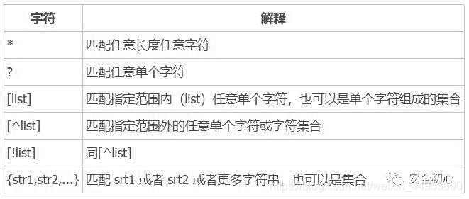

<!--yml
category: 未分类
date: 2022-04-26 14:20:27
-->

# CTF-Web小白入门篇超详细——了解CTF-Web基本题型及其解题方法 总结——包含例题的详细题解_日熙！的博客-CSDN博客_ctf

> 来源：[https://blog.csdn.net/weixin_44953600/article/details/105399366](https://blog.csdn.net/weixin_44953600/article/details/105399366)

很久之前经过一次比赛的打击，决定不能只是一直盲目的刷基础题，应该加快进度，从各种基本题型开始下手，每种题型都应该去找题目刷一刷，并做好总结。于是我去搜了一些总结的文章，便找到了一篇很好的，觉得看完后有点豁然开朗的感觉。**所以本文是在该文章的基础上完善的**，并且是准备一边学一边完善，所以有些地方我还没完全理解，日后会慢慢更新完善，欢迎各位大佬指教。

本文参考链接：[https://www.jianshu.com/p/5fd1b624fd7a](https://www.jianshu.com/p/5fd1b624fd7a)

* * *

* * *

# 第1大类-基础知识类题目

### （1）总结：

*   是最基本的入门题型，考察基本的查看网页源代码、HTTP请求、修改页面元素等，基本都是和其他更复杂的知识结合起来出现，
*   **解题方法**：就是恶补基础知识，可以把刷过的题目涉及到的新知识，都总结下来。

### （2）具体题型包括：

**1\. 查看网页源码**
————火狐浏览器查看源码的快捷键是Ctrl+U

flag一般都在注释里，有时候注释里也会有一条hint（提示）或者是对解题有用的信息。

题目链接：

**2.发送HTTP请求**

可以用hacker，有时候可以写脚本。

怎么用写脚本的方法POST传参？——>利用python脚本！————[具体见此文章](https://blog.csdn.net/weixin_44953600/article/details/107347997)

**3.不常见类型的请求发送**
一般这种题目，写一个脚本应该就能解决了。

# 第2大类-HTTP头相关的题目

### （1）总结：

*   主要是查看和修改HTTP头。
*   **解题方法**：不同的类型有不同的利用方法，基本都离不开**抓包改包**，有些简单的也可以利用**浏览器的网络标签**解决。但是最根本的应对策略，是熟悉一些**常见请求头的格式、作用**等，这样题目考到的时候就很容易知道要怎样做了。

### （2）具体题型包括：

**1.查看响应头**

有时候响应头里会有hint（提示）或者题目的关键信息，也有的时候会直接把flag放在响应头里给你，但是直接查看响应头拿flag的题目并不多，因为太简单了。

~~只是查看的话，可以不用抓包，查看浏览器开发者工具中的 “网络” 标签就可以解决了。~~ (这个方法我试了很久都没弄成功过，暂时未解决，知道的小伙伴还请不吝赐教哦~)

**2.修改请求头、伪造Cookie**

常见的有set-cookie、XFF和Referer，总之考法很灵活，做法比较固定，知道一些常见的请求头再根据题目随机应变就没问题了。

有些题目还需要伪造Cookie，根据题目要求做就行了。

可以用BurpSuite抓包，~~也可以直接在浏览器的F12“网络”标签里改。~~

Bugku 程序员本地网站： [http://123.206.87.240:8002/localhost/](http://123.206.87.240:8002/localhost/)
Bugku 管理员系统： [http://123.206.31.85:1003/](http://123.206.31.85:1003/)
XCTF xff_referer： [https://adworld.xctf.org.cn/task/answer?type=web&number=3&grade=0&id=5068](https://adworld.xctf.org.cn/task/answer?type=web&number=3&grade=0&id=5068)

——————[这三道题的详细题解](https://blog.csdn.net/weixin_44953600/article/details/107515973)

# 第3大类-Git源码泄露？

### 总结：

XCTF mfw: [https://adworld.xctf.org.cn/task/answer?type=web&number=3&grade=1&id=5002](https://adworld.xctf.org.cn/task/answer?type=web&number=3&grade=1&id=5002)
——————暂时还不会

# 第4大类-Python爬虫信息处理

[CTF 中的 Python 漏洞总结](https://www.restran.net/2018/10/29/ctf-python-vulnerability-notes/)——————关键还是学好python这门语言

### （1）总结：

这类题目一般都是给一个页面，页面中有算式或者是一些数字，要求在很短的时间内求出结果并提交，如果结果正确就可以返回flag

因为所给时间一般都很短而且计算比较复杂，所以只能写脚本。这种题目的脚本一般都需要用到requests库。

*   **解题方法**：requests库和BeautifulSoup库熟练掌握后，再多做几道题或者写几个爬虫的项目，一般这类题目就没有什么问题了。主要还是对BeautifulSoup的熟练掌握，另外还需要一点点web前端（HTML）的知识。

### （2）具体题目：

# 第5大类-PHP代码审计（重要！！！）

### （1）总结：

### （2）具体题型包括：

**1.hash加密相关：**

PHP弱类型hash比较缺陷
这是代码审计最基础的题目了，也比较常见。

典型代码：

```
if(md5($a) == md5($b)) {    
    echo $flag;
} 
```

加密函数也有可能是sha1或者其他的，但是原理都是不变的。

这个漏洞的原理如下：

```
== 在进行比较的时候，会先将两边的变量类型转化成相同的，再进行比较。
0e在比较的时候会将其视作为科学计数法，所以无论0e后面是什么，0的多少次方还是0。 
```

所以只要让a和b在经过相应的函数加密之后都是以0e开头就可以。

以下是一些md5加密后开头为0e的字符串：

```
QNKCDZO
0e830400451993494058024219903391

s878926199a
0e545993274517709034328855841020

s155964671a
0e342768416822451524974117254469

s214587387a
0e848240448830537924465865611904

s214587387a
0e848240448830537924465865611904

s878926199a
0e545993274517709034328855841020

s1091221200a
0e940624217856561557816327384675

s1885207154a
0e509367213418206700842008763514

aabg7XSs 
```

另外，这个也可以用数组绕过，这个方法在下面会详细说。

**2.数组返回NULL绕过**

PHP绝大多数函数无法处理数组，向md5函数传入数组类型的参数会使md5()函数返回NULL（转换后为False），进而绕过某些限制。

如果上面的代码变成：

```
if(md5($a) === md5($b)) {       
    echo $flag;
} 
```

那么利用弱类型hash比较缺陷将无法绕过，这时可以使用数组绕过。

传入?a[]=1&b[]=2就可以成功绕过判断。

这样的方法也可以用来绕过sha1()等hash加密函数相关的判断，也可以绕过正则判断，可以根据具体情况来灵活运用。

扩展补充：关于 `== 与 ===`——见文章 “ CTF中PHP常见的考点 ”

**3.正则表达式相关**

*   ereg正则%00截断：

    ereg函数存在NULL截断漏洞，使用NULL可以截断过滤，所以可以使用%00截断正则匹配。即ereg函数 读到 %00 的时候，就截止了。

*   数组绕过：正则表达式相关的函数也可以使用数组绕过过滤，绕过方法详见数组返回NULL绕过。

    上面那道题也可以用数组绕过。

*   单引号绕过preg_match()正则匹配：

    在每一个字符前加上单引号可以绕过preg_match的匹配，原理暂时不明。

例如有如下代码：

```
<?php
    $p = $_GET['p'];
    if (preg_match('/[0-9a-zA-Z]{2}/',$p) === 1) {
        echo 'False';
    } else {
        $pp = trim(base64_decode($p));
        if ($pp === 'flag.php') {
            echo 'success';
        }
    }
?> 
```

payload：p=‘Z’m’x’h’Z’y’5’w’a’H’A’=

**4.不含数字与字母的WebShell**

如果题目使用preg_match()过滤掉了所有的数字和字母，但是没有过滤PHP的变量符号$，可以考虑使用这种方法。

典型代码：

```
<?php 

include'flag.php'; 

if(isset($_GET['code'])){ 
   $code=$_GET['code']; 
   if(strlen($code)>50){ 
       die("Too Long."); 
  } 
   if(preg_match("/[A-Za-z0-9_]+/",$code)){ 
       die("Not Allowed."); 
  } 
   @eval($code);   
}else{ 
   highlight_file(__FILE__); 
} 

?> 
```

这种方法的核心是字符串的异或操作。

爆破脚本：

```
chr1 = ['@', '!', '"', '#', '$', '%', '&', '\'', '(', ')', '*', '+', ',', '-', '.', '/', ':', ';', '<', '=', '>', '?', '[', '\\', ']', '^', '_', '`', '{', '|', '}', '~']
chr2 = ['@', '!', '"', '#', '$', '%', '&', '\'', '(', ')', '*', '+', ',', '-', '.', '/', ':', ';', '<', '=', '>', '?', '[', '\\', ']', '^', '_', '`', '{', '|', '}', '~']

for i in chr1 :
    for j in chr2 :
        print(i + 'xor' + j + '=' + (chr(ord(i) ^ ord(j)))) 
```

根据题目的要求，用异或出来的字符串拼出合适的Payload，并放在PHP变量中执行。变量名可以用中文。

比如这道题的Payload：`?code=$啊="@@^|@@@"^"'%*:,!'";$啊();`

**5.Linux通配符绕过正则匹配**

典型代码如下，与前一种题目非常相似，但也不大一样：？？

```
<?php 

if(isset($_GET['code'])){ 
   $code=$_GET['code']; 
   if(strlen($code)>50){ 
       die("Too Long."); 
  } 
   if(preg_match("/[A-Za-z0-9_$]+/",$code)){ 
       die("Not Allowed."); 
  } 
   @eval($code); 
}else{ 
   highlight_file(__FILE__); 
} 

?> 
```

最主要的区别就是过滤了 $ 和 _ ，也就是说无法使用变量符号$了。

这时候可以考虑采用**通配符**绕过。

通配符有点像正则表达式，有自己的匹配规则，看这张图：

所以构造一下通配符就是`/???/??? /*`。

因为过滤了变量符号，没法通过上面那种方法来执行了。但是，可以通过闭合PHP标记来执行，也就是：?><?=/???/??? /*?>（/bin/cat /*）。

所以本题的payload为：?code=?><?=/???/??? /*?>

具体解法可以参照此篇文章的前两道题目：https://www.jianshu.com/p/ecc2414ec110

**6.命令执行漏洞**：

assert()函数引起的命令执行:

assert函数的参数为字符串时，会将字符串当做PHP命令来执行。

例如：assert(‘phpinfo()’)相当于执行<?php phpinfo() ?>

以一道题目为例：？？

本题目中题目文件夹下放置了一个隐藏的flag文件。

```
<?php
error_reporting(0);
if (isset($_GET['file'])) {
    if($_GET['file'] === "flag"){
        highlight_file("flag.php");
    }else{
        $page = $_GET['file'];
    }
} else {
    $page = "./flag.php";
}

assert("file_exists('$page')");
?> 
```

解法：

构造闭合 file_exists()函数，并使assert()执行恶意代码。

Linux命令ls -a可用于查看该目录下所有文件，包括隐藏文件。

payload：

1- ?file=123’) or system(‘ls -a’);#
2-?file=123’) or system(‘cat .ffll44gg’);#

# 第6大类-XSS题目（跨站脚本攻击）

### （1）总结：

这类题目会涉及到三种XSS类型，具体类型要根据题目来判断。一般都是向后台发送一个带有XSS Payload的文本，在返回的Cookie中含有flag。解法是在XSS Payload。
这类题目一般都会带有过滤和各种限制，需要了解一些常用的绕过方法。

**解题方法**：XSS归根结底还是JavaScript，JavaScript的威力有多大，XSS的威力就有多大。要知道一些常用的XSS Payload，还要把三类XSS的原理弄明白。做题时需要用到XSS平台，网上有公用的，也可以自己在VPS上搭一个。

### （2）具体题型包括：

# 第7大类-绕过waf（Web应用防护系统）

### （1）总结：

其实绝大多数比较难的题目多多少都会对输入有过滤，毕竟在现实的网络中肯定是会对输入进行限制的，但是这里还是把过滤单独列出来了。
**解题方法**：多掌握一些不同的绕过方法。

### （2）具体题型包括：

1.**长度限制**

有些题目会要求输入较长的文本，但对文本的长度进行了限制。

对于这种题目，既可以用BurpSuite抓包改包绕过，~~也可以直接在F12里改页面源代码。~~

**2.双写**

双写可以绕过对输入内容过滤的单次判断，在XSS、SQL注入和PHP代码审计的题目中比较常见。

双写顾名思义就是**将被过滤的关键字符写两遍**，比如，如果要添加XSS Payload，又需要插入

这样的方法不仅 **对XSS有用**，也可以用于 **代码审计 和 SQL注入**。

HGAME2019有一道XSS题目就是过滤了

**3.等价替代**

就是不用被过滤的字符，而使用没有被过滤却会**产生相同效果的字符**。

比如，如果SQL注入题目中过滤了空格，可以用 /**/ 绕过对空格的限制；XSS题目如果过滤了

~~- 实验吧 简单的SQL注入：http://www.shiyanbar.com/ctf/1875~~

**4.URL编码绕过**

如果过滤了某个必须要用的字符串，输入的内容是**以GET方式获取**的（也就是直接在地址栏中输入），可以采用url编码绕过的方式。比如，过滤了 cat，可以使用 c%61t来绕过。

**5.Linux命令使用反斜杠绕过**

在Linux下，命令中加入反斜杠与原命令完全等价。例如，cat与 ca\t两条命令等价，效果完全相同。

可以利用这个特性来进行一些绕过操作（当然，这个**仅限于命令执行漏洞**）。

**6.URL二次解码绕过**

这个类型本来应该放在代码审计里面，但是既然是一种绕过过滤的姿势，就写在这里了。

如果源码中**出现了urldecode()函数**，可以利用url二次解码来绕过。

以下是一些常用的HTML URL编码：

**7.数组绕过**

详见PHP代码审计的“数组返回NULL”绕过。

数组绕过的应用很广，很多题目都可以用数组绕过。

# 第8大类-SQL注入

### （1）总结：

SQL注入是一种灵活而复杂的攻击方式，归根结底还是**考察对SQL语言**的了解 和 根据输入不同数据网页的反应对后台语句的判断，当然也有sqlmap这样的自动化工具可以使用。

**解题方法**：如果不用sqlmap或者是用不了，就一定要把SQL语言弄明白，sqlmap这样的自动化工具也可以使用。

使用sqlmap:

sqlmap的应用范围还不大明确，如果sqlmap没法注入就手工注入。

一篇简单的sqlmap教程：[https://www.jianshu.com/p/4509bdf5e3d0](https://www.jianshu.com/p/4509bdf5e3d0)

### （2）具体题型包括：

[CTF 中的 SQL 注入总结](https://www.restran.net/2018/10/29/ctf-sqli-notes/)