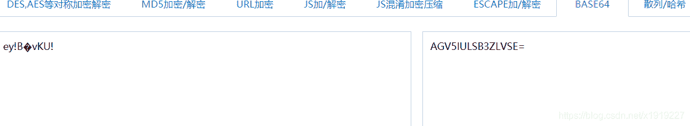
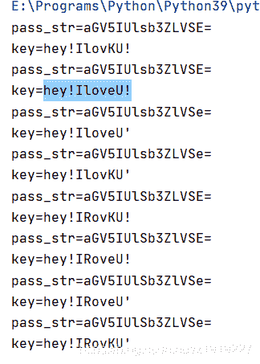

<!--yml
category: 未分类
date: 2022-04-26 14:47:24
-->

# CTF [网络安全实验室] [解密关第6题]_沙之夏的博客-CSDN博客

> 来源：[https://blog.csdn.net/x1919227/article/details/117533556](https://blog.csdn.net/x1919227/article/details/117533556)

## CTF [网络安全实验室] [解密关第6题]

**网络安全实验室**
[http://hackinglab.cn](http://hackinglab.cn)

**解密关**
6.异常数据
分值: 200
小明今天去妹纸家开Party,而妹纸却给他出了一个谜语,说只要他能答出来,她就会答应小明一个要求.
这是妹纸给小明的谜语序列:AGV5IULSB3ZLVSE=
Tips:key就是解密结果

初略一看，密语后面有等号，必定是base加密，使用base64解密

解密网址：[http://tool.chinaz.com/tools/base64.aspx](http://tool.chinaz.com/tools/base64.aspx)

解密结果： ey!B�vKU!

得到这么一串怪怪的字符串，尝试提交答案，果然不正确，考虑到可能是多层加密，又开始找各种加解密工具进行解密，均无法得到解密结果。
上网查询，大神说题目叫异常数据，而且给的整个谜语数列都是大写，那么很有可能原数列进行过upper()处理，所有的小写字符都变成了大写字符。
那么意思就是原字符串应该含有一个或多个小写字符。利用python，通过深度搜索，遍历所有可能的情况，然后对每一个可能的字符串进行base64解密。

```
import base64

def is_all_char(str):
    for i in range(len(str)):
        if ord(str[i])<32 or ord(str[i])>126:
            return False
    return True

def de_base(str):
    try:
        key = base64.b64decode(str).decode('utf-8')
        if is_all_char(key):
            print(f'pass_str={str}')
            print(f'key={key}')
    except Exception:
        return

def replace_char(str, i, char):
    str_list = list(str)
    str_list[i] = char
    return ''.join(str_list)

def get_pass(pass_str, start):
    for i in range(start, len(pass_str)):
        if pass_str[i] >='A' and pass_str[i]<='Z' :
            pass_str = replace_char(pass_str, i, pass_str[i].lower())
            de_base(pass_str)
            get_pass(pass_str, i+1)
            pass_str = replace_char(pass_str, i, pass_str[i].upper())

if __name__ == "__main__":
    pass_str = 'AGV5IULSB3ZLVSE='
    get_pass(pass_str, 0) 
```


排除掉包含控制字符的结果后，依然有很多符合要求的结果，选中最有可能的一条
key=**hey!IloveU!**
提交答案，成功！