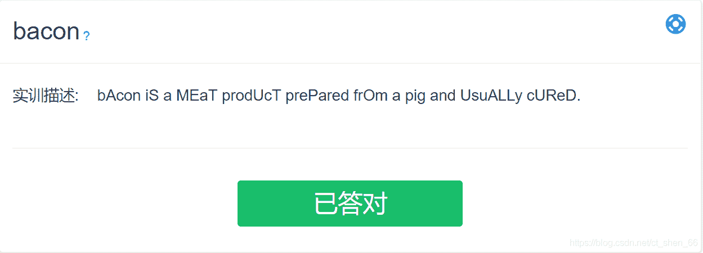
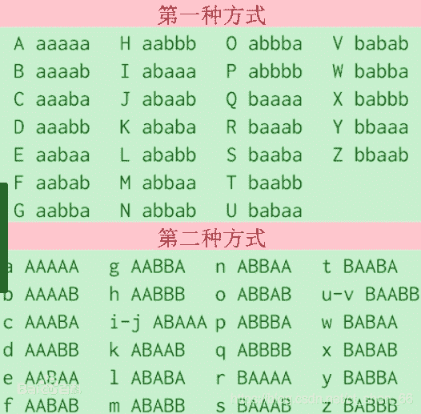
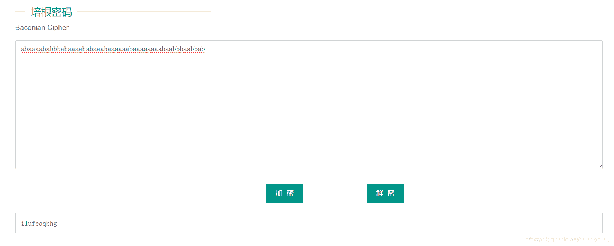
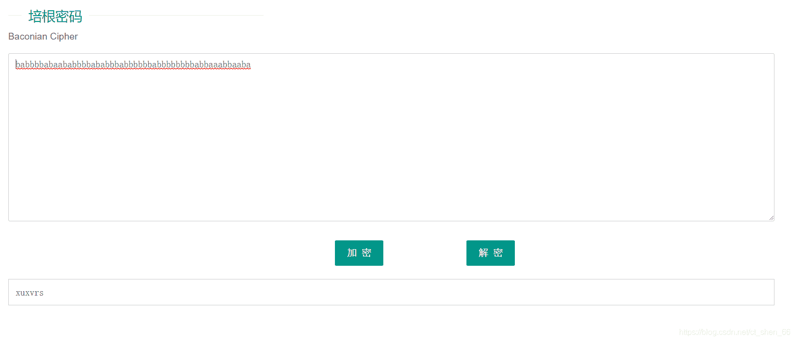

<!--yml
category: 未分类
date: 2022-04-26 14:54:52
-->

# CTF-bacon(培根密码)_咕唔～的博客-CSDN博客_培根密码

> 来源：[https://blog.csdn.net/ct_shen_66/article/details/116164351](https://blog.csdn.net/ct_shen_66/article/details/116164351)

# 一、题目

培根密码实际上就是一种替换密码，根据所给表一一对应转换即可加密解密 。它的特殊之处在于：可以通过不明显的特征来隐藏密码信息，比如大小写、正斜体等，只要两个不同的属性，密码即可隐藏。


# 二、解题思路

我们知道培根密码，解题时没有标准的方法，主要观察题目。
这里我们看到一段字母，发现字母有不一样的地方，就是个别有大小写，我们可以尝试按大小写的方式来解题


# 三、解题过程

把大写的当成a，小写当成b或者把大写的当成b，小写当成a
使用在线解密，得出的值拿去培根密码解密后可以得出flag

```
（1）abaaaababbbabaaaababaaabaaaaaabaaaaaaaabaabbbaabbab 
```



```
（2）babbbbabaababbbbababbbabbbbbbabbbbbbbbabbaaabbaaba 
```


发现（1）是正确的，这题就做完了。
**有问题或者说的不好地方可以私信告诉我，感谢大家的观看！**