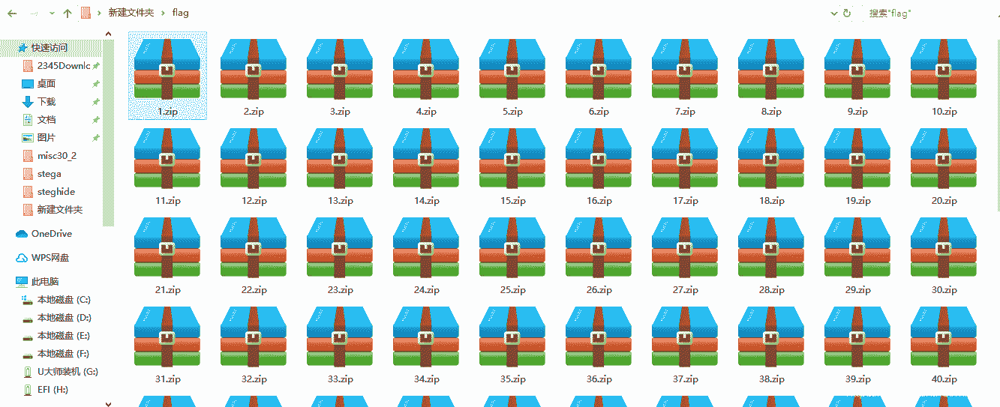
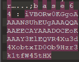
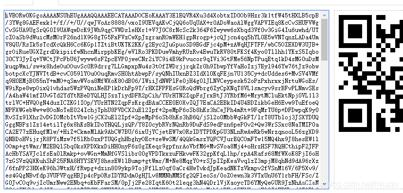

<!--yml
category: 未分类
date: 2022-04-26 14:52:32
-->

# CTF show 红包题第一弹_yu22x的博客-CSDN博客_红包题第一弹

> 来源：[https://blog.csdn.net/miuzzx/article/details/104358576](https://blog.csdn.net/miuzzx/article/details/104358576)

#### 题目地址：https://ctf.show

解压缩压缩包得到如下文件

每个压缩包中都存在一张图片，用010editor打开第一张图片，在二进制的最后发现了base64

依次打开第二第三张图片，均存在base64，猜测每一张图片中均存在部分base64片段为，刚好每一张的base64长度为100。接下来就是去将所有的base64连起来。
介于图片数量过多，所以使用通过脚本进行操作。
将脚本放入压缩包存在的文件夹下。

```
import os
import zipfile

def zips():  
    for i in range(1,87):
        zip_file = zipfile.ZipFile(str(i)+'.zip')
        zip_list = zip_file.namelist()  
        for f in zip_list:
            zip_file.extract(f, './a')      
        zip_file.close()

def base(): 
    flag=""
    for i in range(1,87):
        path ="a/"+ str(i)+".jpg"
        num = os.path.getsize(path)     
        f = open(path,'rb')
        f.seek(int(num)-100)                    
        s =  f.read(100)                    
        flag+=bytes.decode(s)       
        f.close()    
    f1 = open('flag.txt','w')
    f1.write(flag)

if __name__=="__main__":
    zips()
    base() 
```

最后得到一张图片的base64编码。
把得到的base64编码放入 `https://feling.net/base64/` 获得二维码图片，扫码得flag。
