<!--yml
category: 未分类
date: 2022-04-26 14:52:43
-->

# CTF show 萌新区解题报告 （一）_Vayn3的博客-CSDN博客_ctf解题报告

> 来源：[https://blog.csdn.net/qq_51090016/article/details/113917961](https://blog.csdn.net/qq_51090016/article/details/113917961)

## 1.萌新认证

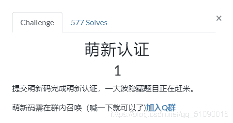
好了好了，我知道我是萌新了。。

## 2.萌新_密码1

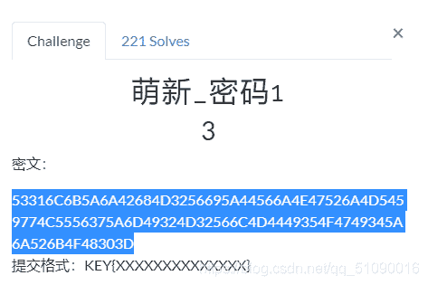
根据经验，这看着应该是16进制，转换成字符串看看：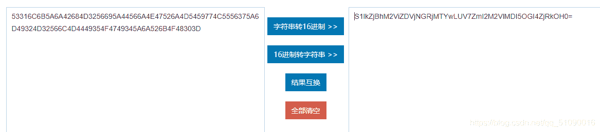
这就很明显是base64了
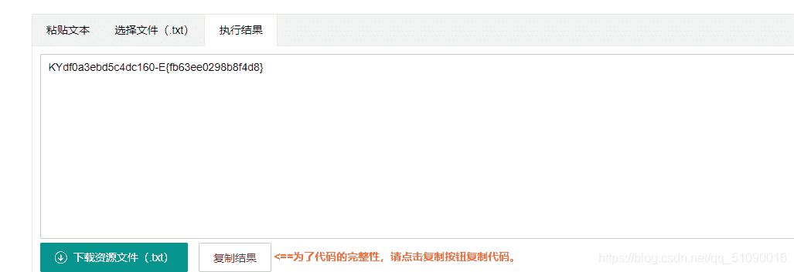
这又是啥？看了大佬的wp，原来是栅栏密码（有没有大佬说一下栅栏密码有什么易于分辨的特征），栏数一个个试，还好到2就出来了：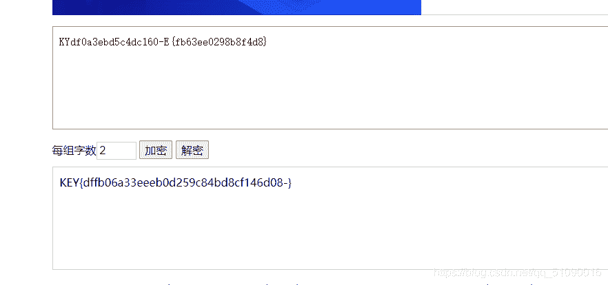

## 3\. 萌新_密码2

这题好坑啊，提示的键盘才是重点。。。

rdcvbg 2qase3 6tghu7这三团字符字符的共同特点就是，在键盘上都包围了一个字母，依次是：f w y，

也就是说，flag应该就是：KEY{fwy}

## 4.萌新 密码3

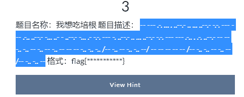
这我一菜鸡都知道应该是摩斯电码吧，解密看看
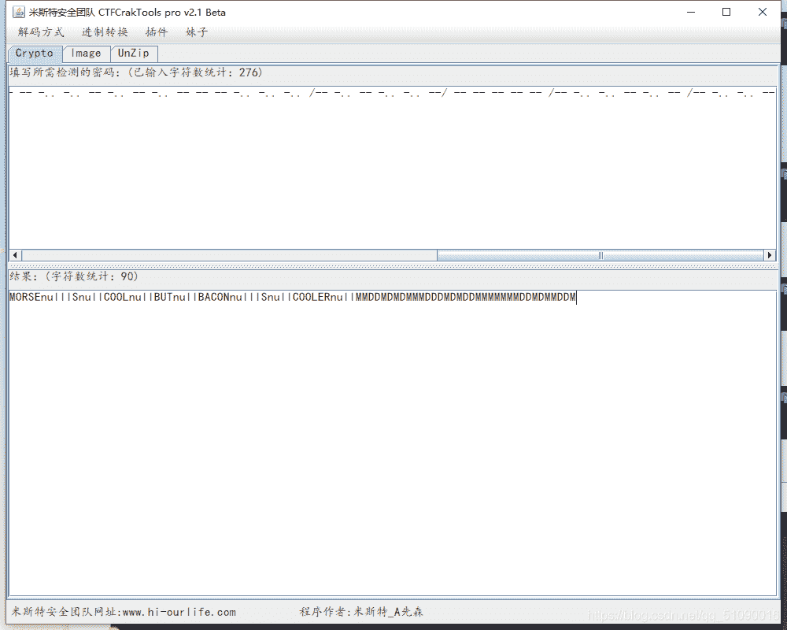
morse cool？ bacon cooler？意思是这后面MDMD的是bacon解密吗？试试看
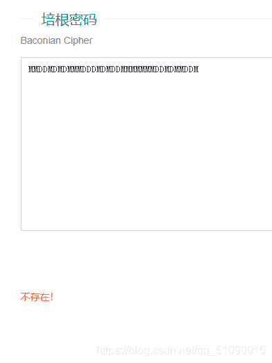
为啥不行。。。

bacon是啥我都不知道，先百度下看看
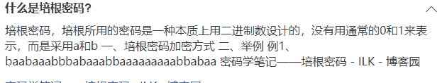
也就是说，我们要将这个MD换成AB才能解密？对应的换一下看看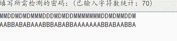
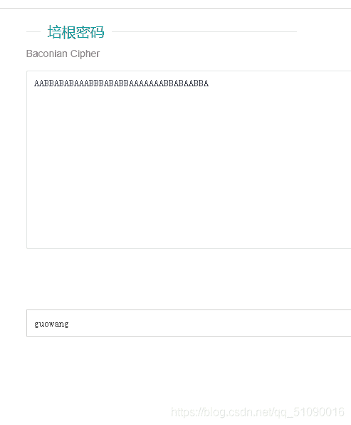

果然可以了

## 5.萌新 隐写2

下载压缩包打开，是一个txt加密文件，需要密码才能解压，题目还贴心的给我们放了工具的链接，下载，并且用这个软件打开文件看看：
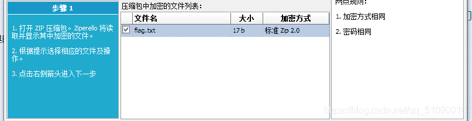
这是一个爆破解压缩包的软件？感觉不错，有点像web题中的burpsuite爆破模块。既然题目提示了我们密码是生日，那长度就不会超过8，直接暴力破解
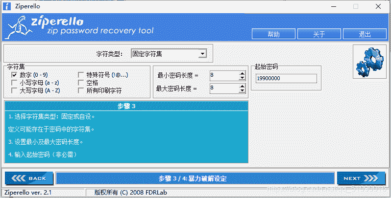
因为是90后，所以初始密码就设为19900000,直接爆破就好了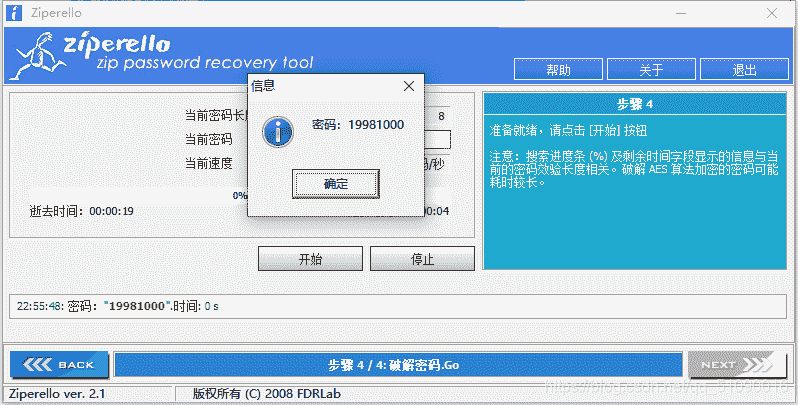
这样flag就有了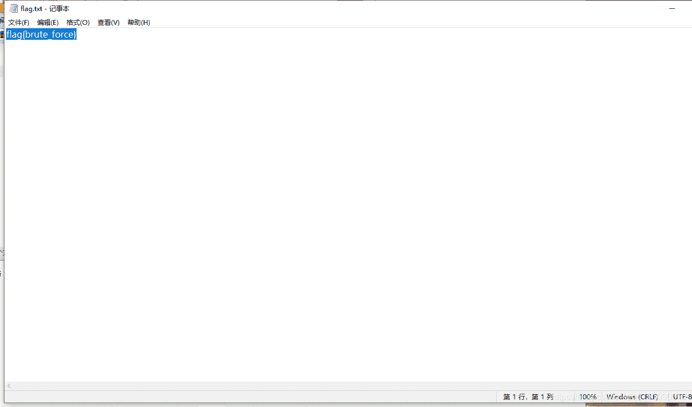

## 6.萌新 隐写4

hint：
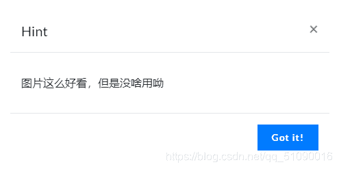

正常的图片隐写嘛，先来010editor打开搜索flag key，啥也没有。。仔细看看提示，说图片没啥用，那应该就是说不是在图片上做文章是吗？而且是用doc做后缀的，一般应该是把flag隐藏在图片下面或者周围吧。

用word打开图片，点开选项
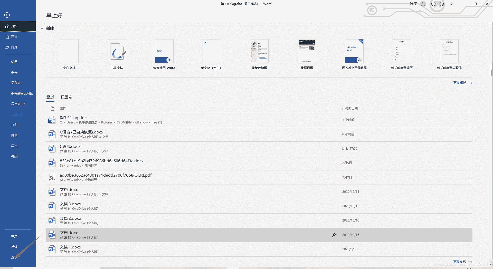
在显示里面勾上隐藏文字：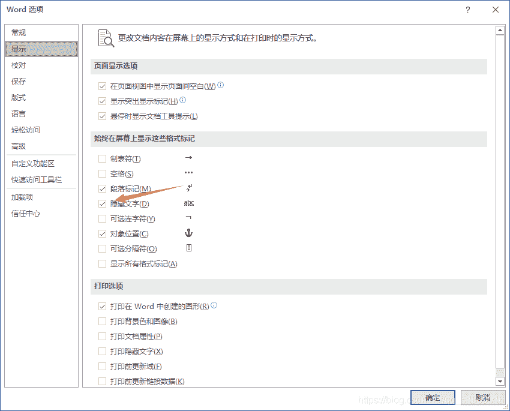
就ok了

## 7.萌新 密码#4

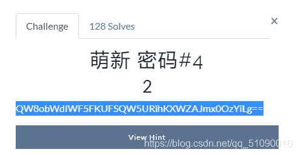

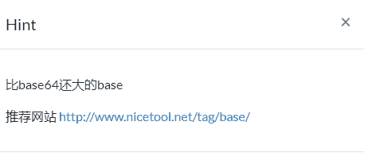
题目给的肯定是base64, 解码看看：
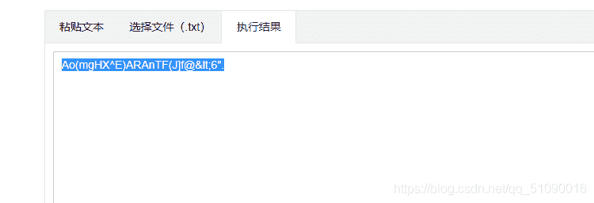
再想到提示，

比base还大的base？？记得之前做题碰到过base100难道是那个？试试看

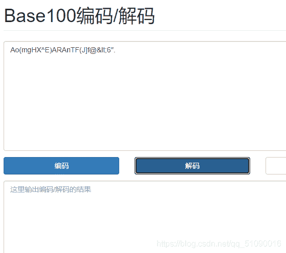
啥也没有。。。base家族还有啥，搜一下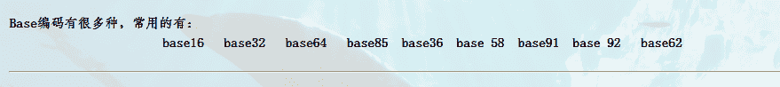
一个个试吗。。题目既然有提示，那应该不会是大太多的，先看看base85：
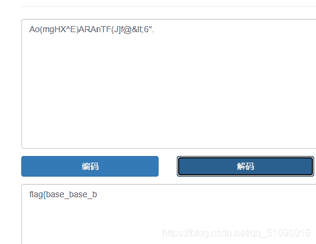
出来了，不过怎么少了一个}
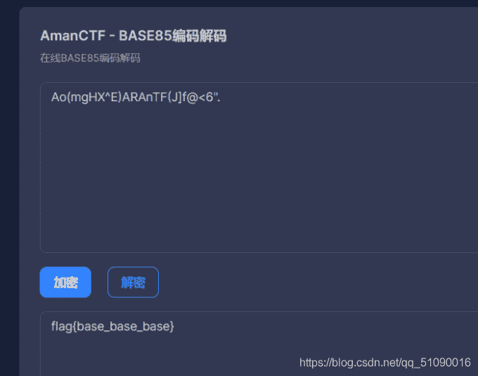
我和答案的不一样就很奇怪。。不过这题就这样了

## 8.萌新 隐写3

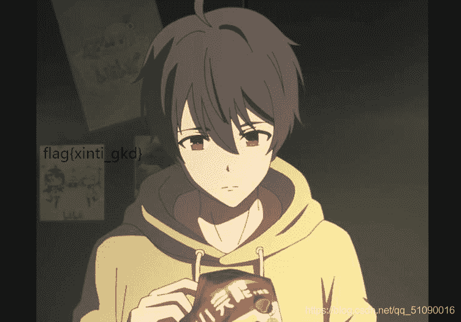
啊这，这题是给我们 萌新送温暖的吗？

## 9.杂项1

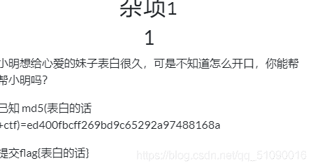
这题也不用多说，md5解密得到：helloctf

然后根据提示，减掉ctf就是flag{}包皮里面的内容了

## 10.杂项2

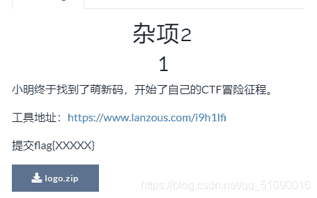
下载，打开图片：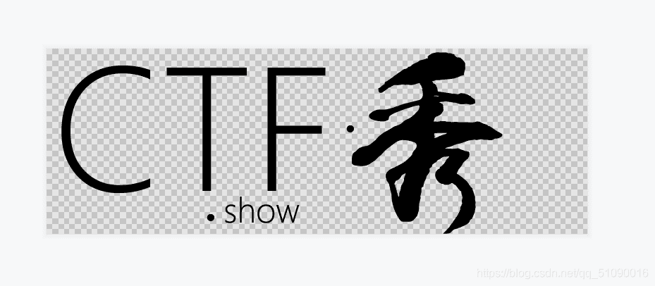
经典图片隐写，用010或者winhex打开搜索一下flag看看：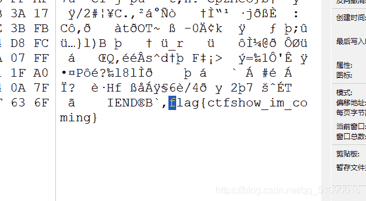
就出来了？？

## 总结：

1.萌新们要努力才行

2.栅栏密码注意一下
16进制转字符串

3.注意提示的每一个关键词，比如 键盘。。。

4.培根密码了解一下

5.对于解压密码有提示的压缩包，可以用ziperello来爆破。

6.隐藏在图片周围的文字可以用word设置里显示

7.base家族了解一下

8.。。。

9.额。。。注意看提示（好勉强的总结）

10.图片隐写第一步，打开搜索flag