<!--yml
category: 未分类
date: 2022-04-26 14:52:51
-->

# CTF show 萌新区解题报告 （三）_Vayn3的博客-CSDN博客

> 来源：[https://blog.csdn.net/qq_51090016/article/details/114152124](https://blog.csdn.net/qq_51090016/article/details/114152124)

## 21.隐写2

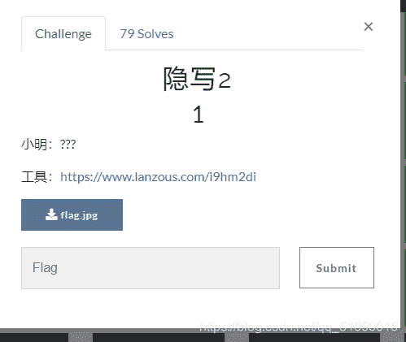
下载打开

提示jphs隐写，用jphs打开：
然后seek ，无密码， 设一个1.txt,这样隐藏的信息就会自动放在里面。

打开1.txt
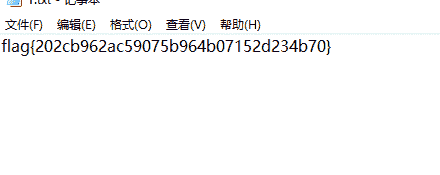

## 22.萌新隐写5

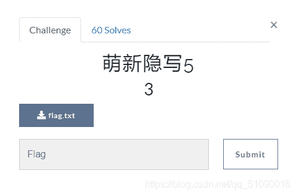
下载打开看看：
这是啥啊？我人傻了 看上去像是编码，但这标题不是隐写么。。

看了wp才知道原来这是unicode编码，啥是unicode编码，百度看看
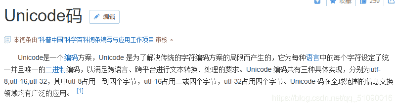
看不太懂。。只好跟着wp的过程去写了

先是从中文转换后得到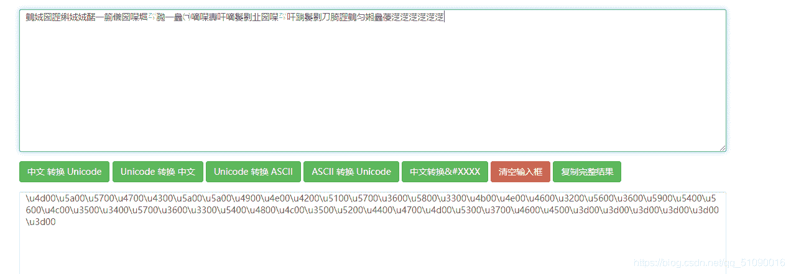
再16进制转化成字符

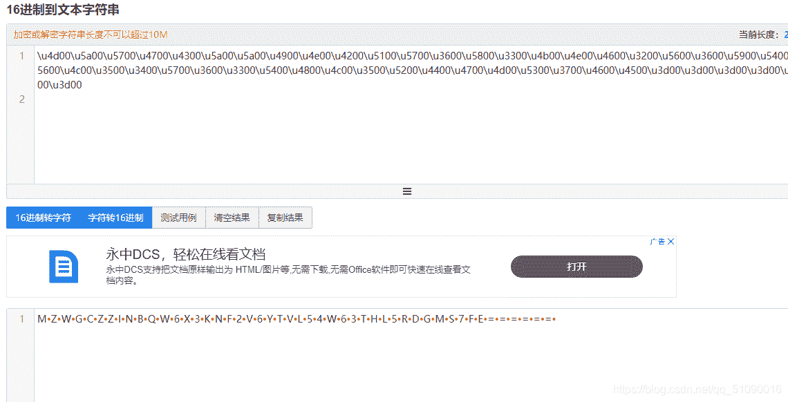
base64解密
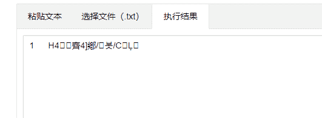
咋不对？？仔细一看，居然有五个等号，试试base32
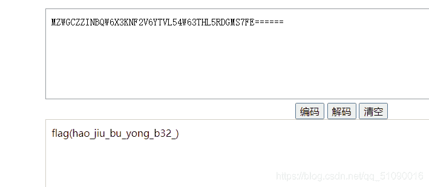
还真是

## 23.萌新隐写6

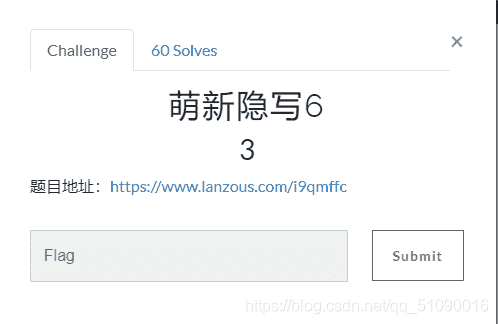
下载打开，居然是一段音频？我还是第一次做音频的隐写，只好跟着wp做

不知道用什么工具的小白，可以下载Audacity，在软件商店就有，用这个打开音频，长这样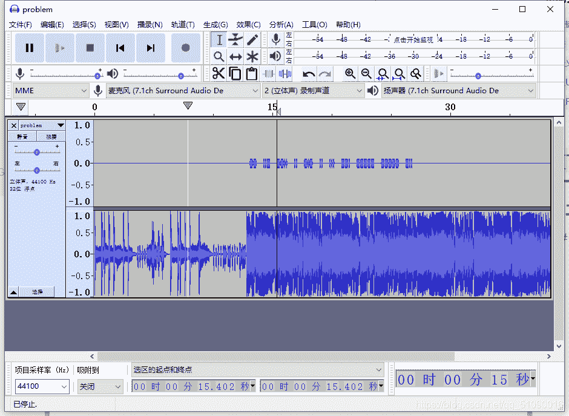
这。。居然告诉我这长短代表摩斯电码，长的替换成-，短的替换成.（看上面的）

也就是：`-- ..- --.. .. -.- .. ... --. ----- ----- -..`

转换得到：`flag{MUZIKISG00D}`

## 24 web1

这题开始，后面的就都是web题了。很久没做web题了，赶快练练手

打开页面：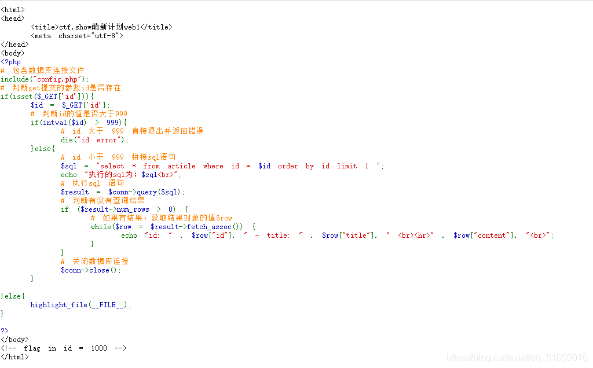
提取里面的几个关键信息：我们要用get的方式上传id ，id大于999的时候会报错，有注意到下面的：flag in id = 1000，传入id = 1000 才能获得flag，那这要咋办？

我们注意到括号里的判断是用的intval函数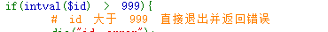
所以我们要绕过它，首先要了解一下intval函数

**intval函数特性：
intval函数是获取变量的整型值，当它获取的变量不能被转换时返回0；
如果字符串其中有数字，则返回数字；
如果开头无法被转换，则返回0；**

所以我们用字符串加数字绕过它，例如’1000’

即在网址后面加上 ？id=’1000‘就行了
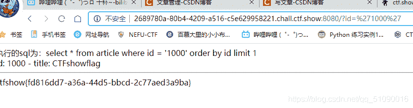
还有其它多种办法：

**二进制：0b1111101000
16进制：0x3e8
双重取反：~~1000
或者100*10**

## 25 web2

打开发现，怎么和web1一样？试试同样的方法
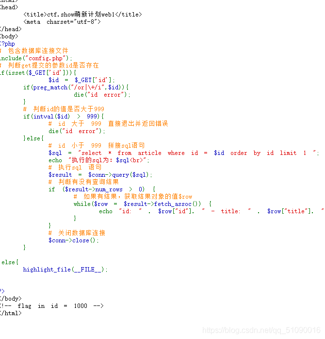
还真的可以
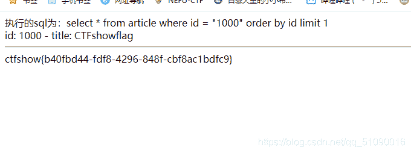

。。。不管了，做下一题

## 26.web3

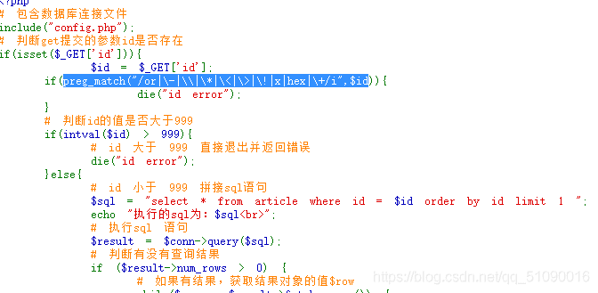

这题倒是改了，这又是啥意思呢。。再试试之前的做法：
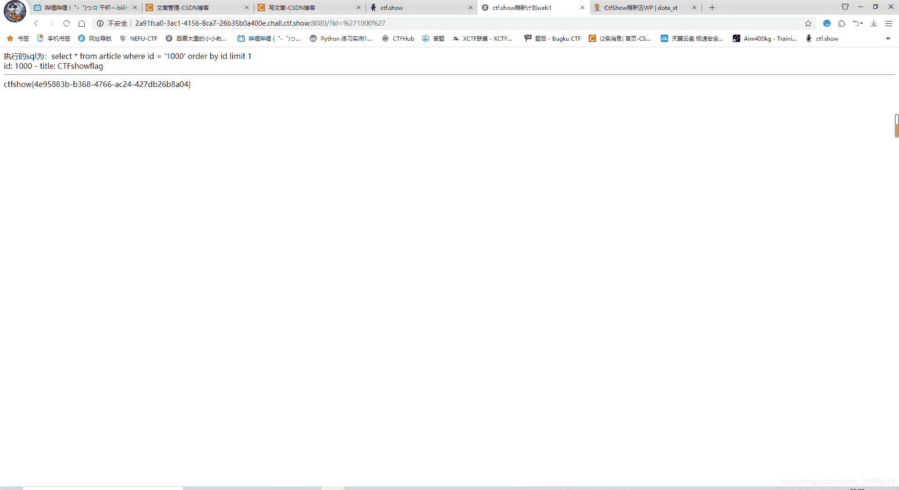
居然还行？ 原因是这次虽然加了过滤，即：

```
if(preg_match("/or|\-|\\|\*|\<|\>|\!|x|hex|\+/i",$id)){
            die("id error");
    } 
```

有这里面的都会出错
但是里面没有单引号，intval函数依然存在，仍然可以绕过。

## 27\. web4

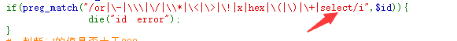

这一次增加了select语句过滤，但是依然不影响

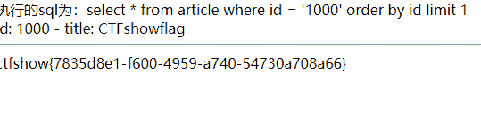

## 28.web5

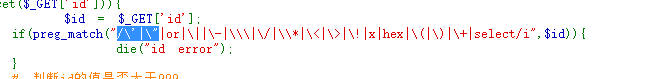
这次就不能用之前的办法了，因为增加了单双引号，不过可以用我们web1提到的其他办法：

二进制：0b1111101000

双重取反：~~1000

另外两个也不行了

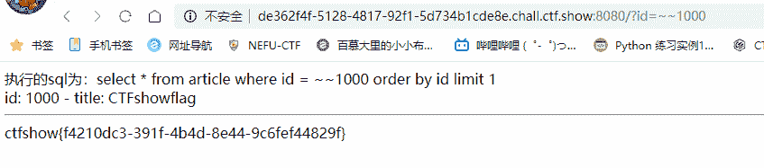

## 29.web6

这道题还是可以用上一题的办法

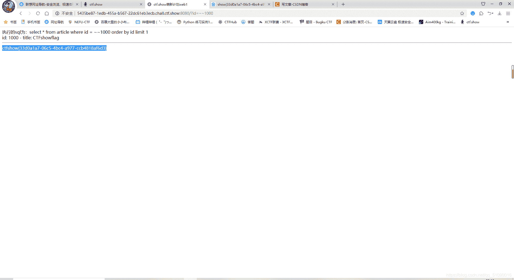

## 30.web7

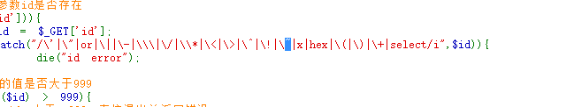
这下波浪号也有了。。我们之前的方法就不行了， 试试转成二进制？
即

```
?id=0b1111101000 
```

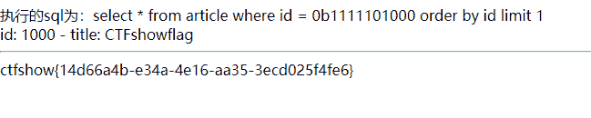
居然还真可以

看到wp还有用sql注入做的方法，来试试：

采取`?id=id%23`进行注入（为什么这么取？）
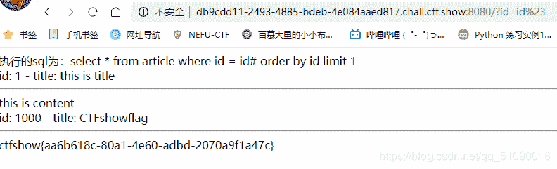
这是什么原理呢？有没有大佬解释一下

## 总结

1.jphs隐写

2.unicode编码了解一下
base64解不了的时候 还有base32 base16呢

3.音频隐写：看波型转换成摩斯电码

4.intval函数可以通过加上’ ‘来绕过它 比如 ： ？id=‘1000’

5.preg_match函数可以用来过滤一些字符

6.同上

7.。。

8.单双引号被屏蔽的时候，可以用~~

9.。。

10.总结绕过intval函数的办法：

单双引号 ‘1000’ “1000”
二进制：0b1111101000
16进制：0x3e8
双重取反：~~1000
或者100*10
sql注入