<!--yml
category: 未分类
date: 2022-04-26 14:49:45
-->

# CTF show 萌新区解题报告 （二）_Vayn3的博客-CSDN博客

> 来源：[https://blog.csdn.net/qq_51090016/article/details/113988188](https://blog.csdn.net/qq_51090016/article/details/113988188)

## 11.萌新 杂项3

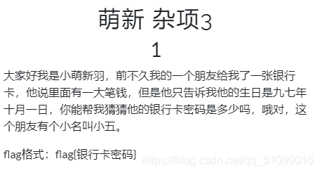
。。这就是脑洞题了，首先要知道银行卡密码只有6位，生日是971001，还着重说了名字小五，银行卡密码只能是数字，那就是密码应该有5，所以一共是97,10,01,5，银行卡密码只有6位，所以就是每个都试一下，最后是971015，就成功了

## 12.杂项4

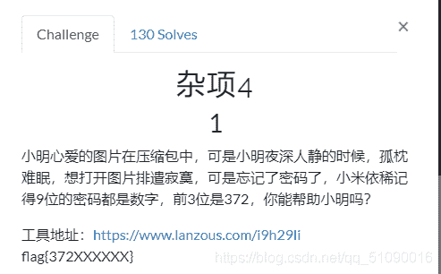
有密码提示？直接ziperello暴力破解，按我这样设置就行了
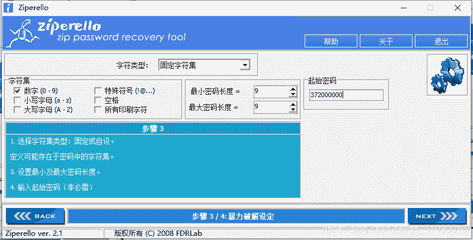
很快啊，密码就出来了
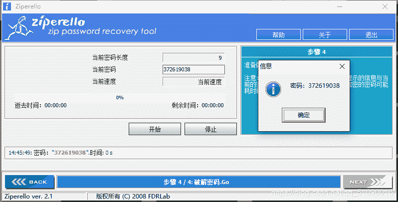
解压就得到flag了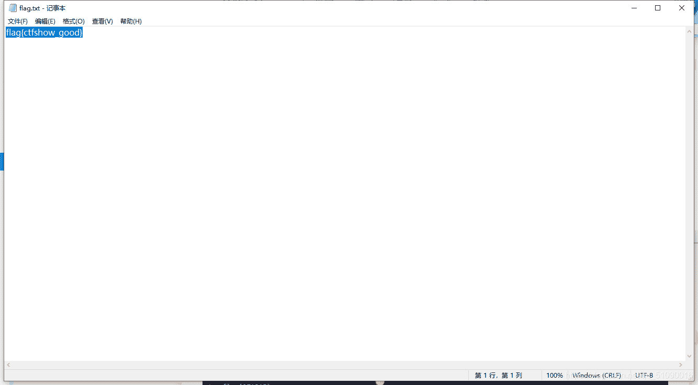

## 13.杂项5


这题还是挺简单的，打开一看，我就感觉那个大写的F不对劲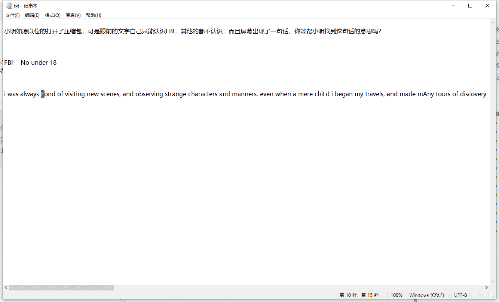
再往后一看，果然，大写字母连起来就是flag

## 14.杂项6

这个本来是个伪加密的题，不过因为我用的是360压缩，可以直接解压缩成功，就直接看到了flag。

不过正常的做法是用010打开压缩包，然后把这里的09改成00再保存，即可去除伪加密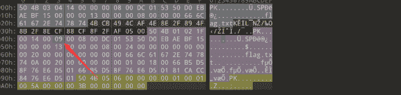

## 15.杂项7

这出题人肯定是个lsp，让我改长度就改长度，干嘛要放色图。。。

我是怎么做的：先打开属性看看图片的宽高：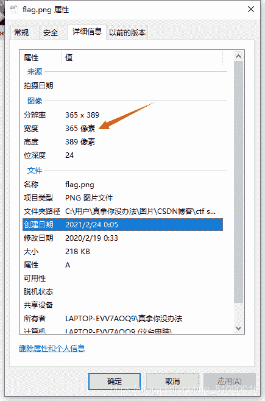
然后高对应的16进制数：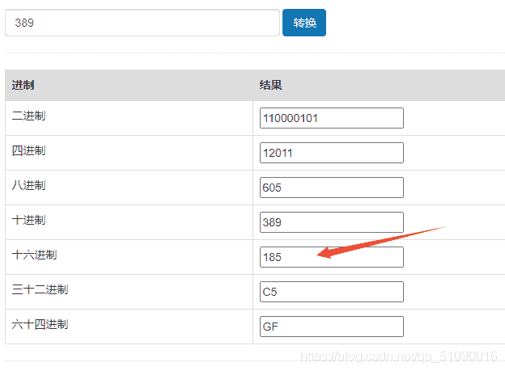
然后用winhex打开，看看185在哪，那应该就是高的数据，修改一下就可以了：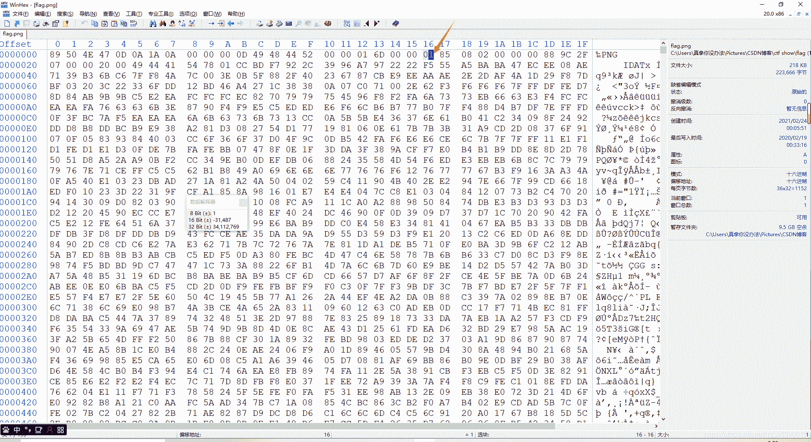
题目也没要求改成多少，变长就行了，把那个改成2，flag就出来了：
。。。不过当我看了wp以后，才发现我的做法好笨

“png格式，从第二行开始，前四个字节代表宽度，后四个代表高度”

记住后就不用傻傻的转换进制了。

## 16.杂项8

这题真的没什么思路，就知道可能因为宽的原因导致图片显示不了，但是又不知道原本的图片宽是多少，这要怎么做呢？看看wp吧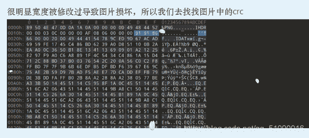
crc是啥？百度一下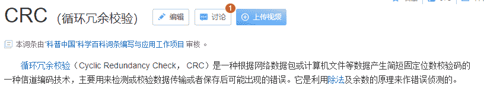
还是看不太懂，总的来说就是校验码，含有长宽的信息吧，用010打开图片，crc就是第二行最后三个加上第三行第一个值：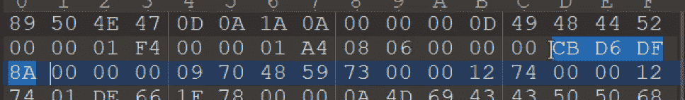

这里就是cbd6df8a

然后说用脚本来爆破原来的宽度，脚本出处：

https://www.wlhhlc.top/posts/25127/#%E6%9D%82%E9%A1%B96

```
'''
Author: dota_st
Date: 2021-01-25 18:40:40
'''
import zlib
import struct

filename = 'flag.png'
with open(filename, 'rb') as f:
    all_b = f.read()
    data = bytearray(all_b[12:29])
    n = 4095
    for w in range(n):
        width = bytearray(struct.pack('>i', w))
        for h in range(n):
            height = bytearray(struct.pack('>i', h))
            for x in range(4):
                data[x+4] = width[x]
                data[x+8] = height[x]
            crc32result = zlib.crc32(data)
            if crc32result == 0x91918666:
                print("宽为：", width, int.from_bytes(width, byteorder='big'))
                print("高为：", height, int.from_bytes(height, byteorder='big'))

作者: dota_st
链接: https://www.wlhhlc.top/posts/25127/
来源: dota_st
著作权归作者所有。商业转载请联系作者获得授权，非商业转载请注明出处。 
```

刚开始运行的时候一直报错，然后搜了下with open的用法（python学的比较少），然后在 with open(filename, ‘rb’) as f: 这一句的filename的内容外加了单引号，还是报错，又搜了下，在单引号前面还要加个r，才正常运行。
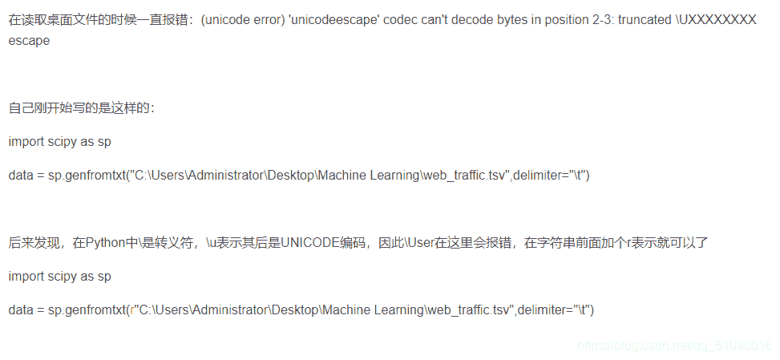
运行完就有宽度了
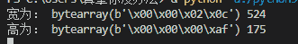
这样把03改成02就可以了（因为524的16进制为20c）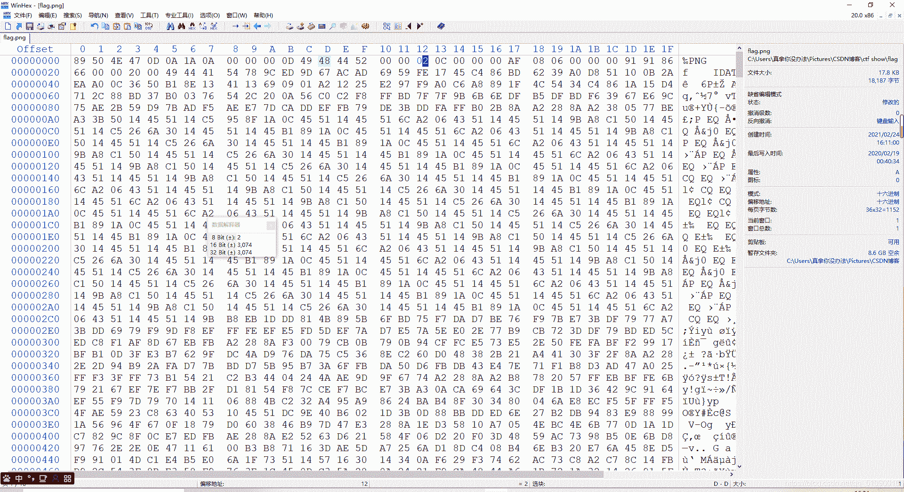
flag就有了：
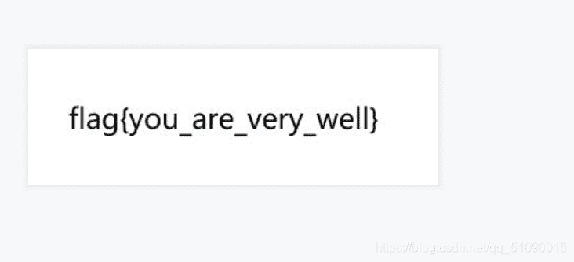

## 17.杂项9

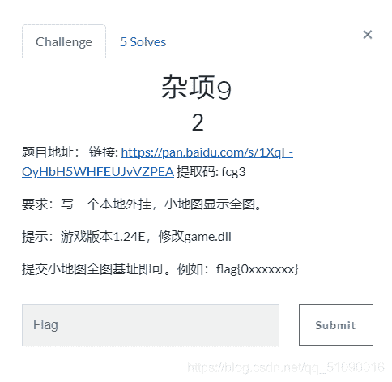
点开，结果。。。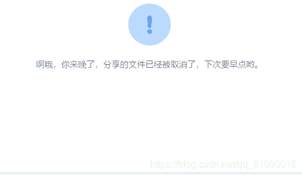
这没办法了，不过这题看起来挺难的，我也挺感兴趣的，看看wp吧，想知道这题长啥样：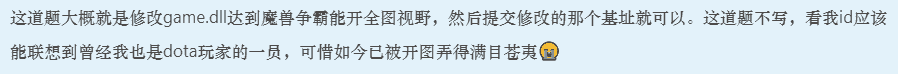
阿西吧。。算了，这题就这样吧。

## 18.杂项10

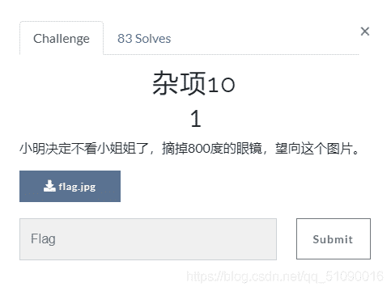
点开看看：
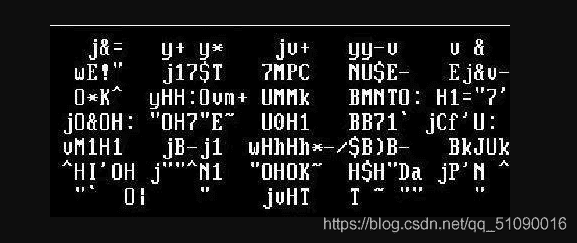

这啥啊。。看这题目就知道不是隐写，那就是脑洞了。仔细看看大小写字母，也没啥规律，放大了看也没啥。只好看看wp
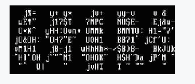
wp居然和我说，这是 我好喜欢你？我就看出来一个你字。。。原来是要近视看，我带着眼睛难怪看不出来，这样说还是要仔细看看提示

也就是说，flag{我好喜欢你}

## 19.杂项11


这题用了各种隐写办法都搞不出来，用记事本 010 打开搜索flag，lsb隐写啥的。。。结果都不是，下载提示的工具，长这样，我还没用过
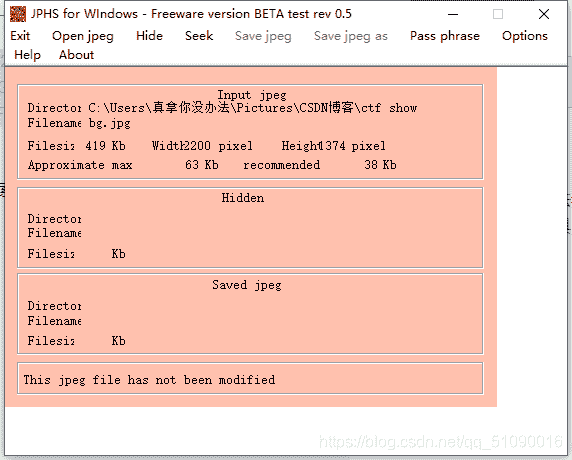
用这个工具打开，但是又不会用，只好百度一下，教程贴这里了：

https://blog.csdn.net/DRondong/article/details/79326385

所以这题值jphs隐写，以前没写过。。

具体操作过程为：用jphs打开图片，点seek，无密码直接ok，然后随便设个txt文件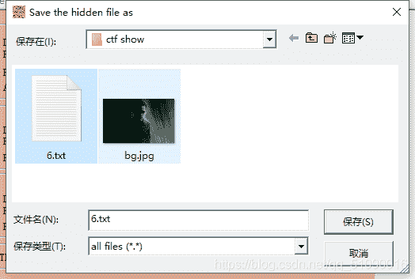
隐藏的信息就保存在里面，然后打开看看：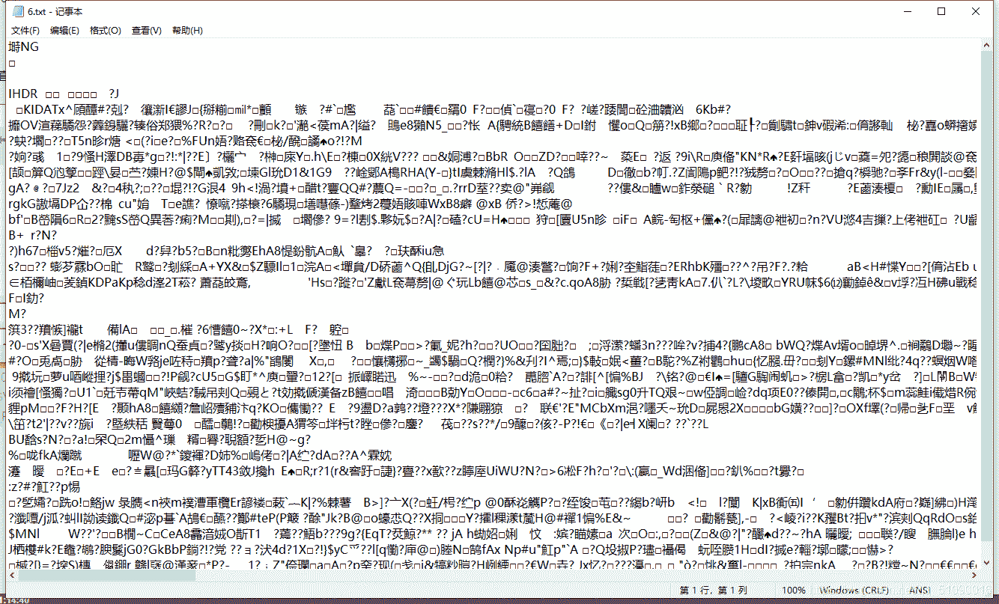
是png格式的，后缀改成png：
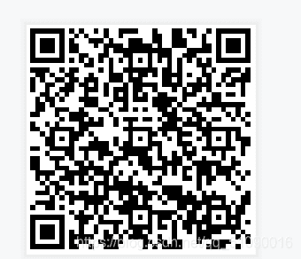

扫一下得到：

？？？还是拿到网站解码吧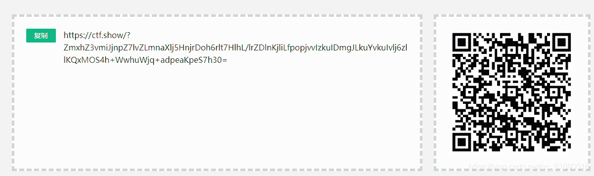
是段base，解码得到：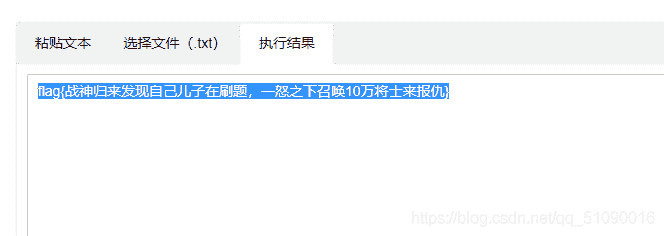
这个flag实在是高。。。

## 20.隐写1

下载图片，发现根本打不开，难道不是png文件？

看看文件头，果然发现了一些东西，和png的文件头不一样，改回来就行了

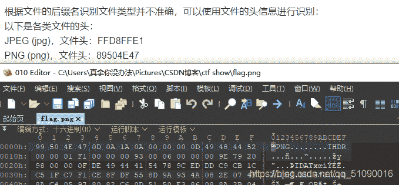
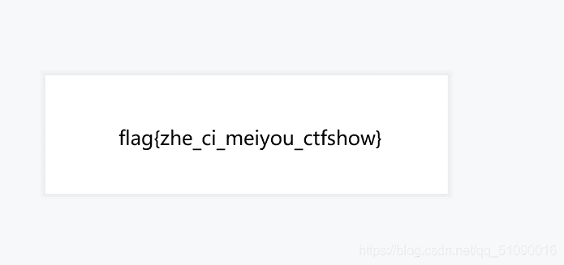

## 总结：

1.放大你的脑洞，有想法就尝试尝试

2.解压需要密码，ziperello爆破了解一下

3.注意观察

4.360流批

5.PNG格式，从第二行开始，前四个字节带表宽度，后四个代表高度

6.需要改回图片原本的高宽，但是却不知道高和宽的，可以：找到crc 通过脚本爆破得到长宽

7.啊这。。能和出题人反应一下，把写外挂的题弄回来吗

8.一团糊的图片要摘下眼镜看

9.jphs隐写了解一下

10.打不开的文件，去看看文件头吧