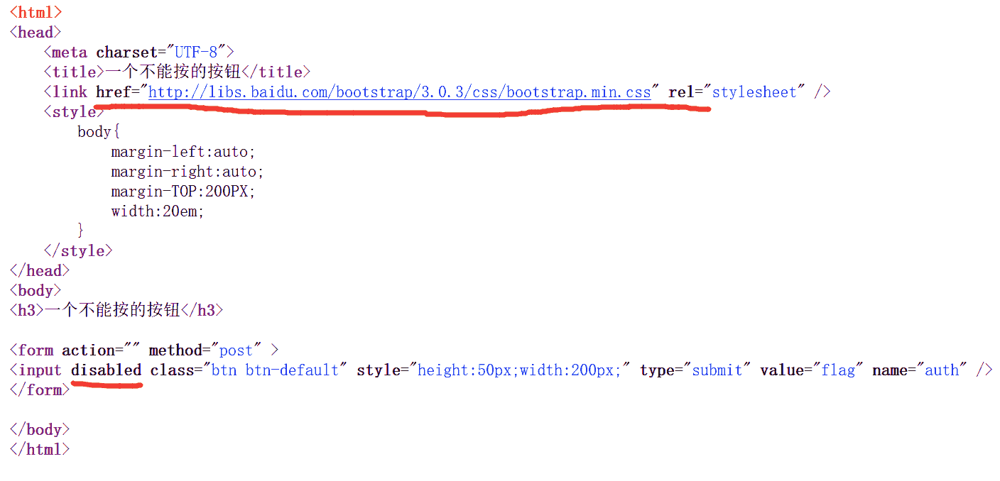
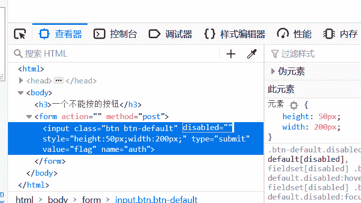
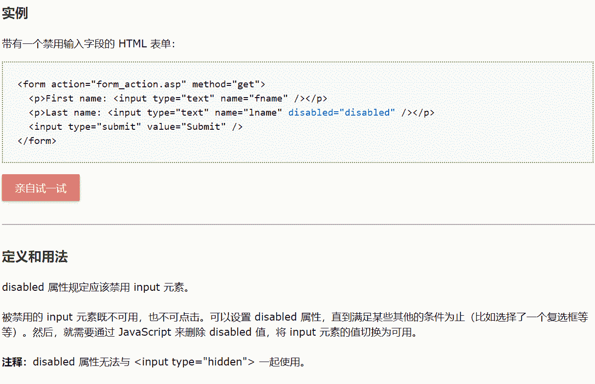
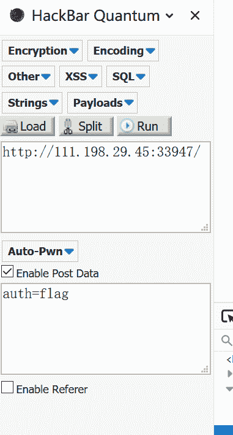

<!--yml
category: 未分类
date: 2022-04-26 14:53:19
-->

# CTF web 攻防世界 disabled_button_weixin_30457065的博客-CSDN博客

> 来源：[https://blog.csdn.net/weixin_30457065/article/details/101338721](https://blog.csdn.net/weixin_30457065/article/details/101338721)

[题目地址](https://adworld.xctf.org.cn/task/answer?type=web&number=3&grade=0&id=5066)

[参考题解（写的非常详细）](https://blog.csdn.net/qq_41617034/article/details/90678997%20)

[ ](https://blog.csdn.net/qq_41617034/article/details/90678997%20)

查看源码

href 是一个链接  百度可知这是一些无关的信息

火狐 F12

disabled属性

 所以在查看器删除 disabled后点击按钮得到flag

同时hacker也发生了变化，post 传参栏多了auth=flag,这是第二种解法（见上文参考[博客链接](https://blog.csdn.net/qq_41617034/article/details/90678997)）

