<!--yml
category: 未分类
date: 2022-04-26 14:35:58
-->

# CTF web入门——HTTP头相关的----修改请求头、伪造Cookie类题目——Bugku Web题目详细题解_日熙！的博客-CSDN博客_ctf请求头题目

> 来源：[https://blog.csdn.net/weixin_44953600/article/details/107515973](https://blog.csdn.net/weixin_44953600/article/details/107515973)

### 1.打开题目显示如下：

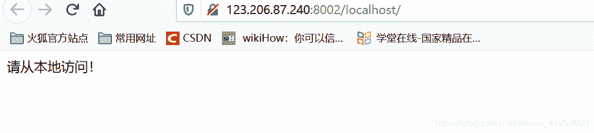
要从本地访问————用Burp抓包，添加X-Forwarded-For 127.0.0.1即可

**X-Forwarded-For :** 简称XFF头，它代表客户端，也就是HTTP的 请求端真实的IP ，只有在通过了HTTP 代理或者负载均衡服务器时才会添加该项。

### 2.详细操作步骤如下：

打开burp，打开浏览器代理
打开题目链接
进入proxy——intercept出现如下图所示（若没出现，就点Forward试试）
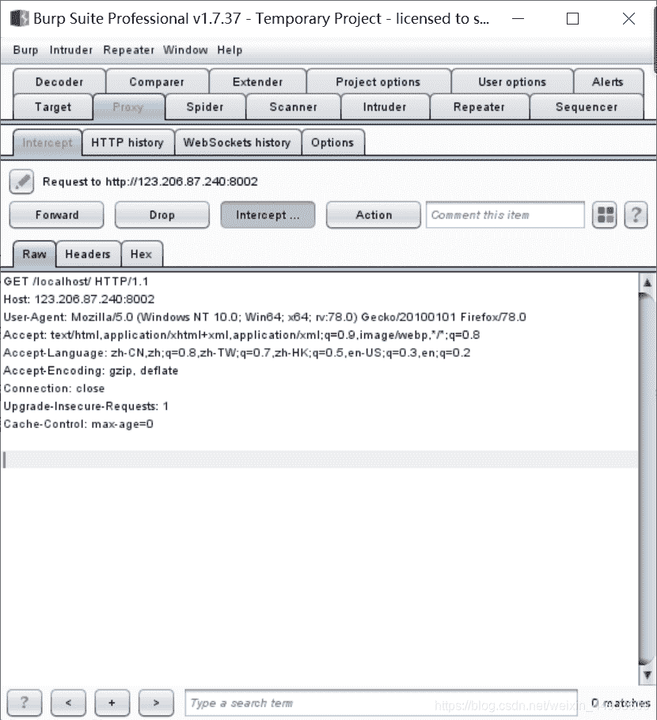

接着在proxy——intercept——Raw区域：鼠标右键，选择 send to repeater，如下图所示：

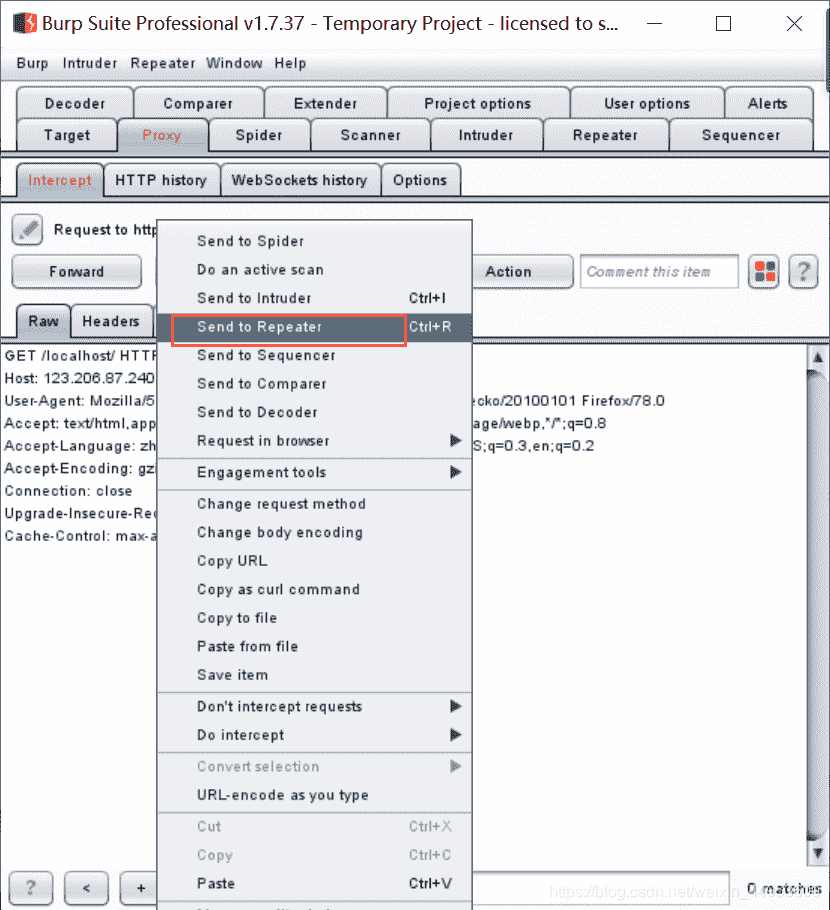

接着到repeater界面，可以在Raw区域随意添加内容了，加上 **X-Forwarded-For:127.0.0.1**
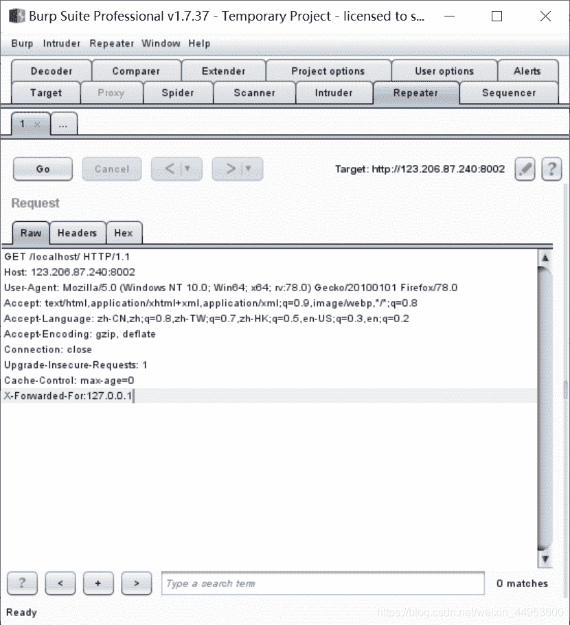

最后再点击 go 即可，会发现右边的Response栏，出现了 Flag ，如下图所示：

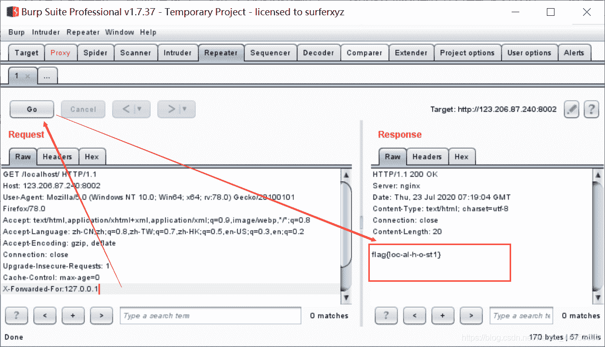

参考链接：https://blog.csdn.net/qq_26090065/article/details/81636812

1.进入题目，显示如下：
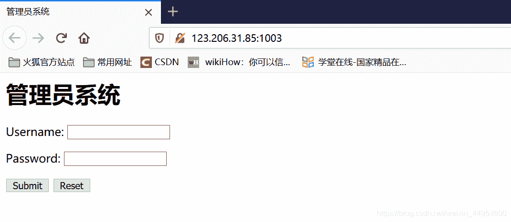
2.首先查看了源码，注意到末尾的注释。
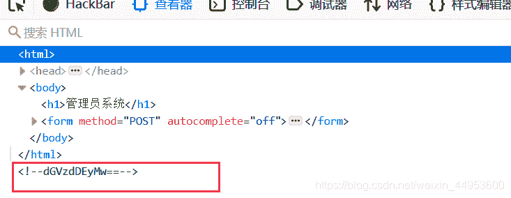
注释包含“==”，判定为BASE64加密后的结果，在线解密。在线解密链接：[https://base64.supfree.net/](https://base64.supfree.net/)
得到test123，这个应该是密码了。

那么用户名是什么呢？————题目是 **管理员系统，用户名一般是 admin**。

3.登录后显示请联系**本地管理**，看到这种就要想到 **<mark>添加X-Forwarded-For，也就是伪造一个XFF头，伪装成本地登录</mark>**：用burp抓包，再 send to repeater，转到Repeater模块中，在 Raw 区域 添加信息： X-Forwarded_For：127.0.0.1
然后点击go，获取回复信息
得到答案 flag{85ff2ee4171396724bae20c0bd851f6b}
（与上面的题目 程序员本地网站 方法 一样）

### **Get 新知识：**

BASE64加密的特征：包含“==” ，在线解密链接：[https://base64.supfree.net/](https://base64.supfree.net/)

如果是管理员系统，用户名一般是 admin。

注：思路参考链接：https://adworld.xctf.org.cn/task/writeup?type=web&id=5068&number=3&grade=0&page=undefined

1.**题目描述** ：X老师告诉小宁其实xff和referer是可以伪造的。

打开题目链接 显示下图所示：
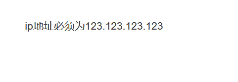

由题目描述得知 应该是要 **用 Burp抓包 修改IP地址**

2.首先 和我们上面说到的两个例子类似，在 Repeater 模块中添加 相应的语句，伪造 xff ，此题应该 添加 ：X-Forwarded-For:123.123.123.123，得到响应如下图所示：
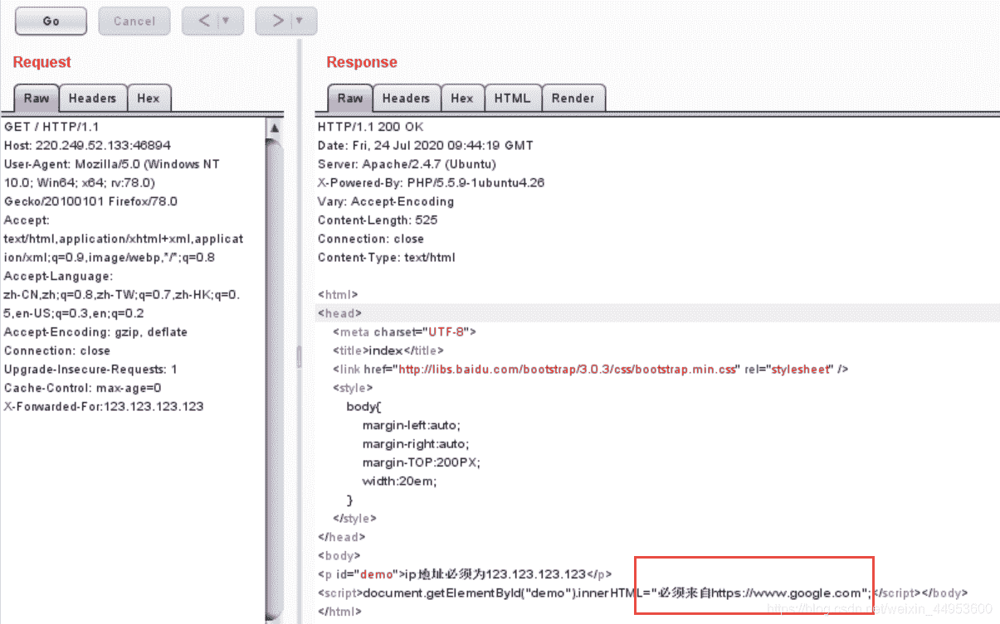
3.发现 “必须来自https://www.google.com” 的提示。——————此处应该想到referer

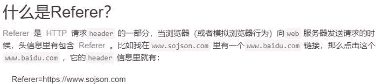

4.继续在 Repeater 模块的Raw添加 Referer:https://www.google.com ，点击发送 得到响应，得到了Flag：cyberpeace{f3e4bbb02cd3341728cec854eae3661f} ，如下图所示：

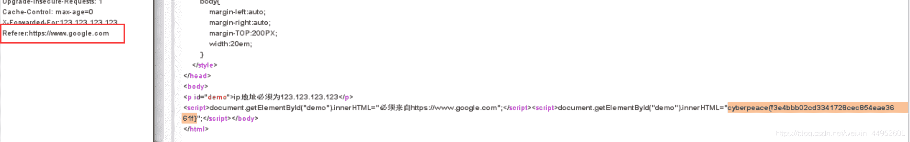