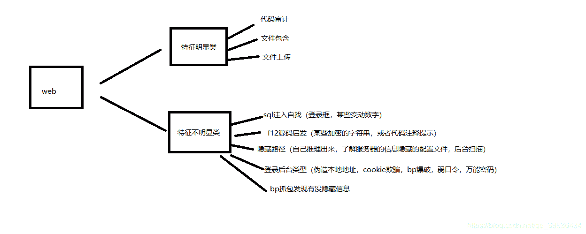

<!--yml
category: 未分类
date: 2022-04-26 14:38:47
-->

# CTF —— web方向思路_吃肉唐僧的博客-CSDN博客_ctf web方向

> 来源：[https://blog.csdn.net/qq_39936434/article/details/100631026](https://blog.csdn.net/qq_39936434/article/details/100631026)

        这段时间在刷CTF题目，在做到web方向的时候，一开始面对题目的时候，总有一种束手无策的感觉，在做了一些web题目后，写一下总结希望以后做的时候可供参考

# **解题大方向  **

        ctf不同于真实实战，有很多题解出来需要绕很多弯，有时候我都怀疑很多题目是为了出题而出题......

        这样有不好也有好，就是ctf的题目无论多难解，都会给你承上启下的线索，这个是必须有的

        在遇到的题目中，web方向的找线索方法我按照自己定义大概可以分为两类，在此献上自己画的草图（很潦草~）

##  特征明显类

  例如是一打开网址，就会有源码页面，或者文件上传页面的,此类比较好定位找到解题方向，这个不多说

  解不出来就是自身知识不足的问题，缺什么补什么就行了，源码不懂多补语言的基础，文件上传没思路的

  搜索上传文件正确姿势等字眼网上一大把

##  特征不明显类

  这一类特征不明显，也是令大多数crfer最头疼的类型。因为相对特征明显类，网上没有固定成体系的知识框架，

  如果不是刷多了有经验，小白（例如我）是很难从中找到头绪。

  当面对一条web题目毫无思路的时候，可以尝试如下步骤找线索：

  1.按f12找提示，可能会有加密的字符串，或者代码注释提示藏在源码里

  2.bp抓包发现有没隐藏信息

  3.寻找隐藏路径（常见index，login类似的路径自己推理出来试下，了解服务器的信息隐藏的配置文件，或者后台扫描）

  4.有登录框类型的题目（伪造本地地址，cookie欺骗，bp爆破密码，弱口令，sql注入万能密码）

  5.sql自找注入点（例如登录框，某些可以变动数字有可能是从数据库查出来的）  

  想到再补