<!--yml
category: 未分类
date: 2022-04-26 14:35:19
-->

# CTF-入门一__starstarli的博客-CSDN博客

> 来源：[https://blog.csdn.net/realstarstarli/article/details/105157348](https://blog.csdn.net/realstarstarli/article/details/105157348)

## **CTF-入门一**

这篇文章是我写的第一篇博客，同时也是我CTF学习的开始。这篇博客主要的内容关于
（1）CTF的简要介绍
（2）kali系统的安装和简要使用
（3）burpsuite的介绍和使用
（4）bugku WEB基础题解前八
（5）涵盖一些上述软件安装过程中，解题过程中出现的一些小问题

## CTF的简要介绍：

CTF（Capture The Flag）中文一般译作夺旗赛，在网络安全领域中指的是网络安全技术人员之间进行技术竞技的一种比赛形式。
CTF比赛和ACM比赛具有相似的评断机制。ACM中通过编程实现算法解题提交通过（AC）评分，而CTF是通过答题获取flag 标识内容通过评分
CTF比赛中的题目类型以下几种：
Web
密码学
pwn 程序的逻辑分析，漏洞利用windows、linux、小型机等
misc 杂项，隐写，数据还原，脑洞、社会工程、与信息安全相关的大数据
reverse 逆向windows、linux类
ppc 编程类的
类似于ACM中的题目类型（贪心、dfs、bfs、动态规划…）不同的题目类型具有不同的解法涵盖知识内容也不同

CTFwiki（入门必看wiki）: [https://ctf-wiki.github.io/ctf-wiki/#/introduction](https://ctf-wiki.github.io/ctf-wiki/#/introduction)
XCTF社区: [https://www.xctf.org.cn/](https://www.xctf.org.cn/)
比赛平台：[https://www.ctfhub.com/#/index](https://www.ctfhub.com/#/index)
入门做题平台;[https://ctf.bugku.com](https://ctf.bugku.com)

## （2）kali系统的安装

kali系统的是linux系统的一款发行版，kali系统被誉为黑客的专用系统，内置了很多有关网络信息安全的软件包括burpsuite，sqlmap等等。
kalin系统可以选用U盘安装，也可以选择虚拟机安装，因为这里只是为了CTF解题需要（在做题的时候，我们可以在windows上面做，只不过kali具有很多解题用的软件，不用再下载）我们这里只说明虚拟机安装
（一）下载虚拟机，官网链接;[https://www.vmware.com/cn/products/workstation-pro/workstation-pro-evaluation.html](https://www.vmware.com/cn/products/workstation-pro/workstation-pro-evaluation.html)
（二）kali镜像：[https://www.kali.org/downloads/](https://www.kali.org/downloads/)
具体的步骤网上有教程，自己写有点累，有时间再说吧…
安装好的界面如下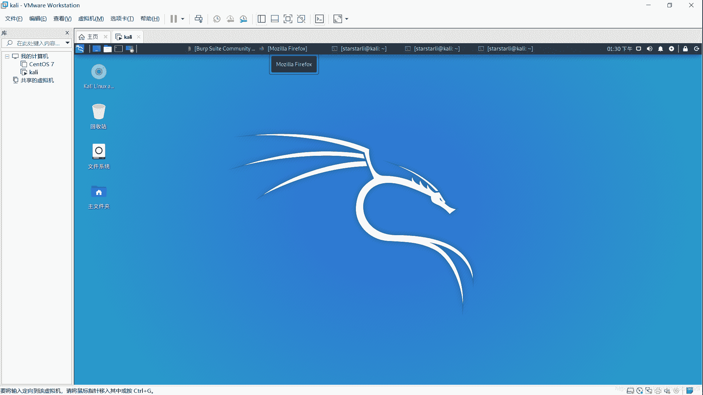
tips:在安装的过程要注意安装图形化界面（初学者，大佬随意），安装的过程中比较与cenos ，ubuntu 等linux发行版会有点慢，耐心等待。还有在安装的过程中会有选择是否安装其余的系统化初始软件，不要选太多，不然会…更慢，还有可能安装失败，其实不用选，自带的软件差不多了，没有的安好再下也行。

## （3）burpsuit的介绍和使用

burpsuit是一个手动抓取浏览器请求的软件，有一些解题时所要采用的功能
更多的使用教程，网上也有…这里不详细说了
(一)安装burpsuite
kalin安装好了具有自带的java编译器，和burpsuite
在终端开就行：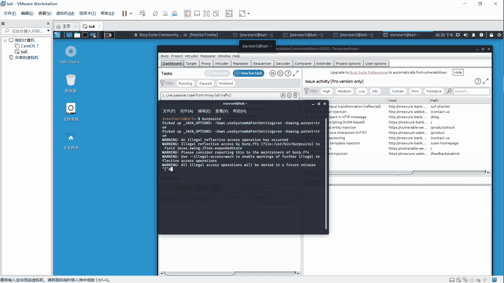
ctrl+alt+t 键打开终端，输入burpsuite
暂时不建立项目，next到底即可出现这样的界面
如果你是window用户就要自己下载，官网太慢…
先安装jre：[https://jingyan.baidu.com/article/09ea3ede2b5f86c0aede39b9.html](https://jingyan.baidu.com/article/09ea3ede2b5f86c0aede39b9.html)
再安装burpsuite：https://share.weiyun.com/5IpgSs9 密码：jeupwp
下载好后有这样的文件：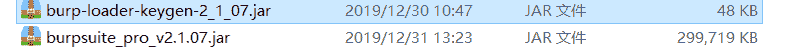
打开第一个文件：
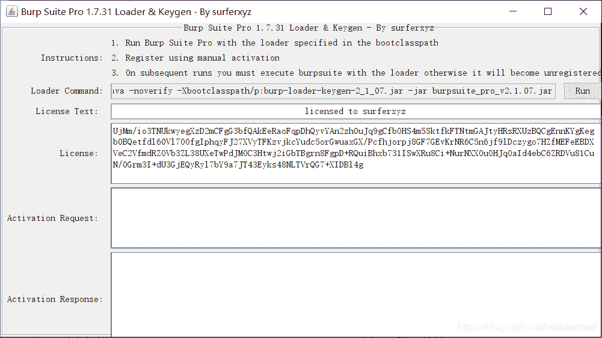
按run，会弹出一个文件框，将licence的全选复制黏贴到框中，申请激活码，复制到上图的第一个空框里，会出现自动的出现激活码，然后burpsuite就可以使用了；
如果run没有用，就打开dos，将run前面的命令输入进去：
java -noverify -Xbootclasspath/p:burp-loader-keygen-2_1_07.jar -jar burpsuite_pro_v2.1.07.jar
（如果没有配置好环境变量），到jre的bin目录下输入该命令，当然两个文件也要在bin目录下，之后就和上一个步骤一样：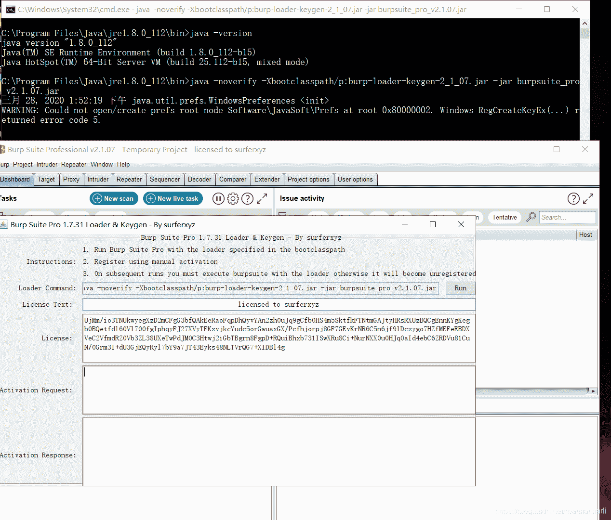
如果你激活成功就是这样的画面。
（二）burpsuite的使用（这里以火狐浏览器为样板）
1.修改域名地址，端口号 默认：127.0.0.1:8080
proxy–>option–>edit

2.浏览器设置手动代理：
设置—>常规–>网络设置
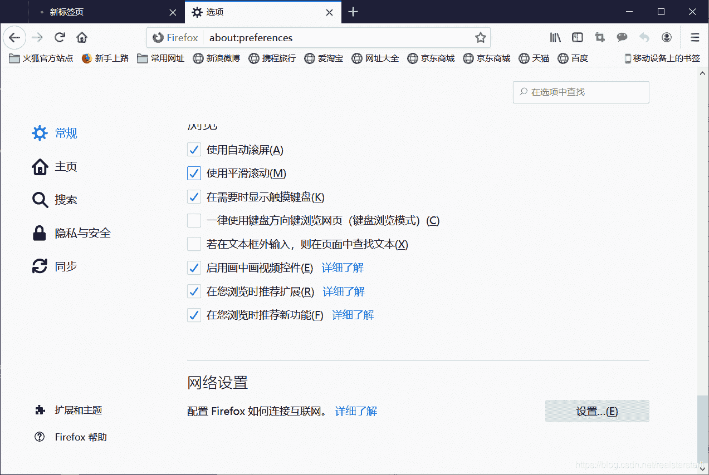
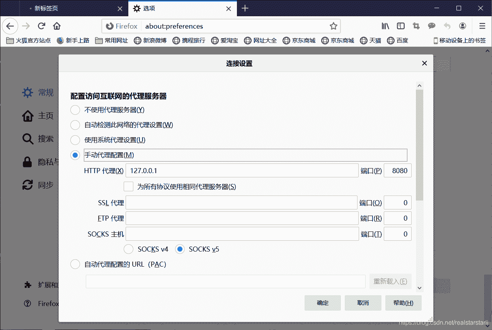
确定就可以了。

3.获取证书：
proxy–>option—>import CA certificate
我这里把证书保存在桌面（要.cer为后缀）保存
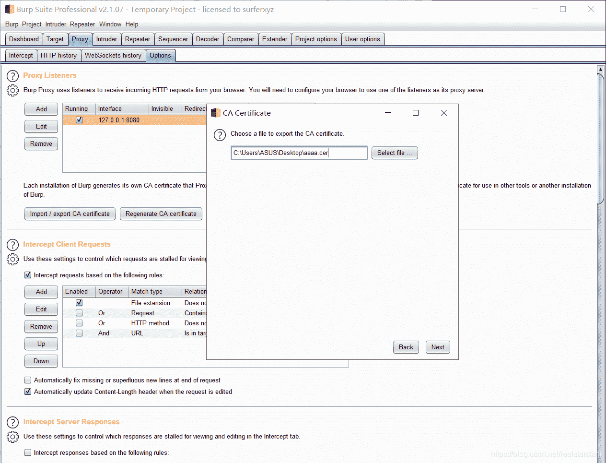
4.导入证书：
设置–>隐私与安全–>证书管理–>证书颁发机构–>导入
选定刚才的文件导入，确定即可。
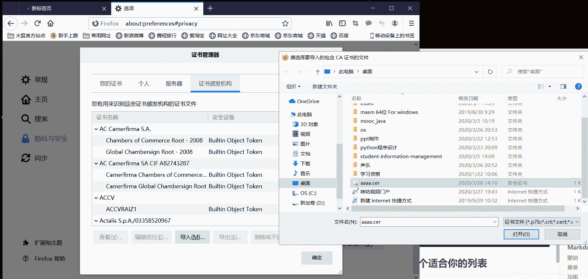

4.抓包
在火狐浏览器输入网址 www.baidu.com;
burpsuite ：
proxy --> intercept --> intercept on
刷新火狐页面：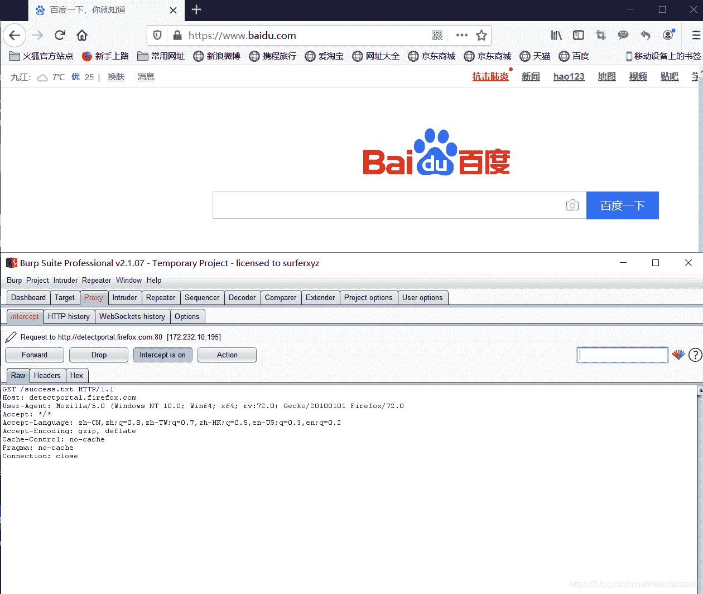
看到这样的页面就可以了
在kali 中和这个一样样搞…

**

## 4）bugku WEB基础题解前八

具体的题解网上有很多：[https://www.cnblogs.com/h3zh1/p/12573716.html](https://www.cnblogs.com/h3zh1/p/12573716.html)
这里给出一些注意事项，和原理解析
web1：签到，没什么可以说的；

web2: 这里是html5的知识，表单input元素设置了最大长度改过来就行

web3：php知识$_GET[“name”]预定义变量，获取名为name的参数值，get传输方式是明文传输，html5表单有这样的方法属性，一般传值是在url以？参数名=参数值的方式传输的

web4：php知识$_POST[‘waht’]预定义变量，获取名为what的参数值，post方法是暗文传输，参数名和参数值藏在文件体内，表单可以比较明确的体现：

```
<!DOCTYPE html>
<html lang="en">
<head>
    <meta charset="UTF-8">
    <meta name="viewport" content="width=device-width, initial-scale=1.0">
    <title>Document</title>
</head>
<body>
    <form action="./post" method="post">
        <input type="text" name="what">
        <input type="submit" value="submit">
    </form>
</body>
</html> 
```

有html5基础的，可以更好的理解，这也是解题方式之一
按F12，将form表单加进去就行，提交也可出答案

web5：is_numeric() 函数用于检测变量是否为数字或数字字符串。php是弱类型的语言，==可以绕过判断

web6：
burpsuite有自己的解码器：
decoder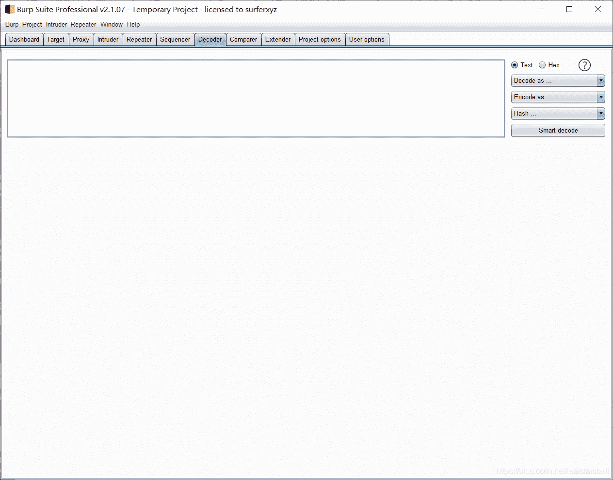
这样&#开头的叫做HTML实体，组成是&#加上一个实体编号，或者&加上实体名称。
咱们这里是前者，这里对应的试题编号是ASCII码，比如75对应K，69对应E，89对应Y。
如果表示汉字也会有自己的相应实体编号。

web7:犹如DNS代替域名解析的工作

web8：还可用burpsuie interpret 抓包；
Action–>send to repeater 执行単步请求，直到刷出flag

## 结束

这是我第一次写博客，写的还是我不懂的CTF，有错误的地方，欢迎批评指正。