<!--yml
category: 未分类
date: 2022-04-26 14:34:51
-->

# CTF-入门九__starstarli的博客-CSDN博客

> 来源：[https://blog.csdn.net/realstarstarli/article/details/107443924](https://blog.csdn.net/realstarstarli/article/details/107443924)

## **CTF-入门九**

这里继续bugku web的题解记录.
**秋名山老司机**
拿到这道题，告诉你们在两秒之内提交答案，手动肯定是不行的。
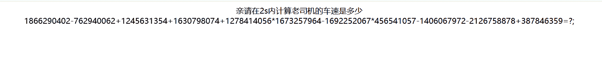
两秒内刷新是这样的页面，这里也可以知道是post方法传值
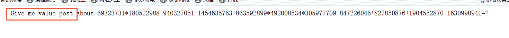
这里给出脚本，网上的脚本大同小异，这里按照惯例优化了一下代码并给出完整的代码注释

```
import requests
from bs4 import BeautifulSoup

'''
通过我们对于题目的源代码的分析可知，在两秒内刷新页面会得到不一样的结果
这里其实是会话机制的作用（cookie和session）
这里有文档解析，比较详细：cookie和session详解：https://www.cnblogs.com/l199616j/p/11195667.html
简要而言cookie和session是对于每一个用户都会形成一个会话机制，不同的用户会对应不同的cookie和session，其中所含的信息也不一样
不同的就是cookie是在客户端记录用户数据；而session是在服务器端记录数据
而且这个数据是由作用周期的，在响应的时间内数据会自动删除，这里是2s
'''
url='http://123.206.87.240:8002/qiumingshan/'

session = requests.session()

res = session.get(url)

res.encoding = 'utf-8'

soup = BeautifulSoup(res.text,"html.parser")

div_contents = soup.find_all("div")

div_content = div_contents[0].text

div_content  = div_content.replace("=?;","  ")

result=eval(div_content)

post_req = session.post(url, data = {'value':result})
print(post_req.text) 
```

cookie和session详解：[https://www.cnblogs.com/l199616j/p/11195667.html](https://www.cnblogs.com/l199616j/p/11195667.html)
具体的解析在代码中交代，一段段的代码注释可能会更好理解（还好之前接触了一下python的爬虫，不然会很难理解）
运行脚本就可以得到flag
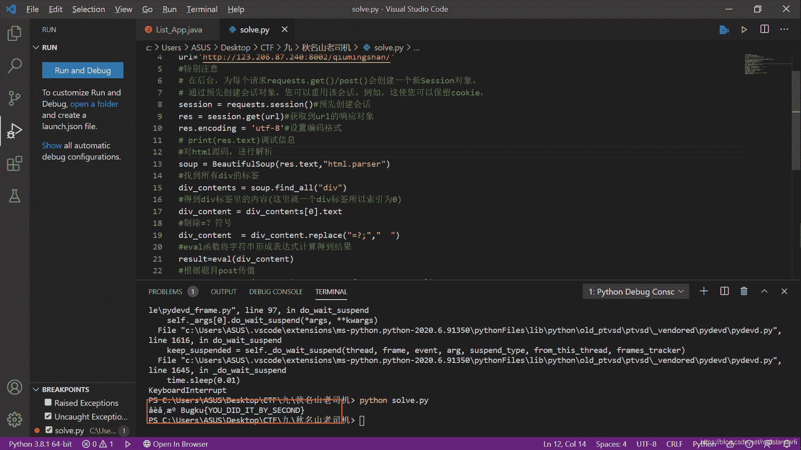
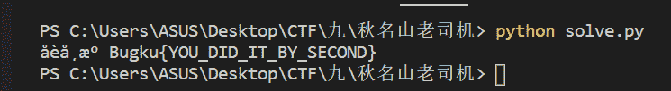
**速度要快**
查看源代码
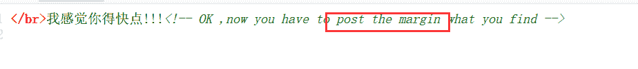
看到这样的一条注释信息： OK ,now you have to post the margin what you find
需要以post方法传值变量的属性为margin
但是margin的值在哪儿呢，我们看看头部信息有没有提示信息
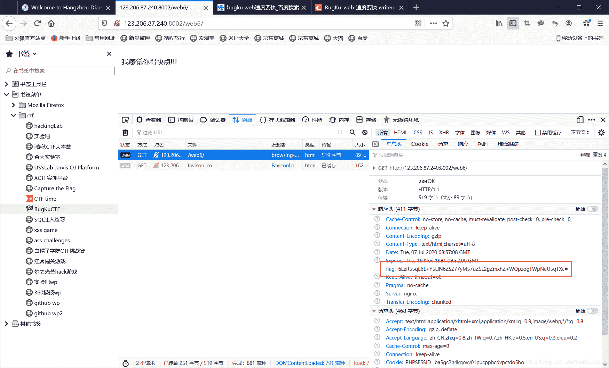
果然在浏览器中查看到有一个flag的字段的信息，这个显然是被编码过的，我们用base64解码一下看看
注意要解两次
用post传值，得到的结果，还是叫你快点
这个时候注意可能是session的问题，再者我们发现每次刷新页面的时候得到的flag字段的信息有一部分是不一样的
6LeR55qE6L+Y5LiN6ZSZ77yM57uZ5L2gZmxhZ+WQpzogTmpJMU56Y3o=
6LeR55qE6L+Y5LiN6ZSZ77yM57uZ5L2gZmxhZ+WQpzogT1RFeE1EYzQ=
6LeR55qE6L+Y5LiN6ZSZ77yM57uZ5L2gZmxhZ+WQpzogTVRZek9EYzA=
这是随机三次获得的编码，我么看到尾部几位是不一样的
所以写一个脚本直接进行获取编码，解码，传值的功能
得到回响信息，拿到flag

```
import requests
import base64
url='http://123.206.87.240:8002/web6/'
session=requests.session()

headers=session.get(url).headers

flag=headers['flag']

flag=base64.b64decode(flag).decode().split(":")[-1]

flag=base64.b64decode(flag).decode()

res_p=session.post(url,data={'margin':flag})
print(res_p.text) 
```

**cookie欺骗**
这道题显而易见是和cookie有关，但是。。。。这道题开始的时候，完全不了解从哪个方面入手
页面的一串乱码也不知道是什么，注意到url上的filename字段上的编码猜想可能是base64（含有=字符串一般就是，以前的杂项题解博客有介绍）
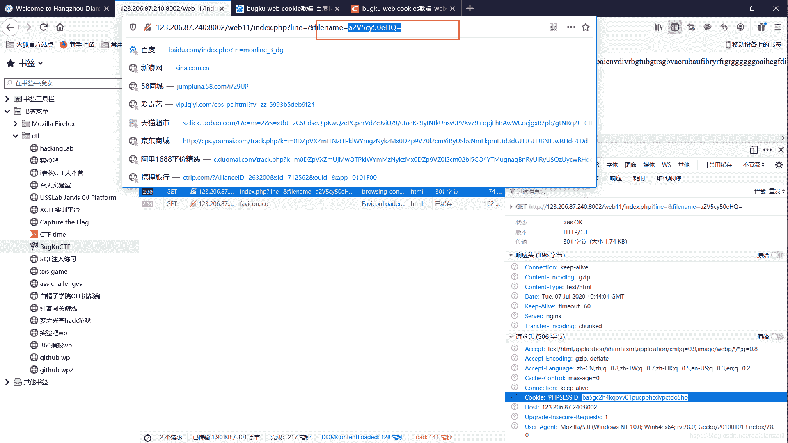

base64解码出来的字符串是keys.txt，传进去发现页面啥都没有了
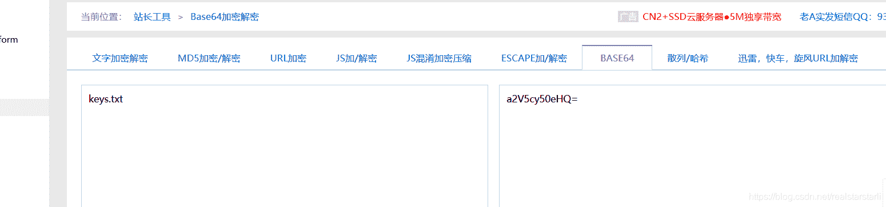

查题解，wp上面说是将这个filename指的就是index.php(编码成base64)
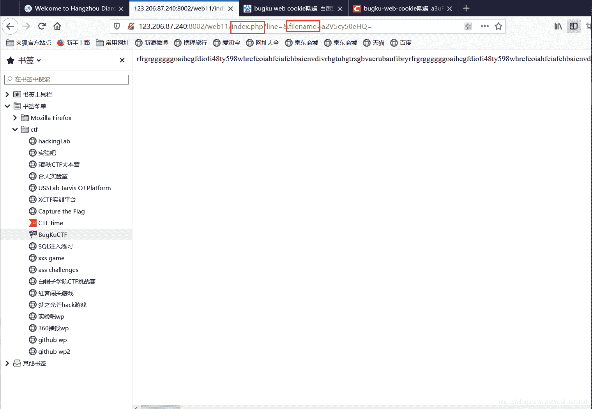这个是base64解码的python代码

```
import requests
import base64
filename=base64.b64encode("index.php".encode()).decode()
print(filename) 
```

再然后我们注意到还有一个line的属性，我们设置成1,2,3.。看到有php的代码出现
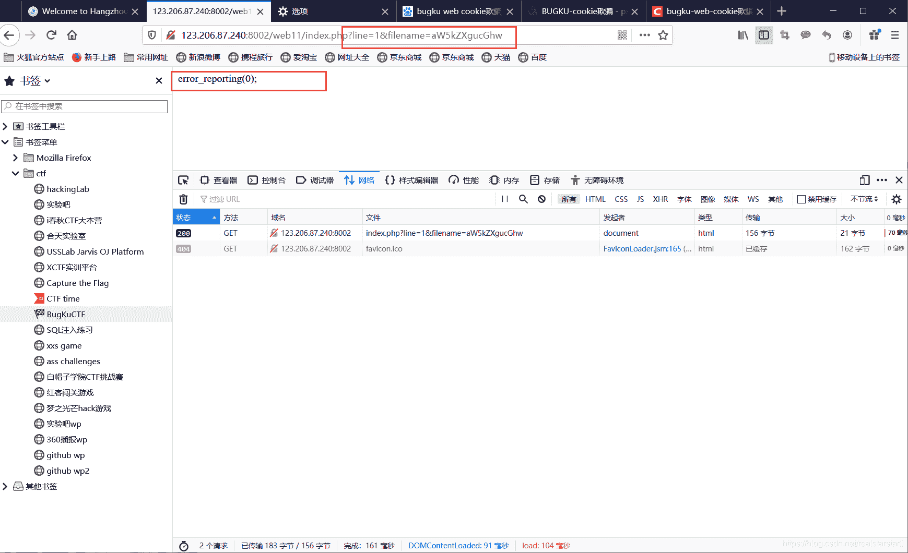
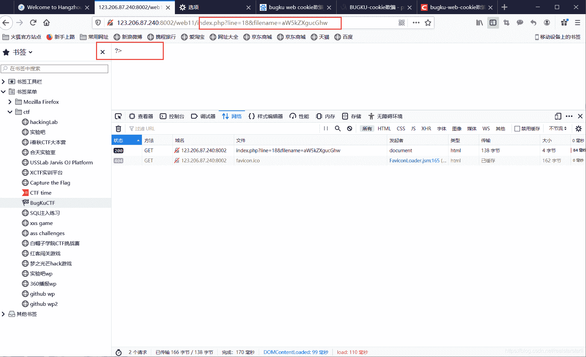

差不多18行的时候的代码已经结尾了。所以这里给出一个python的脚本直接得出php代码。说实在的这个一点提示都没有，有点难想到

```
import requests
import base64

filename=base64.b64encode('index.php'.encode()).decode()

file_php=open("code.php","w")

for i in range(30):

    url='http://123.206.87.240:8002/web11/index.php?line='+str(i)+'&filename='+filename
    result=requests.get(url)
    file_php.write(result.text) 
```

php代码

```
<?php
    error_reporting(0);
    $file=base64_decode(isset($_GET['filename'])?$_GET['filename']:"");
    $line=isset($_GET['line'])?intval($_GET['line']):0;
    if($file=='') header("location:index.php?line=&filename=a2V5cy50eHQ=");
    $file_list = array(
        '0' =>'keys.txt',
        '1' =>'index.php',
    );
    if(isset($_COOKIE['margin']) && $_COOKIE['margin']=='margin'){
        $file_list[2]='keys.php';
    }
    if(in_array($file, $file_list)){
        $fa = file($file);
        echo $fa[$line];
    } 
```

分析一波我们获得的代码，有一部分是检测是否传入cookie，我们查看一下请求头部信息会发现，原先是没有传入cookie的
再者我们通过php代码分析可以得到，keys.php这个文件信息是尤为关键的，所以我们的filename的传参值为keys.php的base64编码
这里说两种方法：
（1）bp抓包
通过得到请求头，修改请求的头部信息filename，再加上cookie：margin=margin（php代码分析得出），得到响应信息（flag）
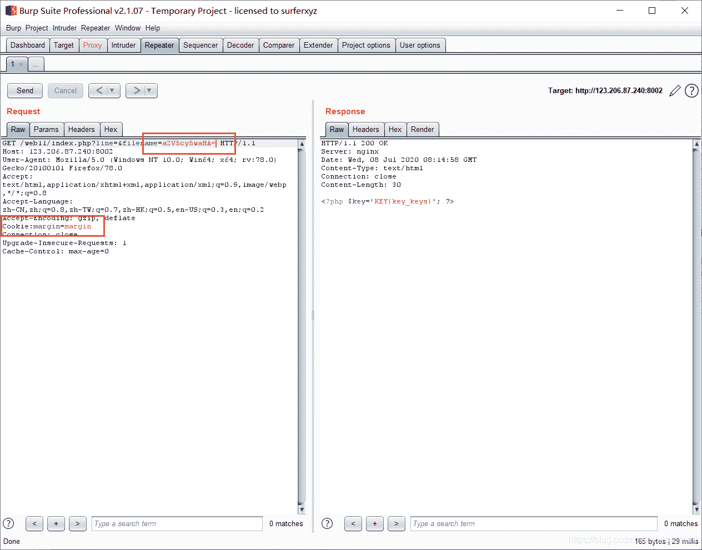

（2）通过浏览器自身的编辑请求头的功能重新发送请求头，修改方式和（1）一样。。。（这是我自己发现的，奇怪以前从来不知道还可以这样）
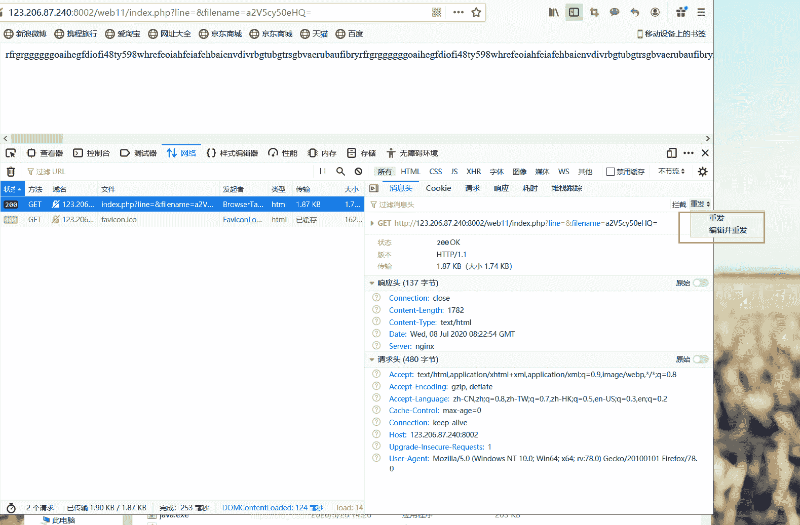

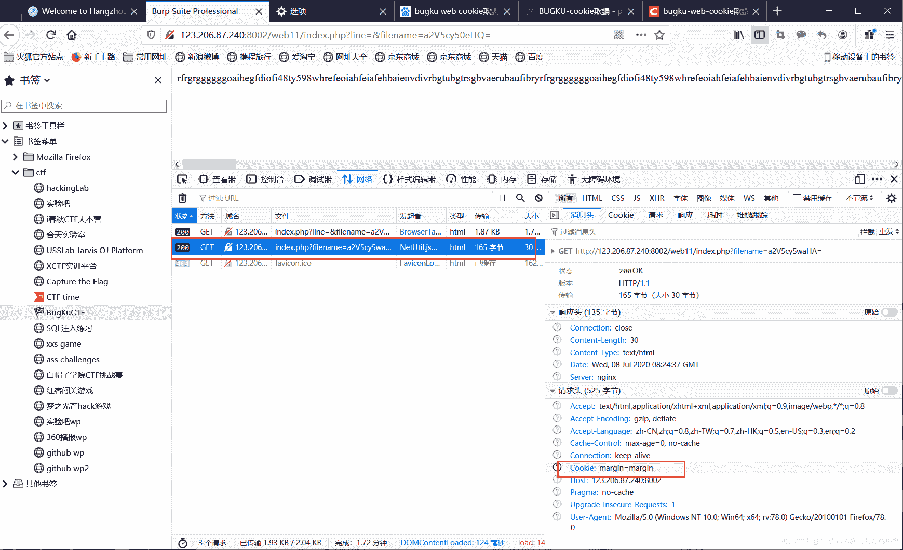

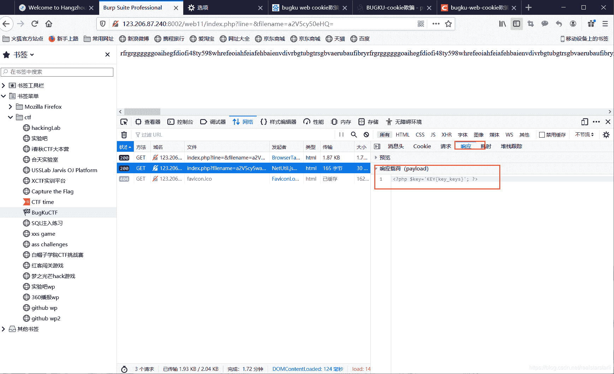

得出的flag是：
KEY{key_keys}
**never give up**
这篇博客写的灰常好，十分的全面，对这道题理解非常好：[https://www.dazhuanlan.com/2019/09/23/5d88b090879c1/](https://www.dazhuanlan.com/2019/09/23/5d88b090879c1/)
这里就讲讲我的解题思路叭，单纯为了做记录
这里先看下源代码，知道有1p.html的提示信息，我们访问一下。
访问的时候出现直接跳转到了bugku的首页，这里知道1p.html一定有页面重定向的代码
这里有两种方式
1）通过用bp的抓包，得到源代码
2）用view-source:url的方式访问view-source:http://123.206.87.240:8006/test/1p.html
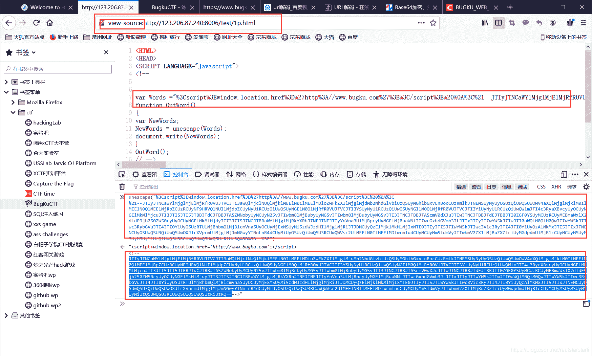

看到了有JavaScript的代码，有一串感觉需要解码的东西
打开控制台，输入unescape(字符串)得出解码的字符串，果然有重定位的代码
还有一部分是被注释了的，看起来很像base64编码，解码。
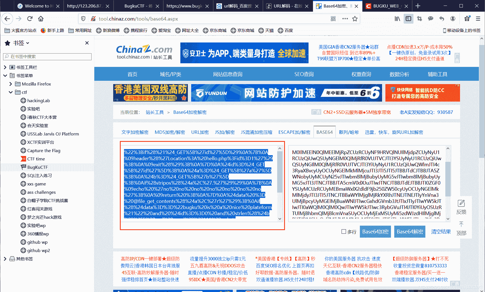
还是一串乱码%标识（url解码），出现了php的源代码
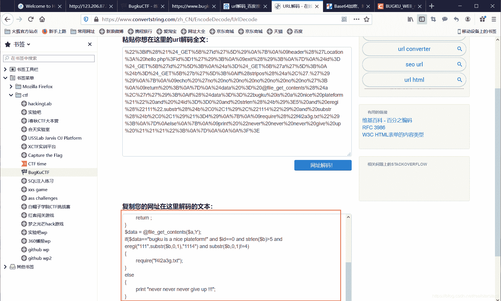

这里按照惯例给出代码的注释信息

```
<?php

if (!$_GET['id']) {
    header('Location: hello.php?id=1');
    exit();
}
$id = $_GET['id'];
$a = $_GET['a'];
$b = $_GET['b'];

if (stripos($a, '.')) {
    echo 'no no no no no no no';
    return;
}

$data = @file_get_contents($a, 'r');

if ($data == "bugku is a nice plateform!" and $id == 0 and strlen($b) > 5 and eregi("111" . substr($b, 0, 1), "1114") and substr($b, 0, 1) != 4) {
    require("f4l2a3g.txt");
} else {
    print "never never never give up !!!";
} 
```

最后构造出payload提交得到回响信息
这里还是有两种方式
1）bp抓包，通过payload的修改请求头和请求体，得到回响信息
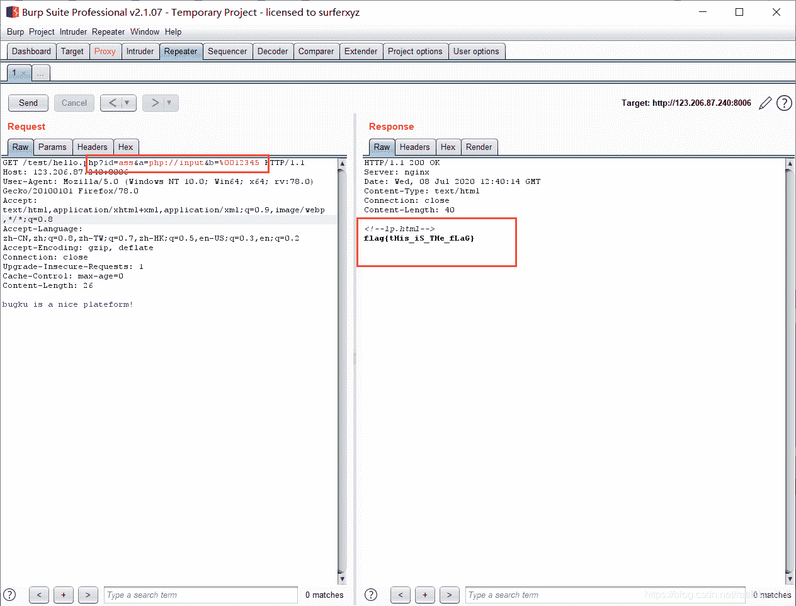

2）还是用浏览器自身的修改功能发送
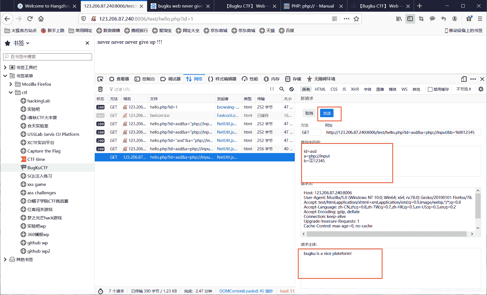
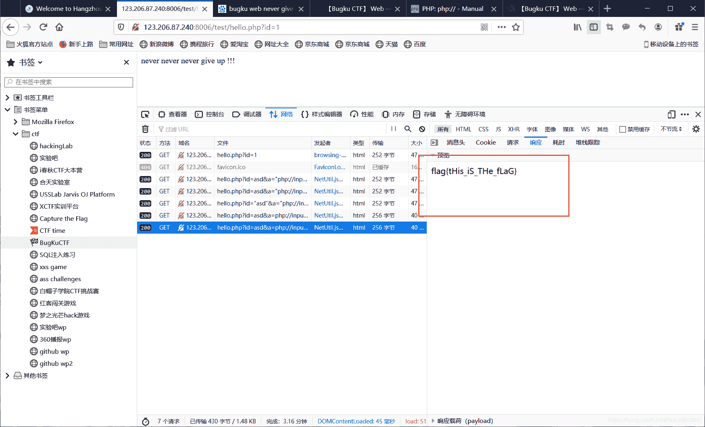

最后得到的flag
flag{tHis_iS_THe_fLaG}
**welcome to bugku**
我做的时候这个链接应该是过期啦：[https://blog.csdn.net/yh1013024906/article/details/81087939](https://blog.csdn.net/yh1013024906/article/details/81087939)
有兴趣可以看看这个博客
**过狗一句话**
这个站可能被人玩坏了，没法做了
感兴趣可以看看这个博客
[https://blog.csdn.net/qq_41420747/article/details/82193325](https://blog.csdn.net/qq_41420747/article/details/82193325)

**字符？正则？**
进入题目发现代码
大概的意思便是，就是需要你根据给出的正则表达式，设置一个符合的字符串，匹配

```
<?php

highlight_file('2.php');

$key = 'KEY{********************************}';

$IM = preg_match("/key.*key.{4,7}key:\/.\/(.*key)[a-z][[:punct:]]/i", trim($_GET["id"]), $match);

if ($IM) {

    die('key is: ' . $key);
} 
```

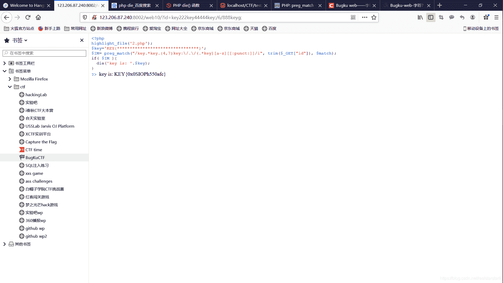
采用get提交的方法就可以出flag
**前女友{SKCTF}**
服务器好像出错了，进不去，就不做了
有兴趣看看前人的博客
[https://blog.csdn.net/weixin_43578492/article/details/95743049](https://blog.csdn.net/weixin_43578492/article/details/95743049)
**Login1{SKCTF}**
服务器好像出错了，进不去，就不做了
前人的博客 [https://blog.csdn.net/saislanti/article/details/103820680](https://blog.csdn.net/saislanti/article/details/103820680)
**你从哪里来**
你从哪里来？之后的页面的提示信息也说了是are you from google
这里的作用和考点便是请求头中的Referer字段
简单说明就是这个字段记录了当前页面的访问源头
举个栗子（说人话）：
如果你访问一个页面比如我的博客`https://blog.csdn.net/realstarstarli/article/details/106606212`
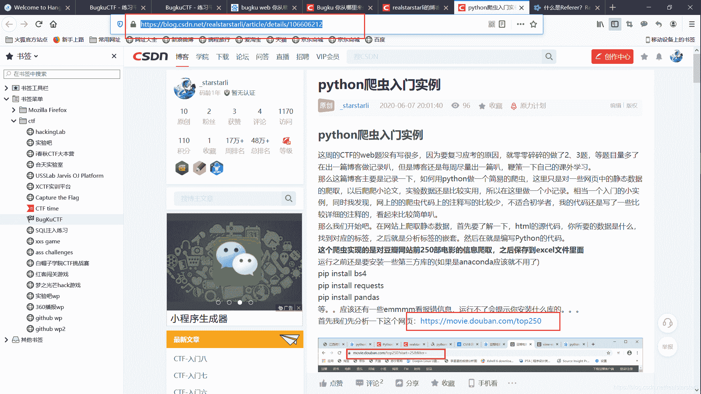

再点击我博客中的一个链接`https://movie.douban.com/top250`，那么在查看这个页面的请求头的时候
Referer字段的信息便是`https://blog.csdn.net/realstarstarli/article/details/106606212`
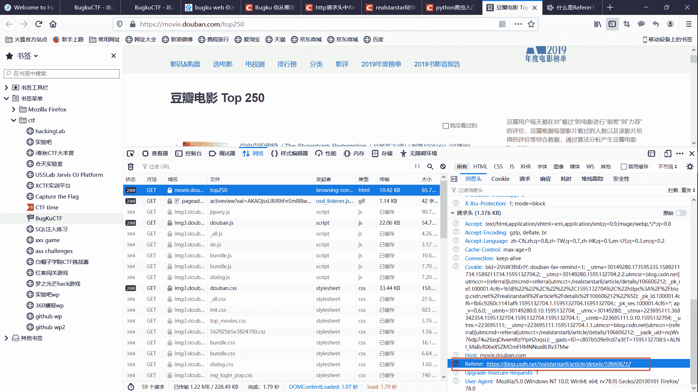

如果你直接通过浏览器输入URL这个时候的是没有Referer字段的
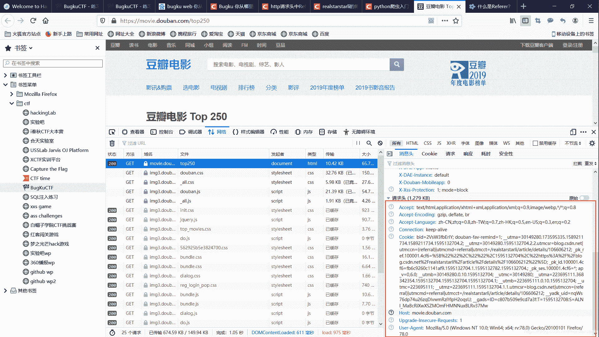

这里有更为全面的解释
[https://www.sojson.com/blog/58.html](https://www.sojson.com/blog/58.html)
知道了原理，那么解题便很轻松了
应为bp的抓包太过于麻烦，我们直接用浏览器自带的功能，重写请求头
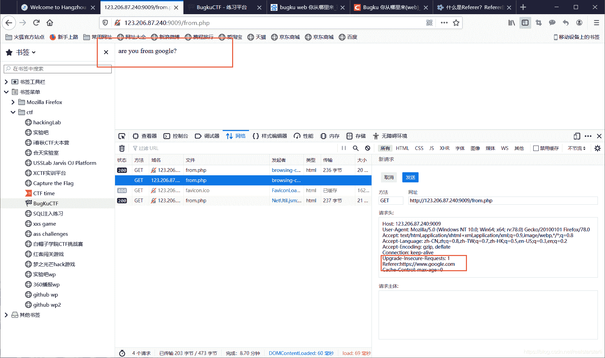
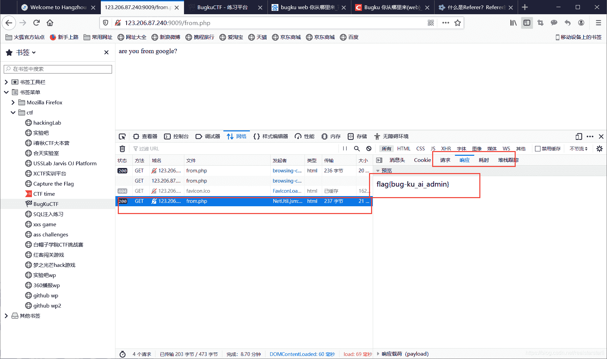

在请求头中加入字段Referer:https://www.google.com
因为访问的源头是要求是谷歌，所以我们传入谷歌的主页
发送请求，查看回响信息，便是flag

**md5 collision**
mid5 collision（MD5 碰撞）
题目给出的提示信息，是md5碰撞
这道题页面的提示信息是please input a
提示你传入a的值，其实我不知道这道题怎么做（get传值）
先随便输值进去
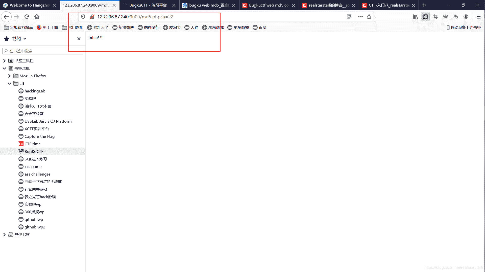

这道题不像 `备份是个好习惯` 这道题可以拿到源代码我们分析不了
但是其实这其中的机制是差不多的，都是通过构造对应的字符串实现`==`绕过
利用`==`比较漏洞
如果字符经MD5加密后的值为 0exxxxx形式，就会被认为是科学计数法，且表示的是0*10的xxxx次方，还是零，都是相等的。
下列的字符串的MD5值都是0e开头的：
QNKCDZO
240610708
s878926199a
s155964671a
s214587387a
我们随便选择一个就可以出现flag了
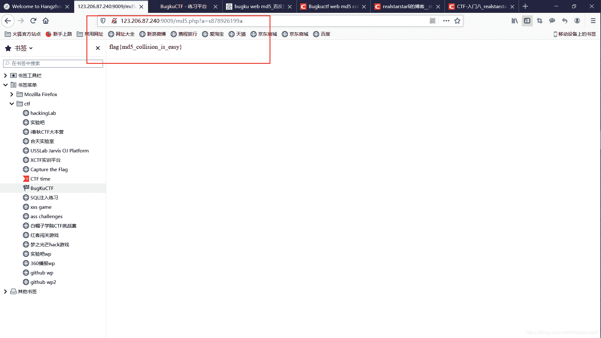
总是觉得这样的解法有点突兀。。

**程序员本地网站**
这道题bugku现在应该是过期了
这道题和管理员系统那道题一样，只要构建好伪ip就行
X-Forwarded-For：127.0.0.1
**各种绕过。**
这道题应该也是不能做了，考点是sha1()不能处理数组的漏洞
[https://blog.csdn.net/qq_40481505/article/details/101294201](https://blog.csdn.net/qq_40481505/article/details/101294201)
这里是前人的wp。

**结语**
我发现bugku现在好多额链接已经失去作用了，有好多题没法写了，所以呢在抽空之余我会将那些没法做的题的重要的知识点，罗列一下，不会直接甩个链接就完事儿了的