<!--yml
category: 未分类
date: 2022-04-26 14:32:50
-->

# CTF-入门五__starstarli的博客-CSDN博客

> 来源：[https://blog.csdn.net/realstarstarli/article/details/106179571](https://blog.csdn.net/realstarstarli/article/details/106179571)

## CTF-入门五

继续bugku的杂项题解
**（1）图穷匕见**
拿到一张图穷匕见的图片
虽然题目有点小提示，但还是转不过来
题目的意思是说：这张图的最后就会出现信息

010编辑器看到有一串十分有规律的数字（文件最后），又是没有做过类似的题目，根本想不到，这可能会是坐标的信息。。。
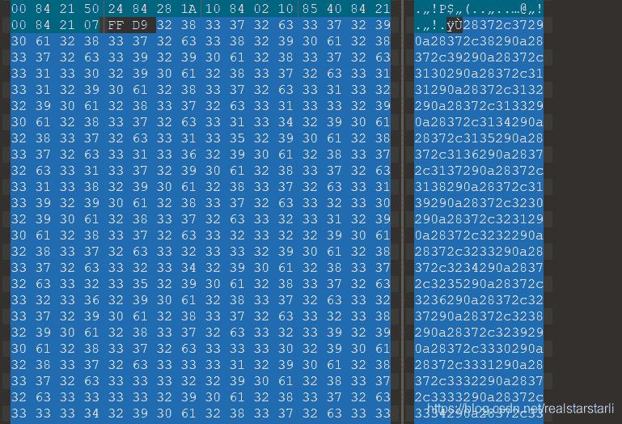
如果你查看到图片的详细信息，他会有一个“你会画图吗”的提示信息。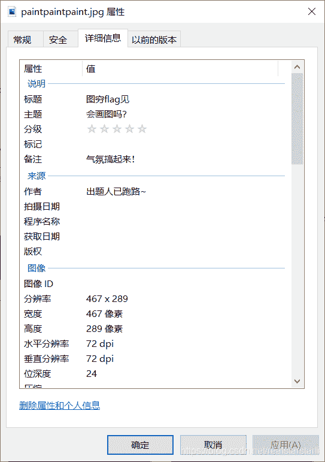
如果做过类似的题那自然会想到，根据提供的坐标画出一张可能有关解题的图片信息那自然是极好的，但是。。你有没有做过，就只能又学到东西了
将上面的一串代码，复制到文件中，全选，十六进制转ASCII
我现在才发现notepad++有一个自动hex转换ASCII码的小功能插件
在插件–>convert–>hex–>ASCII
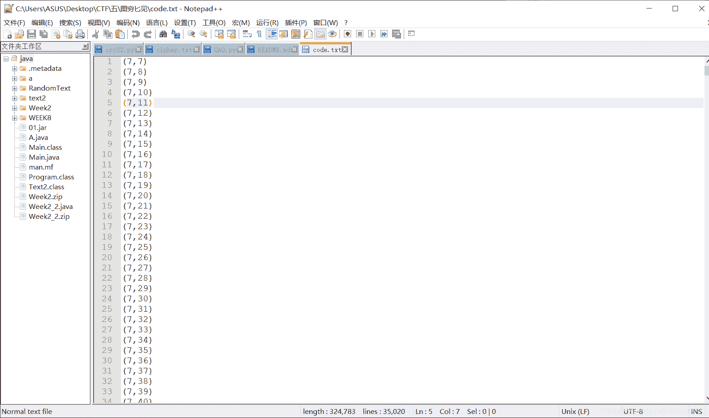
结果当真是坐标，这里要用到一个画图工具gnuplot，下载安装使用即可
linux :sudo ap-get install gnuplot
window:详细教程[https://blog.csdn.net/weixin_42014622/article/details/82962634](https://blog.csdn.net/weixin_42014622/article/details/82962634)
命令详解：[https://blog.csdn.net/langb2014/article/details/48735513](https://blog.csdn.net/langb2014/article/details/48735513)
简而言之，这就是根据你所输入的指令，会画出一个图片
这里如果采用文件的话（7,8）这样格式的是不适用的要改成 7 8才行
我写了一个py脚本把（7,8）格式修改成了7 8这样的格式。

```
f=open("code.txt","r")
f2=open("codec.txt","a")
text=f.read()
ls=list(text.split('\n'))
for i in range(len(ls)):
	ls[i]=ls[i].replace('('," ")
	ls[i]=ls[i].replace(','," ")
	ls[i]=ls[i].replace(')'," ")
	f2.write(ls[i]+"\n") 
```

但是notepad++里面有替换的操作ctrl+f查找替换字符即可
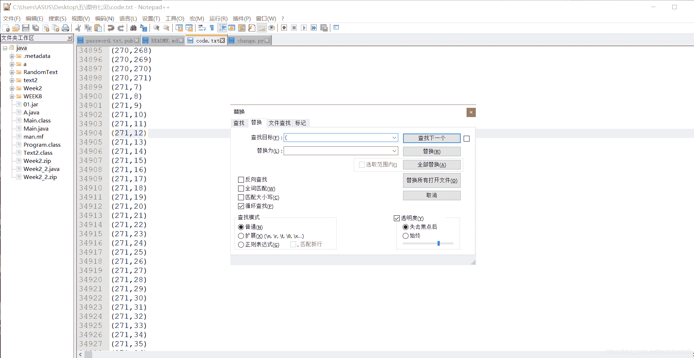
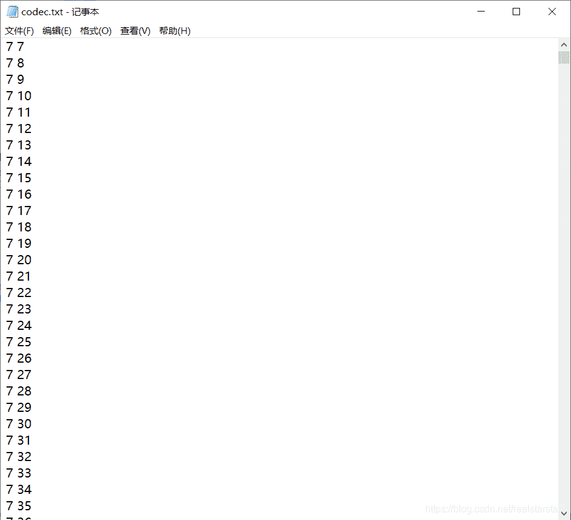
形成一个没有其他字符的文件进入 gnuplot
用plot “filename”命令，可以画出一张二维码
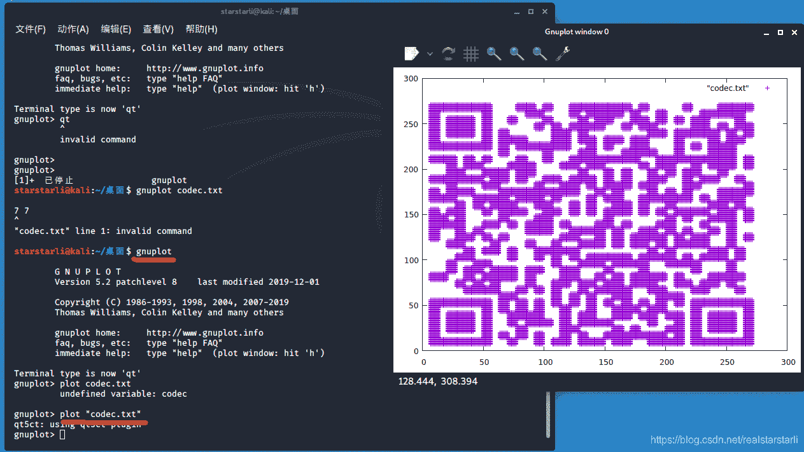
扫出二维码，就是flag
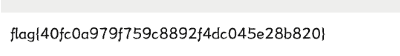
**（2）covert**
做题映入眼帘的便是一大串01的代码
将这串01代码放到文件里面code.txt
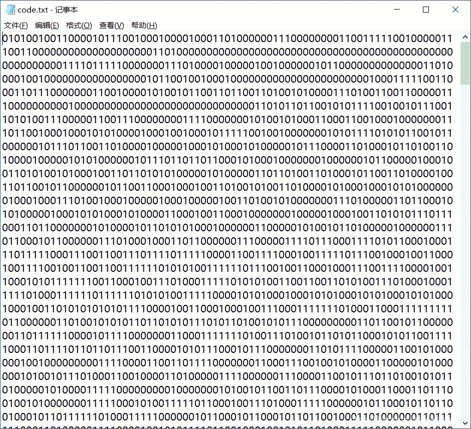
结合题目convert（转换）的信息，很明显这是一个进制转换的题目
我们写一个py脚本，将保存在code.txt的二进制代码，变化成十六进制的代码放到codec.txt文件中

```
f=open("code.txt","r")
f2=open("codec.txt","a")
text=f.read()
s=hex(int(text,2))
f2.write(s) 
```

这个脚本中输出到文件中的十六进制有0x开头，将他删掉
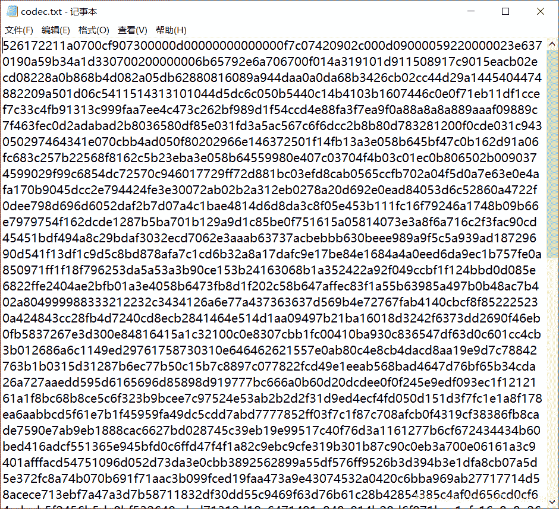
接下来你可能会把它变成ASCII代码看看用nodepad++的十六进制转换ASCII插件
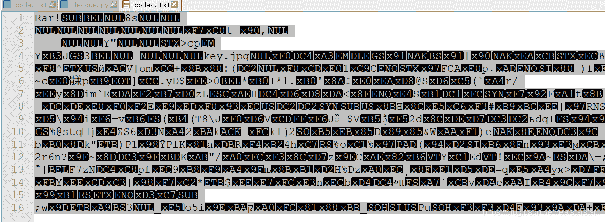
查看出来有一个Rar的头部信息，那么猜想这串代码内涵其实是一个rar文件
但是不要直接改后缀名哦~~~毕竟其原来的本质就是.txt文件
这串十六进制代码，表达的是一个十六进制文件打开010编辑器，选择导入一个十六进制文件，选择codec.txt这里会将你的文本信息自动生成一个十六进制文件。将其另存为.rar文件。
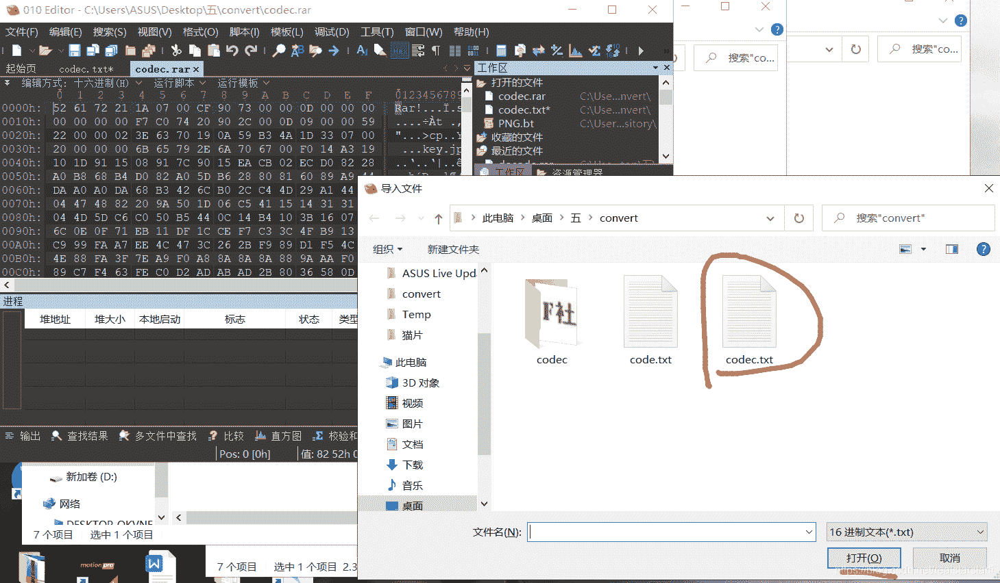解压缩之后会有一张图片，在详细信息里面有一串代码，
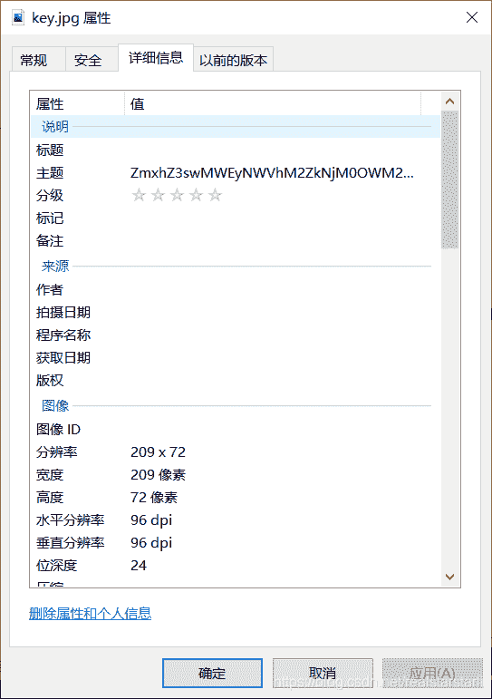
base64解码就是flag
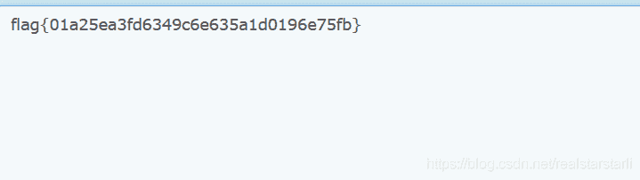
这里要提一下，一开始不知道导入，直接将十六进制的代码复制黏贴上去，结果这些个十六进制的代码就变成ASCII文本信息了
如果你先直接将其变成ASCII文本信息，复制黏贴其实还是不行，这个问题，我想可能是应为你在解码的时候有些十六进制对应的ASCII码可能在你用其他软件解码的是后，出现了信息的丢失。还是采用导入吧。。。。

ps：后来想想，其实在用notepad++将十六进制转换成ASCII码之后（保存），直接修改后缀名为.rar就可以了。当时做题真的是一下子脑筋没有转过来。
**（3）听首音乐**
拿到一个音频格式文件
用audacity软件查看
什么是audacity [https://baike.baidu.com/item/audacity/585645?fr=aladdin](https://baike.baidu.com/item/audacity/585645?fr=aladdin)
下载安装运行会看到里面有一串摩斯电码
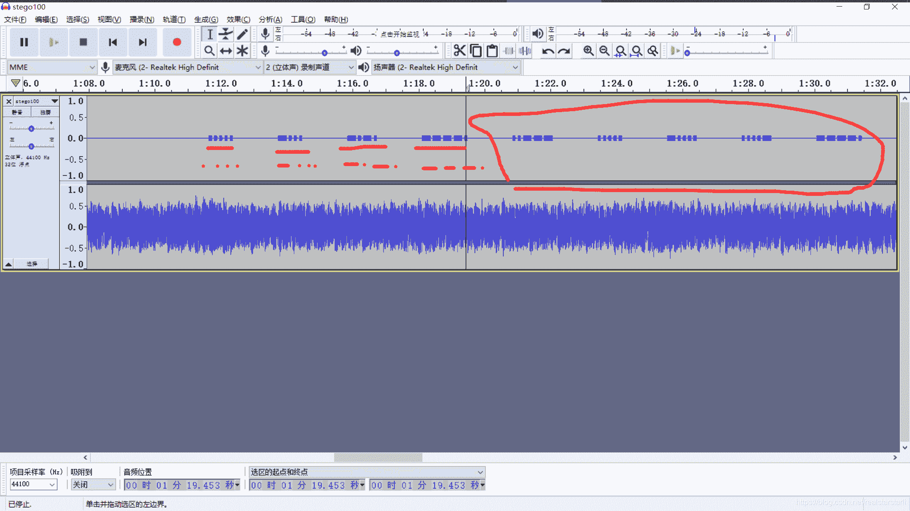
什么是摩斯电码[摩斯电码](https://baike.baidu.com/item/%E6%91%A9%E5%B0%94%E6%96%AF%E7%94%B5%E7%A0%81/1527853?fromtitle=%E6%91%A9%E6%96%AF%E7%94%B5%E7%A0%81&fromid=2667618&fr=aladdin)好像谍战片里面用的就是这个。
记录下来，这里手写,每组以空格分隔。写好就是下面这一串拿走不谢
… -… -.-. ----. …— … -… …- ----. -.-. -… ----- .---- —… —… …-. … …— . -… .---- --… -… --… ----- ----. …— ----. .---- ----. .---- -.-.
在线解码[http://www.zhongguosou.com/zonghe/moersicodeconverter.aspx](http://www.zhongguosou.com/zonghe/moersicodeconverter.aspx)
解码的结果
5BC925649CB0188F52E617D70929191C
切记：bugku直接提交不用注意格式而且 后面有三个空格 why？？？，气吐血.jpg。
**（4）好多数值**
又是一串数字将其保存下来
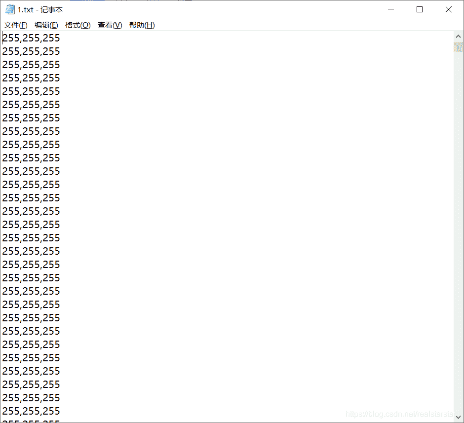
一堆的255,255,255
还有一些不是255,255,255
粗略一想对应的十六进制FF，FF，FF，如果你能想到这是RGB对应的颜色的十六进制的代码那你就成功一半了，但是我没想到
是的，这些就是RGB的像素点，这些像素点拼起来应该是个什么东西。
这里用到python的第三方库PIL中的putpixel方法，可以把对应的像素点在坐标中描绘出来
PIL是第三方库需要自己下载 pip install PIL
自己不会PIL库，搞了个脚本过来，写了点注释,拿去不谢

```
from PIL import Image

x = 503
y = 122

im = Image.new('RGB', (x, y))
with open('1.txt') as f:
    for i in range(x):
        for j in range(y):
            line = f.readline()
            s = line.split(',')
            im.putpixel((i, j), (int(s[0]), int(s[1]), int(s[2])))
im.save('1.jpg') 
```

结果描绘出来的图像就是flag

flag{youc@n’tseeme}
**（5）普通的数独**
拿到zip文件
010编辑器打开pk头部信息
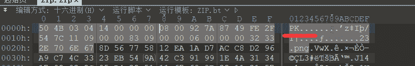
改为.zip文件
解压，25张数独图片，一定要按耐住做出25张数独的冲动，这不是正确的解法
将25图片分隔为5*5的矩阵，以有数字的记录为1，没有数字的记录为0
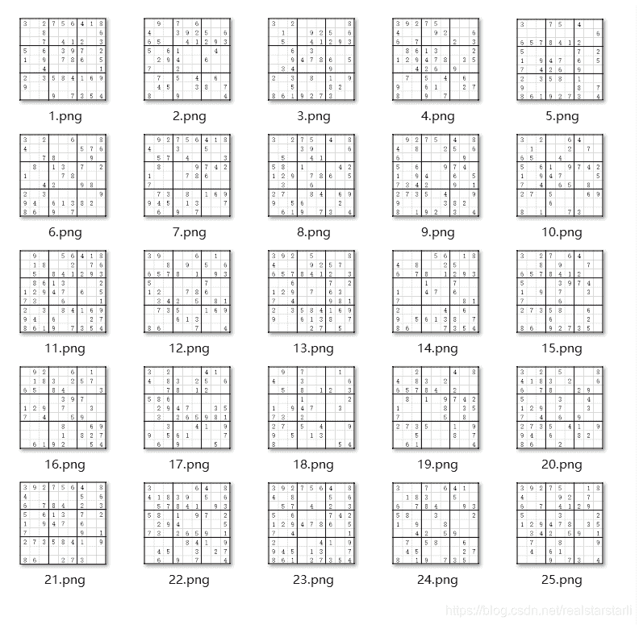
变成一个01的点阵，记录下来

```
111111101010101000101000001111110000101111111
100000101100111101010011101100011001001000001
101110101110011111010011111101000101001011101
101110101101100010001010000011110001101011101
101110100011100100001111101111111011101011101
100000101100100000011000100001110100001000001
111111101010101010101010101010101011101111111
000000000011001101001000110100110011100000000
110011100100100001111111100100101000000101111
101001001011111111101110101011110101101001100
100000111100100100000110001101001101010001010
001100010011010001010011000100000010110010000
010110101010001111110100011101001110101101111
100011000100011100111011101101100101101110001
001100110100000000010010000111100101101011010
101000001011010111110011011111101001110100011
110111110111011001101100010100001110000100000
110101000010101000011101101101110101101001100
010011111110001011111010001000011011101101100
011001011001010101100011110101001100001010010
010111111111101011111111101101101111111111100
011110001100000100001000101000100100100011110
111110101110011100111010110100110100101010010
110010001011101011101000111100000011100010000
101011111011100111101111111100001010111110010
110100011000111000100111101101111101000100010
111101111110001001000011010110001111110111110
011001010101000110010100010001000101101010001
011101110101101101100100001101101000111101001
110110001001101100010101101111110100101100110
000011100111000000000100001010101111100010010
111010010011110011101110010100001011111010010
101001100010111111110100000100001010101010100
000010011001001101110101001111100101111101101
000010111101110001101011000001000101110100110
011110011010100010100000011011000001110010000
100110100100001101111111101100101110111110011
000000001111110101101000101011100100100011010
111111100011111011011010101101110011101011110
100000101110101101101000111110010001100010001
101110101011100001111111101101001000111111011
101110100110111101101000001001101100011101101
101110100000011101100001101010110010010010001
100000101011001011111011001011000011010110000
111111101010101001111011110101101110000101101 
```

用上一题好多数值的方法 将这些变成像素点画出来
下面是py脚本，我改写的。拿走不谢

```
from PIL import Image

x=45
y=45
im=Image.new('RGB',(x,y))
with open('QR.txt') as f:
    for i in range(x):
        line=f.readline()
        for j in range(y):
            if line[j]=='1':
                im.putpixel((i,j),(00,00,00))
            else:
                im.putpixel((i,j),(255,255,255))

im.save("QR.jpg") 
```

运行py脚本，形成了一个二维码

扫码会出现一串字符串，base64解码，解码一次是出不来的

```
Vm0xd1NtUXlWa1pPVldoVFlUSlNjRlJVVGtOamJGWnlWMjFHVlUxV1ZqTldNakZIWVcxS1IxTnNhRmhoTVZweVdWUkdXbVZHWkhOWGJGcHBWa1paZWxaclpEUmhNVXBYVW14V2FHVnFRVGs9 
```

一直解码直到出现flag，我也忘记解了多少次了
flag{y0ud1any1s1}
说真的，谁知道这样做啊，如果没有写过的话。。。。
**（6）PEN_AND_APPLE**
拿到一个视频文件，说真的我要看吐了！！！！
这道题做不出来，百度了一下，这其实一个ntfs隐写流的文件
但是百度上那道题是rar文件，rar文件里面才是这个视频文件，而这里是直接给出了一个视频文件，导致我用ntfs隐写工具ntfsstreamseditor导出来的文件是一个不明文件，而百度上的那道题，导出来的是一个图片文件。这里我怀疑是不是bugku上这道题出现了bug，rar直接解压从而导致了文件信息的流失。。
那么我在这里就记录一下ntfs隐写流的概念，上次的猫片那道题没有那么仔细的介绍
有个博客比较好入门[https://blog.csdn.net/qq_41079177/article/details/102964134](https://blog.csdn.net/qq_41079177/article/details/102964134)
举个栗子：
如果你有01.txt文本文件写有“这是01.txt“
02.txt文本文件写有“这是02.txt”
当你在dos环境下，运行
type 01.txt > 02.txt:ntfs.txt的时候02.txt的文件内容没有任何变化
type 01.txt > 02.txt如果单单运行这条，是会出现02.txt文件里面只有“这是01.txt”的信息（type是查看文本文件的指令）
其实这里：就相当于拦截了文本数据流的信息，文本格式文件是ntfs格式（我是这样理解的，不知道对不对，仅做参考），所以所以在02.txt内部还有一个ntfs.txt的ntfs隐写流文件，内容一定是“这是01.txt”
我们在dos上用命令 dir /r 可以查看ntfs隐写文件信息
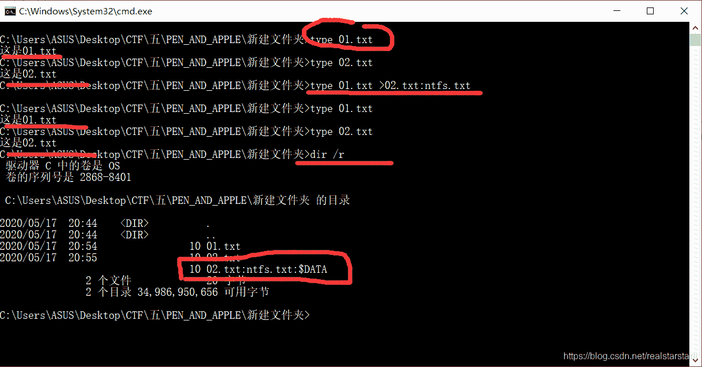
看到了ntfs.txt:$DATA,这就是ntfs隐写的标识啊！！
用工具ntfsstreamseditor查看，也是有的
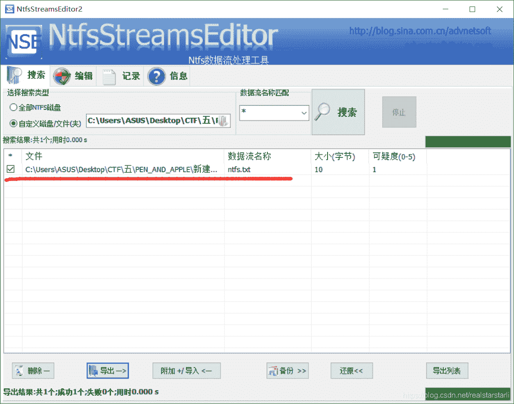
导出的文件也符合我们的预测
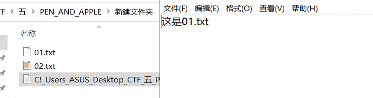
我们再看看本题给我们的文件
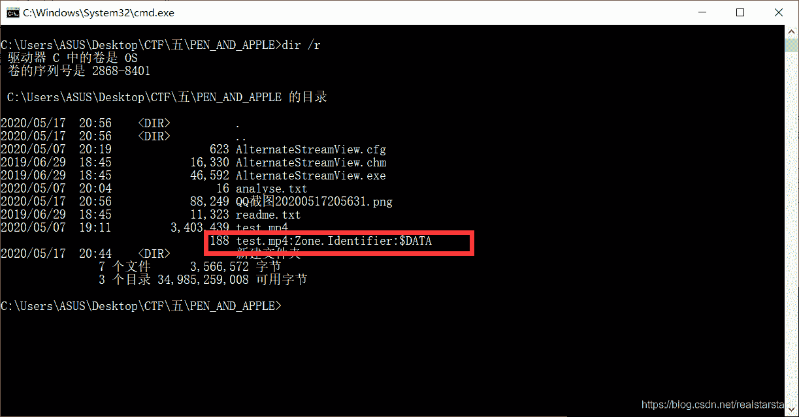
但是这里没有给我们文件信息啊，不不像ntfs.txt一样Zone.Identifier这好像只是一个微软的文件，我也没有深究这个文件，好像和标识一样的意思。
其实说了这么多也只是对ntfs隐写有了一个更加深刻的印象。这道题我不知道是题目的问题还是，我没想到解题策略。
**（7）color**
拿到压缩包，里面有七张彩图
杂项题写的越多，前期判断所花费的时间也就越多。。。
用stegsolve打开每个张，不断调整颜色通道，会发现以一张图片有make字样，后面的六张图片分别是m e t a l l，拼起来就是make me tall（让我变高）。
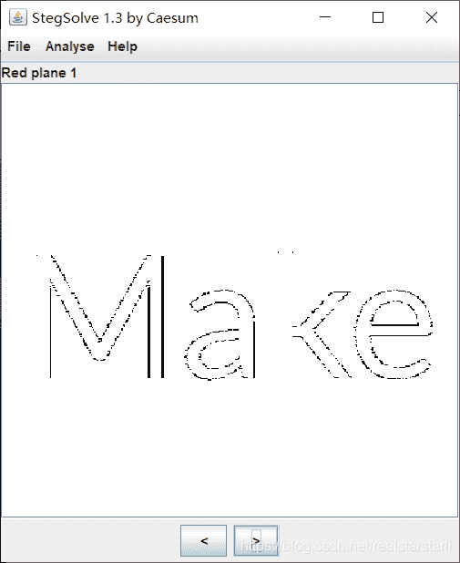
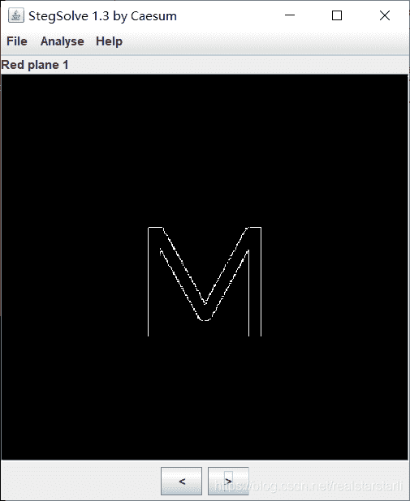
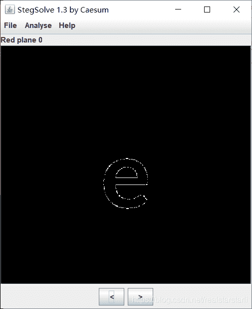
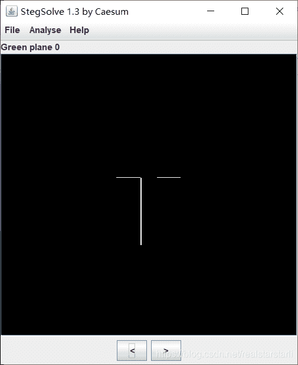
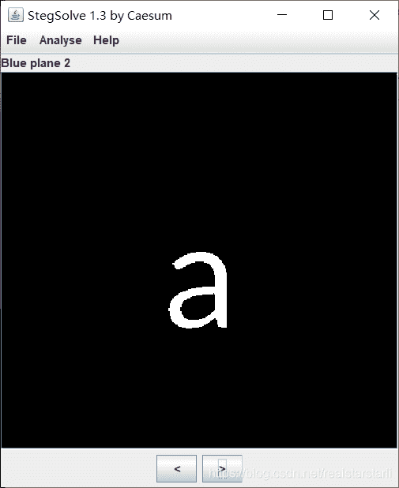
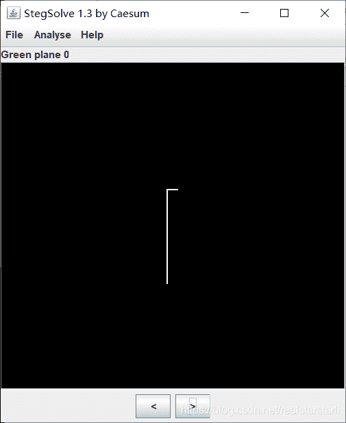
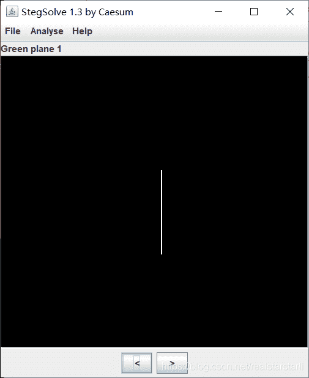
那就把每张图片的高度调高（宽高一样就行了）
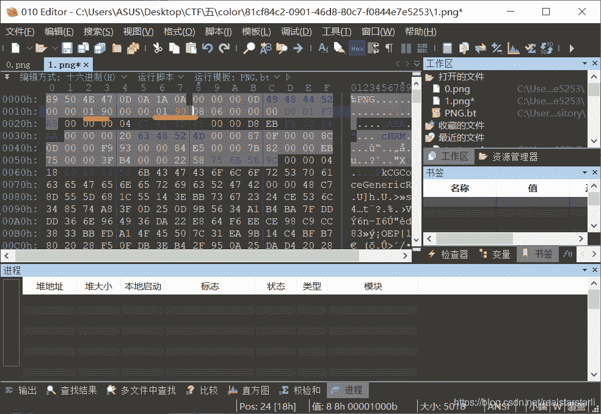
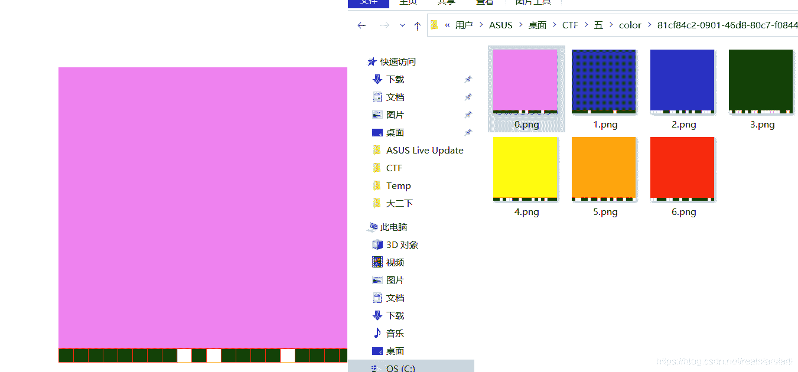
每张图片下面一栏都有一个很奇怪的东西，我们把黑的记录为1，白的记录为0，得到下面的编码，放入code.txt文件中

```
11111111010111101111
11111011111110111111
00001100101010110001
01001010010000001101
11010011011101010111
10011011011010110110
00111001101101111101 
```

做了那么多题，首先猜想和ASCII码有关
从上往下看1100110（f），有内味了
写一个py脚本，编码出来即可

```
f=open("code.txt","r")
text=f.read()
ls=text.split("\n")
for i in range(len(ls[0])):
	s=""
	s=ls[0][i]+ls[1][i]+ls[2][i]+ls[3][i]+ls[4][i]+ls[5][i]+ls[6][i]
	print(chr(int(s,2)),end="") 
```

运行得到flag
flag{Png1n7erEs7iof}
**（8）怀疑人生**
拿到zip文件，010编辑器查看，头部信息pk，改后缀名.zip,解压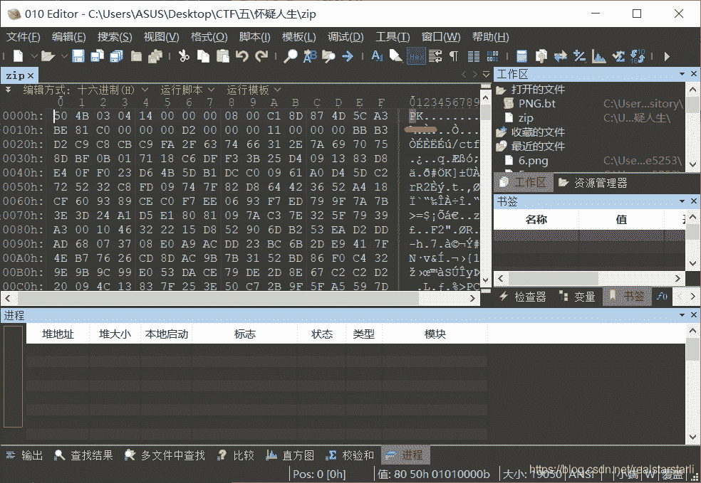
解压出一个zip文件，jpg文件和一个变形了的二维码
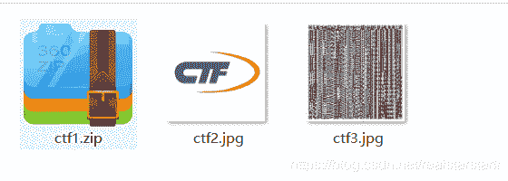
（1）zip文件发现打开需要密码，查看内部文件是一个文本文件，不是明文攻击，用字典爆破看看
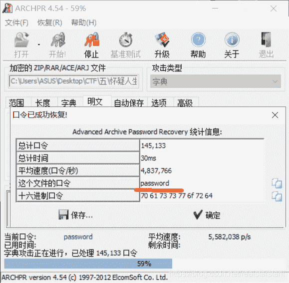
用Advanced Archive Password Recovery内置的字典，爆出来是一个password密码，打开ctf1.txt文件

```
XHU2Nlx1NmNcdTYxXHU2N1x1N2JcdTY4XHU2MVx1NjNcdTZiXHU2NVx1NzI= 
```

发现这是一个base64密码（=号出现）解码后是一个Unicode编码文件。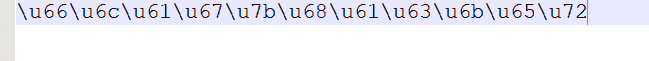
写一个py脚本。

```
s=b"\u0066\u006c\u0061\u0067\u007b\u0068\u0061\u0063\u006b\u0065\u0072"
print(s.decode("unicode_escape")) 
```

注意python内部Unicode编码格式字符是’\uxxxx’格式的，但是这里显示的是’\uxx’格式的，拿在写编译脚本的时候在中间加上00变成’\u00xx’格式的就可以了，出现flag{hacker 很明显这是flag的一部分
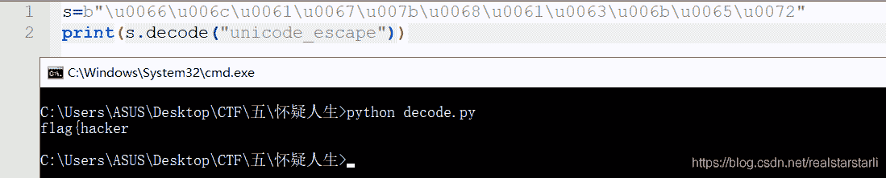
（2）在看第二个jpg文件，binwalk发现有一个zip文件，zip文件要输入密码
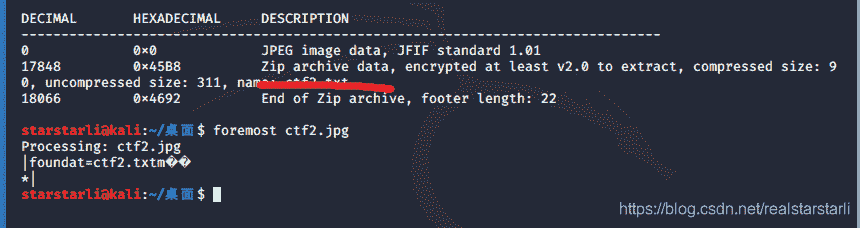
本想要爆破一下，但是Advanced Archive Password Recovery给出的信息该文件未被加密，或损坏。
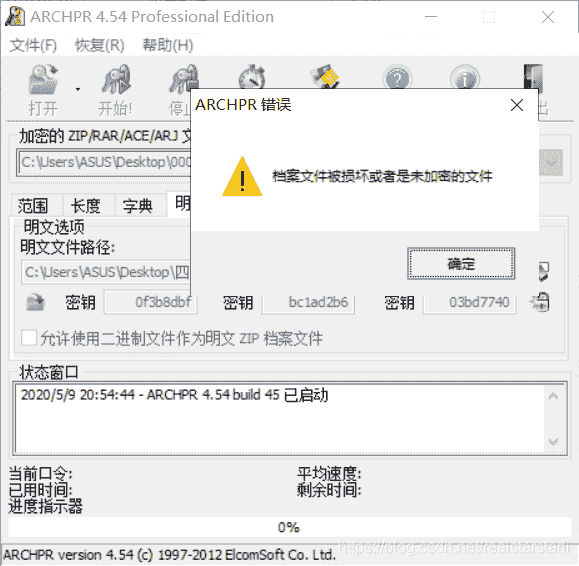
那就可能是伪加密，好吧果然是伪加密，67字节的地方不是00，改成00就可以了，解压
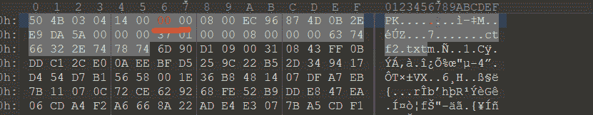
出现一个ctf2.txt文件里面又是什么鬼玩意~~
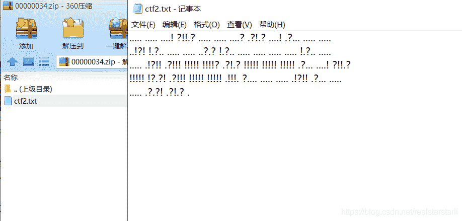

```
..... ..... ....! ?!!.? ..... ..... ....? .?!.? ....! .?... ..... .....
..!?! !.?.. ..... ..... ..?.? !.?.. ..... ..... ..... ..... !.?.. .....
..... .!?!! .?!!! !!!!! !!!!? .?!.? !!!!! !!!!! !!!!! .?... ....! ?!!.?
!!!!! !?.?! .?!!! !!!!! !!!!! .!!!. ?.... ..... ..... .!?!! .?... .....
..... .?.?! .?!.? . 
```

ook密码，吐槽一波，真是什么鬼密码都有
ctf密码介绍：[https://blog.csdn.net/qq_40836553/article/details/79383488](https://blog.csdn.net/qq_40836553/article/details/79383488)
ook密码编译网站：[https://www.splitbrain.org/services/ook](https://www.splitbrain.org/services/ook)
ook编译出来是3oD54e。
开始以为就是flag的一部分呢，结果是什么base58密码，mygod！！！
base58密码编译网站：[https://www.jisuan.mobi/pbHzbBHbzHB6uSJx.html](https://www.jisuan.mobi/pbHzbBHbzHB6uSJx.html)
解出来是misc
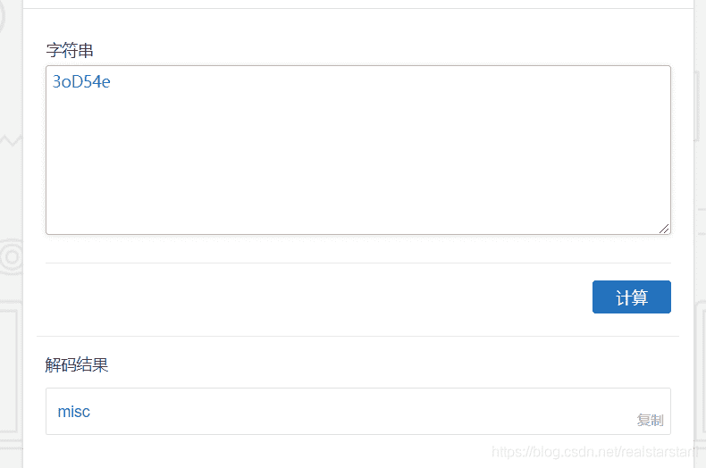
（3）看第三张图片，虽然不成样子，我们用QR research工具先来看看。
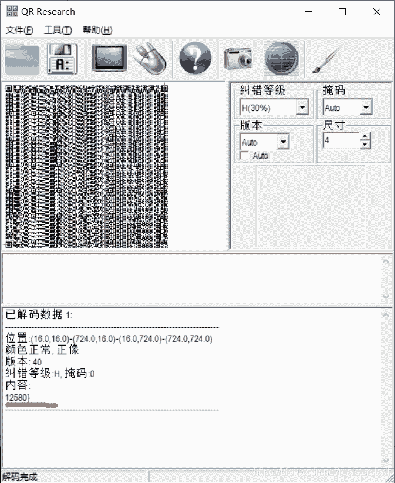
好吧，终于舒服一次flag的尾部部分12580}
综合一下
flag{hackermisc12580}
**（9）红绿灯**
拿到一张gif图用stegsolve查看，这是一张有1168图组合而成的gif
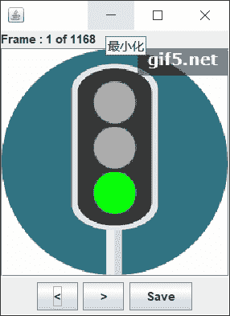
仔细观察一下，有一些灯是灰的，再者每八张出现一次黄灯，猜想八位二进制
用stegsolve analyse —>frame browser一一记录查看（没那个耐心，1千多张啊 不知道这串编码是如何得到的，应该是有什么简便方法的来着。）
如果以绿为0，红为1，第一组是01100110对应的ASCII码是f
编码送上

```
01100110
01101100
01100001
01100111
01111011
01010000
01101100
00110011
00110100
01110011
00110011
01011111
01110000
00110100
01111001
01011111
00110100
01110100
01110100
00110011
01101110
01110100
00110001
00110000
01101110
01011111
01110100
00110000
01011111
01110100
01110010
00110100
01100110
01100110
00110001
01100011
01011111
01110011
00110100
01100110
00110011
01110100
01111001
01011111
01110111
01101000
00110011
01101110
01011111
01111001
00110000
01110101
01011111
00110100
01110010
00110011
01011111
00110000
01110101
01110100
01110011
00110001
01100100
00110011
01111101 
```

写一个py脚本编译出来就行

```
f=open("code.txt","r")
text=f.read()
ls=list(text.split("\n"))
for i in range(len(ls)):
    print(chr(int(ls[i],2)),end="") 
```

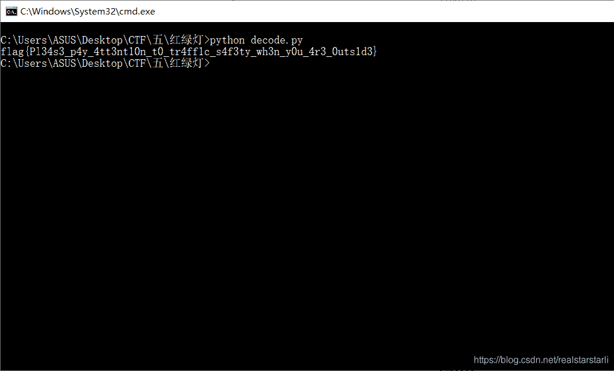
拿到flag
这是多大的脑洞啊~~~~
**结束**
这次的内容有点子多啊
其实本来想这周就写完bugku的杂项的（因为我每次都是记录上一周做过的题）但是我发现，后面几个题目有点子难啊。而且网上没有详细的题解，做起来有点子吃力，比如 一个普通的压缩包 这道题我就做了2天而且做得有点子懵~~，所以还是希望下一周能够结束bugku的杂项，然后写WEB的题。