<!--yml
category: 未分类
date: 2022-04-26 14:39:53
-->

# CTF-入门六__starstarli的博客-CSDN博客

> 来源：[https://blog.csdn.net/realstarstarli/article/details/106318780](https://blog.csdn.net/realstarstarli/article/details/106318780)

## CTF-入门六

这篇博客是bugku最后剩下的杂项题，有几道题目我没有解出来的确因为一些原因没有什么时间去啃这些题目，因为下个星期就要开始学习WEB相关的内容了，现在这里做一个记录，但是我还是会尽量去花时间去解题，解出来还是会补充到上面来的。那就继续吧。
**（1）不简单的压缩包**
拿到zip文件，010编辑器打开pk头部信息，改成.zip后缀文件
要密码，Advanced Archive Password Recovery暴力破解，不行啊。
继续看010编辑器内的文件信息有没有提示信息，好像没有，不过好像还有pk的头部信息
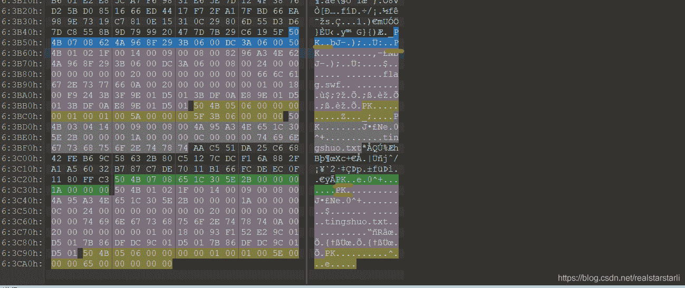
binwalk一下，果然有
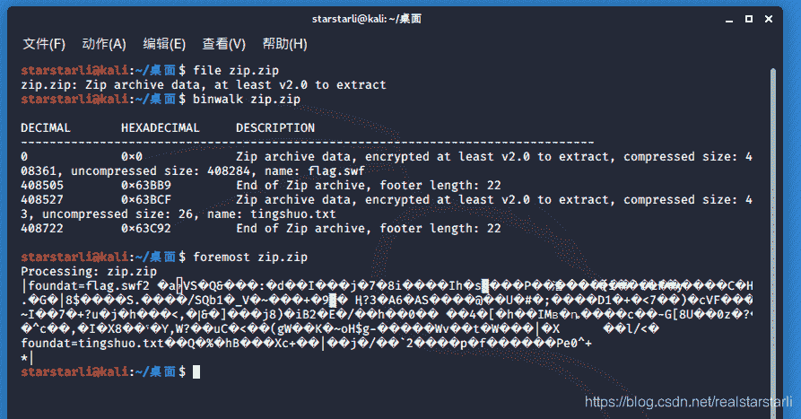
formost output文件里有两个zip文件
一个是源文件，另一个zip又要密码Advanced Archive Password Recovery暴力破解— 0 ？解出来
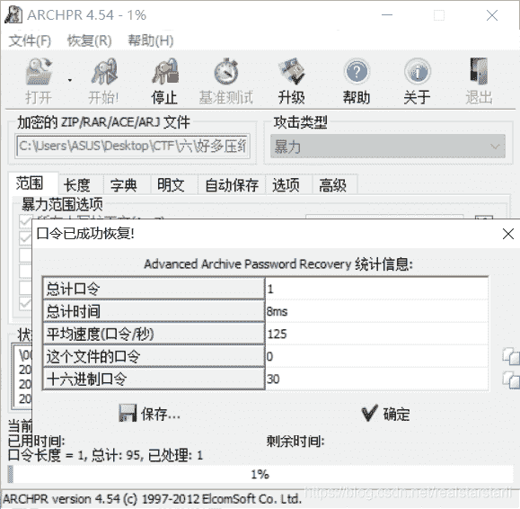
解压缩，.txt文件里面有一段日文。
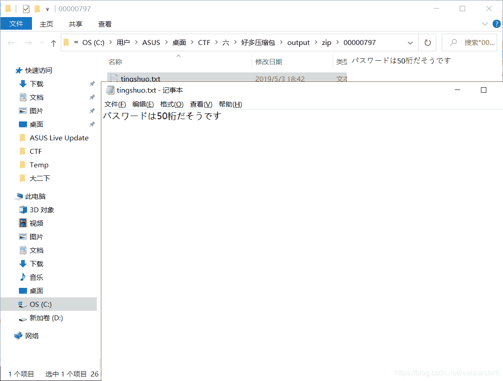百度翻译：密码50位
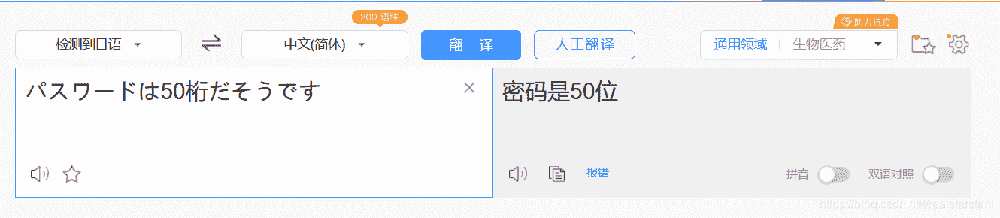
我怎么知道50位什么嘛，爆破肯定是不行的了
用python写一个字典包含a-z和A-Z的各50个的密码文件字典，

```
f=open("code.txt","a")

cnt=65
for i in range(26):
	for j in range(50):
		f.write(chr(cnt))
	f.write('\n')
	cnt+=1
cnt=97
for i in range(26):
	for j in range(50):
		f.write(chr(cnt))
	f.write('\n')
	cnt+=1 
```

用Advanced Archive Password Recovery字典解密，解出来是a的50位。
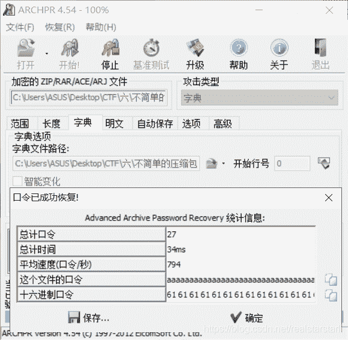
解压缩.swf文件FLASH文件，打开有个游戏，略略略，玩不来

下一个ffcd（这是FLASH文件的反编译软件）
查看scrip中的内容，js的代码，有一段16进制的片段，py脚本运行一下，便可以出flag了
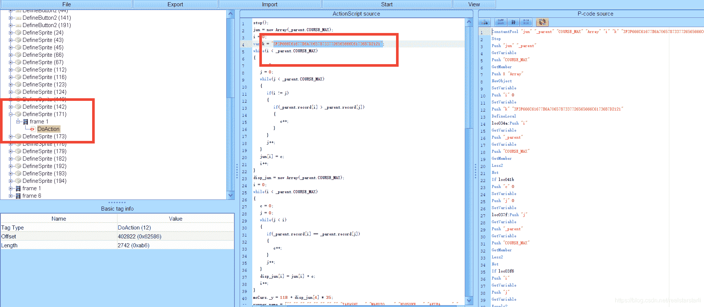

```
code="3F3F666C61677B6A7065787337726565666C6173687D2121"
for i in range(0,len(code),2):
	print(chr(int(code[i:i+2],16)),end="") 
```

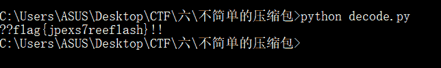
flag{jpexs7reeflash}
**（2）一枝独秀**
一枝独秀，这道题真的好秀啊
拿到zip文件，010编辑器查看是pk。
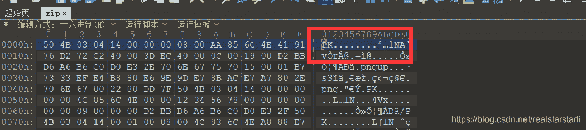改格式.zip文件解压，是一个一枝独秀.png格式文件，010再次查看，呦呵又是pk的头部信息。
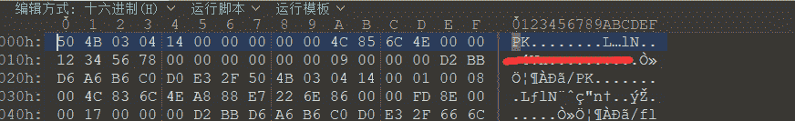
改写后缀名为.zip，解压，咦？空的
注意这里一定要用winrar软件打开压缩文件，不然就会出现文件的流失。winrar打开发现需要密码，这个一下子也没有提示的，先爆破一下，直接好像不行啊，然后又晕了
后来才知道这里的的确确是爆破，把爆破的格式修改一下，纯文字，有八位，（这一下子也想不到啊，结果是这么刚的用法，哎），其实也很快一下就解出来了，12345678（这个密码好贴心，字典可能也可以破译出来。。。）
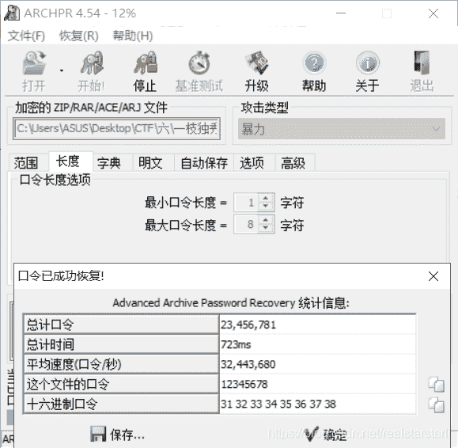
结果发现有百十来张图片，这一下子可如何是啊，全部用万能开头查一下，你都要累死，粗略的观察一下好像第81一张的图片好像和其他的图片的大小不一样。
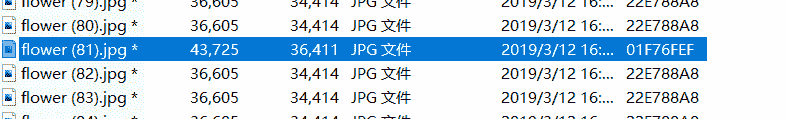
那就先用这张图片万能开头一下，好像没有什么发现不过在stegsolve中在用RGB分层观察的时候出现了这样的图片，好像是二维码（你想多了）
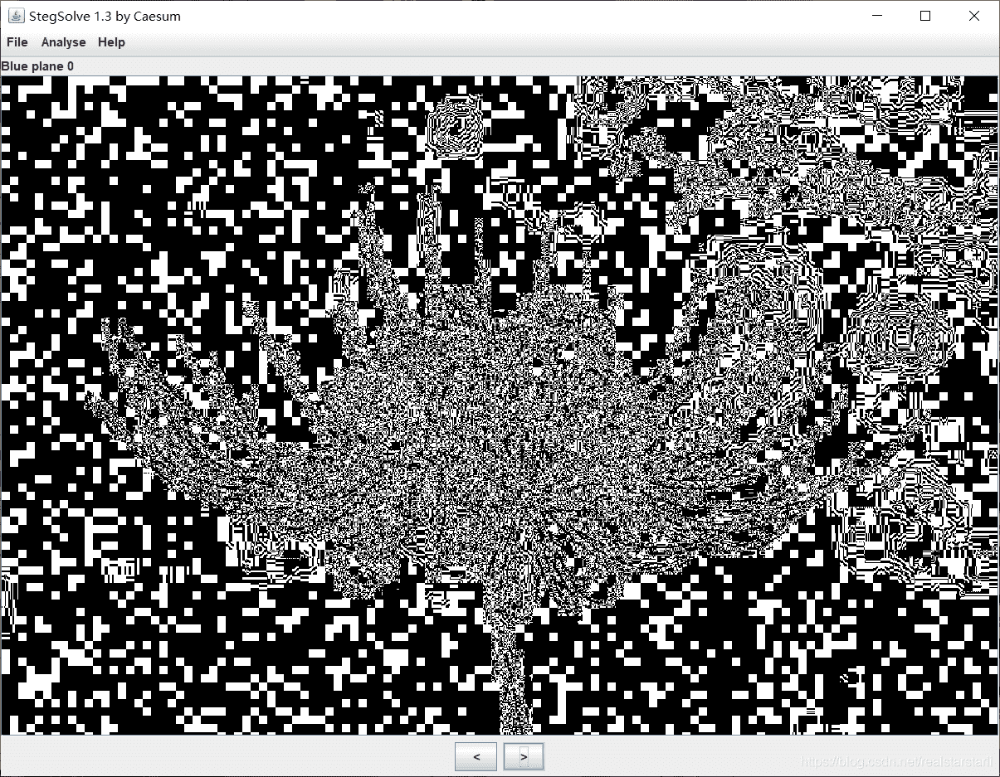
这其实是一种隐写，天哪CTF你到底有多少种隐写术啊
jphs隐写：[https://blog.csdn.net/d_0xff/article/details/51433007](https://blog.csdn.net/d_0xff/article/details/51433007)
下载jphs：[https://www.scanwith.com/JPHS_for_Windows_download.htm](https://www.scanwith.com/JPHS_for_Windows_download.htm)
用jphs打开81，点击seek（搜索隐写信息）输入密码。。。。
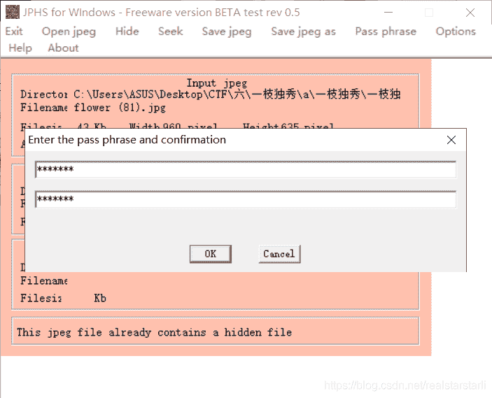
什么密码（12345678？）不是
吐槽，强烈吐槽，谁能想到密码是flowers，就因为这些图片是flowers命名的？？好吧，出题人说什么就是什么。。。
输入两次密码，保存文件，最好不要用后缀名，等会儿我们用010编辑器打开查看头部信息就可以
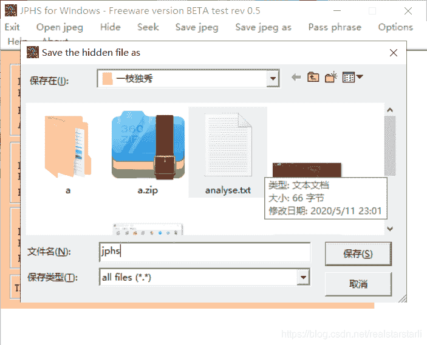
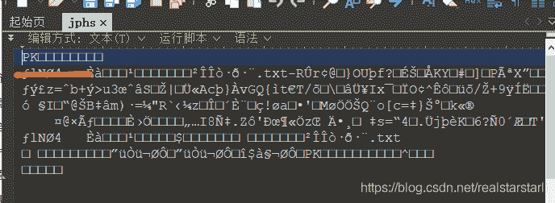
pk！！！改后缀名.zip里面是一个文本文件，什么佛曰。。。
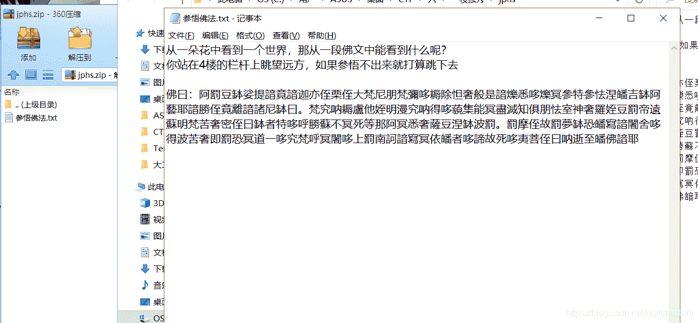
这是与佛论禅的加密
啊~CTF你到底有多少种加密方式啊
进入网站解密，与佛论禅解密：[http://www.keyfc.net/bbs/tools/tudoucode.aspx](http://www.keyfc.net/bbs/tools/tudoucode.aspx)
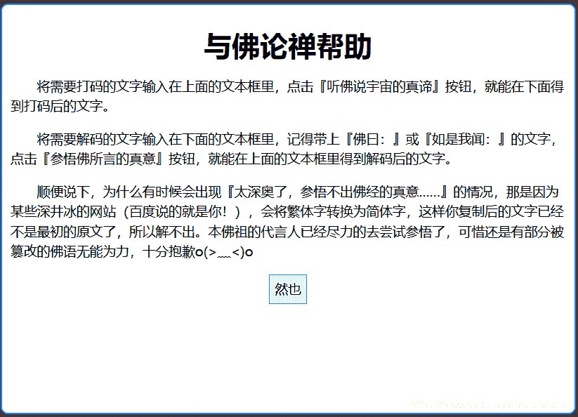
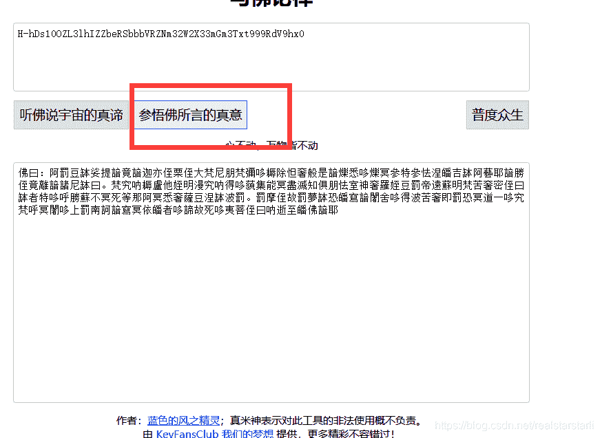

出现一串字符，下意识base64，结果乱码，看来不是。这个时候用到题目所给信息，栅栏密码（终于给了一个明确的啊，但是上面的解密又不说。。。）四组，解出来还是一堆字符
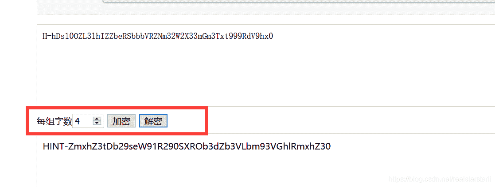
base64，啊~~舒服了flag终于出现了。
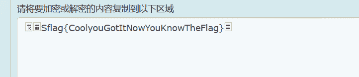
flag{CoolyouGotItNowYouKnowTheFlag}
好秀的一道题
**（3）小猪佩奇**
这道题是LSB密码隐写，写的时候没有什么思路，暂时搁置了。解出来会补上。
**（4）好多压缩包**
拿到压缩文件，解压出现68个压缩文件，都有密码，这咋办呢，爆破不行啊，太多了还不一定能呢，我们观察到里面的一个data.txt文本文件只有四个字节的数据。
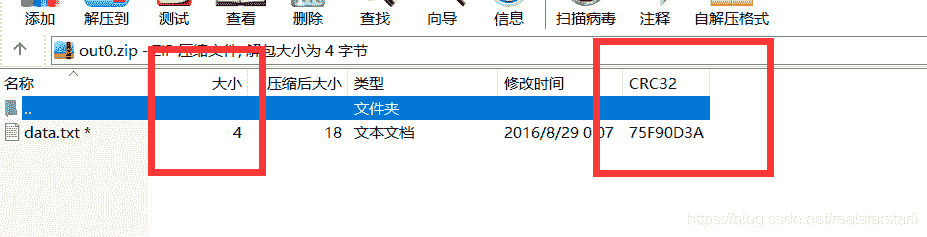
尝试一下crc32爆破，引用内容CRC32:CRC本身是“冗余校验码”的意思，CRC32则表示会产生一个32bit（8位十六进制数）的校验值。
在产生CRC32时，源数据块的每一位都参与了运算，因此即使数据块中只有一位发生改变也会得到不同的CRC32值，利用这个原理我们可以直接爆破出加密文件的内容
一句话：借用crc的值，暴力出文本内容
用个py脚本：自己写了一个，结果出不来，和wp写的差不多啊奇怪，网上借用了一个

```
 import zipfile
import string
import binascii

def CrackCrc(crc):
    for i in dic:
        for j in dic:
            for p in dic:
                for q in dic:
                    s = i + j + p + q
                    if crc == (binascii.crc32(s.encode()) & 0xffffffff):

                        f.write(s)
                        return

def CrackZip():
    for I in range(68):
        file = './123/out' + str(I) + '.zip'
        f = zipfile.ZipFile(file, 'r')
        GetCrc = f.getinfo('data.txt')
        crc = GetCrc.CRC

        CrackCrc(crc)

dic = string.ascii_letters + string.digits + '+/='

f = open('out.txt', 'w')
CrackZip()
f.close() 
```

但是这个原来脚本是用python2写的，所以这条代码（binascii.crc32(s)）（已改）要改成（binascii.crc32(s.encode（）)）,原因下面介绍
[https://blog.csdn.net/kajweb/article/details/76474411](https://blog.csdn.net/kajweb/article/details/76474411)
出来一个base64密码，用notepad++解码。
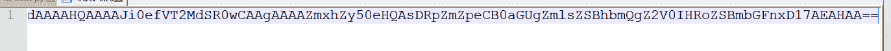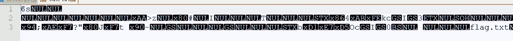
010编辑器查看信息，flag.txt fix the file and get the flag 要修复这个文件，可能头部信息出现了问题。
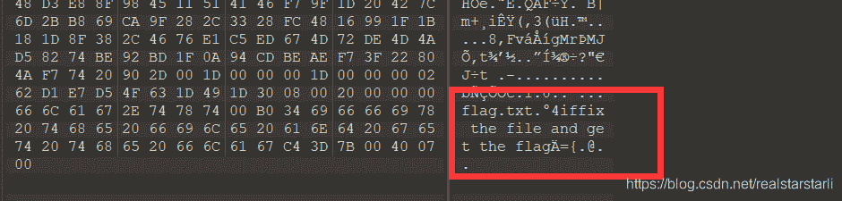
文件无非就那几个.jpg .png .rar .zip,但是
C43D7B00400700是rar文件尾（有的wp上说这就是rar文件的问件尾，这我不太清楚），把文件的后缀名改成rar,(这里注意一下，不要复直接制文本内容建一个新的十六进制文件，在转换十六进制的时候会出问题，因为这个搞了一个小时没出来。。。。)
然后在010编辑器中加入.rar的头部信息（526172211A0700），
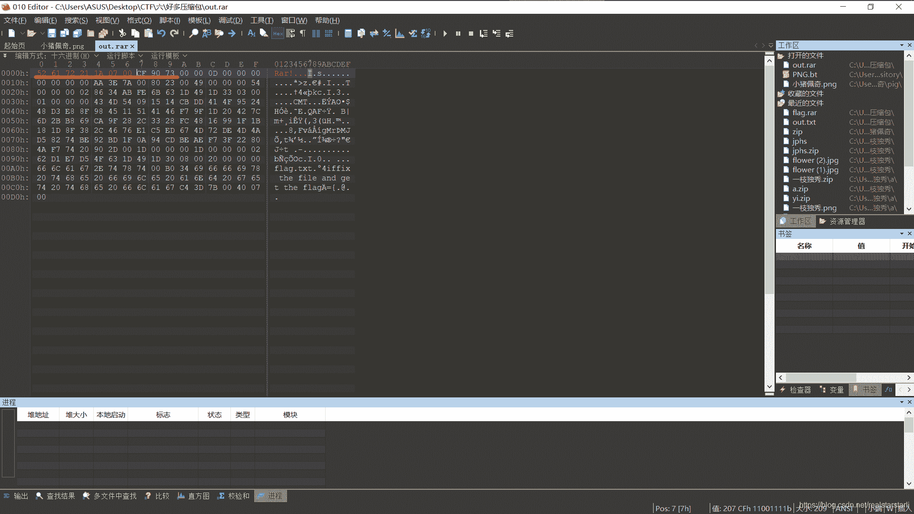
之后解压信息出现了，就是flag
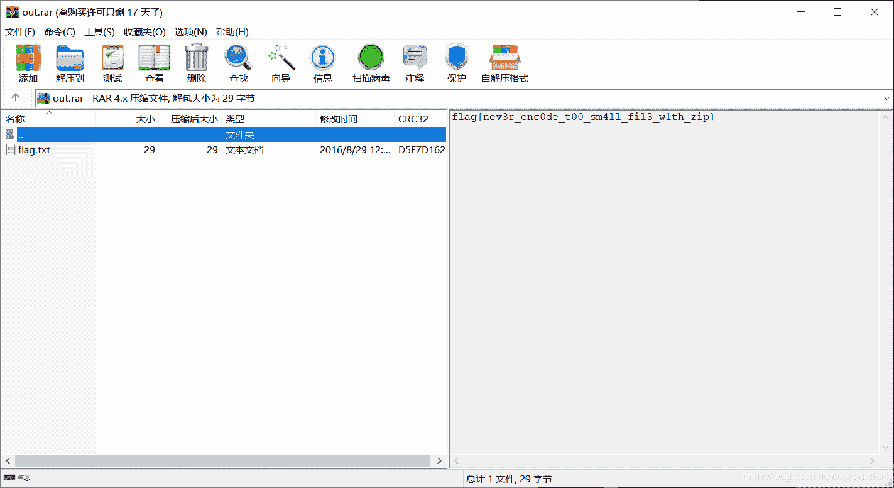
**（5）一个普通的压缩包**
一个普通的压缩包，你不是说笑吧，这个压缩包可不普通
拿到一个压缩包，解压，里面有个文件夹，文件夹里面是个flag压缩包
直接解压只有一个文本文件，flag.txt里面还是什么也没有“flag is not here”这是在搞我的心态吗？
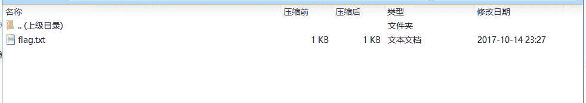
其实你在用winrar软件打开的时候，会出现一个头文件信息出错，将这个位置信息改成65 A8 3c 7A
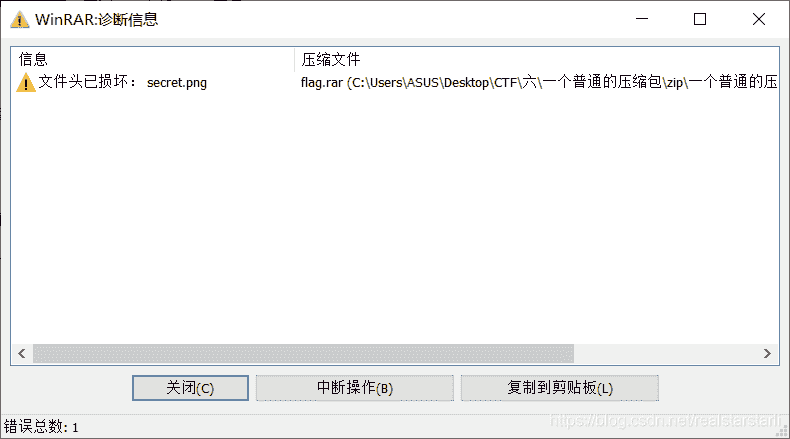
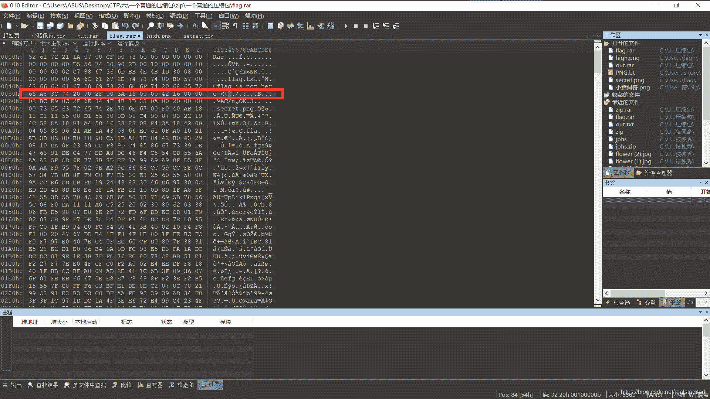
中的7A改成74，为什么我也想知道为什么，这里有rar文件格式的解析
rar格式文件解析：[https://blog.csdn.net/vevenlcf/article/details/51538837](https://blog.csdn.net/vevenlcf/article/details/51538837)
请原谅我看不懂，不知道为什么要这样改
修改后的，再解压出来多了一张png图片，这个图片是白色的一览无遗
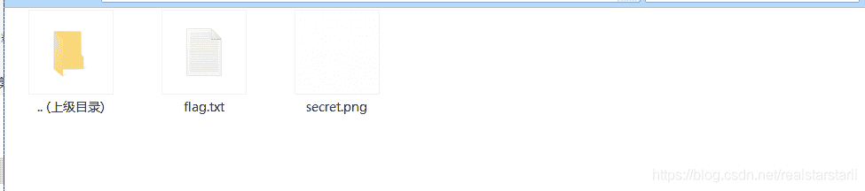
用010编辑器打开，发现头部信息是GIF格式文件
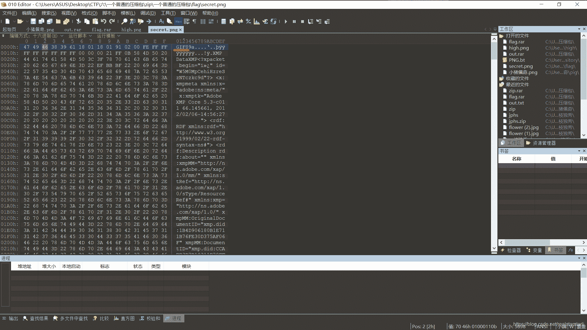
修改后缀名，不行还是都是白色。用stegsolve分析一下，不断切换通道，发现出现了一个二维码的下一半部分，这就有点意思了。
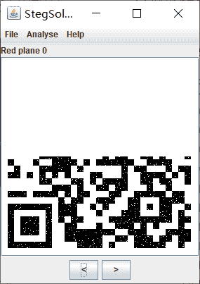
猜想gif的应该还存有另一半的二维码，analyse->frame browser嘿嘿果然有两张。
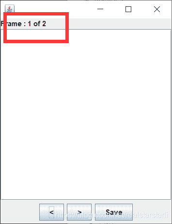
不过保存下来，发现根本打不开，不知道什么原因，想不通。看来只能想另外的方法分离出gif，用ps（本人是一个ps的小可爱，啦啦啦）先安装Photoshop
ps安装破解教程：[https://blog.csdn.net/qq_43682817/article/details/86646165](https://blog.csdn.net/qq_43682817/article/details/86646165)
[ps分离gif](https://blog.csdn.net/qq_39959348/article/details/84729895?utm_medium=distribute.pc_relevant.none-task-blog-BlogCommendFromMachineLearnPai2-1.nonecase&depth_1-utm_source=distribute.pc_relevant.none-task-blog-BlogCommendFromMachineLearnPai2-1.nonecase)
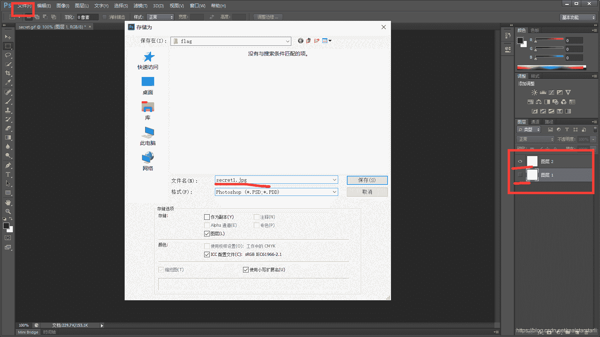
按照这个出现的png图片有好多张，不过每张的图片除了名字之外是一样的CRC是一样的，这个就是二维码的另外半张。
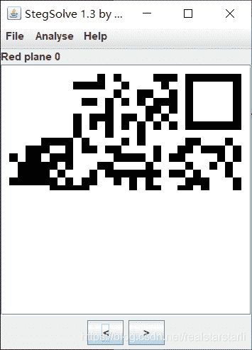
再用ps将两张图片拼在一起
教程：[https://jingyan.baidu.com/article/63acb44a01489361fcc17ee9.html](https://jingyan.baidu.com/article/63acb44a01489361fcc17ee9.html)
其实是，比较简单的操作，然后发现左上角出现了一个空缺，直接将右下角的部分裁剪上去，为什么？不知道。

然后用QR软件分析出来有flag（直接扫是出不来的）
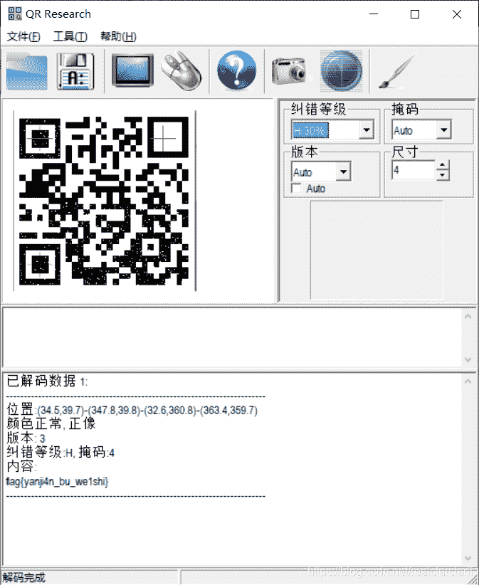
flag{yanji4n_bu_we1shi}
这道题做的好懵啊，做完了发现是个考验rar文件格式，但是没有看懂。。。。
然后就是一大堆杂七杂八的操作，略略略，总的来说做的很艰难，也没学到什么东西。
**（6）2B**
不知道咋搞，没有什么思路，有时间解出来在写wp
**（7）QAQ**
拿到一个txt文本文件和QAQ文件
file命令查询知道QAQ是python 编译后的文件，把QAQ改成.py后缀文件
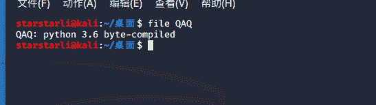
到[https://tool.lu/pyc/](https://tool.lu/pyc/) 反编译网站结果发现部分没有编译出来
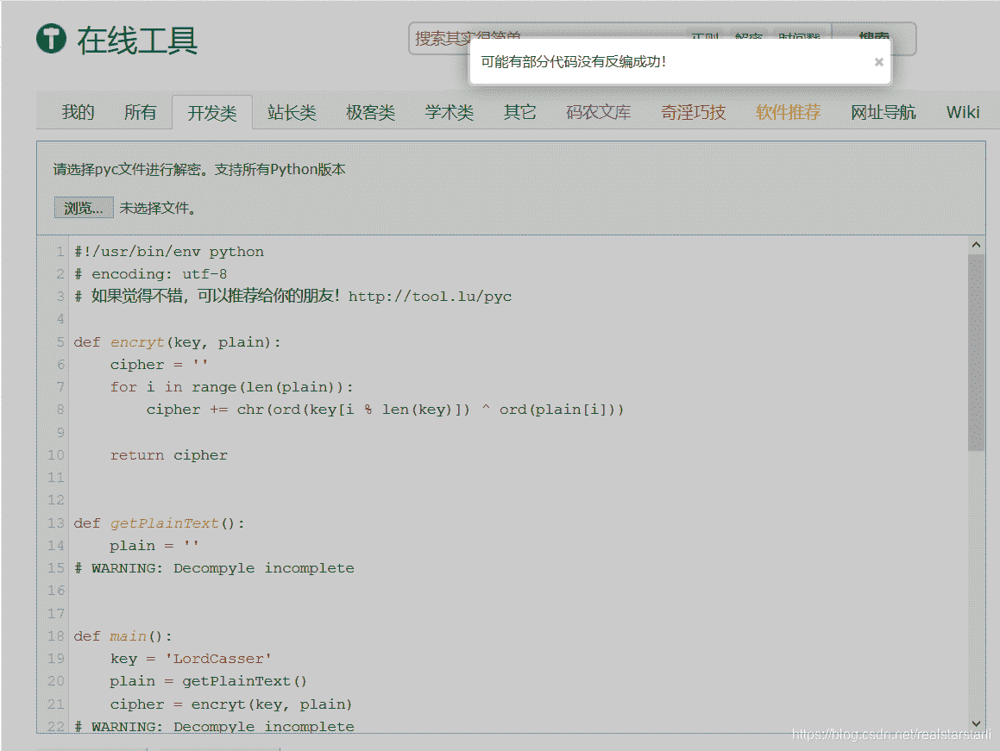
函数内部也有提示文件，其实你可以猜想到这个就是把题目中的文本文件，解密出来的一个py脚本
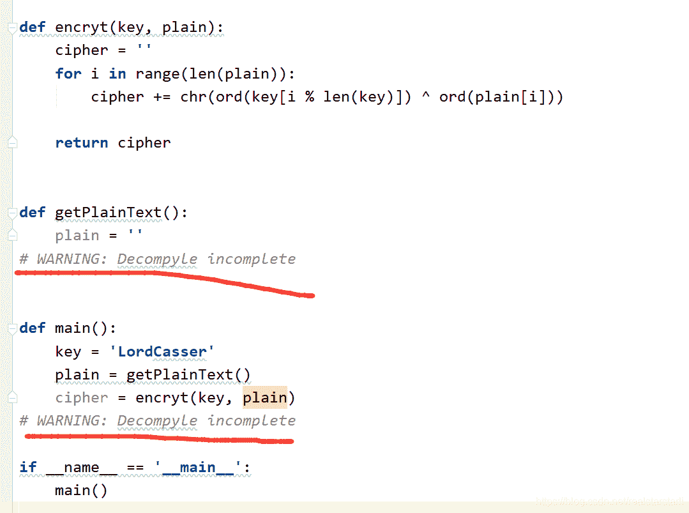
当然这种猜测是有风险的，我们还是看看如何完全反编译出正确的py脚本吧
这里用到一个Python的第三方库uncompyle
先安装这个库 pip install uncompyle
安装好之后执行这个命令 uncompyle6 QAQ.pyc > QAQ.py
将QAQ.pyc反编译的内容放到QAQ.py中

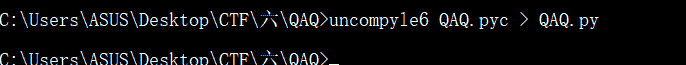
我们打开QAQ.py的文件发现这个就是完整版了
如果你耐心的看完代码的内容你会发现，代码上有一点逻辑上的问题
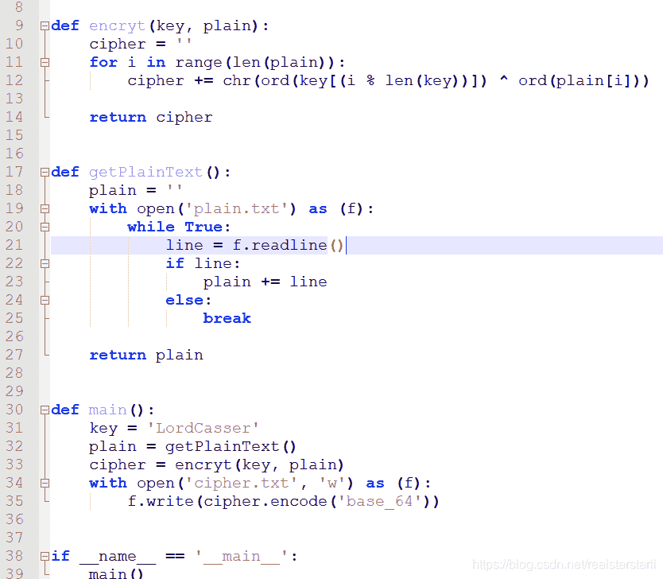
原本的plain.txt根本没有这个文件，如何读取内容让后将解码后的内容放入原本就有内容的cipher.txt文件中去，会觉得这个代码的逻辑是会有问题的
那么正确的逻辑就是，将cipher.txt文件中的内容读取并解码，将解码的内容写到plain.txt中去
我们修改一下代码。是这样的

```
def encryt(key, plain):
    cipher = ''
    for i in range(len(plain)):
        cipher += chr(ord(key[(i % len(key))]) ^ ord(plain[i]))

    return cipher

def getPlainText():
    plain = ''
    with open('cipher.txt',"r") as (f):
        while True:
            line = f.readline()
            if line:
                plain += line
            else:
                break

    return plain.decode("base_64")

def main():
    key = 'LordCasser'
    plain = getPlainText()
    cipher = encryt(key, plain)
    with open('plain.txt', 'w') as (f):
        f.write(cipher)

if __name__ == '__main__':
    main()

''' 
```

我们运行一下这个脚本，咦~出错了。str没有decode这个方法（怎么可能）
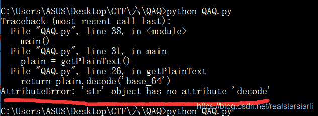
后来百度才知道，python2和Python3的语言规范是不一样的，python3要指定好字符串的编码格式才能解码（请恕我才疏学浅，不知道怎么修改，我百度了半天，还是不行，无奈只好直接用python2运行）
把QAQ.py放到了kali中用python2运行，得到plain.txt文件，出现了一串英文字母，百度翻译

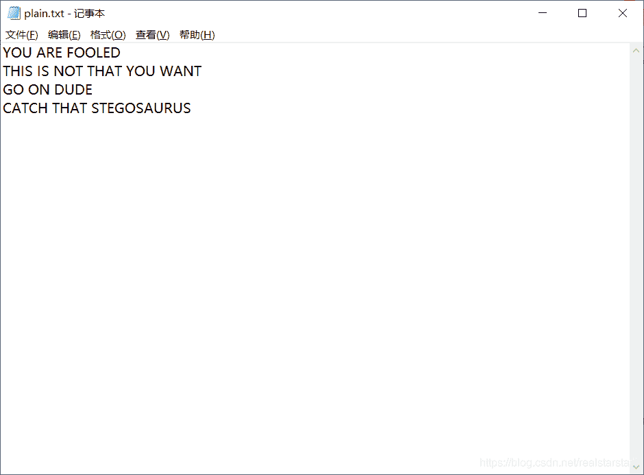

剑龙？？？，小朋友，你是否有许多问号
百度叭。。。。。
stegosaurus隐写：喵的CTF你到底有多少种隐写。。。。
stegosaurus工具会在python的字节码文件（就是Python编译后的文件，通常是.pyc .pyo文件）嵌入隐写信息，那么我们就要用stegosaurus工具，将含在QAQ.pyc中的隐写信息搞出来
stegosaurus工具的github连接，可以直接下载zip文件解压得到stegosaurus.py文件，也可以用git命令（前提是安装可git工具）
git clone https://github.com/AngelKitty/stegosaurus.git
https://github.com/AngelKitty/stegosaurus
下载完了就可以提取隐写信息了
python stegosaurus.py -x QAQ.pyc
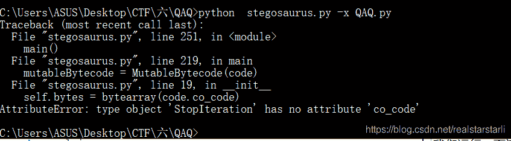
靠又出现问题了了，
readme里面有这样一段话（readme 里面内含这个git项目的介绍信息，包括stegosaurus.py的使用方法）
Stegosaurus requires Python 3.6 or later.#只使用python3.6以下的版本（我的是3.8的）
没办法只能放到kali中运行了
python3 stegosaurus.py -x QAQ.pyc
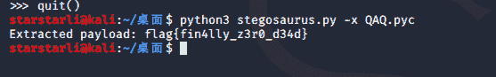flag出来了
ctf真恶心。。。。
**（8）apple**
下载以后是一个.dmg文件这是苹果系统的镜像文件后缀名。没思路。。。
**（9）妹子的陌陌**
拿到一张图片。

010编辑器发现有rar文件存在，foremost分离出来
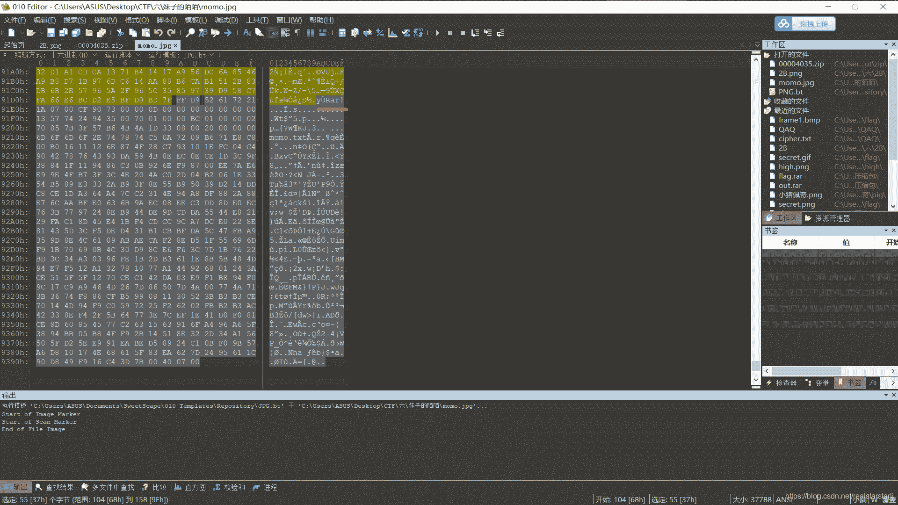
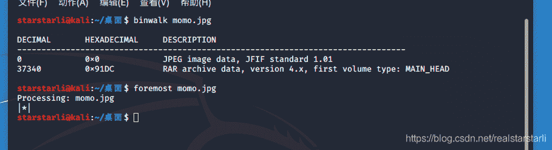

rar文件要密码，图片上的就是密码(喜欢我吗.)注意有.

解压出来一个momo.txt
电报内容的摩斯电码其实没什么用，因为士兵弄错了
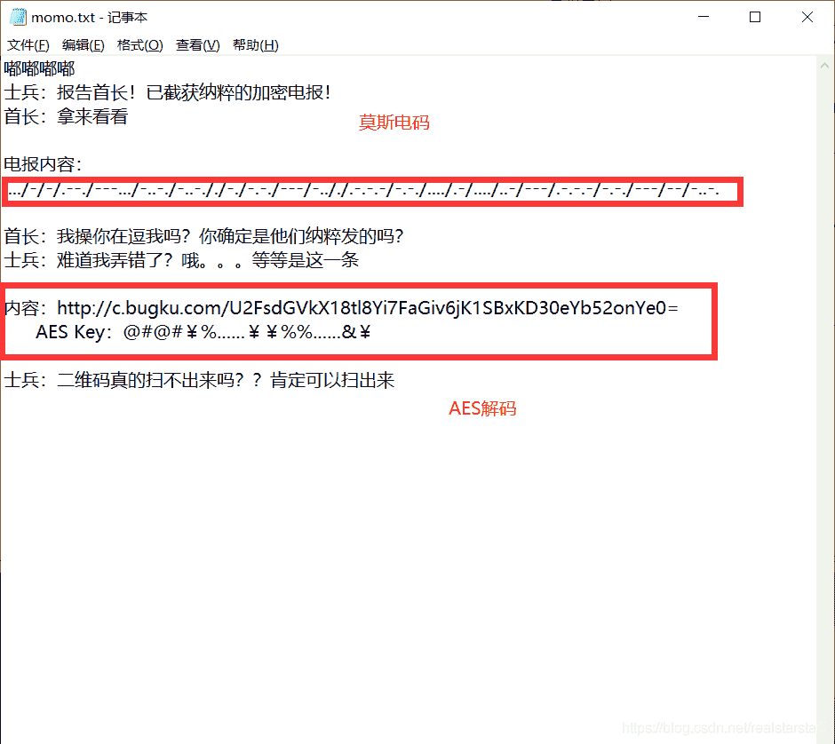

莫斯电码解码网站：
[http://www.zhongguosou.com/zonghe/moersicodeconverter.aspx](http://www.zhongguosou.com/zonghe/moersicodeconverter.aspx)
解出来是这个：
HTTP//ENCODE.CHAHUO.COM/（这是一个解码网站）
之后就是AES的解码
密文：U2FsdGVkX18tl8Yi7FaGiv6jK1SBxKD30eYb52onYe0=
秘钥：@#@#￥%……￥￥%%……&￥
AES解码网站：[http://www.jsons.cn/aesencrypt/](http://www.jsons.cn/aesencrypt/)
解出来是这个：momoj2j.png
构建正确的URL：http://c.bugku.com/momoj2j.png
得到一张二维码

反色（其实也不用）QR直接分析出来flag
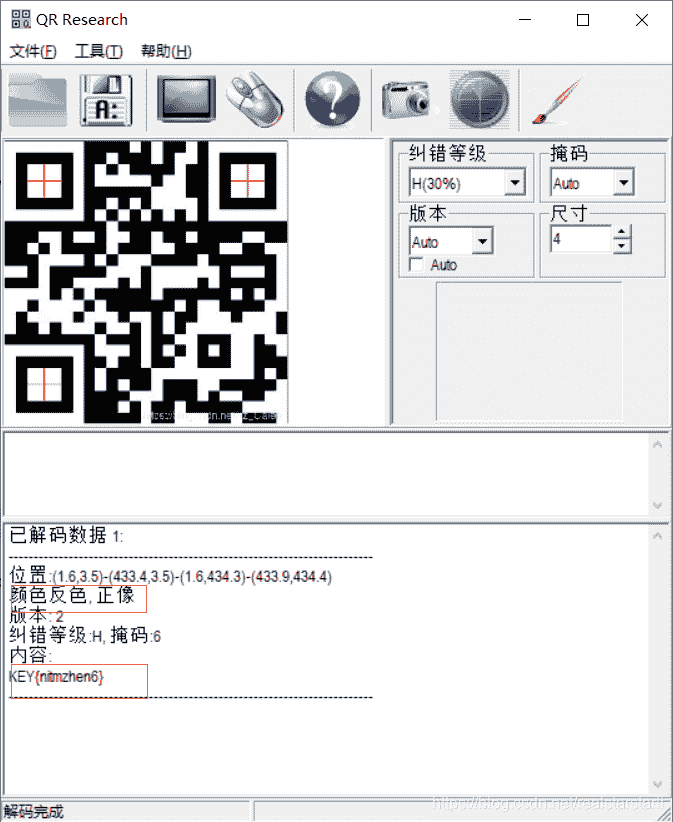
KEY{nitmzhen6}
**（10）就五层你能解开吗**
五层！！
第一层：CRC碰撞
首先到一个压缩包，里面还有一个压缩文件，和三个pwd文本文件，压缩文件是有密码的，既然是crc碰撞那么肯定就是碰撞这三个文本文件，里面就是密码。之前写过一道CRC碰撞的题目，但是当时的文件是四位（四个字节）的，但是这是六个字节的，如果用原来的脚本修改一下的话是搞不出来的，我尝试暴了一个小时，结果还是没出来。这里有一个神器脚本
`https://github.com/theonlypwner/crc32`
可以解6位CRC
安装了git环境就可以直接
`git clone https://github.com/theonlypwner/crc32 .git`
下载，文件不大很快的，要的就是里面的crc32.py脚本文件，这个用法是这样的
python crc32.py reverse crc32-----------crc32就是三个pwd文件的crc值。
是这三个 0x7C2DF918 0xA58A1926 0x4DAD5967(命令输入要加0x)
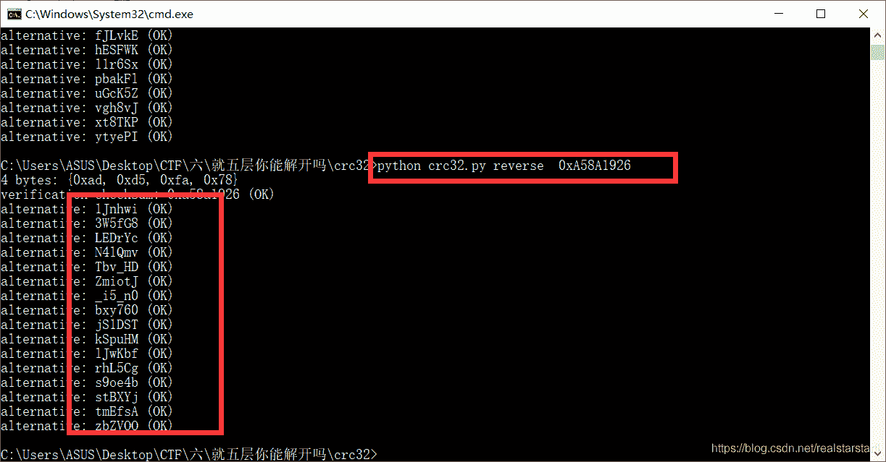
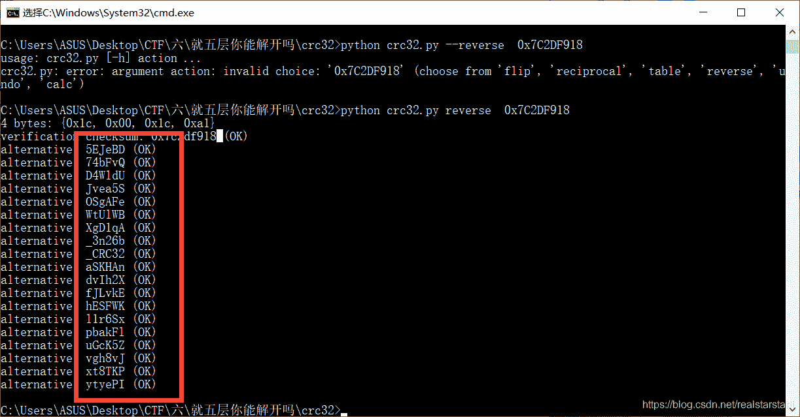
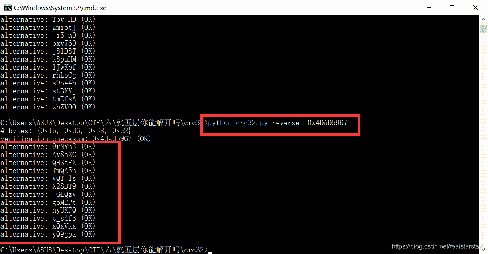

每个crc都会得到十几个可能的字符串，这个到底是哪三个呢？？本来是写了个脚本，暴力出所有的可能然后用字典解密，结果发现这是.7z的文本文件Advanced Archive Password Recovery不支持，没办法，网上找了半天也没有什么.7z字典解密的方法。。。wp上是这么说的，直接凭感觉找出来，语塞。
第一部分凭感觉是这个_CRC32 第二部分：_i5_n0 第三部分：t_s4f3
第一层的密码就是这个_CRC32_i5_n0t_s4f3
第二层，维吉尼亚密码
维吉尼亚密码简介：[https://baike.baidu.com/item/%E7%BB%B4%E5%90%89%E5%B0%BC%E4%BA%9A%E5%AF%86%E7%A0%81/4905472?fr=aladdin](https://baike.baidu.com/item/%E7%BB%B4%E5%90%89%E5%B0%BC%E4%BA%9A%E5%AF%86%E7%A0%81/4905472?fr=aladdin)
压缩文件解压出来了ciphertext.txt keys.txt tips.txt 和一个压缩文件又是需要密码的
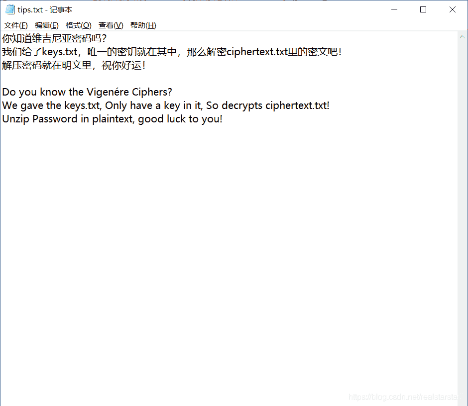
根据tips.txt里面的提示信息，我么可以知道ciphertext.txt是密文 keys.txt里面是秘钥，但是key.txt里面的秘钥由有好几个，要我们找一个正确的出来。
所以啊，我根据维吉尼亚的密码的编码方式，自己写了一个解码的脚本，写了好久，但是好像错了，emmm无奈只能用现成的脚本，（竟然有第三方模块的功能实现这个东西，啊~）

```
from pycipher import Vigenere
b=open('pwd.txt','w')
a=open('ciphertext.txt').read()
for i in open("keys.txt"):
    i=i.replace('\n','')
    flag=Vigenere(i).decipher(a)
    key=flag+'\r\n'
    b.write(key)
b.close() 
```

脚本跑出来，一大堆的代码，这个。。哪条是明文？？哪个是对的啊。既然是找密码，会不会有提示信息比如说会不会出现password is 。。。这样的字段的呢。找一找，有的（wp上面说的，自己还是太年轻了）。
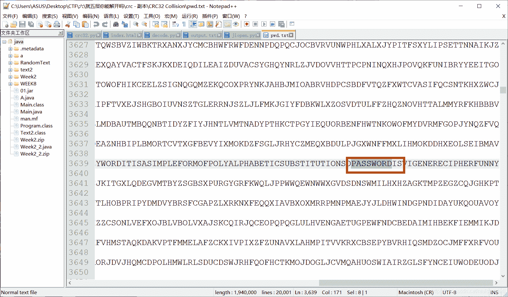出现了这个PASSWORDIS VIGENERECIPHERFUNNY找到的是这里那么VIGENERECIPHERFUNNY就是密码，根据密文中的字符串长度和空格，分隔出字符串，是这样的结果VIGENERE CIPHER FUNNY密码是小写字母（密文是小写的）vigenere cipher funny
第三层：
SAH1碰撞
sha1解析:[https://baike.baidu.com/item/SHA-1/1699692?fr=aladdin](https://baike.baidu.com/item/SHA-1/1699692?fr=aladdin)
如果不想看的话，就只要知道sha1是一种不可逆的哈希加密算法
哈希加密算法：[https://www.jianshu.com/p/cb77838c69db](https://www.jianshu.com/p/cb77838c69db)
解压出来的文件有一个U need unzip password.txt文本文件，和一个压缩文件（加密）
.txt文件里面给出了一个不完整的明文密码，和一个不完整的明文SAH1密文
其实我们可以用Certutil.exe操作命令直接查看文件的SAH1密文，这个详细的操作在第四层MD5一起介绍
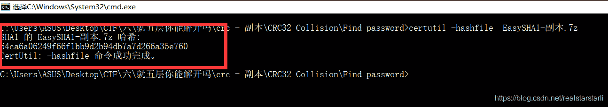
明文密码有缺了四个可打印的字符密码（*号表示），那么，热生苦短我用python，脚本给出（不是自己的写了点注释emmmm）。

```
import string
import hashlib
a = '619c20c'
b = 'a4de755'
char = string.printable
print(char)
for i in char:
    for j in char:
        for k in char:
            for l in char:
                x = '{0}7{1}5-{2}4{3}3?'.format(i,k,j,l)
                ha = hashlib.sha1(x.encode(encoding='utf-8')).hexdigest()
                if (a in ha) and (b in ha):
                    print(x)
                    print(ha) 
```

直接将密码暴出来（4个字符可以接受），暴出来是这个I7~5-s4F3?
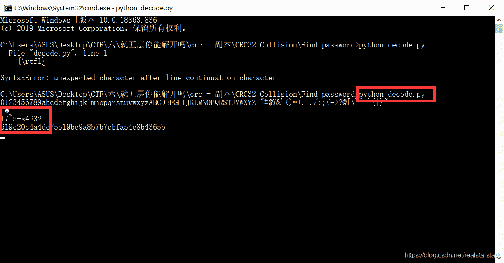
第四层：MD5
MD5也是一种不可逆的哈希加密算法。
解压出的文件.txt文件中说了有两个不同程序的MD5是一样的，哪两个程序啊？？网上搜到是这两个程序
文件下载地址
[http://www.win.tue.nl/hashclash/SoftIntCodeSign/HelloWorld-colliding.exe](http://www.win.tue.nl/hashclash/SoftIntCodeSign/HelloWorld-colliding.exe)
[http://www.win.tue.nl/hashclash/SoftIntCodeSign/GoodbyeWorld-colliding.exe](http://www.win.tue.nl/hashclash/SoftIntCodeSign/GoodbyeWorld-colliding.exe)
第一个文件是无限输出`Goodbye World :-(`
第二个文件是输出：`Hello World ;-)`
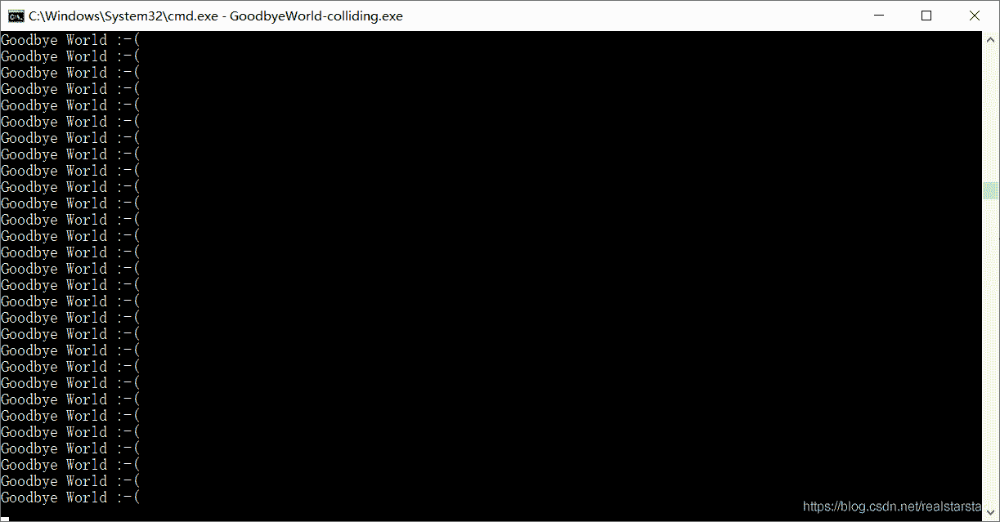
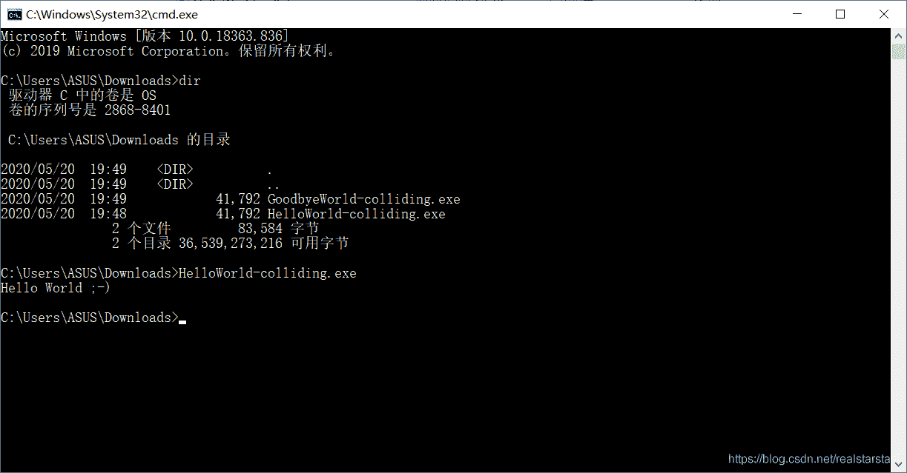

那么这两个文件的MD5是一样的吗？
Certutil.exe操作命令
[https://www.cnblogs.com/zeng-qh/p/10608522.html](https://www.cnblogs.com/zeng-qh/p/10608522.html)（CMD）
certutil --hashfile [文件名] MD5分别查看MD5，WOW结果是一样的
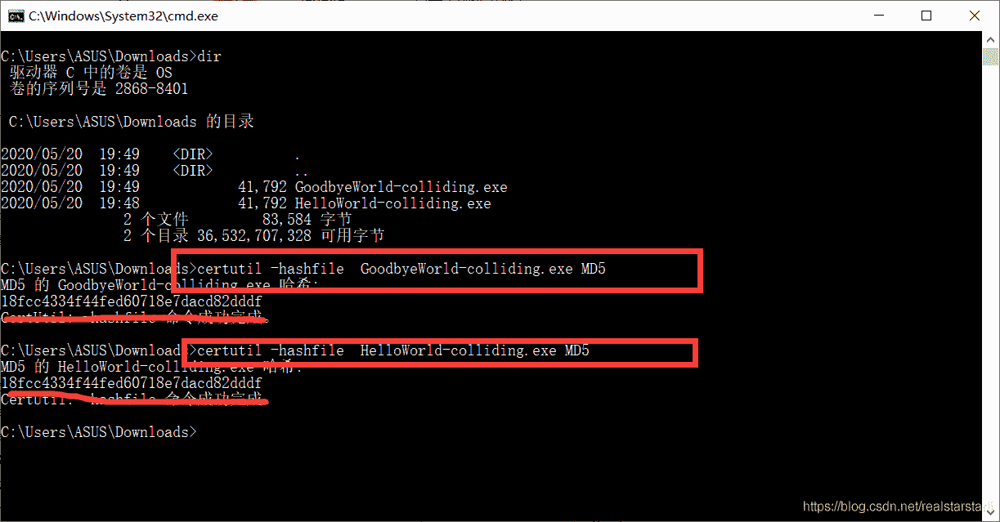
certutil --hashfile [文件名] SAH1分别查看SHA1 是不同的（说明是两个不同的文件）
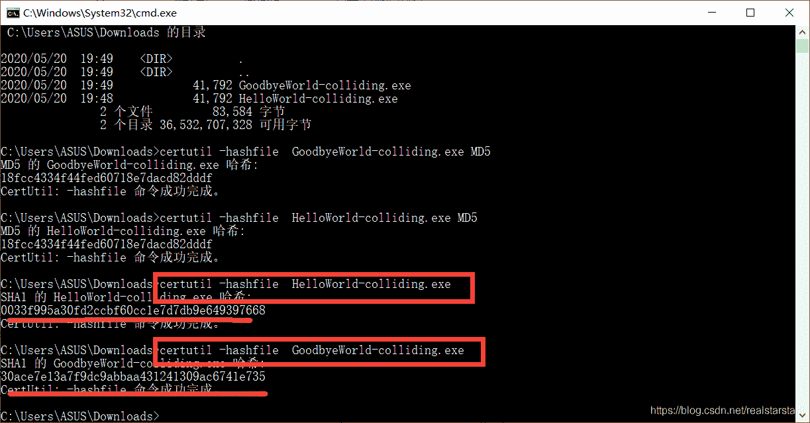
Certutil.exe操作命令检索MD5 SHA1（详细）
[https://www.jianshu.com/p/6384e7f42175](https://www.jianshu.com/p/6384e7f42175)
.txt文件说了另一个文件的输出结果就是密码
（输出`Hello World ;-)`的就是这个文件），那么另一个文件就是`Goodbye World :-(` 无限循环（单行输出结果）
密码 `Goodbye World :-(`
第五层：RSA
解压出来一个flag文件，另一个打开里面是一个密文（公钥）
RSA加密介绍[https://www.freebuf.com/articles/others-articles/161475.html](https://www.freebuf.com/articles/others-articles/161475.html)
简而言之，flag被RSA算法加密了，秘钥就是另一个文件
解密脚本：（里面的solve.py）

```
git clone https://github.com/D001UM3/CTF-RSA-tool.git
cd CTF-RSA-tool
pip install -r "requirements.txt" 
```

ai~~~ pip install pycrypto 失败了好几次，哭了
python solve.py -k [公钥文件] --decrypt [加密文件]
出flag
**结束**
接下来就是对WEB的学习，希望能有时间对上面没做会的题能够解出来。其实这个礼拜没有多少花费在做题上。希望能够继续保持继续出博客吧。