<!--yml
category: 未分类
date: 2022-04-26 14:37:05
-->

# CTF 关于ZIP解题过程_Sn0w/的博客-CSDN博客_ctf zip

> 来源：[https://blog.csdn.net/qq_43431158/article/details/88781970](https://blog.csdn.net/qq_43431158/article/details/88781970)

## CTF 关于ZIP解题

**1.伪加密类型**

打开之后是两张图片，一张未加密，一张已加密。
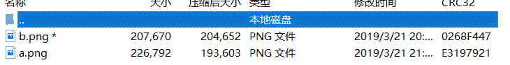
利用WinHex打开
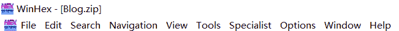
然后在谷歌上找到大佬关于zip格式的介绍
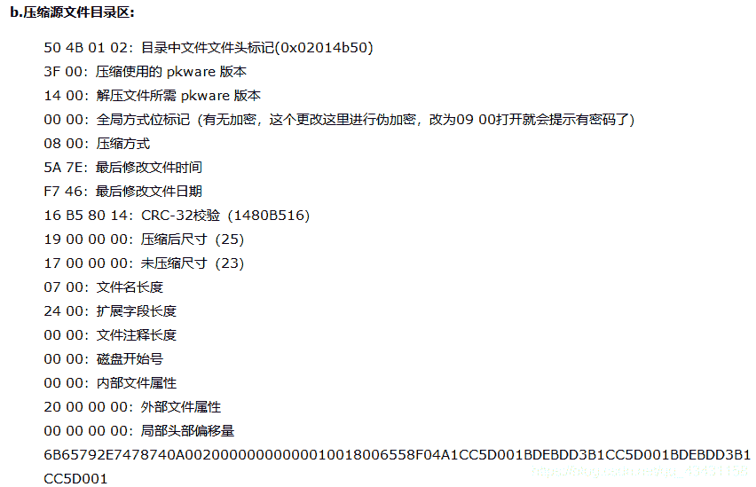
接下来进行对比，看是否属于伪加密
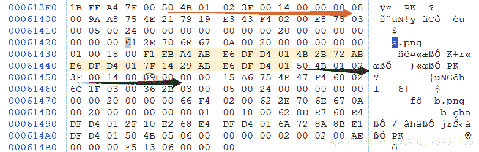
通过对比，发现确实属于伪加密。所以将09改为00即可。

> 总结：从50 4B 01 02 开始数十位数便能查看是否是伪加密。

**2.CRC32碰撞总结**
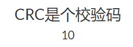
这个题是CRC32碰撞，首先有不会的就百度、谷歌。
通过查找发现需要CRC32碰撞的脚本和安装pathon。
一：安装CRC32 Tools
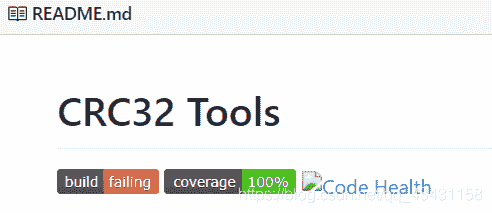
[工具地址](https://github.com/theonlypwner/crc32)
二：安装pathon
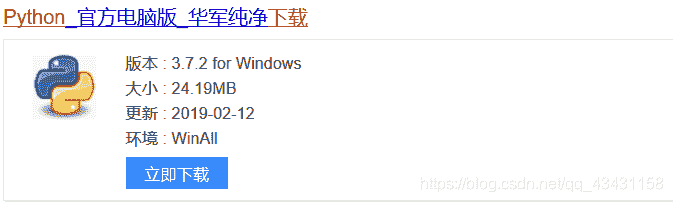
因为要翻墙，去官网下载会特别慢，下载这个没有病毒，也可以用。
还有下载好之后，最好找一下这个版本的安装教程。
[安装3.7.2pathon的教程](https://www.liaoxuefeng.com/wiki/0014316089557264a6b348958f449949df42a6d3a2e542c000/0014316090478912dab2a3a9e8f4ed49d28854b292f85bb000)

配置好之后，打开cmd，进入你安装脚本的目录。
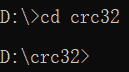
打开下载好的压缩包：
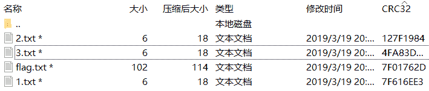
记录下1.2.3的CRC32值
利用碰撞的语法：

> python [crc32.py](http://crc32.py) reverse “你的crc32密文”

```
D:\crc32>python crc32.py reverse  "0X7F616EE3"
4 bytes: {0xfc, 0xf3, 0x48, 0x10}
verification checksum: 0x7f616ee3 (OK)
alternative: 06iBmA (OK)
alternative: 2GAaYT (OK)
alternative: 4BH2ir (OK)
alternative: 8LCPd9 (OK)
alternative: AGtKKP (OK)
alternative: Dbvk8f (OK)
alternative: ECiJJ3 (OK)
alternative: Hp2U49 (OK)
alternative: M9CXCK (OK)
alternative: TrCiM1 (OK)
alternative: WoYVfy (OK)
alternative: _eO5jQ (OK)
alternative: aHGrpU (OK)
alternative: eLZsq6 (OK)
alternative: k3y2Hh (OK)
alternative: kCECM8 (OK)
alternative: l61PcW (OK)
alternative: m6paxN (OK)
alternative: pymQwW (OK)
alternative: xo4nzk (OK)
alternative: you_ar (OK)
<!--破解1.flag--> 
```

```
D:\crc32>python crc32.py reverse  "0x127F1984"
4 bytes: {0x0c, 0xa9, 0xe2, 0xfd}
verification checksum: 0x127f1984 (OK)
alternative: 1IuEfu (OK)
alternative: 7P3JWG (OK)
alternative: 8_mKpP (OK)
alternative: ATZP_9 (OK)
alternative: K_XabT (OK)
alternative: MZQ2Rr (OK)
alternative: O76Mgs (OK)
alternative: SxjLss (OK)
alternative: TamrYX (OK)
alternative: ZnrBeV (OK)
alternative: bFsVOt (OK)
alternative: cF2gTm (OK)
alternative: e_the_ (OK)
alternative: kPkXYQ (OK)
alternative: lIlfsz (OK)
alternative: n8DEGo (OK)
alternative: oTvYX2 (OK)
alternative: swYuHv (OK)
<!--破解2.flag--> 
```

```
D:\crc32>python crc32.py reverse  "0x4FA83D8C"
4 bytes: {0x7e, 0xfa, 0xeb, 0x0a}
verification checksum: 0x4fa83d8c (OK)
alternative: 0KjFzu (OK)
alternative: 3ka59e (OK)
alternative: AwZr1l (OK)
alternative: CK_lhq (OK)
alternative: DRXRBZ (OK)
alternative: LXN1Nr (OK)
alternative: PFpQ6n (OK)
alternative: RzuOos (OK)
alternative: UcrqEX (OK)
alternative: a5Dvga (OK)
alternative: bXb8Iy (OK)
alternative: cDlUSt (OK)
alternative: lK2Ttc (OK)
alternative: mKseoz (OK)
alternative: nViZD2 (OK)
alternative: ruFvTv (OK)
<!--破解3.flag--> 
```

接下来，找到有意义或连贯的的英语词语。
通过查找发现有几个有意义的词语。

```
e_the_
you_ar 
```

一开始以为答案就应该是：flag{you_are_the_}，但提交还是错误。
通过查找，发现漏了一种可能，就是**特殊字符**。
CRC32和MD5加密都是不可逆的，也就是说加密之后是不能反过来看我之前的内容。所以有的大佬就将常见的词（例如 A,B,C。。。）写成了一个脚本,通过一个一个对比来破解出之前的密文。

打开我们下载的CRC32脚本。
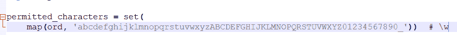
上面便是大佬脚本中的常见词，接下来我们自己添加一些特殊字符。
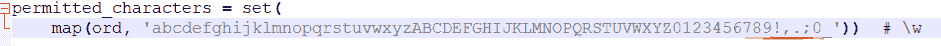
可以看到我自己添加了；/，！等这些特殊符号。（还有一点不要在最后面加特殊字符，会有问题，最好在0前面加）。

再次破解1.2.3.flag
发现3中出现有意义的词语。

```
D:\crc32>python crc32.py reverse  "0x4FA83D8C"
4 bytes: {0x7e, 0xfa, 0xeb, 0x0a}
verification checksum: 0x4fa83d8c (OK)
alternative: ,hEjj1 (OK)
alternative: .83Y7h (OK)
alternative: 0KjFzu (OK)
alternative: 3ka59e (OK)
alternative: 3w.i8q (OK)
alternative: 6R,IKG (OK)
alternative: ;,ZkXE (OK)
alternative: ;awV5M (OK)
alternative: AwZr1l (OK)
alternative: CK_lhq (OK)
alternative: DRXRBZ (OK)
alternative: H,oAJA (OK)
alternative: I,.pQX (OK)
alternative: I0a,PL (OK)
alternative: LXN1Nr (OK)
alternative: PFpQ6n (OK)
alternative: QgopD; (OK)
alternative: RzuOos (OK)
alternative: UcrqEX (OK)
alternative: Zl,pbO (OK)
alternative: a5Dvga (OK)
alternative: bXb8Iy (OK)
alternative: best!! (OK)
alternative: cDlUSt (OK)
alternative: f,CHMJ (OK)
alternative: lK2Ttc (OK)
alternative: mKseoz (OK)
alternative: nViZD2 (OK)
alternative: ruFvTv (OK)
alternative: z.2t4B (OK)在这里插入代码片 
```

best!!
所以把之前的拼凑起来。

```
flag{you_are_the_best!!} 
```

所以这样便把CRC32碰撞的题给做出了咯。

2：GIF图片修复
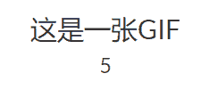
题目已经提示这是一张GIF
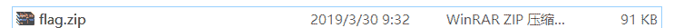
猜想一下flag肯定会隐藏在95KB里面（毕竟几个字母都占几KB)
点击图片，但无法打开。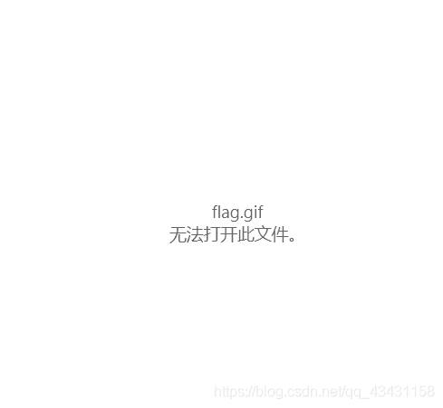
用winhex打开。
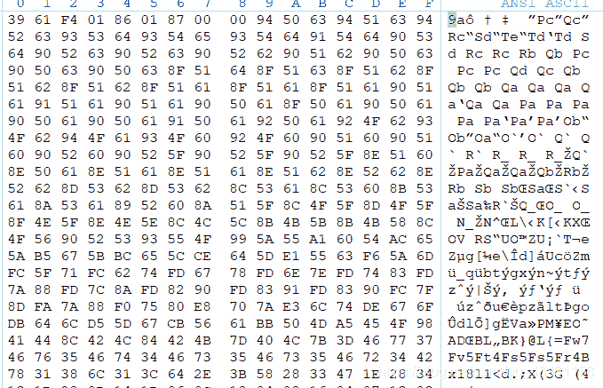
题中明明说这是一张GIF，所以应该就是修复GIF图片，查百度、谷歌大法。

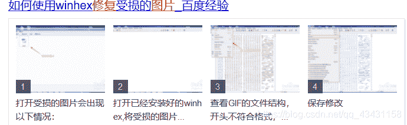
[地址](https://jingyan.baidu.com/album/f79b7cb31576389144023ecf.html?picindex=7)
按照上面的操作，并且将文件头改为GIF图片的格式。
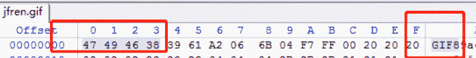
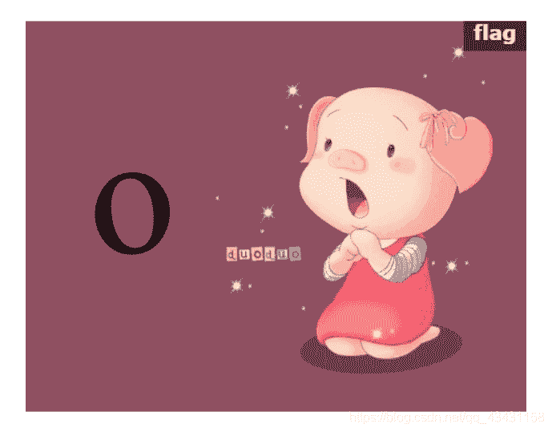
因为是个动态图，所以下面就得自己想办法让它显示出来。
因为我下载了PS软件，所以用这个看会很方便。
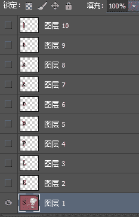
欧克，这道题已解开。