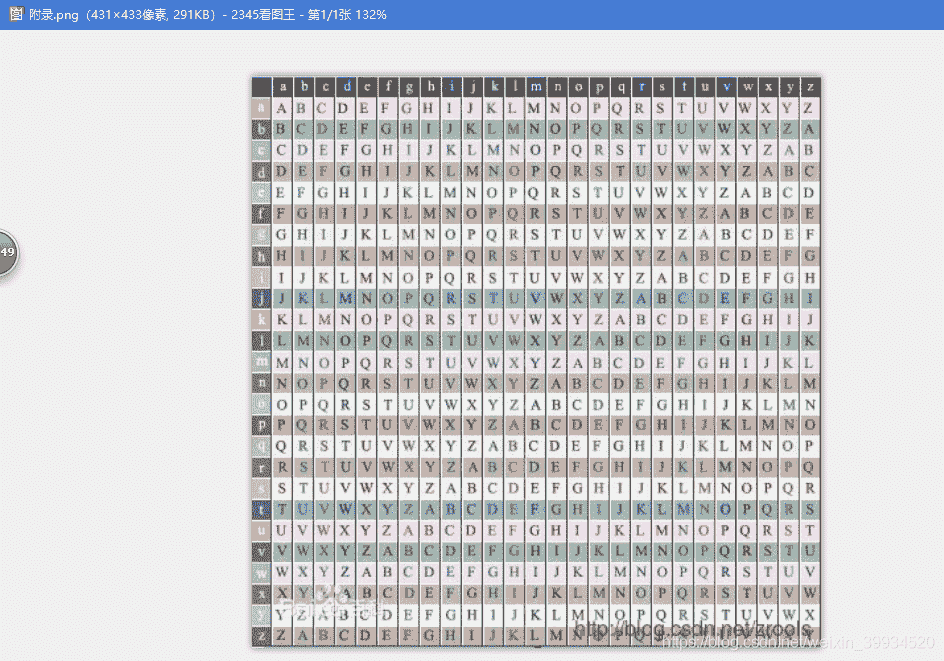
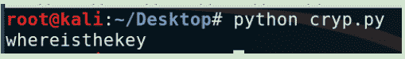
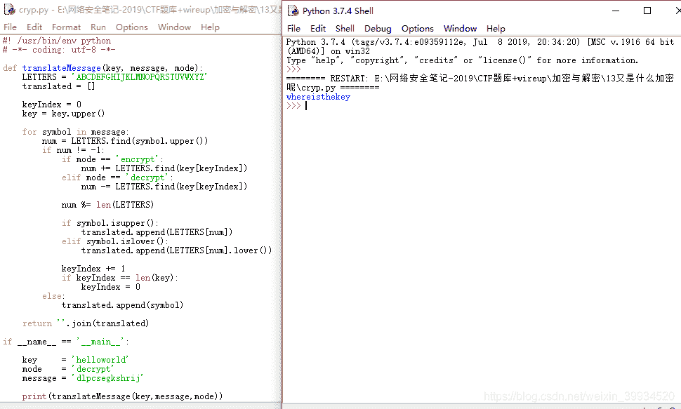
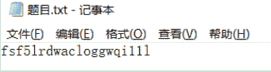
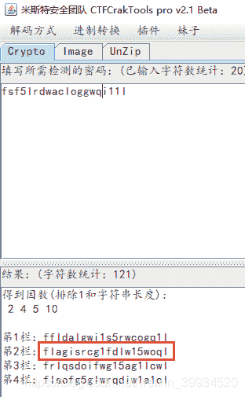

<!--yml
category: 未分类
date: 2022-04-26 14:49:48
-->

# CTF-加密与解密（七）_红烧兔纸的博客-CSDN博客

> 来源：[https://blog.csdn.net/weixin_39934520/article/details/107879409](https://blog.csdn.net/weixin_39934520/article/details/107879409)

> # **声明：以下CTF题均来自网上收集，在这里主要是给新手们涨涨见识，仅供参考而已。需要题目数据包的请私信或在下方留言。**

> # **                                 13.又是什么加密呢   （来源：安恒杯）**

> ## **1.关卡描述**

* * *

**只听说过凯撒？你OUT了！**

**在学习了凯撒大帝使用的神奇密码后，密码前辈们又创造出了更为奇异的加密方法。维吉尼亚是其中一种。。哎呀。。讲太多了。。顺便说一句，出题者是一个程序员，喜欢拿helloworld做秘钥~~下面是密文dlpcsegkshrij,请破解后提交。附录是一张似乎有用的表。**

****

> ## **2.解题步骤**

* * *

**2.1 题目提示是凯撒加密的加强版，通过题目中给定的换位表，推测为维吉尼亚密码。**

**2.2 换位表的基本思路是，纵向的坐标代表秘钥，横向的坐标代表明文，一一对应的中间字母则是密文。密码生成规则是：密码元字符串进行重复直到长度和明文或者密文一致即可。**

**2.3 写个python脚本进行破解。**

```
#! /usr/bin/env python
# -*- coding: utf-8 -*-
def translateMessage(key, message, mode):
    LETTERS = 'ABCDEFGHIJKLMNOPQRSTUVWXYZ'
    translated = []

    keyIndex = 0
    key = key.upper()

    for symbol in message:
        num = LETTERS.find(symbol.upper())
        if num != -1:
            if mode == 'encrypt':
                num += LETTERS.find(key[keyIndex])
            elif mode == 'decrypt':
                num -= LETTERS.find(key[keyIndex])

            num %= len(LETTERS)

            if symbol.isupper():
                translated.append(LETTERS[num])
            elif symbol.islower():
                translated.append(LETTERS[num].lower())

            keyIndex += 1
            if keyIndex == len(key):
                keyIndex = 0
        else:
            translated.append(symbol)

    return ''.join(translated)

if __name__ == '__main__':
    key     = 'helloworld'
    mode    = 'decrypt'
    message = 'dlpcsegkshrij'

    print(translateMessage(key,message,mode))
```

**kali下:**

****

**windows下：**

****

> # **                            14.木册木兰    （来源：网络）**

> ## **1.关卡描述**

* * *

**木册木兰是什么鬼？**

> ## **2.解题步骤**

* * *

**2.1 打开题目，发现一串密文；**

****

**2.2 根据题目提示，判断此题为栅栏密码；**

** f s f 5**

** l r d w**

** a c l o**

** g g w q**

** i 1 1 l**

**每4个分成一组，得到flag为flagisrcg1fd1w15woql**

**或者使用工具：**

****

> **栅栏密码
> 一、基本介绍
> 所谓栅栏密码，就是把要du加密的明文分成N个一zhi组，然后把每组的dao第1个字连起来，形成一段无规律的话。
> 一般来说见到一堆字母没有空格，就应该想一想是不是栅栏。**