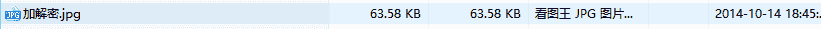
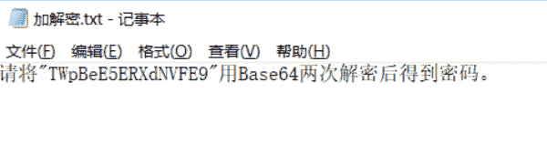
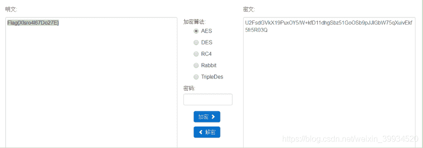

<!--yml
category: 未分类
date: 2022-04-26 14:50:13
-->

# CTF-加密与解密（三）_红烧兔纸的博客-CSDN博客

> 来源：[https://blog.csdn.net/weixin_39934520/article/details/107774828](https://blog.csdn.net/weixin_39934520/article/details/107774828)

> # 声明：以下CTF题均来自网上收集，在这里主要是给新手们涨涨见识，仅供参考而已。需要题目数据包的请私信或在下方留言。

> # ****                              6.图片中的密码    （来源：安码CTF）****

> ## ******1.关卡描述******

* * *

你能发现什么

> ## ******2.解题步骤******

* * *

**2.1 将文件下载，解压后将文件后缀名改为rar，解压得到 “加解密.txt”**

**2.2 然后Base64两次解密，得到通关密钥。**

20141014

> # ****                3.AES********解密   （来源：网络）****

> ## ******1.关卡描述******

* * *

高级的加密

密文：U2FsdGVkX19PuxOY5/W+kfD11dhgSbz51GoOSb9pJJIGbW75qXuivEkf5fr5R03Q

> ## ******2.解题步骤******

* * *

**2.1 到在线解密网站**

**http://tool.oschina.net/encrypt/**

**进行解密**

