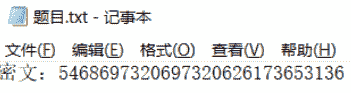
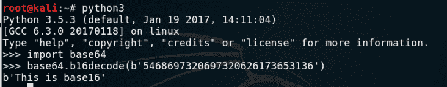
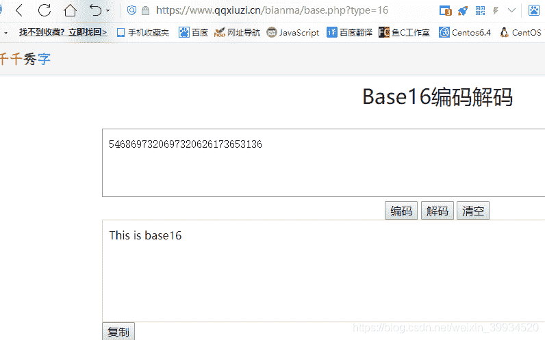
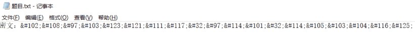
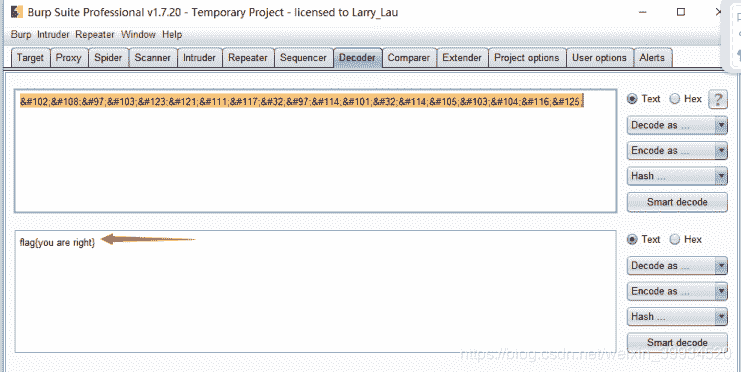
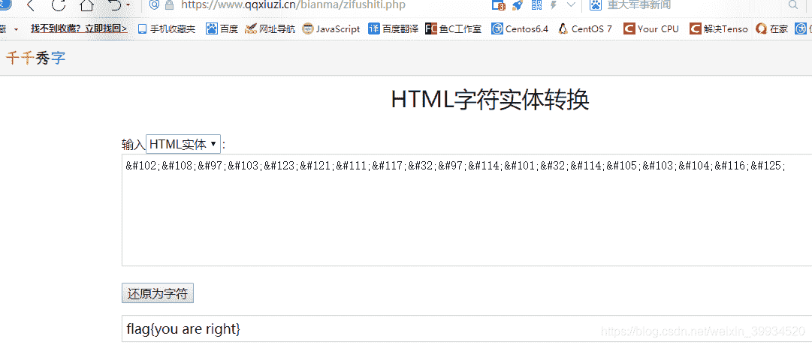

<!--yml
category: 未分类
date: 2022-04-26 14:48:36
-->

# CTF-加密与解密（九）_红烧兔纸的博客-CSDN博客

> 来源：[https://blog.csdn.net/weixin_39934520/article/details/107914858](https://blog.csdn.net/weixin_39934520/article/details/107914858)

> # **声明：以下CTF题均来自网上收集，在这里主要是给新手们涨涨见识，仅供参考而已。需要题目数据包的请私信或在下方留言。**

> # **                                      17.Base16   （来源：网络）**

> ## **1.关卡描述**

* * *

**只知道base64？你太low了**

**密文：5468697320697320626173653136**

> ## **2.解题步骤**

* * *

**2.1 打开题目，发现一串密文**

****

**2.2 根据题目名称，判断为base16加密，可以使用python解密**

****

**在线解答：[https://www.qqxiuzi.cn/bianma/base.php](https://www.qqxiuzi.cn/bianma/base.php)**

> # **                  18.**Html********字符实体**   （来源 **

> ## **1.关卡描述**

* * *

**打开网页遇到乱码怎么办？**

**密文：&#102;&#108;&#97;&#103;&#123;&#121;&#111;&#117;&#32;&#97;&#114;&#101;&#32;&#114;&#105;&#103;&#104;&#116;&#125;**

> ## **2.解题步骤**

* * *

**2.1  打开题目，发现一串密文**

****

**2.2 根据题目名称，判断为html实体编码**

**2.3 使用burp的decoder模块进行解密，得到flag :    flag{you are right}**

> **或者在线转换：[https://www.qqxiuzi.cn/bianma/zifushiti.php](https://www.qqxiuzi.cn/bianma/zifushiti.php)**

> **小知识：**

**字符实体是用一个编号写入HTML代码中来代替一个字符，在使用浏览器访问网页时会将这个编号解析还原为字符以供阅读。**

**这么做的目的主要有两个：
１、解决HTML代码编写中的一些问题。例如需要在网页上显示小于号（<）和大于号（>），由于它们是HTML的预留标签，可能会被误解析。这时就需要将小于号和大于号写成字符实体：
小于号这样写：&lt; 或 &#60;
大于号这样写：&gt; 或 &#62;
前面的写法称为实体名称，后面的写法则是实体编号。[ISO-8859-1字符集](https://www.qqxiuzi.cn/wz/zixun/1681.htm)（西欧语言）中两百多个字符设定了实体名称，而对于其它所有字符都可以用实体编号来代替。
２、网页编码采用了特定语言的编码，却需要显示来自其它语言的字符。例如，网页编码采用了西欧语言ISO-8859-1，却要在网页中显示中文，这时必须将中文字符以实体形式写入HTML代码中。**

**带有实体名称的 ASCII 实体**

| **结果** | **描述** | **实体名称** | **实体编号** |
| **"** | **quotation mark** | **&quot;** | **&#34;** |
| **'** | **apostrophe ** | **&apos;** | **&#39;** |
| **&** | **ampersand** | **&amp;** | **&#38;** |
| **<** | **less-than** | **&lt;** | **&#60;** |
| **>** | **greater-than** | **&gt;** | **&#62;** |