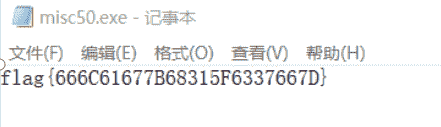
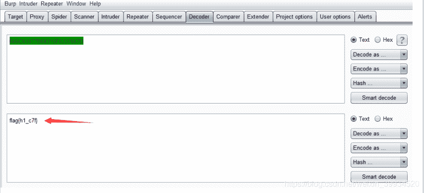
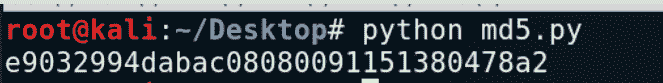

<!--yml
category: 未分类
date: 2022-04-26 14:33:49
-->

# CTF-加密与解密（二）_红烧兔纸的博客-CSDN博客

> 来源：[https://blog.csdn.net/weixin_39934520/article/details/107741595](https://blog.csdn.net/weixin_39934520/article/details/107741595)

> # 声明：以下CTF题均来自网上收集，在这里主要是给新手们涨涨见识，仅供参考而已。需要题目数据包的请私信或在下方留言。

> # ****                              3.请破译密码    （来源：安码CTF）****

> ## ******1.关卡描述******

* * *

**密码是什么呢？**

> ## ******2.解题步骤******

* * *

**2.1 用记事本打开，发现是个明文、**



**2.2 使用Burp的Decoder模块ASCII解码得出：**



### flag{h1_c7f}

> # ****                                3.丢失的MD5    （来源：****安恒杯****）****

> ## ******1.关卡描述******

* * *

**python大法好！
这里有一段丢失的md5密文
e9032???da???08????911513?0???a2
要求你还原出他**

**已知线索 明文为：TASC?O3RJMV?WDJKX?ZM**

> ## ******2.解题步骤******

* * *

**2.1 题目为MD5碰撞，我们知道MD5理论上是不可逆的，我们只能通过明文来计算出MD5，然后再和已知的MD5进行比对。**

**明文为：TASC?O3RJMV?WDJKX?ZM**

**2.2 分析可知 : 明文缺失了3个字符，写个python脚本进行爆破**

```
//python 2.x版本
import hashlib   
for i in range(32,127):
    for j in range(32,127):
        for k in range(32,127):
            m=hashlib.md5()
            m.update('TASC'+chr(i)+'O3RJMV'+chr(j)+'WDJKX'+chr(k)+'ZM')
            des=m.hexdigest()
            if 'e9032' in des and 'da' in des and '911513' in des:
                print des
```



### e9032994dabac08080091151380478a2