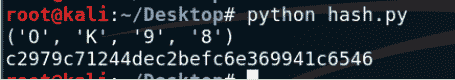
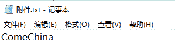
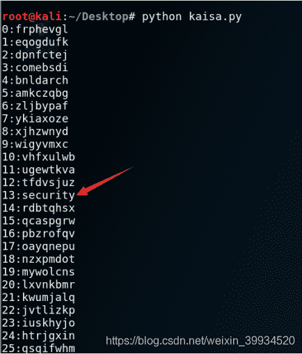
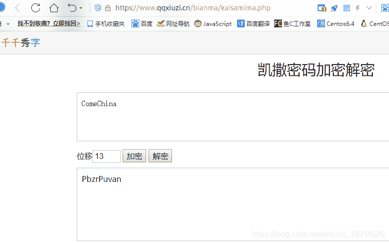
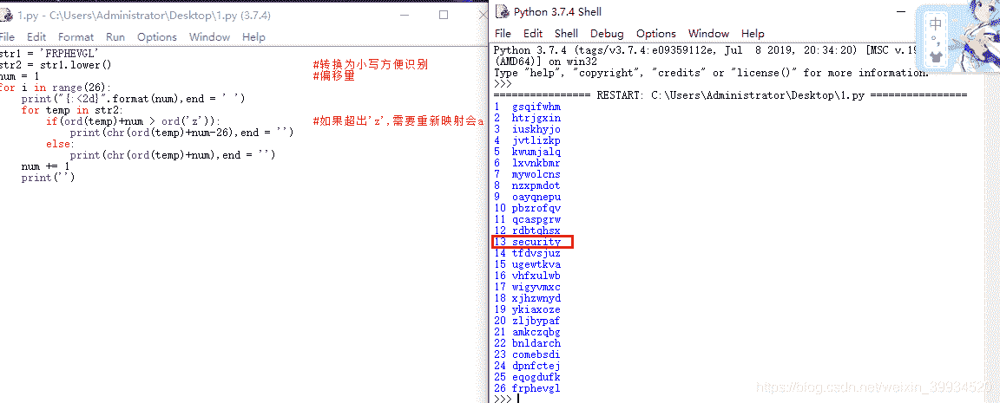
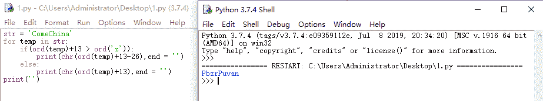

<!--yml
category: 未分类
date: 2022-04-26 14:48:53
-->

# CTF-加密与解密（六）_红烧兔纸的博客-CSDN博客_加密与解密 附件

> 来源：[https://blog.csdn.net/weixin_39934520/article/details/107864750](https://blog.csdn.net/weixin_39934520/article/details/107864750)

> # **声明：以下CTF题均来自网上收集，在这里主要是给新手们涨涨见识，仅供参考而已。需要题目数据包的请私信或在下方留言。**

> # **                                11.Hash还原    （来源：网络）**

> ## **1.关卡描述**

* * *

**小明一直将电脑密码的Hash值写在标签纸上，结果一不小心墨水撒到了上面，只能看到前十位是c2979c7124，另外小明记得他的密码是4位的数字加字母，你能帮小明恢复密码的Hash值吗？（密码的Hash值即为Flag值）**

> ## **2.解题步骤**

* * *

**2.1 通过分析前十位可以猜测出这个密文的加密方式是MD5。**

**2.2 使用Python编写脚本进行爆破猜解：**

```
import hashlib
import itertools
import hmac
key = 'c2979c7124'
dir = '1234567890abcdefghijklmnopqrstuvwxyzABCDEFGHIJKLMNOPQRSTUVWXYZ'
dir_list = itertools.product(dir, repeat=4)
for i in dir_list:
	res = hashlib.md5(''.join(i)).hexdigest()
	if res[0:10] == key:
		print i
		print res
```

****

**c2979c71244dec2befc6e369941c6546**

> # **                             12.大帝的密码武器    （来源：安恒杯）**

> ## **1.关卡描述**

**公元前一百年，在罗马出生了一位对世界影响巨大的人物，他生前是罗马三巨头之一。他率先使用了一种简单的加密函，因此这种加密方法以他的名字命名。
以下密文被解开后可以获得一个有意义的单词：FRPHEVGL
你可以用这个相同的加密向量加密附件中的密文，作为答案进行提交。**

****

> ## **2.解题步骤**

* * *

**2.1 题目叫做大帝的秘密武器，且题目提醒；罗马三巨头之一。符合条件且比较有名的就是凯撒大帝了。史料记载，凯撒密码曾经在凯撒大帝军队中进行使用并以此命名。**

**2.2 凯撒密码属于移位加密，我们对密文进行移位，最多移动25位，可以写个脚本运行。等结果出来了找到合理的单词。记住移动次数，对题目给的明文进行同样的移动，则可以得到密文，进行提交。**

```
#! /usr/bin/env python
# -*- coding: utf-8 -*-

def translateMessage(key, message, mode):
    LETTERS = 'ABCDEFGHIJKLMNOPQRSTUVWXYZ'
    translated = ''

    for symbol in message:
        if symbol.upper() in LETTERS: 
            num = LETTERS.find(symbol.upper())
            if mode == 'encrypt':
                num = num + key
            elif mode == 'decrypt':
                num = num - key

            if num >= len(LETTERS):
                num = num - len(LETTERS)
            elif num < 0:
                num = num + len(LETTERS)

            if symbol.isupper():
                translated = translated + LETTERS[num]
            elif symbol.islower():
                translated = translated + LETTERS[num].lower()

        else:
            translated = translated + symbol
    return translated

if __name__ == '__main__':
    # key     = 13
    mode    = 'decrypt' 
    message = 'FRPHEVGL'

    for key in xrange(0,26):
        print(str(key)+':'+translateMessage(key,message,mode).lower())
```

**(上面的代码，比较复杂点，在文章的左后，会提供简单的脚本)**

**2.3 运行kaisa.py，可以看到13 security为有意义的单词。**

****



**PbzrPuvan**

### **补充：**

> **来自：**[https://blog.csdn.net/qq_41523170/article/details/107668949](https://blog.csdn.net/qq_41523170/article/details/107668949)

**凯撒密码核心就是移位，所以我们将题目中给的字符串`FRPHEVGL`经行1-26的移位观察（总所周知，一个单词小写字母写认识，可能大写字母写就认不出来了，所以转化成小写字母）**

```
str1 = 'FRPHEVGL'
str2 = str1.lower()                                 #转换为小写方便识别
num = 1                                             #偏移量
for i in range(26):
    print("{:<2d}".format(num),end = ' ')
    for temp in str2:
        if(ord(temp)+num > ord('z')):               #如果超出'z',需要重新映射会a~z这26个字母上
            print(chr(ord(temp)+num-26),end = '')
        else:
            print(chr(ord(temp)+num),end = '')
    num += 1
    print('')
```



**可以看到偏移量是13的时候，好像是我们想要的东西，然后将密文里面的`ComeChina`做偏移量为13的偏移：然后如果超出`z`，减26使其回到`A-z`范围内（别问我为什么，因为不减的结果`P|zrPuv{n`经过我的验证是不对的），最终得到`PbzrPuvan`，用花括号包起来就可以提交了`flag{PbzrPuvan}`**

```
str = 'ComeChina'
for temp in str:
    if(ord(temp)+13 > ord('z')):               
        print(chr(ord(temp)+13-26),end = '')
    else:
        print(chr(ord(temp)+13),end = '')
print('')
```



> **小知识点：**
> 
> 凯撒密码最早由古罗马军事统帅盖乌斯·尤利乌斯·凯撒在军队中用来传递加密信息，故称凯撒密码。这是一种位移加密方式，只对26个字母进行位移替换加密，规则简单，容易破解。下面是位移1次的对比：
> 
> | 明文字母表 | Z | A | B | C | D | E | F | G | H | I | J | K | L | M | N | O | P | Q | R | S | T | U | V | W | X | Y |
> | 密文字母表 | A | B | C | D | E | F | G | H | I | J | K | L | M | N | O | P | Q | R | S | T | U | V | W | X | Y | Z |
> 
> 将明文字母表向后移动1位，A变成了B，B变成了C……，Z变成了A。同理，若将明文字母表向后移动3位：
> 
> | 明文字母表 | X | Y | Z | A | B | C | D | E | F | G | H | I | J | K | L | M | N | O | P | Q | R | S | T | U | V | W |
> | 密文字母表 | A | B | C | D | E | F | G | H | I | J | K | L | M | N | O | P | Q | R | S | T | U | V | W | X | Y | Z |
> 
> 则A变成了D，B变成了E……，Z变成了C。
> 
> 字母表最多可以移动25位。凯撒密码的明文字母表向后或向前移动都是可以的，通常表述为向后移动，如果要向前移动1位，则等同于向后移动25位，位移选择为25即可。