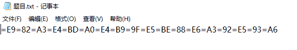
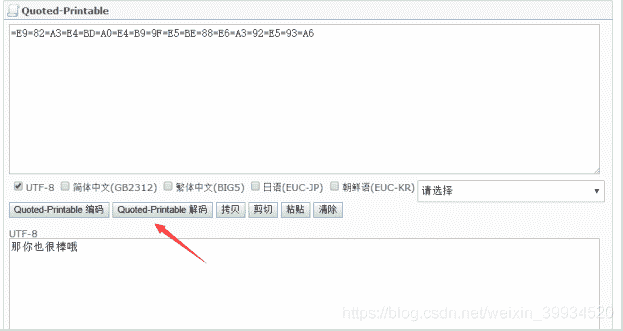
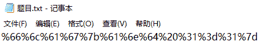
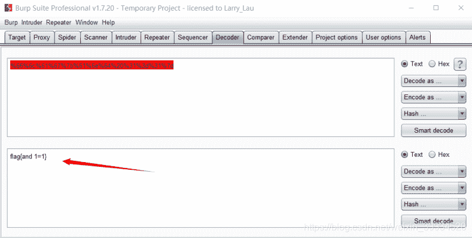
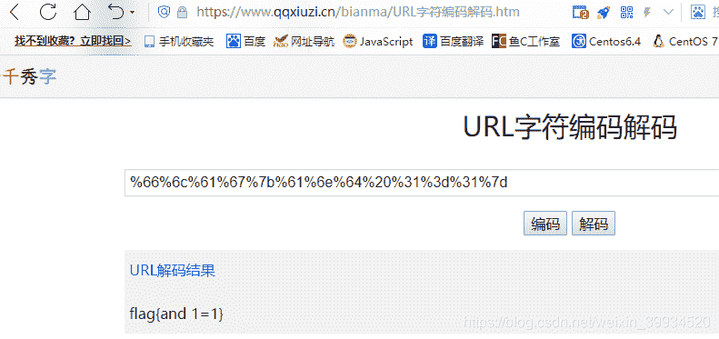
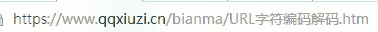

<!--yml
category: 未分类
date: 2022-04-26 14:48:44
-->

# CTF-加密与解密（十一）_红烧兔纸的博客-CSDN博客

> 来源：[https://blog.csdn.net/weixin_39934520/article/details/107956283](https://blog.csdn.net/weixin_39934520/article/details/107956283)

> # **声明：以下CTF题均来自网上收集，在这里主要是给新手们涨涨见识，仅供参考而已。需要题目数据包的请私信或在下方留言。**

> # **              21.Quoted-printable  （来源：网络）**

> ## **1.关卡描述**

* * *

**下载附件并从中获取Flag值进行提交。**

**=E9=82=A3=E4=BD=A0=E4=B9=9F=E5=BE=88=E6=A3=92=E5=93=A6**

> ## **2.解题步骤**

* * *

**2.1 打开题目，发现是一串密文。**

**2.2 根据题目的名字，判断是Quoted-printable编码。   **

**2.3  到在线网站上进行解密，得到flag。**

**http://www.mxcz.net/tools/QuotedPrintable.aspx**

**小知识：**

**Quoted-printable可译为“可打印字符引用编码”，编码常用在电子邮件中，如：Content-Transfer-Encoding: quoted-printable ，它是MIME编码常见一种表示方法！ 在邮件里面我们常需要用可打印的ASCII字符 (如字母、数字与"=")表示各种编码格式下的字符！Quoted-printable将任何8-bit字节值可编码为3个字符：一个等号"="后跟随两个十六进制数字(0–9或A–F)表示该字节的数值。例如，ASCII码换页符（十进制值为12）可以表示为"=0C"， 等号"="（十进制值为61）必须表示为"=3D"，gb2312下“中”表示为=D6=D0。除了可打印ASCII字符与换行符以外，所有字符必须表示为这种格式。因为Quoted-printable编码简单、方便因此在电子邮件中应用广泛！详细[Quoted-printable介绍](http://blog.chacuo.net/494.html)**

> # **                              22.Url编码  （来源：网络）**

> ## **1.关卡描述**

* * *

**Sql注入时，是不是经常见到%20？**

> ## **2.解题步骤**

* * *

**2.1 打开题目，发现是一串密文。**

**2.2 根据题目的名字，判断是Url编码。**

**2.3 使用burp的decoder模块解码，获得flag。**

**或者在线解码：**

**在线解答：[https://www.qqxiuzi.cn/bianma/base.php](https://www.qqxiuzi.cn/bianma/base.php)**

> 小知识：
> 
> **URL** 是 Uniform Resource Locator 的简称，中文译为“统一资源定位符”，也就是网络地址。
> 
> 编码结果义项说明：
> 
> **作为完整的网址：**
> 除了ASCII字母和数字，以及这些ASCII标点符号：-_.!~*'();/?:@&=+$,#，其它字符都将被一个或多个十六进制的转义序列替换。
> 
> **作为网址的参数：**
> 除了ASCII字母和数字，以及这些ASCII标点符号：-_.!~*'()，其它字符都将被一个或多个十六进制的转义序列替换。
> 
> 也就是说 ;/?:@&=+$,# 这些标点符号作为网址的分隔符时不会被转义，而作为网址的参数传递时都将被转义。
> 
> URL 转义序列采用 UTF-8 编码方案。
> 
> 例子：
> 
> “作为完整的网址”如本页的URL，复制下来就能看到中文被转义了。如下：
> 
> https://www.qqxiuzi.cn/bianma/URL%E5%AD%97%E7%AC%A6%E7%BC%96%E7%A0%81%E8%A7%A3%E7%A0%81.htm
> 
> “作为网址的参数”例如以下的形式，一个网址是另一个网址的参数。
> 
> https://www.qqxiuzi.cn/bianma/URL%E5%AD%97%E7%AC%A6%E7%BC%96%E7%A0%81%E8%A7%A3%E7%A0%81.htm?url=http%3A%2F%2Fwww.qqxiuzi.cn%2Fbianma%2FURL%E5%AD%97%E7%AC%A6%E7%BC%96%E7%A0%81%E8%A7%A3%E7%A0%81.htm

**推荐网站：**

[http://web.chacuo.net/charseturlencode](http://web.chacuo.net/charseturlencode)

