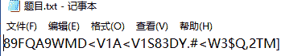
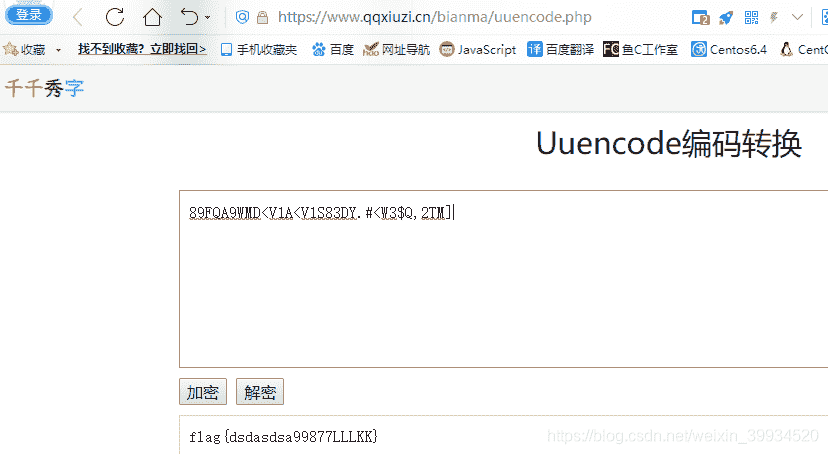
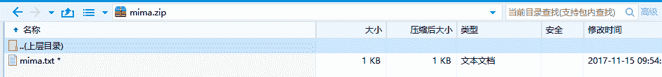
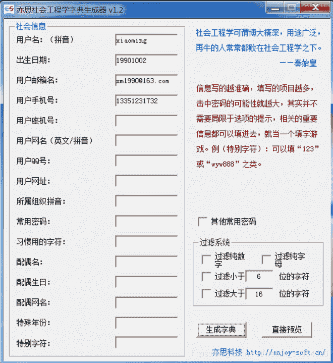
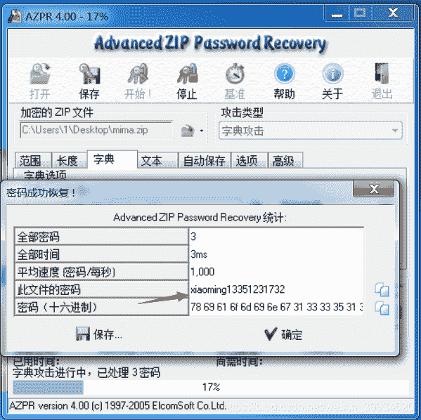

<!--yml
category: 未分类
date: 2022-04-26 14:48:38
-->

# CTF-加密与解密（十七）_红烧兔纸的博客-CSDN博客

> 来源：[https://blog.csdn.net/weixin_39934520/article/details/108064444](https://blog.csdn.net/weixin_39934520/article/details/108064444)

> # **声明：以下CTF题均来自网上收集，在这里主要是给新手们涨涨见识，仅供参考而已。需要题目数据包的请私信或在下方留言。**

> # **                                  33.Uuencode编码（来源：网络）**

> ## **1.关卡描述**

* * *

**So easy!**

> ## **2.解题步骤**

* * *

**2.1 打开题目，发现是一串密文。**

**2.2 判断是Uuencode编码。**

**2.3 Uuencode编码的原理：**

> **Uuencode是二进制信息和文字信息之间的转换编码，也就是机器和人眼识读的转换。Uuencode编码方案常见于电子邮件信息的传输，目前已被多用途互联网邮件扩展（MIME）大量取代。**
> 
> **Uuencode将输入文字以每三个字节为单位进行编码，如此重复进行。如果最后剩下的文字少于三个字节，不够的部份用零补齐。这三个字节共有24个Bit，以6-bit为单位分为4个群组，每个群组以十进制来表示所出现的数值只会落在0到63之间。将每个数加上32，所产生的结果刚好落在ASCII字符集中可打印字符（32-空白...95-底线）的范围之中。**
> 
> **Uuencode编码每60个将输出为独立的一行（相当于45个输入字节），每行的开头会加上长度字符，除了最后一行之外，长度字符都应该是“M”这个ASCII字符（77=32+45），最后一行的长度字符为32+剩下的字节数目这个ASCII字符。**

**2.4 到在线网站上解密，得到flag**

**[https://www.qqxiuzi.cn/bianma/uuencode.php](https://www.qqxiuzi.cn/bianma/uuencode.php)**

**flag{dsdasdsa99877LLLKK}**

> # **                                34.带密码的ZIP（来源：网络）**

> ## **1.关卡描述**

* * *

**小明把qq密码存在了一个txt文档里，并且将其进行了zip压缩；
不过小明忘记了解压密码，只记得密码是自己个人信息的组合；
你能帮小明找回密码吗？**

**已知：
姓名 xiaoming
生日 19901002
邮箱 xm1990@163.com
手机 13351231732**

****

> ## **2.解题步骤**

* * *

**2.1 根据题目的意思，此题需要先根据小明的个人信息，生成社会工程学字典，再对zip压缩包进行爆破。**

**2.2 首先使用亦思字典生成器，填入小明的个人信息，生成字典。**

**2.3 再使用暴力破解工具，破解zip压缩包的密码，得到flag。**

