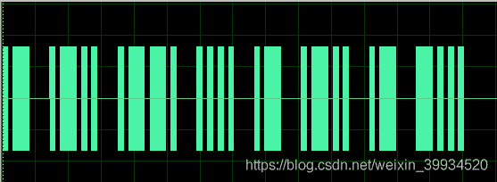
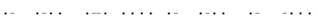
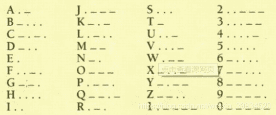
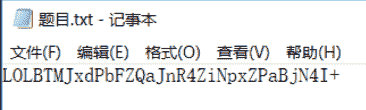
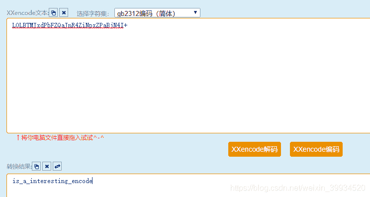

<!--yml
category: 未分类
date: 2022-04-26 14:19:40
-->

# CTF-加密与解密（十九）_红烧兔纸的博客-CSDN博客_ctf中txt文件的解密过程

> 来源：[https://blog.csdn.net/weixin_39934520/article/details/108089464](https://blog.csdn.net/weixin_39934520/article/details/108089464)

> # **声明：以下CTF题均来自网上收集，在这里主要是给新手们涨涨见识，仅供参考而已。需要题目数据包的请私信或在下方留言。**

> # **                                      37.滴答滴答（来源：网络）**

> ## **1.关卡描述**

* * *

**福尔摩斯表**

> ## **2.解题步骤**

* * *

**2.1 打开图片。**

**2.2 粗的表示横杠，细的表示点，将上图进行转换，解出如下。**

**2.3 对照福尔摩斯表，将转换过后的翻译成字母。**

**2.4 翻译过后得到Flag值: alphalab**

> # **                                  38.Uuencode编码（来源：网络）**

> ## **1.关卡描述**

* * *

**下载附件并从中获取Flag值进行提交。**

> ## **2.解题步骤**

* * *

**2.1 打开题目，发现是一串密文。**

**2.2 判断是XXencode编码。**

**2.3 XXencode编码介绍：**

**Xxencode编码，也是一个二进制字符转换为普通打印字符方法。跟[UUencode编码原理](http://blog.chacuo.net/753.html)方法很相似，唯独不同的是可打印字符不同。通个UUencode编码，我们知道它有个缺点就是，64个可打印字符中，有很多的特殊字符。而XXencode编码方法，对64个原字符有做规范。这里它有跟Base64类型了。都有指定可打印字符范围、及编号。Xxencode编码在上世纪后期，IBM大型机中得到很广泛的应用。现在逐渐被Base64编码转换方法所取代了。**

**详细原理参考：[http://blog.chacuo.net/778.html](http://blog.chacuo.net/778.html)**

**2.4 到在线网站上解密**

**http://web.chacuo.net/charsetxxencode**

**is_a_interesting_encode**